# 第5章 需求模型

FocusFlow 的主要目標是協助學生在長篇課程影片中快速找到重點，透過 AI 問答回覆答案與影片時間段，降低課後複習與考前查找的時間成本。系統使用者分為學生、教師與管理員三種角色：學生可在網頁影片旁或 LINE Bot 提問；教師負責建立課程、維護修課名單、加入教學影片並追蹤處理狀態；管理員則負責帳號、課程、影片與系統公告等維運工作。

本章以統一塑模語言（Unified Modeling Language, UML）描述需求：5-1 以編號列出功能性與非功能性需求，並建立需求與使用個案的追溯關係；5-2 以使用個案圖界定系統邊界與角色；5-3 以表格與活動圖描述每個使用個案的前置條件、主要流程、例外流程與完成條件；5-4 以分析類別圖整理需求中的核心概念與關聯。所有角色可見的功能都由後端依身分與權限再次驗證，不以畫面選單是否顯示作為授權依據。

## 5-1 使用者需求

需求編號採「FR-xx」（功能性需求）與「NFR-xx」（非功能性需求），同一組編號也用於第 6 章循序圖與第 10 章測試案例的追溯。表中以「預設」標示的數值是系統設定的預設值，部署時可由環境設定調整。

### 功能性需求

表5-1-1　功能性需求表

| 編號 | 需求名稱 | 需求說明 | 對應使用個案 |
| --- | --- | --- | --- |
| FR-01 | 學生自助註冊 | 學生以姓名、尚未註冊的 Email 與至少 8 字元的密碼自助註冊，註冊成功即取得登入憑證；教師與管理員不開放自助註冊。 | UC-01 |
| FR-02 | 角色登入與失敗鎖定 | 使用者以 Email、密碼及所選角色登入；帳號停用或帳號角色與所選角色不符時拒絕登入。同一 Email 連續登入失敗達門檻時暫時鎖定（預設 15 分鐘內 5 次、鎖定 15 分鐘），未達門檻時提示剩餘可嘗試次數。 | UC-01 |
| FR-03 | 個人資料與密碼重設 | 已登入使用者可修改姓名、Email 與密碼（變更 Email 或密碼須輸入目前密碼），並上傳僅限本人讀取的頭像（JPEG、PNG、WebP，1 MiB 以內）；忘記密碼時以寄至 Email 的 6 位數驗證碼重設（10 分鐘內有效，錯誤 5 次即失效）。 | UC-06 |
| FR-04 | 角色入口分流 | 一般入口與管理員入口（`/admin`）分流，非管理員不得進入管理介面；管理員不提供自助註冊。 | UC-01、UC-09 |
| FR-05 | 課程管理 | 教師建立並維護自己課程的名稱、說明與狀態（草稿、已發布、封存），並可刪除課程；管理員可跨課程管理。 | UC-02、UC-09 |
| FR-06 | 修課名單管理 | 課程教師或管理員以學生完整 Email 指派修課、匯入名單（單次最多 200 筆；尚無帳號者以學號作為初始密碼建立學生帳號，不合格的列逐筆列出略過原因），或撤銷修課；撤銷保留歷史紀錄，並清除該學生在 LINE 上的此課程範圍。 | UC-02、UC-09 |
| FR-07 | 課程存取授權 | 學生只能存取「具有效修課資格且課程已發布」之課程的影片、問答、通知、短影音與 LINE 課程範圍；系統不提供學生自助選課、邀請碼或申請審核流程。 | UC-04、UC-05、UC-07 |
| FR-08 | 加入影片 | 教師或管理員將本機影片（單檔 500 MB 以內）或 YouTube 連結加入可管理的課程，同一課程不得重複加入相同的 YouTube 影片；啟用 YouTube 自動上傳時，本機影片另以不公開（unlisted）方式上傳 YouTube 供播放。 | UC-03 |
| FR-09 | 多影片批次上傳 | 一次上傳最多 10 支影片並建立批次，可查看批次與各支影片的狀態，部分失敗時保留其他影片的結果，並可對允許的失敗項目重試。 | UC-03 |
| FR-10 | 影片處理狀態追蹤 | 影片處理狀態依「待處理（queued）→處理中（processing）→完成（completed）或失敗（failed）」轉換，只有失敗的影片可重新排入處理；不合法的狀態轉換與重複回報不得破壞既有結果。影片處理完成時通知修課學生。 | UC-03 |
| FR-11 | 影片掛載與刪除 | 既有影片可掛載至其他可管理的課程或解除掛載；解除掛載不刪除影片本身，刪除影片則一併移除其可檢索片段與相關課程的 FAQ 快取。 | UC-03 |
| FR-12 | 觀看紀錄與進度 | 學生播放授權影片時記錄開啟事件；觀看達影片長度 80% 時記錄完成並更新修課進度，同一影片只計算一次。 | UC-04 |
| FR-13 | 網頁多輪問答 | 學生在授權課程中建立或續用對話、提出問題並查看歷史訊息，失敗的訊息可重試。問題字數上限預設 50 字，學生每日提問次數預設 5 次（網頁與 LINE 合併計算），並受全站與個人每月用量配額限制。 | UC-04 |
| FR-14 | 回答與來源引用 | 問答回覆包含回答狀態與實際命中的來源片段（影片、片段文字與時間點），使用者可由引用跳至影片對應時間點。 | UC-04、UC-05 |
| FR-15 | 拒答與失敗回覆 | 權限不足、課程影片尚無可檢索片段或檢索結果不足以回答時，系統拒絕請求或回覆「資料不足以回答」，不得虛構課程內容；超過提問上限或配額時回覆明確的上限訊息。 | UC-04、UC-05 |
| FR-16 | 常見問題快取 | 無對話歷史的問題若與課程既有常見問題（FAQ）相同或高度相似，直接回覆已快取的答案；無法回答的回覆不快取。影片刪除、重新處理完成、掛載或解除掛載，以及課程刪除時自動清除該課程快取，教師或管理員亦可手動清除。 | UC-04 |
| FR-17 | LINE 綁定與提問 | 已登入學生取得一次性綁定碼（10 分鐘內有效）或由課程頁 QR Code 完成綁定；綁定後輸入「切換課程」，系統列出有效修課且已發布的課程（一次最多 4 門）；點選課程時才確認該課程已有影片，尚無影片時提示暫時無法提問，有影片才設為目前提問課程。同一 LINE 帳號改綁其他帳號時，原綁定改為新帳號；學生可於網頁解除綁定。 | UC-05 |
| FR-18 | 站內通知與系統公告 | 使用者查看站內通知與未讀數，並標記單筆或全部已讀；系統於影片處理完成、短影音成品被退回時發送通知；管理員可對所有啟用中的學生發送系統公告。 | UC-06、UC-09 |
| FR-19 | 儀表板與統計 | 學生、教師與管理員各有相符的儀表板；管理員可查看全站使用統計、近期事件與系統服務狀態，並維護使用者的姓名、角色與啟用狀態。 | UC-09 |
| FR-20 | 短影音牆 | 學生短影音牆只顯示其有效修課且已發布課程中，狀態為已發布且 YouTube 可播放的短影音成品，並以游標分頁載入。 | UC-07 |
| FR-21 | 短影音腳本生成 | 啟用短影音腳本功能時，教師或管理員由課程提問彙整的候選主題建立凍結證據、生成腳本版本，並核准、要求修改或放棄主題；生成內容只能引用凍結證據中的片段。 | UC-08 |
| FR-22 | 短影音成品審核 | 啟用短影音腳本功能時，教師上傳於系統外製作完成的成品並確認 AI 揭露與同意事項，系統以不公開方式上傳 YouTube 供預覽；教師或管理員審核成品，核准且 YouTube 上傳完成後才進入學生短影音牆，退回時通知腳本負責人並將 YouTube 影片轉為私人。系統不提供自動剪輯或渲染功能。 | UC-08 |
| FR-23 | 問題回報與處理 | 學生與教師可提交問題回報（類別、影響程度、描述，最多 3 張 JPEG、PNG 或 WebP 截圖，每張 10 MiB 以內）；管理員查看回報並更新處理狀態（待處理、處理中、已解決、已關閉）與備註。 | UC-06、UC-09 |

### 非功能性需求

表5-1-2　非功能性需求表

| 編號 | 類別 | 需求說明 | 相關使用個案 |
| --- | --- | --- | --- |
| NFR-01 | 授權安全 | 所有受保護的 API 與非公開資源都須驗證身分，並依角色、課程擁有權、修課資格與資源狀態判斷權限；權限判斷由後端統一執行，不依賴前端畫面。 | UC-01～UC-09 |
| NFR-02 | 憑證安全 | 密碼只保存雜湊值；登入憑證有效期限由設定控制；LINE Webhook 須驗證訊息簽章，影片處理回報須驗證共享密鑰；金鑰不得寫入程式碼、文件或回應內容。 | UC-01、UC-03、UC-05 |
| NFR-03 | 隱私保護 | 頭像須登入後由本人讀取；密碼雜湊不得出現在任何回應中；Email、LINE 識別碼、提問內容與使用紀錄不得對無權限者公開。 | UC-05、UC-06、UC-09 |
| NFR-04 | 資料完整性 | 影片處理、批次重試、處理回報重送、修課指派與成品審核都須具備冪等或衝突保護，重複或過期的請求不得覆蓋較新的結果。 | UC-02、UC-03、UC-08 |
| NFR-05 | 可追溯性 | 問答引用只能來自實際檢索到的片段；影片、批次、腳本與審核須保存狀態與必要的稽核欄位（操作者、時間、版本）。 | UC-03、UC-04、UC-08 |
| NFR-06 | 失敗透明 | 外部服務或資料未就緒時，須回傳可判讀的錯誤代碼、拒答或降級狀態，不得以成功訊息掩蓋失敗。 | UC-03～UC-09 |
| NFR-07 | 易用性 | 核心頁面須呈現載入中、無資料、錯誤與可重試狀態；重新整理頁面後可恢復有效的登入狀態與批次上傳追蹤。 | UC-01、UC-03、UC-04 |
| NFR-08 | 效能與容量 | 系統以明確上限保護資源：單支影片 500 MB、每批 10 支、問題 50 字、每位學生每日 5 次提問，以及全站與個人每月用量配額（數值為預設值）。問答回應時間與同時使用人數的量化目標：待確認。 | UC-03、UC-04、UC-05 |
| NFR-09 | 相容性與無障礙 | 網頁須支援仍提供安全更新的主流瀏覽器與鍵盤操作；引用卡片等互動元件須可聚焦並以 Enter 或空白鍵啟動。 | UC-04 |
| NFR-10 | 可維護性 | 後端維持 routes、controllers、services、models 分層；API、前端呼叫端、資料契約與文件須同步維護。 | 全系統 |
| NFR-11 | 資料治理 | 教材、逐字稿、提問、使用事件、暫存檔與備份須有授權、保存與刪除規則；刪除影片時一併移除其可檢索片段並將自有頻道的 YouTube 影片轉為私人。 | UC-03、UC-08 |
| NFR-12 | 部署與驗收 | 正式環境以 HTTPS 提供服務；AI 服務、LINE、YouTube、SMTP 與共用資料庫須於實際環境驗收，模擬環境的測試結果不得視為正式驗收。 | 全系統 |

### 需求追溯

表5-1-3 將每個使用個案對應到其功能性需求、主要非功能性需求與 5-3 節的活動圖，同一組編號也用於第 6 章與第 10 章的追溯。FR-16 常見問題快取屬系統內部行為，不另立使用個案，而由 UC-04 的問答流程承接。

表5-1-3　使用個案與需求追溯表

| 使用個案 | 功能性需求 | 主要非功能性需求 | 活動圖 |
| --- | --- | --- | --- |
| UC-01 註冊與登入 | FR-01、FR-02、FR-04 | NFR-01、NFR-02、NFR-07 | 圖5-3-1 |
| UC-02 教師管理課程與修課名單 | FR-05、FR-06、FR-07 | NFR-01、NFR-04 | 圖5-3-2 |
| UC-03 教師加入影片並追蹤處理 | FR-08～FR-11 | NFR-02、NFR-04～NFR-06、NFR-08、NFR-11 | 圖5-3-3 |
| UC-04 學生在網頁觀看與提問 | FR-07、FR-12～FR-16 | NFR-01、NFR-05～NFR-09 | 圖5-3-4 |
| UC-05 學生綁定 LINE 並提問 | FR-07、FR-14、FR-15、FR-17 | NFR-01～NFR-03、NFR-06、NFR-08 | 圖5-3-5 |
| UC-06 使用者維護個人資料與通知 | FR-03、FR-18、FR-23 | NFR-02、NFR-03、NFR-07 | 圖5-3-6 |
| UC-07 學生查看短影音 | FR-07、FR-20 | NFR-01、NFR-06 | 圖5-3-7 |
| UC-08 教師產生腳本並提交短影音成品 | FR-21、FR-22 | NFR-04～NFR-06、NFR-11、NFR-12 | 圖5-3-8 |
| UC-09 管理員維運系統 | FR-04～FR-06、FR-18、FR-19、FR-23 | NFR-01、NFR-03～NFR-06 | 圖5-3-9 |

## 5-2 使用個案圖（Use Case diagram）

FocusFlow 的 9 個使用個案依角色分成兩張使用個案圖：圖5-2-1a 呈現學生功能與三種角色共用的權限控管功能，圖5-2-1b 呈現教師與管理員的管理功能。兩張圖使用同一個系統邊界，每個使用個案只出現在其中一張。圖中實線為行為者與使用個案的關聯；虛線箭頭標 `«include»` 表示必然執行的步驟，標 `«extend»` 表示特定條件才觸發的延伸行為（方括號內為觸發條件）；空心三角形箭頭表示行為者一般化。

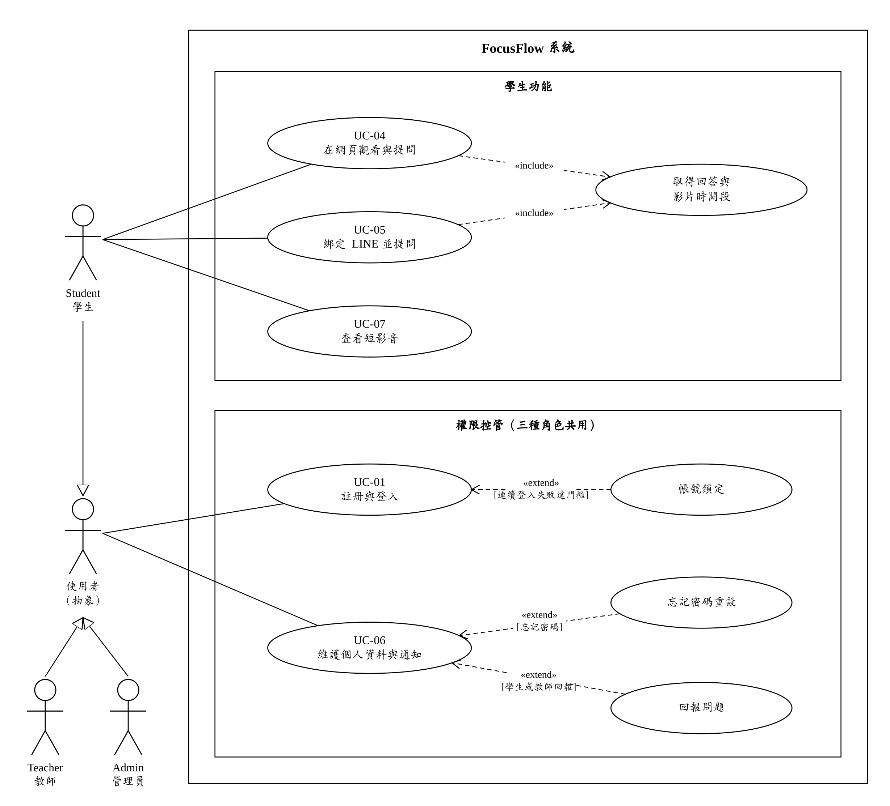

圖5-2-1a 學生與共用功能使用個案圖

- **學生功能區塊**：Student 直接關聯 UC-04 在網頁觀看與提問、UC-05 綁定 LINE 並提問、UC-07 查看短影音，三者都只對學生開放。
- **共用的回答機制**：UC-04 與 UC-05 皆 `«include»`「取得回答與影片時間段」，表示網頁與 LINE 兩種提問管道共用同一套檢索、回答與引用規則，學生在任一管道都能取得影片時間點。
- **權限控管區塊**：UC-01 註冊與登入、UC-06 維護個人資料與通知由抽象行為者「使用者」關聯；Student、Teacher、Admin 以一般化箭頭指向「使用者」，表示三種角色都能執行這兩個使用個案。
- **UC-01 的延伸**：同一 Email 連續登入失敗達門檻時，延伸出「帳號鎖定」。
- **UC-06 的延伸**：使用者忘記密碼時延伸出「忘記密碼重設」；學生或教師回報系統問題時延伸出「回報問題」（FR-23），管理員不提交問題回報，而是在圖5-2-1b 處理。

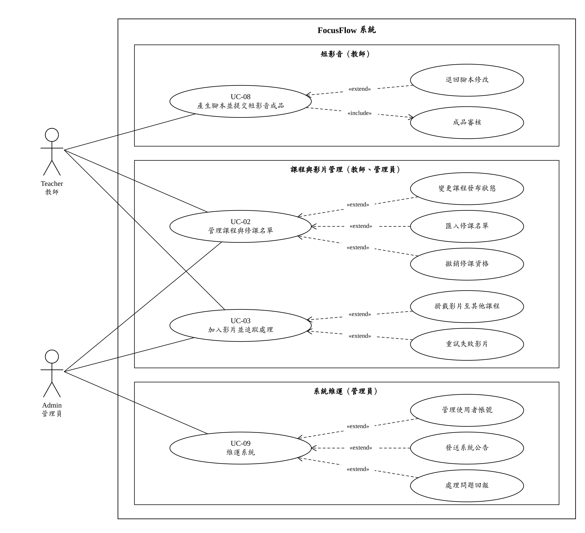

圖5-2-1b 教師與管理員功能使用個案圖

- **短影音區塊**：Teacher 關聯 UC-08 產生腳本並提交短影音成品；UC-08 `«include»`「成品審核」，成品通過審核後才進入學生短影音牆；腳本內容不符需求時延伸出「退回腳本修改」。成品審核另開放管理員經後端 API 執行，但不列為管理員的主要互動（見表5-3-8）。
- **課程與影片管理區塊**：Teacher 與 Admin 都關聯 UC-02 管理課程與修課名單、UC-03 加入影片並追蹤處理；教師只能管理自己的課程，管理員可跨課程操作，兩者套用相同的課程與影片規則。
- **UC-02 的延伸**：「變更課程發布狀態」（草稿、已發布、封存）、「匯入修課名單」與「撤銷修課資格」都是維護課程時依需要才執行的操作；建立與編輯課程本身屬於 UC-02 的主要流程。
- **UC-03 的延伸**：將既有影片「掛載影片至其他課程」，或對處理失敗的影片「重試失敗影片」。
- **系統維運區塊**：Admin 關聯 UC-09 維運系統，延伸出「管理使用者帳號」「發送系統公告」與「處理問題回報」（FR-23 的處理端）。

表5-2-1　行為者與系統邊界

| 行為者 | 主要責任與權限 |
| --- | --- |
| 使用者（抽象行為者） | Student、Teacher、Admin 的共同上層，代表「已擁有或正在建立帳號的人」，關聯 UC-01 與 UC-06。 |
| Student（學生） | 以自己的帳號及有效修課資格查看課程、影片、學習進度、問答、通知與短影音；可綁定 LINE 並提問，可提交問題回報。不能建立修課資格或自行加入課程。 |
| Teacher（教師） | 建立與管理自己的課程、修課名單、影片及批次；在短影音功能啟用時管理腳本與成品；可提交問題回報。不能管理其他教師的課程。 |
| Admin（管理員） | 由管理員入口登入，跨課程管理使用者、課程、影片與修課名單，發送系統公告、處理問題回報並查看統計、事件與系統服務狀態。 |

LINE Platform 是學生透過 LINE Bot 提問時的訊息傳遞管道，角色類似網頁使用個案中的瀏覽器；提問的行為者仍是 Student，訊息的技術流程見第6-1節循序圖。系統為完成使用個案而呼叫的 AI 服務、YouTube、SMTP 郵件與 MongoDB Atlas 等外部服務不列為行為者，其依賴關係記錄於各使用個案描述（表5-3-1至表5-3-9）。

表5-2-2　使用個案清單

| 編號 | 使用個案 | 主要行為者 | 目的 | 使用個案圖 |
| --- | --- | --- | --- | --- |
| UC-01 | 註冊與登入 | Student、Teacher、Admin | 學生建立帳號；各角色以相符的身分登入並進入對應的儀表板。 | 圖5-2-1a |
| UC-02 | 教師管理課程與修課名單 | Teacher、Admin | 建立與發布課程，並維護可存取課程的學生名單。 | 圖5-2-1b |
| UC-03 | 教師加入影片並追蹤處理 | Teacher、Admin | 將教學影片加入課程，並追蹤語音轉錄與片段建立的結果。 | 圖5-2-1b |
| UC-04 | 學生在網頁觀看與提問 | Student | 觀看授權影片並提問，取得可跳回影片時間點的回答。 | 圖5-2-1a |
| UC-05 | 學生綁定 LINE 並提問 | Student | 綁定 LINE 帳號後，在 LINE 中選擇課程並提問。 | 圖5-2-1a |
| UC-06 | 使用者維護個人資料與通知 | Student、Teacher、Admin | 維護個人資料與頭像、重設密碼、讀取通知與回報問題。 | 圖5-2-1a |
| UC-07 | 學生查看短影音 | Student | 瀏覽所修課程中已發布且可播放的短影音。 | 圖5-2-1a |
| UC-08 | 教師產生腳本並提交短影音成品 | Teacher（審核步驟另含 Admin） | 由課程提問產生短影音腳本，提交成品並經審核後上架。 | 圖5-2-1b |
| UC-09 | 管理員維運系統 | Admin | 跨課程維護帳號與使用者狀態，發送公告並處理問題回報。 | 圖5-2-1b |

## 5-3 使用個案描述（Activity diagram）

每個使用個案依「基本資料表 → 活動圖與判讀 → 主要流程表 → 例外流程表」的順序說明。活動圖左側泳道為行為者，右側泳道為 FocusFlow；每個拒絕或失敗結果都以 E1、E2 等編號標在動作框前，並各自以終止節點結束，編號與例外流程表一一對應。流程較長的活動圖分為左右兩欄，左欄以連接點 A 結束，右欄由 A 接續。

表5-3-1　UC-01 註冊與登入

| 項目 | 說明 |
| --- | --- |
| 行為者 | Student（註冊與登入）、Teacher、Admin（登入） |
| 目的 | 學生建立帳號；各角色以正確身分登入並進入對應的儀表板。 |
| 前置條件 | 使用者尚未登入。學生註冊時使用尚未註冊的 Email；教師與管理員帳號已由管理流程建立。 |
| 完成條件 | 成功：取得登入憑證並進入相符角色的儀表板。失敗：不取得登入憑證，也不取得任何受保護資料。 |
| 追溯需求 | FR-01、FR-02、FR-04、NFR-01、NFR-02、NFR-07 |

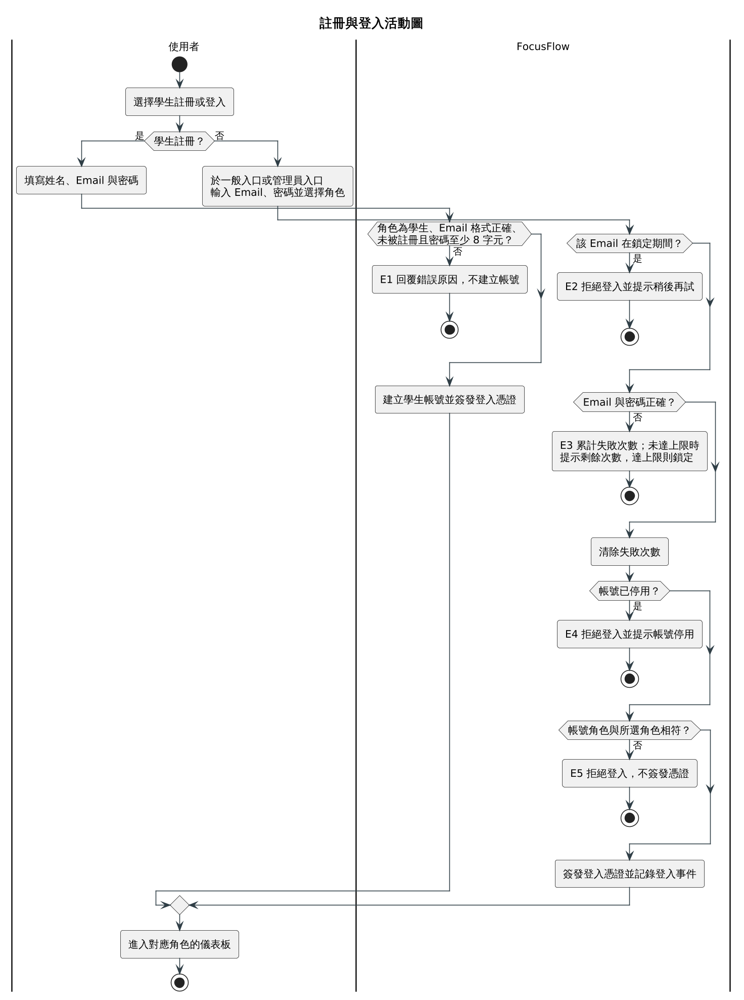

圖5-3-1 註冊與登入活動圖

1. 「學生註冊？」把流程分成兩條：左側為學生註冊，右側為各角色登入。
2. 註冊只有一道檢查（角色為學生、Email 格式與唯一性、密碼長度），不通過即 E1，通過後建立學生帳號並直接簽發登入憑證。
3. 登入的第一道判斷是鎖定期間（E2）；鎖定時系統不比對密碼，直接拒絕。
4. 「Email 與密碼正確？」（E3）是唯一會累計失敗次數的判斷，通過後立即清除失敗次數。
5. 帳號停用（E4）與角色相符（E5）在密碼正確後才判斷，因此不計入鎖定門檻；四道判斷都通過才簽發登入憑證並記錄登入事件。

主要流程：

| 步驟 | 行為者動作 | 系統回應 |
| --- | --- | --- |
| 1 | 學生選擇註冊，填寫姓名、Email 與密碼 | 檢查角色、Email 格式、是否已註冊與密碼長度 |
| 2 | — | 建立學生帳號並簽發登入憑證 |
| 3 | 使用者於一般入口或管理員入口輸入 Email、密碼並選擇角色 | 先確認該 Email 是否在鎖定期間，再比對 Email 與密碼 |
| 4 | — | 比對成功後清除失敗次數，確認帳號啟用且角色與所選角色相符 |
| 5 | — | 簽發登入憑證、記錄登入事件 |
| 6 | 進入對應角色的儀表板 | — |

例外流程：

| 編號 | 發生步驟 | 條件 | 系統處理 |
| --- | --- | --- | --- |
| E1 | 1 | 以非學生角色申請公開註冊、Email 格式錯誤或已註冊，或密碼少於 8 字元 | 回覆錯誤原因，不建立帳號 |
| E2 | 3 | 該 Email 仍在鎖定期間 | 直接拒絕登入並提示稍後再試，不比對密碼 |
| E3 | 3 | Email 不存在或密碼錯誤 | 累計失敗次數；未達門檻時提示剩餘次數，達門檻時鎖定 |
| E4 | 4 | 帳號已停用 | 拒絕登入並提示帳號停用 |
| E5 | 4 | 帳號角色與所選角色不符（包含非管理員帳號由管理員入口登入） | 拒絕登入，不簽發憑證 |

表5-3-2　UC-02 教師管理課程與修課名單

| 項目 | 說明 |
| --- | --- |
| 行為者 | Teacher、Admin |
| 目的 | 建立與發布課程，並維護可存取課程的學生名單。 |
| 前置條件 | 行為者已登入；教師為課程擁有者，或行為者為管理員。 |
| 完成條件 | 成功：課程與修課資格的異動被保存並保留紀錄，只有「有效修課資格且課程已發布」的學生可存取課程內容。失敗：課程與名單維持原狀。 |
| 追溯需求 | FR-05、FR-06、FR-07、NFR-01、NFR-04 |

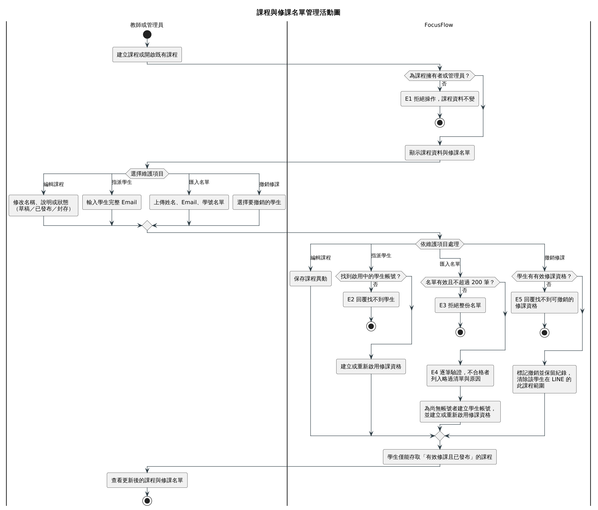

圖5-3-2 課程與修課名單管理活動圖

1. 第一道判斷確認行為者為課程擁有者或管理員，否則為 E1，課程資料不變。
2. 行為者泳道的「選擇維護項目」決定四種操作之一；系統泳道的「依維護項目處理」以同一選擇分別驗證與保存。
3. 指派學生時，找不到啟用中的學生帳號即為 E2；找到則建立或重新啟用修課資格。
4. 匯入名單時，整份名單無效或超過 200 筆即為 E3；通過後逐筆驗證，不合格的列標為 E4 列入略過清單，但不中斷其他列，尚無帳號的學生會被建立帳號。
5. 撤銷修課時，沒有可撤銷的有效修課資格即為 E5；四項操作最後匯流到「學生僅能存取有效修課且已發布的課程」。

主要流程：

| 步驟 | 行為者動作 | 系統回應 |
| --- | --- | --- |
| 1 | 建立課程或開啟既有課程 | 確認行為者為課程擁有者或管理員 |
| 2 | — | 顯示課程資料與修課名單（有效與已撤銷紀錄） |
| 3 | 修改課程名稱、說明或狀態（草稿、已發布、封存） | 保存課程異動 |
| 4 | 以學生完整 Email 指派修課 | 確認為啟用中的學生帳號後，建立或重新啟用修課資格 |
| 5 | 匯入姓名、Email、學號名單 | 逐筆驗證；尚無帳號者建立學生帳號，其餘建立或重新啟用修課資格，並列出略過項目與原因 |
| 6 | 選擇撤銷學生修課 | 將修課資格標記為撤銷並保留紀錄，清除該學生在 LINE 上的此課程範圍 |
| 7 | 查看更新後的課程與名單 | 回傳最新狀態 |

步驟 3 至 6 依行為者選擇的維護項目擇一執行，可重複進行。

例外流程：

| 編號 | 發生步驟 | 條件 | 系統處理 |
| --- | --- | --- | --- |
| E1 | 1 | 行為者不是課程擁有者，也不是管理員 | 拒絕操作，課程資料不變 |
| E2 | 4 | 找不到符合 Email 的啟用中學生帳號 | 回覆找不到學生 |
| E3 | 5 | 名單不是有效的名單格式，或超過 200 筆 | 拒絕整份名單 |
| E4 | 5 | 單列姓名空白、Email 格式錯誤、學號過短、檔內重複、帳號不是學生或已停用 | 該列列入略過清單並記錄原因，其他列照常處理 |
| E5 | 6 | 學生沒有可撤銷的有效修課資格 | 回覆找不到修課資格 |

表5-3-3　UC-03 教師加入影片並追蹤處理

| 項目 | 說明 |
| --- | --- |
| 行為者 | Teacher、Admin |
| 目的 | 將教學影片加入課程，並追蹤語音轉錄與片段建立的結果。 |
| 前置條件 | 行為者已登入且可管理目標課程；本機影片符合檔案限制，或 YouTube 連結有效。處理流程依賴語音轉錄、文字向量與（選用的）YouTube 上傳服務。 |
| 完成條件 | 成功：影片處理完成，片段可供問答檢索，修課學生收到影片可觀看的通知。失敗：影片標記為處理失敗並保留錯誤資訊，其他影片的結果不受影響。 |
| 追溯需求 | FR-08～FR-11、NFR-02、NFR-04～NFR-06、NFR-08、NFR-11 |

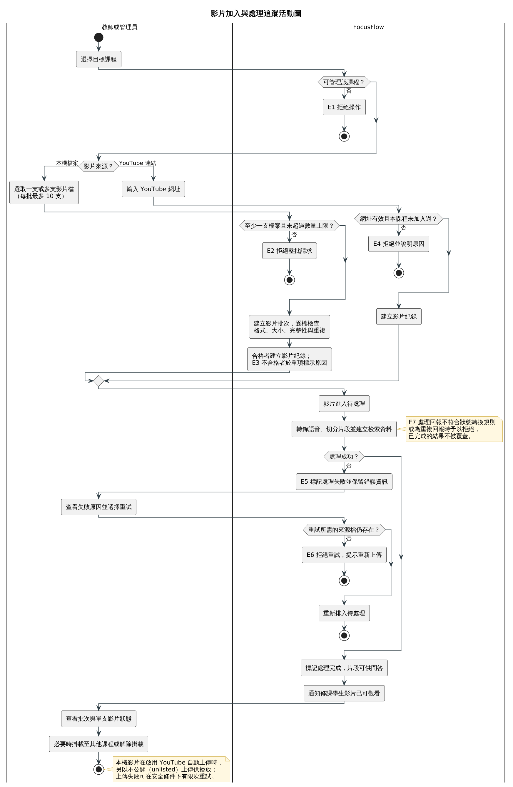

圖5-3-3 影片加入與處理追蹤活動圖

1. 第一道判斷確認行為者可管理目標課程，否則為 E1。
2. 「影片來源？」分為兩路：本機檔案先檢查整批（E2），再逐檔檢查，不合格的單項標為 E3 但不影響其他影片；YouTube 連結無效或同課程重複即為 E4。
3. 兩路建立影片紀錄後匯流，進入待處理與轉錄、切分片段的處理；右側註記 E7 表示不合法的狀態轉換或重複回報會被拒絕，已完成的結果不會被覆蓋。
4. 「處理成功？」否即為 E5：行為者查看失敗原因並選擇重試，系統確認來源檔仍存在（否則 E6）後重新排入待處理。
5. 處理成功後通知修課學生，行為者查看批次與單支影片狀態，必要時調整掛載課程；下方註記說明本機影片的 YouTube 自動上傳。

主要流程：

| 步驟 | 行為者動作 | 系統回應 |
| --- | --- | --- |
| 1 | 選擇目標課程 | 確認行為者可管理該課程 |
| 2 | 選取一支或多支本機影片（每批最多 10 支），或輸入 YouTube 網址 | 本機檔案：建立影片批次，逐檔檢查格式、大小、檔案完整性與重複；YouTube：檢查網址與同課程重複 |
| 3 | — | 為合格的影片建立影片紀錄，狀態為待處理 |
| 4 | — | 轉錄語音、切分片段並建立檢索資料，狀態轉為處理中 |
| 5 | — | 處理成功後標記完成，片段可供問答，並通知修課學生 |
| 6 | 查看批次與單支影片的處理狀態 | 回傳單項與批次彙總狀態 |
| 7 | 必要時將影片掛載至其他課程或解除掛載 | 更新課程與影片的掛載關係，並清除受影響課程的 FAQ 快取 |

本機影片在啟用 YouTube 自動上傳時，另以不公開方式上傳 YouTube 供播放；上傳失敗時在可安全重試的條件下提供有限次數的重試。

例外流程：

| 編號 | 發生步驟 | 條件 | 系統處理 |
| --- | --- | --- | --- |
| E1 | 1 | 行為者不能管理目標課程 | 拒絕操作 |
| E2 | 2 | 未附任何檔案或超過每批 10 支 | 拒絕整批請求 |
| E3 | 2 | 單一檔案不是影片、超過 500 MB、檔案結構損壞或與既有影片重複 | 該項標示失敗或重複的原因，其他影片照常處理 |
| E4 | 2 | YouTube 網址無效，或同一課程已加入相同影片 | 拒絕並說明原因 |
| E5 | 4 | 語音轉錄或片段建立失敗 | 標記處理失敗並保留錯誤資訊；行為者可將失敗的影片重新排入處理 |
| E6 | E5 之後 | 重試所需的本機來源檔已不存在 | 拒絕重試並提示重新上傳 |
| E7 | 3～5 | 處理回報不符合狀態轉換規則，或為重複回報 | 拒絕不合法的轉換，已完成的結果不被覆蓋 |

表5-3-4　UC-04 學生在網頁觀看與提問

| 項目 | 說明 |
| --- | --- |
| 行為者 | Student |
| 目的 | 觀看授權影片並提問，取得可跳回影片時間點的回答。 |
| 前置條件 | 學生已登入，具有目標課程的有效修課資格，且課程已發布。回答生成依賴文字向量與 AI 回答服務。 |
| 完成條件 | 成功：學生取得附來源片段與時間點的回答，對話、提問與使用事件被記錄。失敗：學生取得明確的拒答或失敗狀態，不會看到虛構的課程內容。 |
| 追溯需求 | FR-07、FR-12～FR-16、NFR-01、NFR-05～NFR-09 |

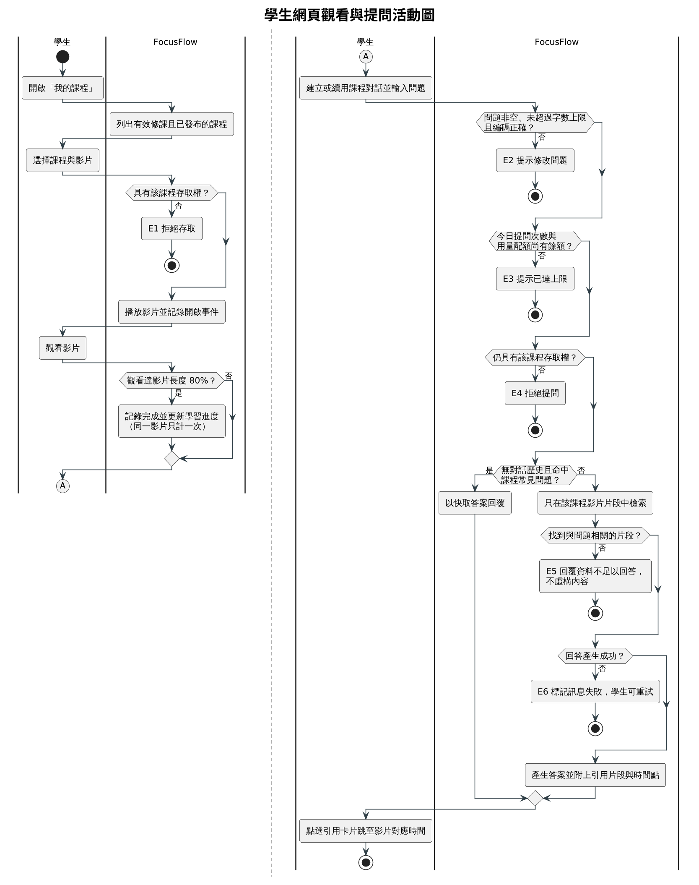

圖5-3-4 學生網頁觀看與提問活動圖

1. 左欄為觀看流程：唯一的拒絕是課程存取權（E1），通過後播放影片並記錄開啟事件。
2. 「觀看達影片長度 80%？」只在達成時記錄完成並更新學習進度，未達成不影響後續提問；左欄以連接點 A 接到右欄。
3. 右欄為提問流程，依序檢查問題內容（E2）、今日提問次數與用量配額（E3），以及送出當下的課程存取權（E4）。
4. 「無對話歷史且命中課程常見問題？」為是時，直接以 FAQ 快取答案回覆，略過檢索與回答生成。
5. 未命中快取時只在該課程的影片片段中檢索，找不到相關片段為 E5、回答生成失敗為 E6；兩者都通過才回覆附引用片段的答案，學生可點選引用卡片跳至影片時間點。

主要流程：

| 步驟 | 行為者動作 | 系統回應 |
| --- | --- | --- |
| 1 | 開啟「我的課程」 | 列出有效修課且已發布的課程 |
| 2 | 選擇課程與影片 | 確認課程存取權後播放影片，並記錄開啟事件 |
| 3 | 觀看影片 | 觀看達 80% 時記錄完成並更新學習進度（同一影片只計一次） |
| 4 | 建立或續用課程對話並輸入問題 | 檢查問題內容、今日提問次數與用量配額 |
| 5 | — | 重新確認課程存取權；無對話歷史且命中常見問題時直接回覆快取答案，否則只在該課程的影片片段中檢索 |
| 6 | — | 生成回答，附上回答狀態、引用片段與影片時間點 |
| 7 | 點選引用卡片 | 跳至對應影片與時間點 |

例外流程：

| 編號 | 發生步驟 | 條件 | 系統處理 |
| --- | --- | --- | --- |
| E1 | 2 | 修課資格已撤銷、課程未發布，或影片不屬於該課程 | 拒絕存取 |
| E2 | 4 | 問題空白、超過字數上限或疑似非 UTF-8 編碼 | 提示修改問題 |
| E3 | 4 | 今日提問次數已達上限，或超過每月用量配額 | 提示已達上限 |
| E4 | 5 | 送出提問時已不具課程存取權（例如修課資格剛被撤銷） | 拒絕提問 |
| E5 | 5 | 課程影片尚無可檢索片段，或檢索結果與問題無關 | 回覆「資料不足以回答」，不虛構內容 |
| E6 | 6 | 向量或回答服務失敗 | 將該則訊息標記為失敗，學生可重試 |

本機上傳影片的播放檔以 `/uploads` 靜態網址提供，屬直接連結存取，不經過上述課程授權流程。

表5-3-5　UC-05 學生綁定 LINE 並提問

| 項目 | 說明 |
| --- | --- |
| 行為者 | Student（LINE Platform 為訊息傳遞管道，非行為者，見表5-2-1後說明） |
| 目的 | 綁定 LINE 帳號後，在 LINE 中選擇課程並提問。 |
| 前置條件 | 學生已有 FocusFlow 帳號並登入網頁；LINE Bot 與 Webhook 設定可用。 |
| 完成條件 | 成功：LINE 帳號與 FocusFlow 帳號連結，學生在有效課程範圍內取得回答與影片時間點。失敗：綁定或課程範圍不變，學生收到重新操作的提示。修課資格被撤銷後，原課程範圍與對話脈絡即失效。 |
| 追溯需求 | FR-07、FR-14、FR-15、FR-17、NFR-01～NFR-03、NFR-06、NFR-08 |

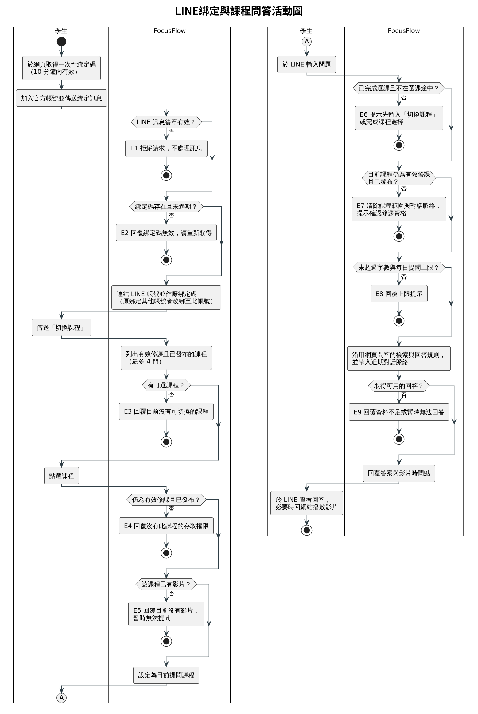

圖5-3-5 LINE綁定與課程問答活動圖

1. 左欄上段為綁定：LINE 訊息簽章無效為 E1、綁定碼不存在或已過期為 E2；通過後連結 LINE 帳號並作廢綁定碼，若該 LINE 帳號原本綁定其他使用者，改綁至此帳號。
2. 左欄中段為切換課程：系統只依「有效修課且已發布」列出課程，一次最多 4 門，沒有可選課程為 E3。
3. 學生點選課程後，系統才再確認存取權（E4）與該課程是否已有影片（E5），兩者都通過才設為目前提問課程，並以連接點 A 接到右欄。
4. 右欄為提問：先確認已完成選課且不在選課途中（E6），再確認目前課程仍為有效修課且已發布（E7，不成立時清除課程範圍與對話脈絡），以及字數與每日提問上限（E8）。
5. 回答沿用網頁問答的檢索與回答規則並帶入近期對話脈絡，沒有可用回答時為 E9；成功時回覆答案與影片時間點。

主要流程：

| 步驟 | 行為者動作 | 系統回應 |
| --- | --- | --- |
| 1 | 於網頁「LINE Bot」頁取得一次性綁定碼，或於課程頁掃描課程 QR Code | 產生 10 分鐘內有效的綁定碼 |
| 2 | 加入官方帳號並傳送綁定訊息 | 驗證 LINE 訊息簽章與綁定碼 |
| 3 | — | 連結 LINE 帳號並作廢綁定碼；若該 LINE 帳號原本綁定其他使用者，改綁至此帳號 |
| 4 | 傳送「切換課程」 | 列出有效修課且已發布的課程（最多 4 門） |
| 5 | 點選課程 | 確認仍有存取權且該課程已有影片後，設為目前提問課程 |
| 6 | 輸入問題 | 確認已選課、課程仍有效，並檢查字數與每日提問上限 |
| 7 | — | 沿用網頁問答的檢索與回答規則，並帶入近期對話脈絡 |
| 8 | 於 LINE 查看回答與影片時間點 | — |

由課程 QR Code 綁定時，步驟 3 完成後直接選定該課程（同樣確認存取權與是否已有影片），可略過步驟 4、5。

例外流程：

| 編號 | 發生步驟 | 條件 | 系統處理 |
| --- | --- | --- | --- |
| E1 | 2 | LINE 訊息簽章缺少或不符 | 拒絕請求，不處理訊息 |
| E2 | 2 | 綁定碼不存在或已過期 | 回覆綁定碼無效，請重新從網頁取得 |
| E3 | 4 | 沒有有效修課且已發布的課程 | 回覆目前沒有可切換的課程 |
| E4 | 5 | 點選的課程已不是有效修課或已不是已發布狀態 | 回覆沒有此課程的存取權限 |
| E5 | 5 | 點選的課程目前沒有影片 | 回覆暫時無法提問，不設定目前課程 |
| E6 | 6 | 尚未選定課程，或仍在等待選擇課程 | 提示先輸入「切換課程」或完成課程選擇 |
| E7 | 6 | 目前課程已不在有效修課範圍，或已不是已發布狀態 | 清除課程範圍與對話脈絡，提示確認修課資格 |
| E8 | 6 | 問題超過字數上限或今日提問次數已達上限 | 回覆上限提示 |
| E9 | 7 | 檢索結果不足以回答，或回答服務失敗 | 回覆資料不足或暫時無法回答；沒有可播放連結時提示回網站查看時間點 |

表5-3-6　UC-06 使用者維護個人資料與通知

| 項目 | 說明 |
| --- | --- |
| 行為者 | Student、Teacher、Admin（問題回報限 Student、Teacher） |
| 目的 | 維護個人資料與頭像、重設密碼、讀取通知與回報問題。 |
| 前置條件 | 使用者已登入；「忘記密碼」延伸流程在未登入時由登入頁觸發。 |
| 完成條件 | 成功：個人資料、頭像、已讀狀態或問題回報被保存並同步至頁面；密碼重設後可用新密碼登入。失敗：原資料不變，使用者收到錯誤原因；網路連線失敗時不清除仍可能有效的登入狀態。 |
| 追溯需求 | FR-03、FR-18、FR-23、NFR-02、NFR-03、NFR-07 |

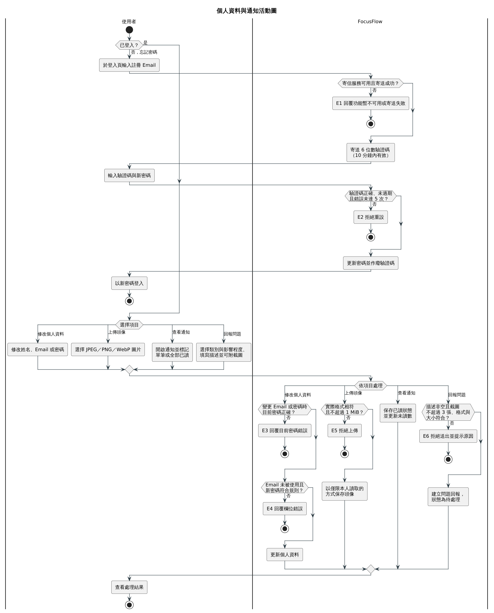

圖5-3-6 個人資料與通知活動圖

1. 「已登入？」為否時進入忘記密碼流程：寄信服務未設定或寄送失敗為 E1，成功則寄出 10 分鐘內有效的 6 位數驗證碼。
2. 使用者輸入驗證碼與新密碼後，驗證碼錯誤、過期或錯誤已達 5 次為 E2；通過則更新密碼並作廢驗證碼，使用者以新密碼登入。
3. 「已登入？」為是時，使用者先在自己的泳道選擇四個項目之一並輸入內容，系統再依同一項目驗證與保存。
4. 修改個人資料依序檢查目前密碼（E3）與 Email、新密碼規則（E4）；上傳頭像檢查實際格式與 1 MiB 上限（E5）。
5. 查看通知沒有拒絕分支，只保存已讀狀態；回報問題檢查描述與截圖（E6），通過後建立狀態為待處理的問題回報。

主要流程：

| 步驟 | 行為者動作 | 系統回應 |
| --- | --- | --- |
| 1 | 開啟個人資料頁 | 顯示目前的姓名、Email 與頭像 |
| 2 | 修改姓名；變更 Email 或密碼時輸入目前密碼 | 驗證目前密碼、Email 未被使用與新密碼規則後更新 |
| 3 | 選擇 JPEG、PNG 或 WebP 圖片上傳為頭像 | 確認實際格式與大小後，以僅限本人讀取的方式保存 |
| 4 | 開啟頂端列通知 | 載入個人通知與未讀數 |
| 5 | 標記單筆或全部已讀，或開啟具導向資訊的通知 | 保存已讀狀態並視需要導向對應頁面 |
| 6 | 填寫問題回報（類別、影響程度、描述，可附截圖） | 驗證內容與附件後建立問題回報，狀態為待處理 |

步驟 2 至 6 依使用者選擇的項目擇一執行。

替代流程（忘記密碼）：

| 步驟 | 行為者動作 | 系統回應 |
| --- | --- | --- |
| A1 | 於登入頁選擇忘記密碼並輸入註冊 Email | 寄送 6 位數驗證碼，10 分鐘內有效 |
| A2 | 輸入驗證碼與新密碼 | 驗證碼正確後更新密碼並作廢驗證碼 |
| A3 | 以新密碼登入 | 回到 UC-01 登入流程 |

例外流程：

| 編號 | 發生步驟 | 條件 | 系統處理 |
| --- | --- | --- | --- |
| E1 | A1 | 系統未設定寄信服務，或驗證信寄送失敗 | 回覆忘記密碼功能暫不可用或寄送失敗 |
| E2 | A2 | 驗證碼錯誤、過期或錯誤已達 5 次 | 拒絕重設，需重新申請驗證碼 |
| E3 | 2 | 變更 Email 或密碼時，目前密碼錯誤 | 回覆目前密碼錯誤，資料不變 |
| E4 | 2 | Email 已被使用、新密碼少於 8 字元或與目前密碼相同 | 回覆欄位錯誤 |
| E5 | 3 | 圖片格式與宣告不符、不是允許的格式或超過 1 MiB | 拒絕上傳 |
| E6 | 6 | 描述空白、截圖超過 3 張、單張超過 10 MiB 或格式不符 | 拒絕送出並提示原因 |

表5-3-7　UC-07 學生查看短影音

| 項目 | 說明 |
| --- | --- |
| 行為者 | Student |
| 目的 | 瀏覽所修課程中已發布且可播放的短影音。 |
| 前置條件 | 學生已登入。 |
| 完成條件 | 學生只看到目前授權範圍內、已發布且 YouTube 可播放的短影音；沒有符合條件的內容時看到空狀態。 |
| 追溯需求 | FR-07、FR-20、NFR-01、NFR-06 |

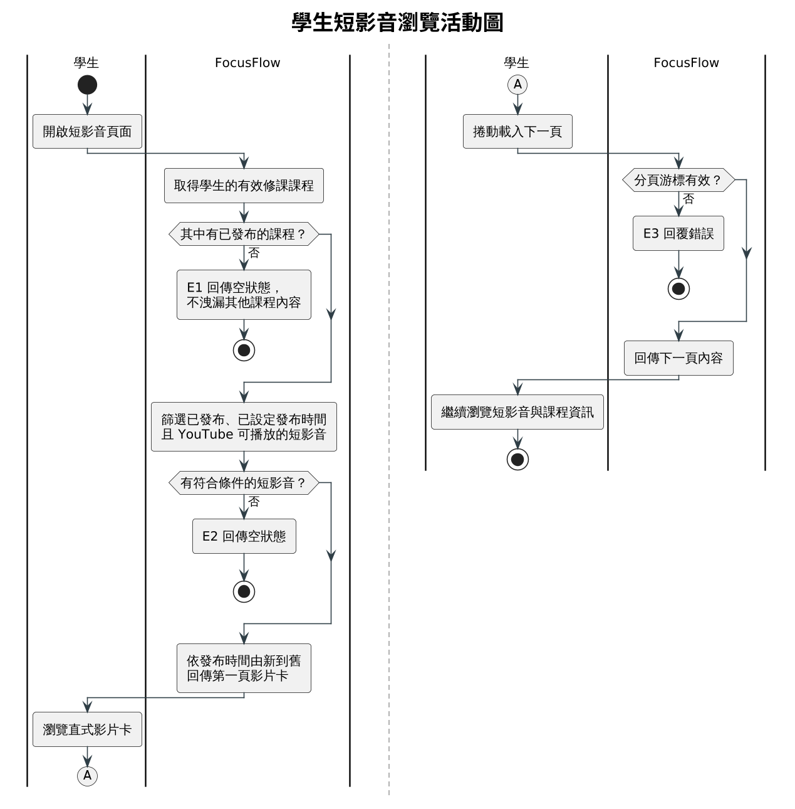

圖5-3-7 學生短影音瀏覽活動圖

1. 系統先取得學生的有效修課課程，其中沒有已發布的課程即為 E1，回傳空狀態且不洩漏其他課程的內容。
2. 接著篩選已發布、已設定發布時間且 YouTube 可播放的短影音，沒有符合條件的內容為 E2。
3. 符合條件時依發布時間由新到舊回傳第一頁影片卡，學生瀏覽後以連接點 A 接到右欄。
4. 右欄為分頁：學生捲動載入下一頁時，系統檢查分頁游標，無效為 E3，有效則回傳下一頁內容。

主要流程：

| 步驟 | 行為者動作 | 系統回應 |
| --- | --- | --- |
| 1 | 開啟短影音頁面 | 取得學生的有效修課課程 |
| 2 | — | 篩選已發布課程中，狀態為已發布、已設定發布時間且 YouTube 可播放的短影音 |
| 3 | — | 依發布時間由新到舊，以游標分頁回傳第一頁 |
| 4 | 瀏覽直式影片卡與課程資訊，捲動載入下一頁 | 確認分頁游標後回傳下一頁內容 |

例外流程：

| 編號 | 發生步驟 | 條件 | 系統處理 |
| --- | --- | --- | --- |
| E1 | 1 | 學生沒有有效修課，或所修課程皆未發布 | 回傳空狀態，不洩漏其他課程的內容 |
| E2 | 2 | 沒有審核通過、已發布且 YouTube 可播放的短影音（未發布、不可播放或已封存者都不列入） | 回傳空狀態 |
| E3 | 4 | 分頁游標格式錯誤 | 回覆錯誤 |

表5-3-8　UC-08 教師產生腳本並提交短影音成品

| 項目 | 說明 |
| --- | --- |
| 行為者 | Teacher（腳本生成、成品上傳與製作由教師介面完成；成品審核步驟另開放 Admin 經後端 API 執行） |
| 目的 | 由課程提問產生短影音腳本，提交成品並經審核後上架。 |
| 前置條件 | 行為者可管理目標課程；短影音腳本功能已啟用；課程有足夠的提問與可檢索片段；腳本生成與 YouTube 上傳服務已設定。 |
| 完成條件 | 成功：腳本版本、凍結證據與審核歷史可追溯，核准且 YouTube 上傳完成的成品進入學生短影音牆。失敗或退回：成品不進入學生短影音牆，退回原因被保存並通知腳本負責人。系統不產生剪輯完成檔。 |
| 追溯需求 | FR-21、FR-22、NFR-04～NFR-06、NFR-11、NFR-12 |

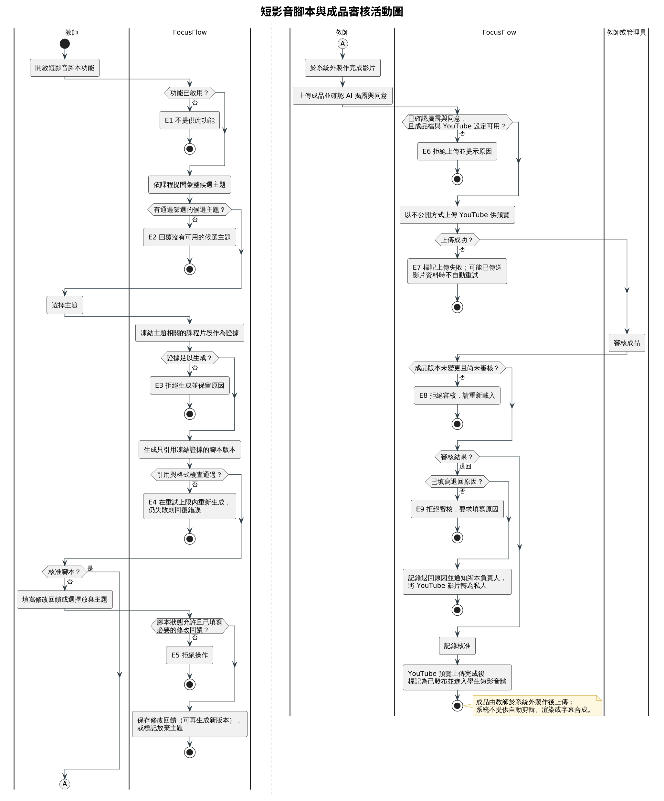

圖5-3-8 短影音腳本與成品審核活動圖

1. 左欄為腳本產生：功能未啟用為 E1，沒有通過篩選的候選主題為 E2。
2. 教師選擇主題後系統凍結相關片段作為證據，證據不足為 E3；生成的腳本若引用了證據外的片段或格式無法解析，在重試上限內重新生成，仍失敗為 E4。
3. 「核准腳本？」為否時，教師填寫修改回饋或選擇放棄主題，系統確認腳本狀態允許且已填必要回饋（E5）後保存；核准則以連接點 A 接到右欄。
4. 右欄為成品提交：未確認 AI 揭露與同意、成品檔遺失或 YouTube 未設定為 E6；以不公開方式上傳 YouTube 失敗為 E7，可能已傳送影片資料時不自動重試。
5. 審核時，成品版本已變更或已審核過為 E8；結果為退回時必須填寫原因（E9），系統通知腳本負責人並將 YouTube 影片轉為私人；結果為核准時記錄核准，待 YouTube 預覽上傳完成後才標記為已發布並進入學生短影音牆。

主要流程：

| 步驟 | 行為者動作 | 系統回應 |
| --- | --- | --- |
| 1 | 開啟短影音腳本功能 | 列出由課程提問彙整的候選主題 |
| 2 | 選擇主題 | 凍結與主題相關的課程片段作為證據 |
| 3 | — | 生成只引用凍結證據的腳本版本，並檢查引用與格式 |
| 4 | 核准腳本、要求修改（檢索或敘事）或放棄主題 | 依決定保存回饋、產生新版本或標記放棄 |
| 5 | 於系統外製作完成影片，上傳成品並確認 AI 揭露與同意事項 | 以不公開方式上傳 YouTube 供預覽 |
| 6 | 教師或管理員審核成品 | 確認成品版本未變更且尚未審核後記錄審核結果 |
| 7 | — | 核准：YouTube 上傳完成後標記為已發布並進入學生短影音牆；退回：記錄原因、通知腳本負責人並將 YouTube 影片轉為私人 |

例外流程：

| 編號 | 發生步驟 | 條件 | 系統處理 |
| --- | --- | --- | --- |
| E1 | 1 | 短影音腳本功能未啟用 | 不提供此功能（路由回應 404） |
| E2 | 1 | 沒有通過篩選的候選主題 | 回覆沒有可用的候選主題，不降低門檻 |
| E3 | 2 | 檢索不到足夠片段作為證據 | 拒絕生成並保留原因 |
| E4 | 3 | 生成結果引用了證據外的片段，或格式無法解析 | 在重試上限內重新生成，仍失敗則回覆錯誤 |
| E5 | 4 | 腳本狀態不允許此操作，或要求修改卻未填寫回饋 | 拒絕操作 |
| E6 | 5 | 未確認 AI 揭露與同意、本機成品檔遺失，或 YouTube 上傳未設定 | 拒絕上傳並提示原因 |
| E7 | 5 | YouTube 上傳失敗 | 標記上傳失敗；可能已傳送影片資料時不自動重試，須先人工確認 YouTube 頻道以避免重複影片 |
| E8 | 6 | 成品版本已變更，或同一版本已審核過 | 拒絕審核，請重新載入 |
| E9 | 6 | 審核結果為退回，卻未填寫退回原因 | 拒絕審核，要求填寫原因 |

表5-3-9　UC-09 管理員維運系統

| 項目 | 說明 |
| --- | --- |
| 行為者 | Admin（短影音相關後端 API 亦對管理員開放，惟管理後台以使用者、課程、影片、統計與問題回報為主要導覽範圍；短影音成品審核由教師介面或直接呼叫 API 完成，不列入本使用個案主流程） |
| 目的 | 跨課程維護帳號與使用者狀態，發送公告並處理問題回報。 |
| 前置條件 | 管理員已由管理員入口登入，帳號為啟用狀態。 |
| 完成條件 | 成功：管理操作與必要事件被保存，受影響的使用者依最新的帳號、課程與影片狀態取得內容；公告送達所有啟用中的學生。失敗：資料不變，管理員收到明確的錯誤原因。 |
| 追溯需求 | FR-04～FR-06、FR-18、FR-19、FR-23、NFR-01、NFR-03～NFR-06 |

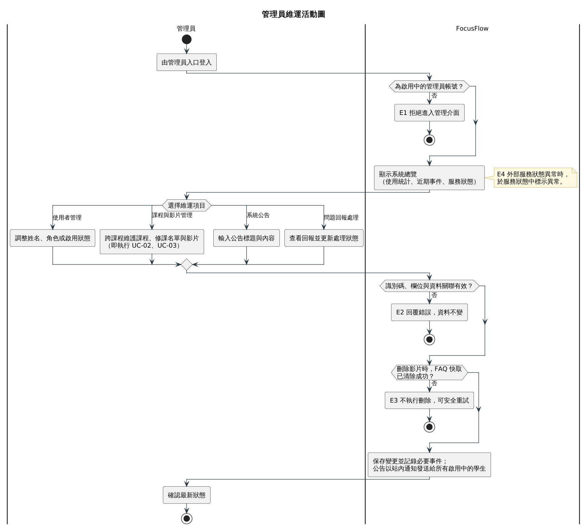

圖5-3-9 管理員維運活動圖

1. 第一道判斷確認登入者為啟用中的管理員，否則為 E1。
2. 通過後顯示系統總覽（使用統計、近期事件與服務狀態）；右側註記 E4 表示外部服務異常時在服務狀態中標示，不視為正常。
3. 管理員擇一維運項目；「課程與影片管理」即以管理員身分執行 UC-02、UC-03，套用相同的課程與影片規則。
4. 系統統一驗證識別碼、欄位與資料關聯（E2）；刪除影片時必須先清除 FAQ 快取，清除失敗為 E3，影片不會被刪除。
5. 全部通過後保存變更並記錄必要事件，系統公告以站內通知發送給所有啟用中的學生，管理員再確認最新狀態。

主要流程：

| 步驟 | 行為者動作 | 系統回應 |
| --- | --- | --- |
| 1 | 開啟管理後台 | 重新確認管理員身分，顯示全站統計、近期事件與系統服務狀態 |
| 2 | 查看使用者並調整姓名、角色或啟用狀態 | 驗證欄位後保存變更 |
| 3 | 跨課程維護課程、修課名單與影片 | 依 UC-02、UC-03 的規則處理；刪除影片時一併移除其片段與相關快取 |
| 4 | 輸入系統公告的標題與內容 | 以站內通知發送給所有啟用中的學生 |
| 5 | 查看問題回報並更新處理狀態與備註 | 保存處理狀態 |
| 6 | 確認最新狀態 | 回傳更新後的資料 |

步驟 2 至 5 依管理員選擇的維運項目擇一執行。

例外流程：

| 編號 | 發生步驟 | 條件 | 系統處理 |
| --- | --- | --- | --- |
| E1 | 1 | 登入者不是管理員或帳號已停用 | 拒絕進入管理介面 |
| E2 | 2～5 | 識別碼格式錯誤、資料不存在，或欄位值不在允許範圍 | 回覆錯誤，資料不變 |
| E3 | 3 | 刪除影片前清除 FAQ 快取失敗 | 不執行刪除，可安全重試 |
| E4 | 1 | 外部服務（AI、LINE、YouTube 等）狀態異常 | 於系統服務狀態中顯示異常，不視為正常 |

## 5-4 分析類別圖（Analysis class diagram）

分析類別模型把需求中的概念整理為邊界類別、控制類別與實體類別，再由第 6 章落實為設計類別、第 8 章對應至實際的 MongoDB 集合。邊界與控制類別採責任導向命名（如「課程授權」），其落實為程式類別的對應見表6-2-1。

表5-4-1　主要分析類別

| 類別類型 | 代表類別（分析層概念名稱） | 責任 |
| --- | --- | --- |
| 邊界類別 | 網頁介面、管理員入口、LINE 訊息介面、影片處理回報介面、外部服務介面 | 接收角色操作或外部事件並呈現結果，不自行決定課程授權 |
| 控制類別 | 身分驗證、課程授權、修課管理、影片管理、影片批次管理、提問處理、對話管理、LINE 對話處理、通知發送、問題回報處理、短影音腳本產生、短影音成品審核 | 執行驗證、權限、狀態轉換、檢索、回答、通知及審核流程 |
| 核心實體 | User、Course、Enrollment、Video、VideoBatch | 表達帳號角色、課程擁有者、修課授權、影片來源與處理批次 |
| 問答實體 | VideoSegment、Question、FAQ、Conversation、Message | 表達可檢索片段、提問與回答、常見問題快取及多輪對話 |
| 營運實體 | Notification、UsageLog、Feedback | 表達通知與已讀、使用事件與統計基礎、問題回報與處理狀態 |
| 短影音實體 | ShortScript、ShortAsset | 表達候選主題與凍結證據、腳本版本與回饋，以及成品的審核、YouTube 與發布狀態 |

系統分析類別圖如圖5-4-1所示，呈現 15 個實體類別間的領域關聯與多重性；邊界與控制類別的歸屬見表5-4-1，不重複畫入圖中，協作順序由第 6 章循序圖承接。

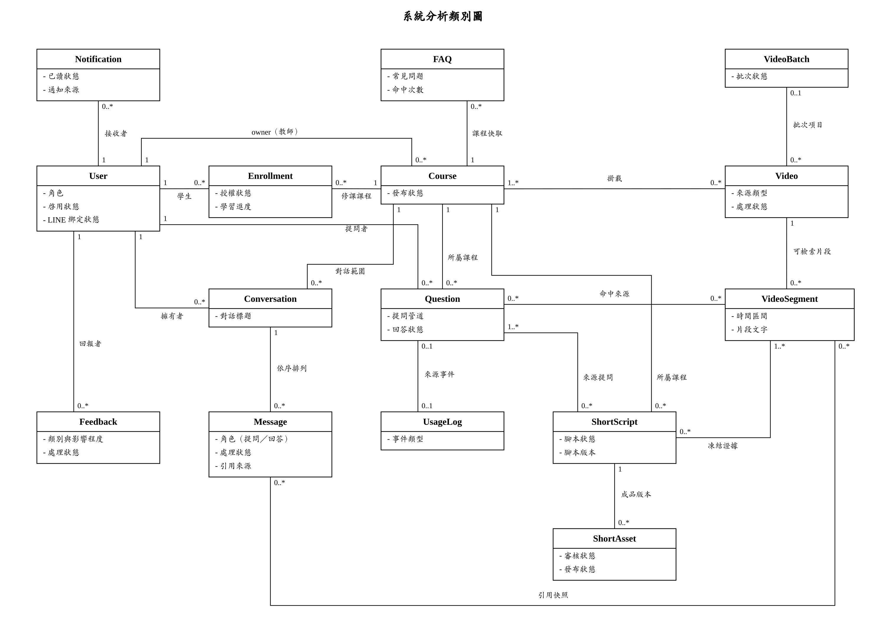

圖5-4-1 系統分析類別圖

表5-4-2 說明圖中較需判讀的關聯。

表5-4-2　主要關聯與多重性說明

| 關聯 | 多重性 | 說明 |
| --- | --- | --- |
| User－Course（owner） | 1 對 0..* | 一位教師可擁有多門課程；管理員跨課程管理不取代課程擁有者。 |
| User－Enrollment－Course | 1 對 0..*；0..* 對 1 | 學生與課程之間以修課資格連結，學生的內容授權來自「有效修課資格 × 已發布課程」的交集，User 不直接連到 Course。 |
| Course－Video（掛載） | 1..* 對 0..* | 一支影片至少屬於一門課程，也可掛載到多門課程；解除掛載不刪除影片。 |
| VideoBatch－Video | 0..1 對 0..* | 多檔上傳時一個批次包含多支影片，並彙整部分成功與部分失敗；YouTube 連結建立的影片不屬於批次。 |
| Question、Message－VideoSegment | 0..* 對 0..* | 提問的命中來源與對話訊息的引用只能是實際檢索到的片段（對應 NFR-05）。 |
| User－Question（提問者） | 1 對 0..* | 每筆提問記錄提問者，作為每日提問上限與使用統計的依據。 |
| Question－UsageLog | 0..1 對 0..1 | 提問紀錄與其使用事件對應，使用事件也另外記錄登入、觀看等行為。 |
| ShortScript－Question（來源提問） | 0..* 對 1..* | 腳本主題由同一課程中多筆相近的提問彙整而來。 |
| ShortScript－VideoSegment（凍結證據） | 0..* 對 1..* | 腳本只能引用建立時凍結的片段。 |
| ShortScript－ShortAsset | 1 對 0..* | 腳本（含凍結證據）與人工上傳的成品是不同實體，每次重新上傳產生新的成品版本。 |

User 只有一個類別，學生、教師與管理員以「角色」屬性區分；LINE 綁定狀態與短期對話狀態也保存在 User，未獨立成實體。
