# 第6章 設計模型

第5章以使用個案與活動圖說明「使用者要完成什麼」，本章屬物件設計（Object Design），說明 FocusFlow 以哪些參與者與設計類別完成這些使用個案：6-1 以循序圖（Sequence Diagram）呈現每個使用個案的訊息往返、權限檢查與例外分支；6-2 以設計類別圖（Design Class Diagram）說明分析責任如何落實為後端服務與資料物件，並以一張設計物件圖（Design Object Diagram）呈現一次網頁問答完成後的實例快照。後端依 routes → controllers → services → models 分層，本章只描述到「服務與資料物件」層級；完整欄位、索引與參照限制見第8章，程式檔案職責見第9章。

## 6-1 循序圖（Sequential diagram）

本節依規範「循序圖或通訊圖擇一」採用循序圖，共 9 張，與第5章 UC-01～UC-09 一一對應（表6-1-2）。每張圖的參與者統一抽象為使用者、前端、後端 API、資料庫與外部服務五類，責任如表6-1-1；後端內部的 service 分工不在循序圖展開，改由 6-2 的設計類別圖說明。

表6-1-1　循序圖參與者與責任

| 參與者 | 對應元件 | 在循序圖中的責任 |
| --- | --- | --- |
| 使用者（學生、教師、管理員） | 瀏覽器操作者或 LINE 使用者 | 觸發操作、提供輸入、閱讀結果與錯誤訊息 |
| 前端 | React SPA 頁面（`frontend/focus-flow`） | 收集輸入、呼叫 REST API、保存登入狀態、呈現結果；不自行決定授權 |
| 後端 API | Express REST API（`backend/`，路徑前綴 `/api/v1`） | 驗證 JWT 與角色、檢查課程權限與資源狀態、執行狀態機與業務規則、回傳統一格式的成功或錯誤碼 |
| 資料庫 | MongoDB（Mongoose models 與 Pipeline 寫入的片段集合） | 保存帳號、課程、修課、影片、片段、問答、通知與短影音資料 |
| 外部服務 | AI Pipeline（STT_Whisper）、AI 服務（Gemini）、LINE 平台、YouTube、SMTP 郵件服務 | 語音辨識與 embedding、回答與腳本生成、訊息傳遞、影片託管與播放、寄送驗證碼 |

圖中箭頭與編號的讀法如下：實線實心箭頭為同步請求，虛線箭頭為回應，實線開放箭頭為不等待結果的非同步呼叫（例如背景上傳或 LINE 回覆 API）；灰底方框為後端內部的檢查或說明；`alt` 為互斥分支，`opt` 為條件成立才發生的步驟，`loop` 為逐項重複。訊息前的圓形編號即內文所稱的「步驟」。API 路徑省略共同前綴 `/api/v1`，錯誤一律以「HTTP 狀態碼＋錯誤碼」標示，與 `backend/src/utils/apiResponse.js` 的錯誤格式一致。

表6-1-2　循序圖與使用個案對照

| 圖號 | 使用個案 | 觸發者 | 主要例外分支 |
| --- | --- | --- | --- |
| 圖6-1-1 | UC-01 註冊與登入 | 使用者 | 欄位不合規、Email 重複、登入鎖定、帳密錯誤、帳號停用、角色不符 |
| 圖6-1-2 | UC-02 課程與修課名單管理 | 教師或管理員 | 無管理權、學生帳號無效、名單逐筆略過、無可撤銷紀錄 |
| 圖6-1-3 | UC-03 影片加入與處理追蹤 | 教師或管理員；AI Pipeline 回報 | 重複或不合規檔案、處理失敗、webhook 密鑰錯誤、非法狀態轉換、不可重試 |
| 圖6-1-4 | UC-04 學生網頁觀看與提問 | 學生 | 無修課資格、超過字數或每日次數、月配額超限、查無片段、AI 服務失敗 |
| 圖6-1-5 | UC-05 LINE 綁定與課程問答 | 學生（經 LINE 平台） | 簽章錯誤、綁定碼無效或過期、無可選課程、未選課或資格失效 |
| 圖6-1-6 | UC-06 個人資料與通知 | 使用者 | 目前密碼錯誤、Email 重複、頭像格式不符、驗證碼錯誤、通知不屬於本人 |
| 圖6-1-7 | UC-07 學生短影音瀏覽 | 學生 | 非學生角色、無可存取課程、游標格式錯誤 |
| 圖6-1-8 | UC-08 短影音腳本與成品審核 | 教師或管理員 | 功能關閉、無證據、引用越界、狀態轉換不合法、未確認揭露、版本衝突 |
| 圖6-1-9 | UC-09 管理員維運 | 管理員 | token 無效或非管理員、查無帳號、FAQ 快取清除失敗 |

### 6-1-1 註冊與登入

圖6-1-1 對應 UC-01（表5-3-1），說明使用者送出註冊或登入資料後，後端如何驗證身分並簽發 JWT。前端為登入／註冊頁（一般入口與 `/admin` 管理員入口共用同一支登入 API）；後端 API 負責欄位驗證、登入失敗計數與簽發 token；資料庫保存帳號與登入使用紀錄。

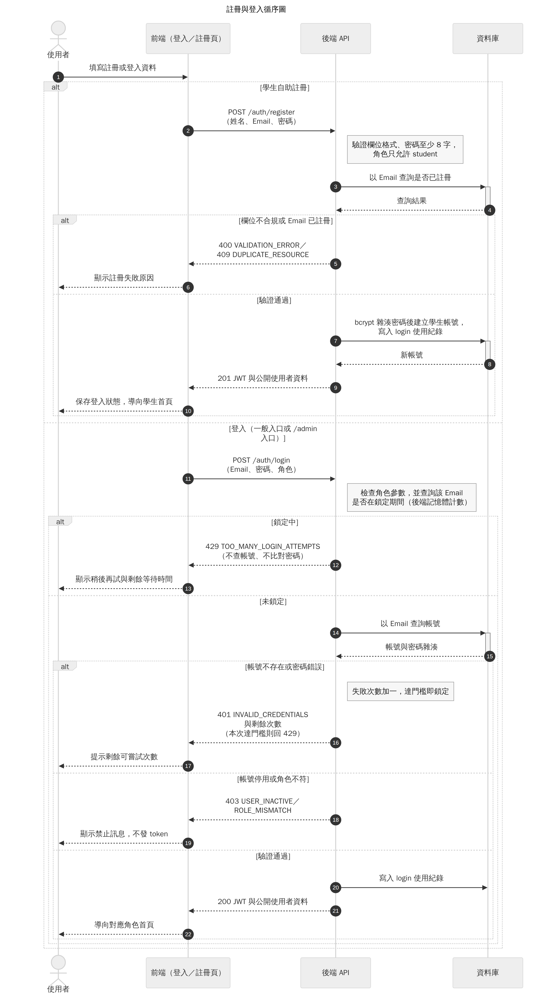

圖6-1-1 註冊與登入循序圖

註冊分支（步驟 2～10）只開放學生：後端先驗證姓名、Email 格式與密碼至少 8 字，並拒絕 student 以外的角色，再以 Email 查詢是否已註冊；欄位不合規回 400 `VALIDATION_ERROR`，Email 重複回 409 `DUPLICATE_RESOURCE`。通過後以 bcrypt 雜湊密碼建立學生帳號、寫入一筆 login 使用紀錄，並直接回傳 JWT，因此註冊完成即為登入狀態。

登入分支（步驟 11～22）的關鍵在檢查順序。後端先在記憶體中查詢該 Email 是否處於鎖定期間，鎖定中直接回 429 `TOO_MANY_LOGIN_ATTEMPTS`，不查帳號也不比對密碼（步驟 12～13）；未鎖定才查帳號並比對密碼。帳號不存在與密碼錯誤走同一個分支，失敗次數加一並回 401 `INVALID_CREDENTIALS` 與剩餘可嘗試次數，本次恰好達門檻時改回 429；兩種失敗的回應相同，外界無法由錯誤訊息推知 Email 是否已註冊。密碼正確後才檢查帳號是否停用與所選角色是否相符（403 `USER_INACTIVE`／`ROLE_MISMATCH`），角色比對放在密碼驗證之後，未通過驗證者無從得知帳號的角色。全部通過才寫入 login 使用紀錄並回傳 JWT，前端依角色導向學生、教師或管理員首頁。JWT 只攜帶使用者 id，之後每次請求由後端重新查詢帳號是否存在且啟用（見圖6-1-9 步驟 3）。

### 6-1-2 課程與修課名單管理

圖6-1-2 對應 UC-02（表5-3-2），說明教師或管理員如何建立課程、指派或匯入修課學生、撤銷修課並發布課程。前端為課程管理頁；後端 API 負責確認呼叫者是課程 owner 教師或管理員，並逐筆處理名單；資料庫保存 Course 與 Enrollment。

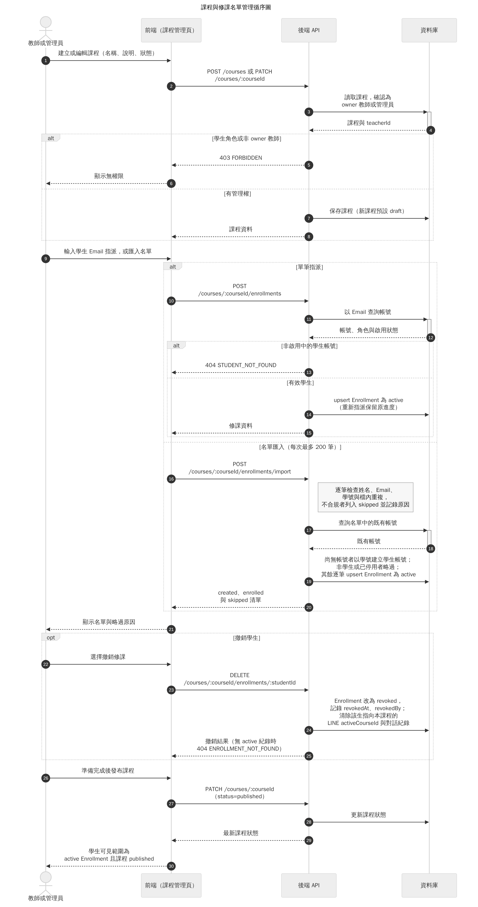

圖6-1-2 課程與修課名單管理循序圖

課程異動（步驟 1～8）先確認管理權：學生角色或非 owner 教師回 403 `FORBIDDEN`，管理員可跨課程操作；新課程預設為 draft。修課名單分兩種入口。單筆指派（步驟 10～15）以學生完整 Email 查詢帳號，查無、非學生或已停用回 404 `STUDENT_NOT_FOUND`；有效學生則以 upsert 將 Enrollment 設為 active，重複指派不會產生重複紀錄，先前撤銷者重新啟用時保留原觀看進度。名單匯入（步驟 16～20）每次最多 200 筆，後端逐筆檢查姓名、Email、學號與檔內重複，不合規者列入 skipped 並記錄原因；名單中尚無帳號者以學號為初始密碼建立學生帳號，已存在但非學生或已停用者略過，既有帳號的密碼與角色不會被匯入改動。回應同時列出 created、enrolled 與 skipped，單筆失敗不影響其他列。

撤銷（步驟 22～25）不刪除 Enrollment，而是改為 revoked 並記錄 revokedAt 與 revokedBy，保留稽核歷史；同時清除該生以本課程為 LINE 目前課程的設定與 LINE 對話紀錄，因此撤銷後在 LINE 上也無法繼續就此課程提問。無 active 紀錄時回 404 `ENROLLMENT_NOT_FOUND`。最後教師把課程設為 published（步驟 26～30）；學生可見範圍是「active Enrollment」與「課程 published」的交集，兩者缺一即無法存取，名單準備與對外開放因此是兩個可分開控制的步驟。

### 6-1-3 影片加入與處理追蹤

圖6-1-3 對應 UC-03（表5-3-3），說明教師上傳影片後，後端、AI Pipeline 與資料庫如何協作完成語音辨識、分段與 embedding，並讓教師追蹤與重試。前端為影片上傳頁（支援一次 1～10 支本機影片）；後端 API 建立批次與影片、排程處理並接收 Pipeline 回報；AI Pipeline 是獨立的 Python 程序，負責實際運算並直接寫入片段；YouTube 為選用的外部託管服務。

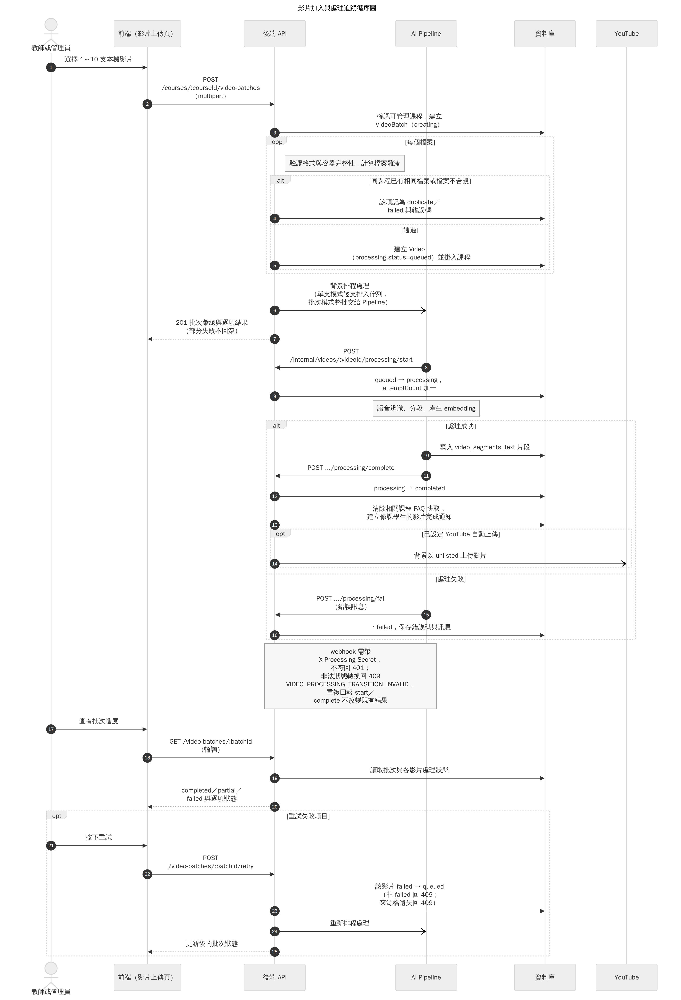

圖6-1-3 影片加入與處理追蹤循序圖

教師以單一 multipart 請求上傳（步驟 2），後端確認可管理課程後建立 VideoBatch，再逐檔驗證格式與容器完整性並計算檔案雜湊（`loop` 區塊）：同課程已有相同檔案記為 duplicate，不合規記為 failed，其餘建立 Video 並掛入課程，初始處理狀態即為 queued。每處理完一個檔案就保存一次批次狀態，某一檔失敗不會回滾其他成功項目。後端在回應前把可處理的影片排入背景處理（步驟 6），回應 201 與逐項結果後，前端即可開始追蹤。

AI Pipeline 開始運算前先呼叫 start webhook，後端把狀態由 queued 轉為 processing 並累計嘗試次數（步驟 8～9）；語音辨識、分段與 embedding 都在 processing 狀態下進行。成功時 Pipeline 先把片段寫入 `video_segments_text`，再呼叫 complete webhook（步驟 10～11），後端將狀態轉為 completed，清除引用此影片之課程的 FAQ 快取（片段已更新，舊答案可能過時），並為這些課程的修課學生建立「影片處理完成」通知；若已設定 YouTube 自動上傳，另在背景以 unlisted 上傳（步驟 14），上傳結果不影響處理狀態。失敗時 Pipeline 呼叫 fail webhook，後端保存 failed 與錯誤訊息（步驟 15～16）。三個 webhook 只接受帶正確 `X-Processing-Secret` 的請求，否則回 401；狀態機只允許 queued→processing→completed、queued／processing→failed 與 failed→queued，其他轉換回 409 `VIDEO_PROCESSING_TRANSITION_INVALID`；重複送達的 start 或 complete 不會重複計數，complete 重送時只重新執行快取清除與通知。

教師以批次 API 輪詢進度（步驟 17～20），批次狀態由各影片彙整為 completed、partial 或 failed。只有 failed 的影片可以重試（步驟 21～25），後端將其改回 queued 並重新排程；非 failed 或原始檔已不存在時回 409。貼 YouTube 網址建立影片的 API 仍保留，但教師上傳頁不提供此入口，故本圖不繪出。

### 6-1-4 學生網頁觀看與提問

圖6-1-4 對應 UC-04（表5-3-4），說明學生開啟課程影片並在網頁對話中提問後，系統如何檢查權限與使用限制、利用 FAQ 快取或檢索片段產生回答，並回傳可跳回影片的引用。前端為課程影片頁（含對話面板）；後端 API 負責授權、限額、快取判斷、檢索與記錄；資料庫保存對話、訊息、提問紀錄、FAQ 與片段；AI 服務（Gemini）負責計算問題 embedding 與生成回答。

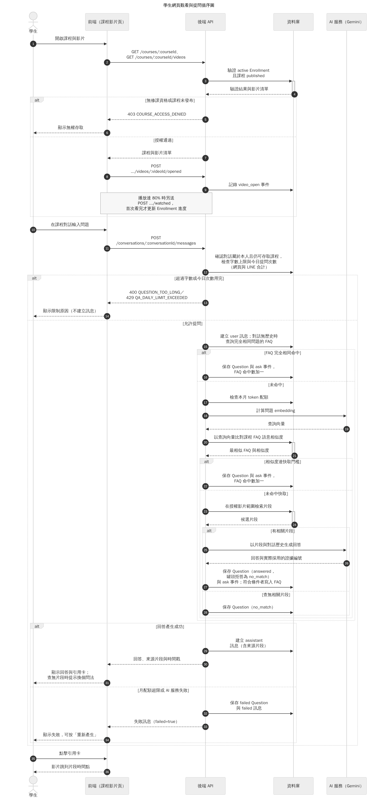

圖6-1-4 學生網頁觀看與提問循序圖

開啟影片時（步驟 1～9）後端驗證 active Enrollment 與課程 published，不通過回 403 `COURSE_ACCESS_DENIED`；通過後前端記錄一次開啟事件，播放到 80% 時另送 watched，只有第一次看完才更新 Enrollment 進度。

提問（步驟 10 起）送到 conversations API。後端先確認對話屬於本人且仍可存取該課程，再檢查字數上限與今日提問次數（網頁與 LINE 合計），超過即回 400 `QUESTION_TOO_LONG` 或 429 `QA_DAILY_LIMIT_EXCEEDED`，不建立任何訊息（步驟 12～14）。因此每日次數在所有快取判斷之前檢查，FAQ 快取命中的提問同樣計入當日次數。

允許提問後，後端建立 user 訊息並進入兩層 FAQ 快取判斷；快取只用於對話中沒有歷史訊息的提問，同一對話的後續追問一律重新檢索。第一層以正規化後完全相同的文字比對（步驟 15～16），命中即記錄提問紀錄與 FAQ 命中數，不呼叫 AI 服務。未命中才檢查本月 token 配額（步驟 17），接著請 AI 服務計算問題 embedding，以語意相似度比對課程 FAQ，相似度達門檻同樣直接採用快取答案（步驟 18～22）。兩層都未命中時，後端只在該課程授權影片範圍內檢索片段：有相關片段就把片段與對話歷史送交 AI 服務生成回答，AI 服務同時回傳實際採用的證據編號，後端保存提問紀錄與 ask 事件，並在條件符合時寫入 FAQ（步驟 23～27）；查無相關片段則記為 no_match（步驟 28），前端提示換個問法。AI 回覆罐頭拒答句時同樣記為 no_match，且不寫入 FAQ。

最外層的 `alt` 區分結果：成功時建立含來源片段的 assistant 訊息，前端顯示回答與引用卡（步驟 29～31）；月配額超限或 AI 服務失敗時，後端保存 failed 的提問紀錄與訊息，前端顯示失敗並提供「重新產生」，重試成功才計入當日次數（步驟 32～34）。學生點擊引用卡時，影片跳到該片段的起始時間（步驟 35～36）；引用只來自本次實際採用的片段，不會出現檢索範圍以外的內容。

### 6-1-5 LINE 綁定與課程問答

圖6-1-5 對應 UC-05（表5-3-5），說明學生如何把 LINE 帳號綁定到 FocusFlow、選擇課程並在 LINE 上提問。前端為網頁的 LINE Bot 頁；LINE 平台負責轉送學生訊息並把後端的回覆送回學生；後端 API 驗證簽章、維護綁定與 LINE 對話狀態；資料庫保存綁定碼、使用者的 LINE 狀態與提問紀錄。

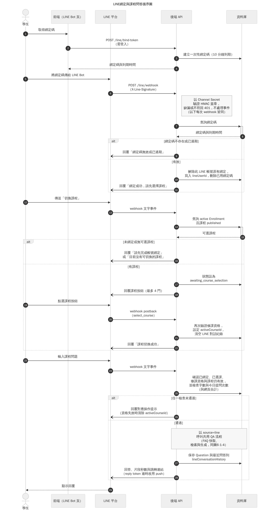

圖6-1-5 LINE綁定與課程問答循序圖

綁定（步驟 1～11）由已登入的學生在網頁取得一次性綁定碼，有效期 10 分鐘。學生把綁定碼傳給 LINE Bot 後，LINE 平台以 webhook 送達後端；後端先以 Channel Secret 驗證 HMAC 簽章，缺漏或不符回 401 且不處理事件，此檢查適用於圖中每一次 webhook。綁定碼不存在或已過期時回覆「綁定碼無效或已過期」；有效時先解除此 LINE 帳號原本綁定的系統帳號，再寫入新的 lineUserId 並刪除已用綁定碼，所以同一個 LINE 帳號改綁時以最新一次為準。綁定成功的回覆只提示「請先選擇課程」，不直接列出課程。

選課（步驟 12～22）由學生傳送「切換課程」觸發。後端只列出該生 active Enrollment 且課程為 published 的課程，最多 4 門（LINE 按鈕範本的上限）；未綁定或沒有可選課程時回覆對應提示。送出課程按鈕後，後端把對話狀態設為等待選課，學生點選按鈕產生的 postback 會再次驗證修課資格，才設定目前課程並清空 LINE 對話紀錄。

提問（步驟 23～29）前，後端依序確認已綁定、已選課、目前課程與修課資格仍有效，並檢查字數與今日提問次數（與網頁合計）；任一項未通過就回覆對應提示，若是資格已失效，同時清除目前課程設定。通過後以 `source=line` 呼叫與網頁相同的 QA 流程（FAQ 快取、檢索與生成，見圖6-1-4），本圖不重複繪製其內部步驟。回答完成後後端保存最近的問答作為下一次追問的上下文，並回覆答案、片段秒數與跳轉連結；影片沒有 YouTube 連結時改提示回網站觀看。AI 回答可能花費十餘秒，LINE 回覆憑證逾時時改用主動推播送出同一則回答。

### 6-1-6 個人資料與通知

圖6-1-6 對應 UC-06（表5-3-6），說明三種角色共用的個人資料維護、忘記密碼與站內通知。前端為個人資料頁與 Topbar 通知中心；後端 API 負責驗證目前密碼、檔案型別與驗證碼；資料庫保存帳號、頭像與通知；SMTP 郵件服務寄送重設密碼驗證碼。

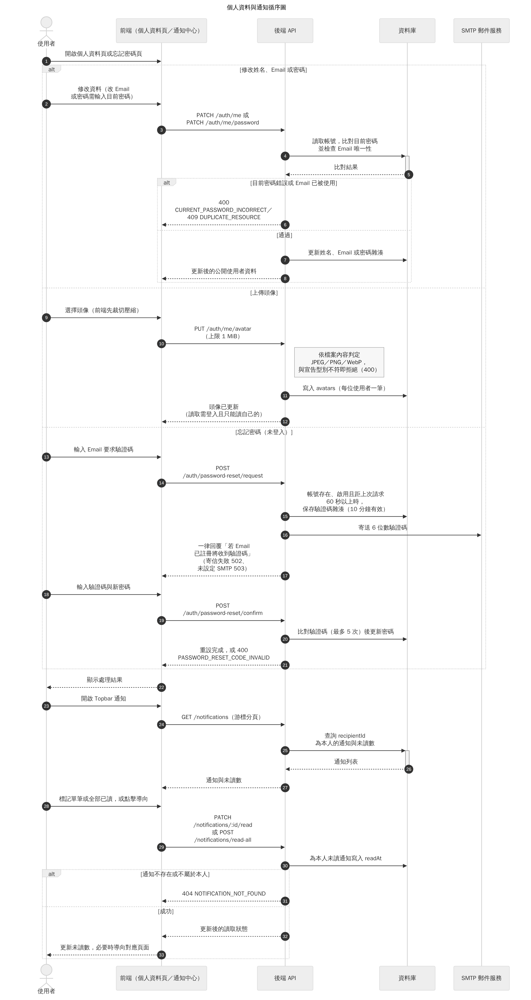

圖6-1-6 個人資料與通知循序圖

第一個 `alt` 區塊是三條互斥的資料維護路徑。修改資料（步驟 2～8）：只改姓名不需要密碼；改 Email 或改密碼都必須輸入目前密碼，改 Email 另檢查唯一性；目前密碼錯誤回 400 `CURRENT_PASSWORD_INCORRECT`，Email 已被使用回 409 `DUPLICATE_RESOURCE`。上傳頭像（步驟 9～12）：前端先裁切壓縮，後端限制 1 MiB，並依檔案內容判定是否為 JPEG、PNG 或 WebP，與宣告型別不符即拒絕；頭像存於資料庫，每位使用者一筆，讀取時需登入且只能讀自己的頭像。忘記密碼（步驟 13～21）不需登入：帳號存在、啟用且距上次請求超過 60 秒時，後端保存驗證碼雜湊（10 分鐘有效）並寄出 6 位數驗證碼；無論 Email 是否存在，回覆都是同一句話，避免被用來探測帳號。確認時驗證碼最多可錯 5 次，錯誤、過期或已用完回 400 `PASSWORD_RESET_CODE_INVALID`；寄信失敗回 502，未設定 SMTP 則回 503。

通知（步驟 23～33）只查詢收件人為本人的通知，以游標分頁並附未讀數。標記單筆或全部已讀時，後端只為本人尚未讀取的通知寫入 readAt；通知不存在或不屬於本人回 404 `NOTIFICATION_NOT_FOUND`。通知是依收件人各自建立的文件，因此一位使用者標記已讀不影響其他人。

### 6-1-7 學生短影音瀏覽

圖6-1-7 對應 UC-07（表5-3-7），說明學生開啟短影音牆時，後端如何篩出可播放的已發布短影音。前端為學生短影音牆；後端 API 依修課資格與成品狀態篩選；資料庫保存課程、修課與 ShortAsset；YouTube 提供嵌入播放與影片狀態查詢。

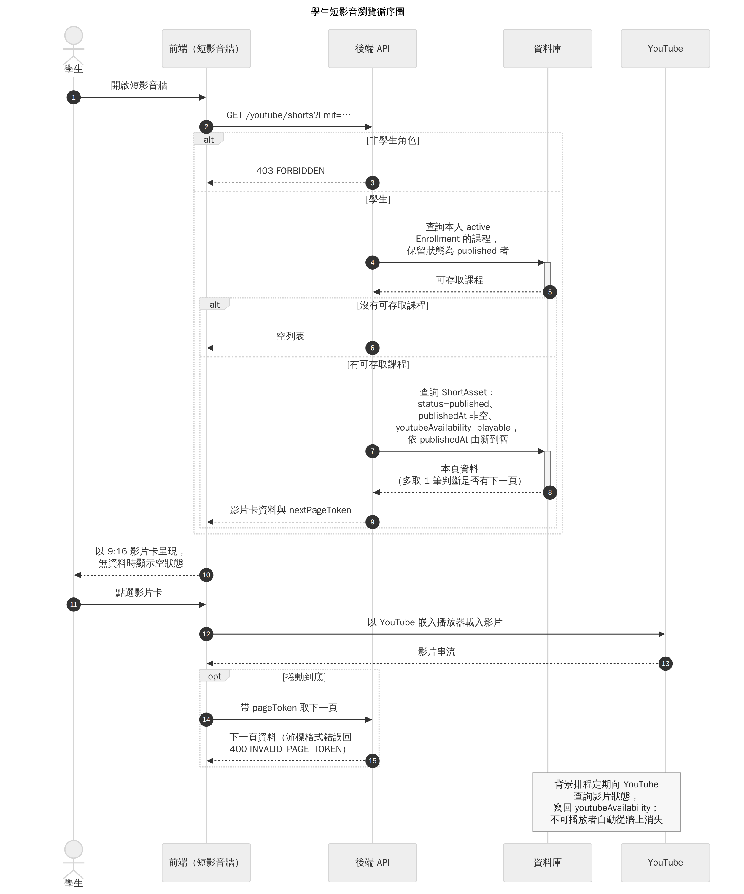

圖6-1-7 學生短影音瀏覽循序圖

此 API 只開放學生，其他角色回 403 `FORBIDDEN`（步驟 3）。篩選分兩段：先取本人 active Enrollment 的課程並保留 published 者，沒有任何可存取課程時直接回空列表（步驟 4～6）；再從這些課程中查詢 status 為 published、publishedAt 非空且 YouTube 可播放的 ShortAsset，依發布時間由新到舊排序，多取一筆用來判斷是否還有下一頁（步驟 7～9）。修課被撤銷、課程下架、成品未通過審核或 YouTube 影片不可播放，任一條件都會讓該短影音不出現在牆上。前端以 9:16 影片卡呈現，無資料時顯示空狀態；點選後由 YouTube 嵌入播放器載入影片（步驟 11～13）。捲動到底時帶 pageToken 取下一頁，游標格式錯誤回 400 `INVALID_PAGE_TOKEN`。圖末的說明方塊指出另一個背景觸發：排程定期向 YouTube 查詢影片狀態並寫回可播放狀態，不可播放的影片因此會自動從牆上消失。

### 6-1-8 短影音腳本與成品審核

圖6-1-8 對應 UC-08（表5-3-8），說明教師如何由課程提問產生有證據依據的短影音腳本、上傳系統外製作的成品，並經審核後進入學生短影音牆。前端為短影片腳本頁與審核頁；後端 API 負責凍結證據、驗證生成結果、維護腳本與成品的狀態機；AI 服務（Gemini）生成腳本；YouTube 託管成品影片供預覽與播放。

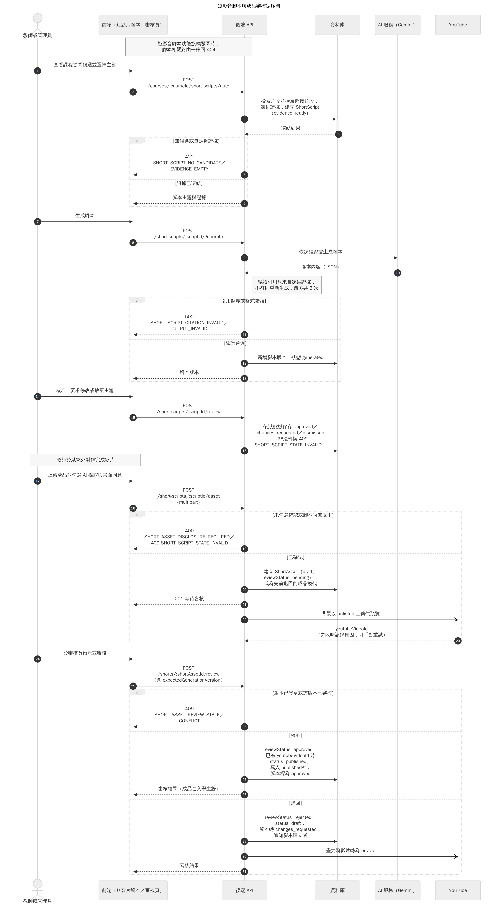

圖6-1-8 短影音腳本與成品審核循序圖

腳本相關 API 受功能旗標控制，關閉時一律回 404，讓未啟用的功能對外不可見。教師選定由課程提問彙整出的主題後（步驟 1～6），後端檢索相關片段並擴展鄰接片段，把這批證據凍結在 ShortScript（狀態 evidence_ready）；沒有候選或證據不足回 422。生成腳本時（步驟 7～13），後端把凍結證據交給 AI 服務，並驗證回傳的腳本只引用凍結證據中的片段，不符則重新生成，最多共 3 次；仍不通過回 502 `SHORT_SCRIPT_CITATION_INVALID` 或 `SHORT_SCRIPT_OUTPUT_INVALID`，通過才新增一個腳本版本（generated）。教師接著核准、要求修改或放棄主題（步驟 14～16），狀態機只允許合法轉換，否則回 409 `SHORT_SCRIPT_STATE_INVALID`。

成品影片由教師在系統外製作，系統不提供剪輯或渲染。上傳成品時必須同時確認 AI 揭露標示與教師書面同意，未確認回 400 `SHORT_ASSET_DISCLOSURE_REQUIRED`；腳本尚無任何版本時回 409（步驟 17～19）。通過後建立 ShortAsset（draft、待審核），同一腳本若已有被退回的成品，則在原成品上換代並保留審核歷史；後端回應 201 後在背景以 unlisted 上傳 YouTube，讓審核者可以預覽，上傳失敗會記錄原因並可手動重試（步驟 20～23）。

審核請求必須帶上審核者看到的成品版本（步驟 25）。版本已變更或該版本已審核過回 409，避免審到舊影片或重複審核。核准時記錄審核結果，若影片已上傳 YouTube 就將成品設為 published 並寫入發布時間，腳本同步標為 approved，成品隨即出現在圖6-1-7 的學生牆（步驟 27～28）；影片尚未上傳完成時先保持 draft，待上傳成功再自動上架。退回時成品回到 draft，腳本轉為 changes_requested，並通知腳本建立者，同時盡力把 YouTube 影片轉為 private（步驟 29～31）。腳本核准與成品上架因此是兩道獨立關卡，成品是否上架只取決於當前版本的審核結果。

### 6-1-9 管理員維運

圖6-1-9 對應 UC-09（表5-3-9），說明管理員登入後台後，如何查看統計並執行使用者、影片、課程名單與公告等維運操作。前端為 `/admin` 管理後台；後端 API 對每一個請求重新驗證管理員身分；資料庫保存所有被管理的資料；YouTube 在刪除影片時被要求將影片轉為 private。

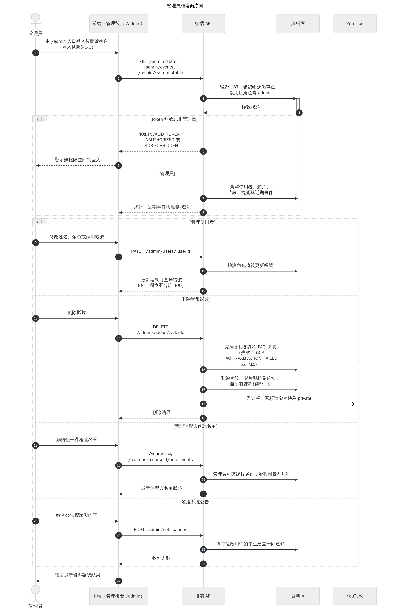

圖6-1-9 管理員維運循序圖

每一個後台請求都先驗證 JWT，並查詢帳號是否仍存在、啟用且角色為 admin（步驟 3～4）；token 無效回 401 `INVALID_TOKEN`，帳號已停用或不存在回 401 `UNAUTHORIZED`，角色不是管理員回 403 `FORBIDDEN`。授權不沿用登入當下的判斷，管理員被停用後下一個請求即失效。通過後回傳全站統計、近期事件與服務狀態。

第二個 `alt` 區塊列出四種維運操作。管理使用者（步驟 9～12）可修改姓名、角色或停用帳號，角色值不合規回 400，查無帳號回 404。刪除異常影片（步驟 13～18）必須先成功清除相關課程的 FAQ 快取，失敗回 503 `FAQ_INVALIDATION_FAILED` 並中止，確保不會留下引用已刪除影片的快取答案；接著刪除片段、影片與相關通知，並從所有掛載此影片的課程移除引用，最後盡力將自家頻道上的 YouTube 影片轉為 private。提問紀錄與使用紀錄屬歷史資料，不隨影片刪除。管理課程與修課名單（步驟 19～22）沿用圖6-1-2 的 API 與規則，差別在於管理員可操作任何課程。發送系統公告（步驟 23～26）會為每一位啟用中的學生各建立一則通知，回傳收件人數。所有操作完成後前端重新讀取資料確認結果，錯誤時顯示後端回傳的錯誤碼，不以前端的樂觀更新代替實際結果。

## 6-2 設計類別圖（Design class diagram）與設計物件圖（Design object diagram）

本節依第5章表5-4-1 的分析責任分組，將設計類別拆成三張設計類別圖，並附一張設計物件圖。分析層的邊界與控制類別以責任命名（例如「課程授權」），在設計層落實為具體的後端服務；實體類別則落實為 Mongoose model，對應關係如表6-2-1。

表6-2-1　分析責任到設計類別的落實

| 分析類別（表5-4-1） | 設計類別 | 設計圖 |
| --- | --- | --- |
| 身分驗證 | AuthService、LoginThrottle | 圖6-2-1 |
| 課程授權 | CourseAccessService | 圖6-2-1 |
| 修課管理 | EnrollmentService | 圖6-2-1 |
| 影片管理、影片批次管理 | VideoBatchService、VideoProcessingService（影片掛載、解除掛載與刪除由 VideoService 負責，未繪入圖中，流程見圖6-1-3、圖6-1-9） | 圖6-2-1 |
| 提問處理 | QaService、AskLimitsService、FaqCacheService、CostControlService、AnswerGenerationService | 圖6-2-2 |
| 對話管理 | ConversationService | 圖6-2-2 |
| LINE 對話處理 | LineService | 圖6-2-2 |
| 通知發送 | NotificationService | 圖6-2-3 |
| 短影音腳本產生 | ShortScriptService | 圖6-2-3 |
| 短影音成品審核 | ShortAssetPublishService、ShortAssetService | 圖6-2-3 |
| 個人資料維護（UC-06） | AuthService（圖6-2-1）、AvatarService、PasswordResetService | 圖6-2-1、圖6-2-3 |
| 核心、問答、營運與短影音實體 | User、Course、Enrollment、Video、VideoBatch、Conversation、Message、Question、Faq、UsageLog、VideoSegment、Notification、ShortScript、ShortAsset 等 model | 圖6-2-1～圖6-2-3 |

三張圖的記法一致。標示 «service» 的類別是後端服務：程式以 CommonJS 模組匯出函式，不是 JavaScript class，圖中以類別表示其對外操作；操作名稱即實際函式名稱，參數以物件傳入，圖中省略參數列、保留回傳型別。未標示 stereotype 的類別是 Mongoose model，屬性以「欄位 : 型別」列出，列舉值以「｜」分隔，只列理解責任所需的欄位，不列 `_id` 與時間戳記。虛線箭頭表示服務對另一個服務或 model 的使用關係（dependency），箭頭旁為用途；實線箭頭表示 model 之間以參照欄位建立的關聯，箭頭指向被參照的一方並標示多重性。MongoDB 不強制參照完整性，這些關聯由應用層維護，限制細節見第8章。

### 6-2-1 帳號、課程與影片設計類別圖

圖6-2-1 對應 UC-01～UC-03，呈現帳號、課程、修課與影片批次的設計類別。

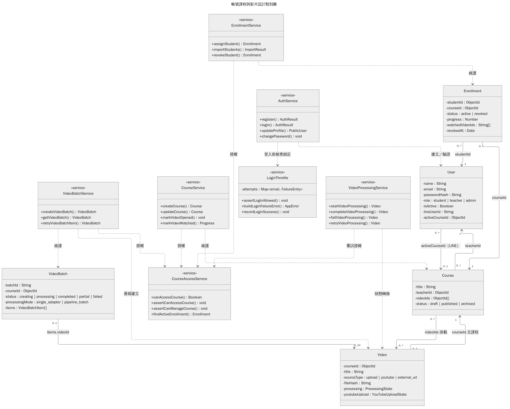

圖6-2-1 帳號課程與影片設計類別圖

CourseAccessService 是這張圖的中心：CourseService、EnrollmentService、VideoBatchService 與 VideoProcessingService 都依賴它判斷「是否可存取課程」與「是否可管理課程」，授權規則因此集中在一處，而不是散落在各服務中。學生的存取條件由 `findActiveEnrollment()` 與課程 status 共同決定，對應圖6-1-2 與圖6-1-4 的「active Enrollment 且 published」。AuthService 在登入時先呼叫 LoginThrottle，LoginThrottle 以記憶體中的 `attempts` 對照表記錄各 Email 的失敗次數，不寫入資料庫，對應圖6-1-1 鎖定檢查排在查詢帳號之前的順序。

資料物件方面，Course 以 `teacherId` 參照擁有者 User（多對一）；Enrollment 以 `studentId` 與 `courseId` 連接 User 與 Course，同一學生與課程只有一筆（唯一索引），撤銷時改變 `status` 而不刪除。Video 有兩種與課程的關係：`courseId` 是影片的主課程，Course 的 `videoIds` 則記錄掛載，同一支影片可以掛載到多門課程。VideoBatch 以 `items` 記錄一次上傳的最多 10 支影片與逐項結果，影片的處理狀態仍只由 VideoProcessingService 寫在各 Video 的 `processing` 上，批次狀態由各影片狀態彙整而來，兩者不會各自更新而互相矛盾。User 的 `activeCourseId` 只用於 LINE 的目前課程。

### 6-2-2 問答與對話設計類別圖

圖6-2-2 對應 UC-04、UC-05，呈現網頁對話與 LINE 兩個提問入口如何共用同一套問答服務。

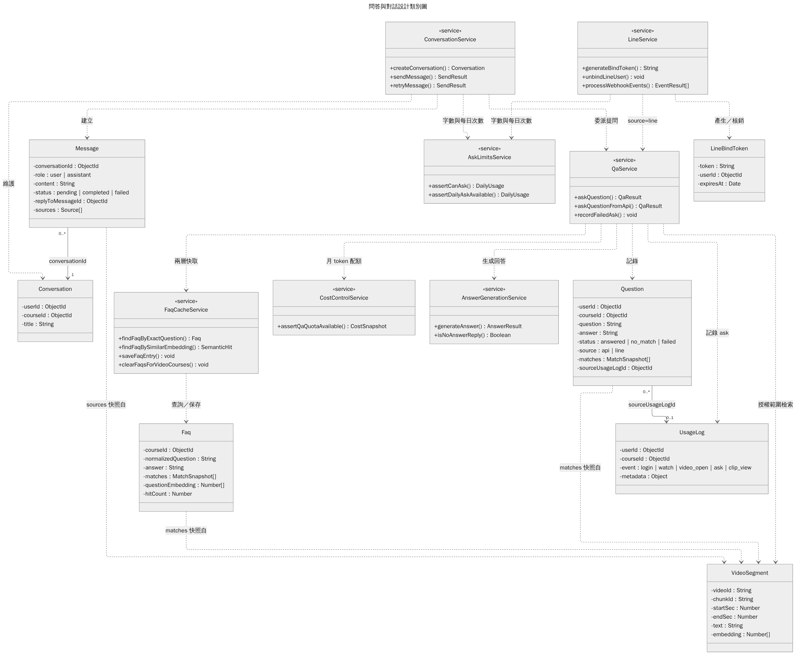

圖6-2-2 問答與對話設計類別圖

ConversationService 與 LineService 是兩個入口，都先呼叫 AskLimitsService 檢查字數與每日次數，再委派 QaService 的 `askQuestion()`；兩個入口的差異只在於對話紀錄保存在哪裡（網頁存於 Conversation 與 Message，LINE 存於 User 的 LINE 對話欄位）以及回覆方式，檢索與回答邏輯只有一份。QaService 依序使用 FaqCacheService 的 `findFaqByExactQuestion()` 與 `findFaqBySimilarEmbedding()` 完成兩層快取，在兩層之間以 CostControlService 的 `assertQaQuotaAvailable()` 檢查每月 token 配額，未命中時在授權範圍內檢索 VideoSegment，再交由 AnswerGenerationService 生成回答；`isNoAnswerReply()` 用來辨識罐頭拒答，避免把拒答寫入 FAQ。LineService 另負責 LineBindToken 的產生與核銷。

資料物件中，Message 以 `conversationId` 屬於一個 Conversation，assistant 訊息以 `replyToMessageId` 指向它所回答的 user 訊息，失敗重試時更新的是同一則 assistant 訊息。Question 是每次提問的稽核紀錄，以 `sourceUsageLogId` 連到當次的 ask 事件；Question 的 `matches`、Faq 的 `matches` 與 Message 的 `sources` 都是片段內容的快照而非參照，因此以虛線表示「快照自 VideoSegment」：即使片段之後被重新處理，歷史回答仍保有當時引用的內容。Question 保存的是檢索到的全部候選，Message 的 `sources` 只保存回答實際採用的片段，前者供稽核，後者供學生核對。Question 與 Faq 之間沒有直接關聯，快取命中時同樣新增一筆 Question，快取答案與即時生成的答案走同一套紀錄方式。

### 6-2-3 個人資料、通知與短影音設計類別圖

圖6-2-3 對應 UC-06～UC-08，呈現個人資料維護、通知與短影音三條責任線。

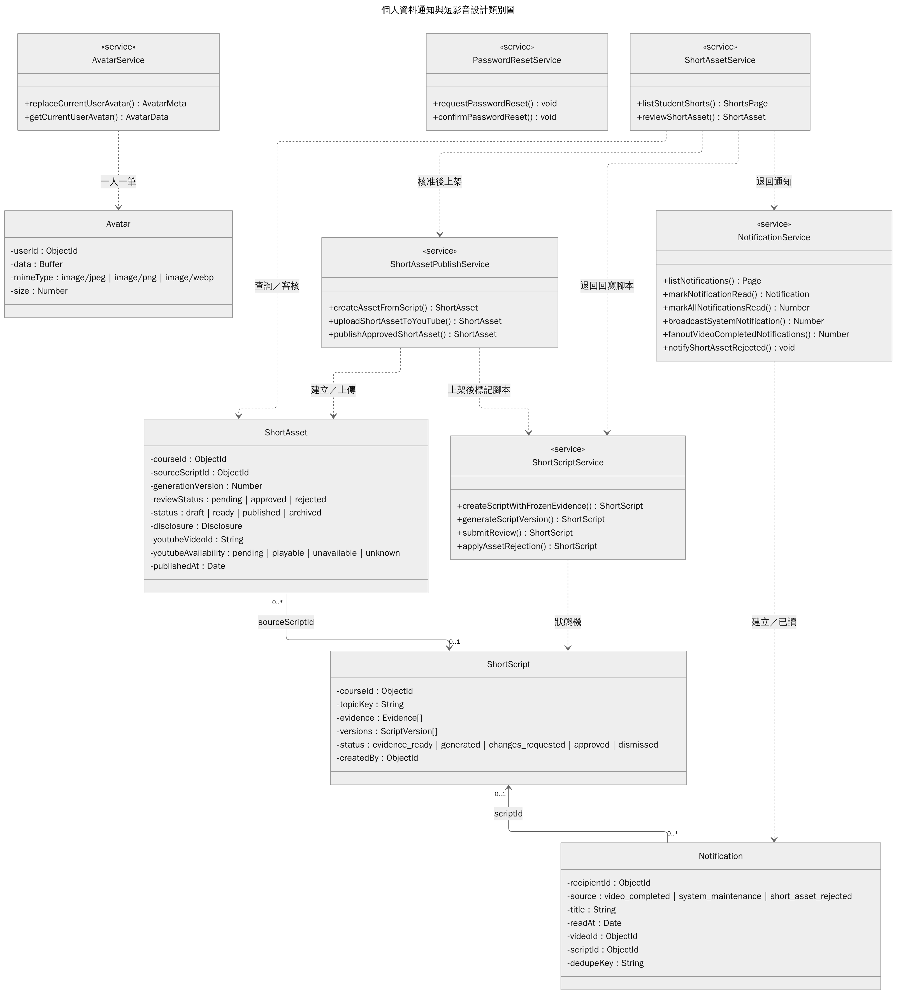

圖6-2-3 個人資料通知與短影音設計類別圖

個人資料部分，AvatarService 把頭像存成獨立的 Avatar 文件（每位使用者一筆），PasswordResetService 負責驗證碼的請求與確認；姓名、Email 與密碼的修改由圖6-2-1 的 AuthService 負責。NotificationService 提供列表、單筆與全部已讀，以及三種建立通知的操作：影片完成（由影片處理完成時呼叫）、系統公告（管理員發送）與短影音退回（成品審核退回時呼叫）；每則 Notification 以 `recipientId` 屬於單一收件人，`dedupeKey` 防止同一事件重複通知。

短影音分為三個服務。ShortScriptService 維護 ShortScript 的狀態機（evidence_ready、generated、changes_requested、approved、dismissed），`evidence` 保存凍結證據，`versions` 保存每次生成的腳本版本。ShortAssetPublishService 負責由腳本建立成品、上傳 YouTube 與核准後上架；ShortAssetService 負責學生短影音列表與成品審核，審核退回時依賴 ShortScriptService 回寫腳本狀態與 NotificationService 通知建立者，核准時依賴 ShortAssetPublishService 上架。ShortAsset 以 `sourceScriptId` 參照 ShortScript，一份腳本可對應多個成品；`generationVersion` 記錄同一成品的換代次數，審核只對當前版本有效。成品的審核狀態（`reviewStatus`）與上架狀態（`status`）是兩個欄位，學生牆只顯示 `status` 為 published 且 YouTube 可播放者。

### 6-2-4 學生網頁問答授權與引用設計物件圖

圖6-2-4 對應 UC-04，以一次網頁提問完成後的實例快照，說明圖6-2-1 與圖6-2-2 的設計類別在執行時如何連結。情境為：學生 student01 已被指派到已發布的 course01，在新建的對話中提出第一個問題，兩層 FAQ 快取都未命中，系統檢索到 segment07 並生成回答。

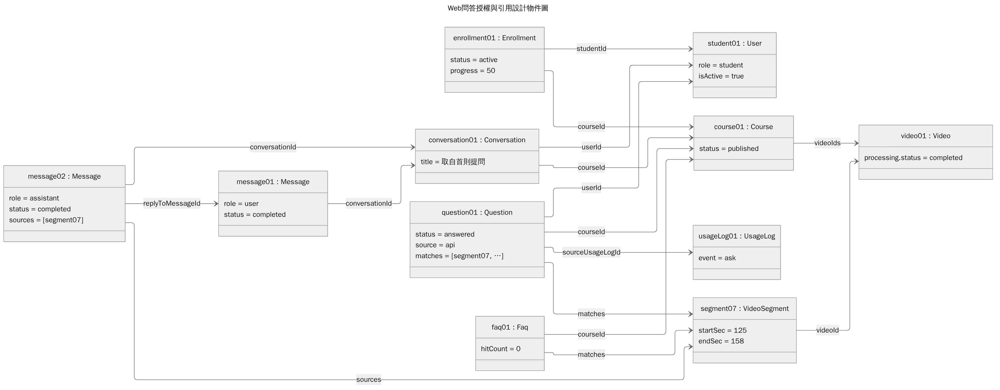

圖6-2-4 Web問答授權與引用設計物件圖

圖中名稱與數值為示例，不是實際帳號或課程資料；物件以「物件名 : 類別名」標示（繪圖工具無法加上 UML 規定的底線）。授權來自 enrollment01 同時連到 student01 與 course01，且 course01 為 published，學生本身並不直接持有課程。conversation01 屬於 student01 與 course01，其中 message01 是學生的提問，message02 是回答，以 `replyToMessageId` 指回 message01，並在 `sources` 保存實際引用的 segment07；segment07 以 `videoId` 屬於 video01，而 video01 掛載在 course01，所以引用必然落在學生有權存取的課程範圍內。同一次提問另產生 question01（answered）與 usageLog01（ask），兩者以 `sourceUsageLogId` 連結，供統計與稽核使用。由於這是對話中的第一個問題且答案不是拒答，系統同時寫入 faq01，下一位學生問相同問題時即可由快取回答。
