# 第6章 設計模型

第5章以使用個案與活動圖說明「使用者要完成什麼」，本章屬物件設計（Object Design），說明 FocusFlow 以哪些參與者與設計類別完成這些使用個案：6-1 以循序圖（Sequence Diagram）呈現每個使用個案的訊息往返、權限檢查與例外分支；6-2 以設計類別圖（Design Class Diagram）說明分析責任如何落實為後端服務與資料物件，並以一張設計物件圖（Design Object Diagram）呈現一次網頁問答完成後的實例快照。後端依 routes → controllers → services → models 分層，本章只描述到「服務與資料物件」層級；完整欄位、索引與參照限制見第8章，程式檔案職責見第9章。

## 6-1 循序圖（Sequential diagram）

本節依規範「循序圖或通訊圖擇一」採用循序圖，與第5章 UC-01～UC-09 一一對應（表6-1-2）。一個使用個案若包含多個獨立觸發（例如「開啟影片」與「送出提問」），依觸發拆成子圖，子圖沿用同一使用個案的圖號並加上 a、b、c，共 21 張。每張圖的參與者統一抽象為使用者、前端、後端 API、資料庫與外部服務五類，責任如表6-1-1；後端內部的 service 分工不在循序圖展開，改由 6-2 的設計類別圖說明。

表6-1-1　循序圖參與者與責任

| 參與者 | 對應元件 | 在循序圖中的責任 |
| --- | --- | --- |
| 使用者（學生、教師、管理員） | 瀏覽器操作者或 LINE 使用者 | 觸發操作、提供輸入、閱讀結果與錯誤訊息 |
| 前端 | React SPA 頁面（`frontend/focus-flow`） | 收集輸入、呼叫 REST API、保存登入狀態、呈現結果；不自行決定授權 |
| 後端 API | Express REST API（`backend/`，路徑前綴 `/api/v1`） | 驗證 JWT 與角色、檢查課程權限與資源狀態、執行狀態機與業務規則、回傳統一格式的成功或錯誤碼 |
| 資料庫 | MongoDB（Mongoose models 與 Pipeline 寫入的片段集合） | 保存帳號、課程、修課、影片、片段、問答、通知與短影音資料 |
| 外部服務 | AI Pipeline（STT_Whisper）、AI 服務（Gemini）、LINE 平台、YouTube、SMTP 郵件服務 | 語音辨識與 embedding、回答與腳本生成、訊息傳遞、影片託管與播放、寄送驗證碼 |

圖中箭頭與編號的讀法如下：實線實心箭頭為同步請求，虛線箭頭為回應，實線開放箭頭為不等待結果的非同步呼叫（例如背景上傳或 LINE 回覆 API）；灰底方框為後端內部的檢查或說明；`alt` 為互斥分支，`opt` 為條件成立才發生的步驟，`loop` 為逐項重複。訊息前的圓形編號即內文所稱的「步驟」。API 路徑省略共同前綴 `/api/v1`，錯誤一律以「HTTP 狀態碼＋錯誤碼」標示，與 `backend/src/utils/apiResponse.js` 的錯誤格式一致。

表6-1-2　循序圖與使用個案對照

| 使用個案 | 圖號 | 觸發者 | 主要例外分支 |
| --- | --- | --- | --- |
| UC-01 註冊與登入 | 圖6-1-1a 學生自助註冊 圖6-1-1b 登入與帳號鎖定 | 使用者 | 欄位不合規、Email 重複、登入鎖定、帳密錯誤、帳號停用、角色不符 |
| UC-02 課程與修課名單管理 | 圖6-1-2a 課程建立與發布 圖6-1-2b 修課名單指派、匯入與撤銷 | 教師或管理員 | 無管理權、學生帳號無效、名單逐筆略過、無可撤銷紀錄 |
| UC-03 影片加入與處理追蹤 | 圖6-1-3a 影片上傳與批次追蹤 圖6-1-3b Pipeline 處理與狀態回報 | 教師或管理員；AI Pipeline | 重複或不合規檔案、處理失敗、webhook 密鑰錯誤、非法狀態轉換、不可重試 |
| UC-04 學生網頁觀看與提問 | 圖6-1-4a 觀看與授權 圖6-1-4b 提問與回覆 圖6-1-4c FAQ 快取與片段檢索 | 學生 | 無修課資格、超過字數或每日次數、月配額超限、查無片段、AI 服務失敗 |
| UC-05 LINE 綁定與課程問答 | 圖6-1-5a 帳號綁定 圖6-1-5b 切換課程 圖6-1-5c 課程提問 | 學生（經 LINE 平台） | 簽章錯誤、綁定碼無效或過期、無可選課程、未選課或資格失效 |
| UC-06 個人資料與通知 | 圖6-1-6a 修改個人資料與頭像 圖6-1-6b 忘記密碼重設 圖6-1-6c 站內通知讀取 | 使用者 | 目前密碼錯誤、Email 重複、頭像格式不符、驗證碼錯誤、通知不屬於本人 |
| UC-07 學生短影音瀏覽 | 圖6-1-7 | 學生 | 非學生角色、無可存取課程、游標格式錯誤 |
| UC-08 短影音腳本與成品審核 | 圖6-1-8a 證據凍結與腳本生成 圖6-1-8b 腳本審核與成品上傳 圖6-1-8c 成品審核 | 教師或管理員 | 功能關閉、無證據、引用越界、狀態轉換不合法、未確認揭露、版本衝突 |
| UC-09 管理員維運 | 圖6-1-9a 後台授權與使用者管理 圖6-1-9b 影片刪除、名單與公告 | 管理員 | token 無效或非管理員、查無帳號、FAQ 快取清除失敗 |

每張圖之後以「步驟｜發生什麼｜錯誤碼或結果」表格逐段對應圖上的步驟編號，再以一段文字說明設計理由。

### 6-1-1 註冊與登入

對應 UC-01（表5-3-1）。註冊與登入是兩個獨立觸發，分成圖6-1-1a、圖6-1-1b。前端為登入／註冊頁，一般入口與 `/admin` 管理員入口共用同一支登入 API。

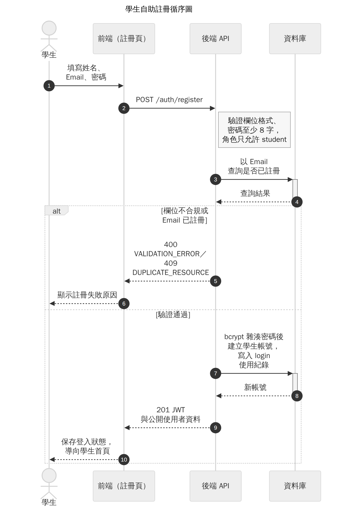

圖6-1-1a 學生自助註冊循序圖

表6-1-3　圖6-1-1a 步驟對照

| 步驟 | 發生什麼 | 錯誤碼或結果 |
| --- | --- | --- |
| 1～2 | 學生填寫姓名、Email、密碼並送出 `POST /auth/register` | — |
| （灰框） | 後端驗證欄位格式、密碼至少 8 字，角色只允許 student | 不合規 → 400 `VALIDATION_ERROR` |
| 3～4 | 以 Email 查詢是否已註冊 | — |
| 5～6 | 欄位不合規或 Email 已註冊 | 400 `VALIDATION_ERROR`／409 `DUPLICATE_RESOURCE` |
| 7～8 | bcrypt 雜湊密碼、建立學生帳號、寫入 login 使用紀錄 | — |
| 9～10 | 回傳 JWT，前端保存登入狀態並導向學生首頁 | 201，註冊完成即為登入狀態 |

設計理由：自助註冊只開放學生，教師帳號不經公開註冊產生，角色限制在後端檢查而非只靠前端表單；Email 唯一性先查詢給出明確錯誤，資料庫唯一索引再擋下同時送出的重複註冊。

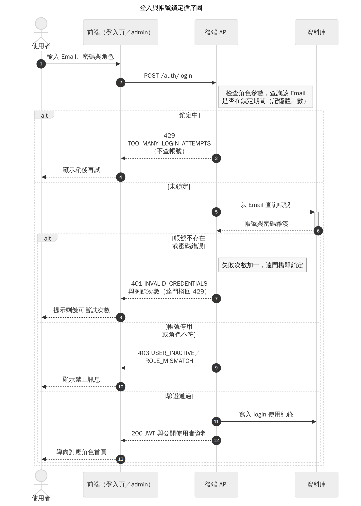

圖6-1-1b 登入與帳號鎖定循序圖

表6-1-4　圖6-1-1b 步驟對照

| 步驟 | 發生什麼 | 錯誤碼或結果 |
| --- | --- | --- |
| 1～2 | 使用者輸入 Email、密碼與角色，送出 `POST /auth/login` | — |
| （灰框） | 檢查角色參數，並查詢該 Email 是否在鎖定期間（後端記憶體計數） | — |
| 3～4 | 鎖定中：不查帳號、不比對密碼，直接拒絕 | 429 `TOO_MANY_LOGIN_ATTEMPTS` |
| 5～6 | 未鎖定：以 Email 查詢帳號與密碼雜湊 | — |
| 7～8 | 帳號不存在或密碼錯誤：失敗次數加一並回傳剩餘次數 | 401 `INVALID_CREDENTIALS`；本次達門檻 → 429 |
| 9～10 | 密碼正確但帳號停用或所選角色不符 | 403 `USER_INACTIVE`／`ROLE_MISMATCH`，不發 token |
| 11～13 | 寫入 login 使用紀錄，回傳 JWT，前端導向對應角色首頁 | 200 |

設計理由：鎖定檢查排在查詢帳號之前，鎖定期間即使密碼正確也不比對；帳號不存在與密碼錯誤走同一分支、回應相同，外界無法由錯誤訊息推知 Email 是否已註冊；角色比對放在密碼驗證之後，未通過驗證者無從得知帳號角色。JWT 只攜帶使用者 id，之後每次請求由後端重新確認帳號存在且啟用（見圖6-1-9a 步驟 3）。

### 6-1-2 課程與修課名單管理

對應 UC-02（表5-3-2）。課程異動與名單維護是兩個獨立操作，分成圖6-1-2a、圖6-1-2b。前端為課程管理頁與修課名單頁。

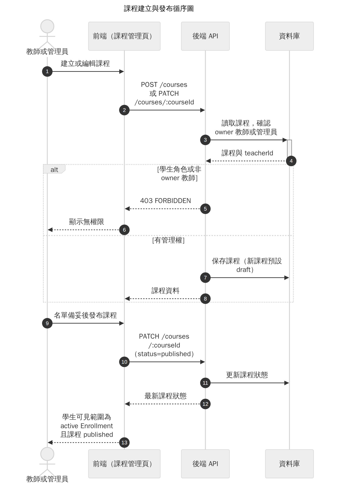

圖6-1-2a 課程建立與發布循序圖

表6-1-5　圖6-1-2a 步驟對照

| 步驟 | 發生什麼 | 錯誤碼或結果 |
| --- | --- | --- |
| 1～2 | 建立或編輯課程，送出 `POST /courses` 或 `PATCH /courses/:courseId` | — |
| 3～4 | 讀取課程，確認呼叫者是 owner 教師或管理員 | — |
| 5～6 | 學生角色或非 owner 教師 | 403 `FORBIDDEN` |
| 7～8 | 保存課程（新課程預設 draft） | 課程資料 |
| 9～12 | 名單備妥後把課程設為 published | 最新課程狀態 |
| 13 | 前端提示學生可見範圍 | active Enrollment 且課程 published |

設計理由：課程狀態與修課名單分開控制，draft 課程即使已有名單，學生仍看不到；管理員可跨課程操作，但不取代 `teacherId` 所代表的課程擁有者。

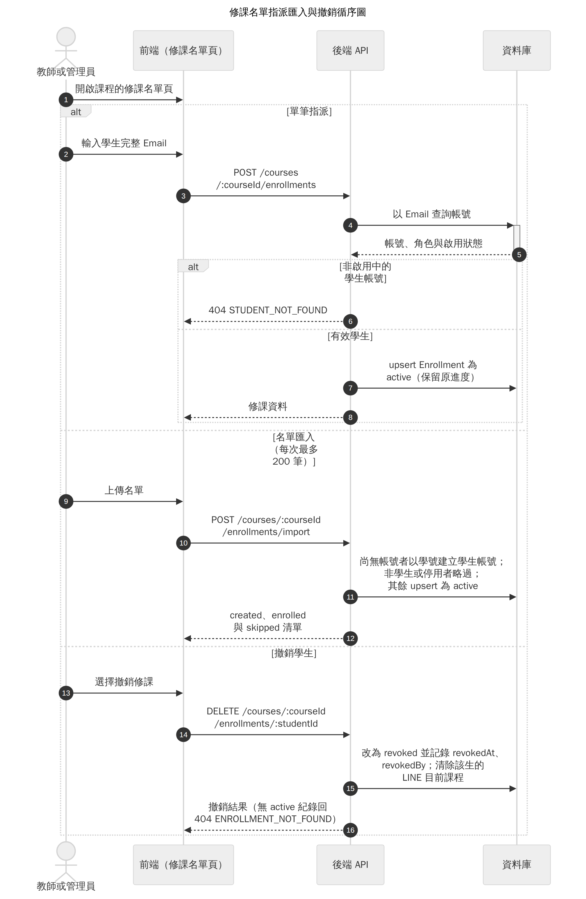

圖6-1-2b 修課名單指派、匯入與撤銷循序圖

表6-1-6　圖6-1-2b 步驟對照

| 步驟 | 發生什麼 | 錯誤碼或結果 |
| --- | --- | --- |
| 1 | 開啟課程的修課名單頁 | — |
| 2～5 | 單筆指派：以學生完整 Email 查詢帳號、角色與啟用狀態 | — |
| 6 | 查無、非學生或已停用 | 404 `STUDENT_NOT_FOUND` |
| 7～8 | upsert Enrollment 為 active，重複指派不產生重複紀錄並保留原進度 | 修課資料 |
| 9～11 | 名單匯入（每次最多 200 筆）：無帳號者以學號建立學生帳號，非學生或停用者略過，其餘 upsert 為 active | 超過 200 筆 → 400 `VALIDATION_ERROR` |
| 12 | 回傳 created、enrolled 與 skipped 清單，skipped 附原因 | 單筆失敗不影響其他列 |
| 13～15 | 撤銷：改為 revoked 並記錄 revokedAt、revokedBy，清除該生以本課程為 LINE 目前課程的設定 | — |
| 16 | 回傳撤銷結果 | 無 active 紀錄 → 404 `ENROLLMENT_NOT_FOUND` |

設計理由：撤銷不刪除 Enrollment，保留稽核歷史，重新指派時可恢復原進度；撤銷同時清除 LINE 目前課程，學生不會在 LINE 上繼續就已撤銷的課程提問。名單匯入採逐筆結果而非整批成敗，一列錯誤不會讓整份名單失效；既有帳號只被加入修課，不會被匯入改動密碼或角色。

### 6-1-3 影片加入與處理追蹤

對應 UC-03（表5-3-3）。教師上傳與 AI Pipeline 回報是不同參與者發起的兩段流程，分成圖6-1-3a、圖6-1-3b。AI Pipeline 是獨立的 Python 程序（STT_Whisper），負責語音辨識、分段與 embedding，並直接寫入片段。

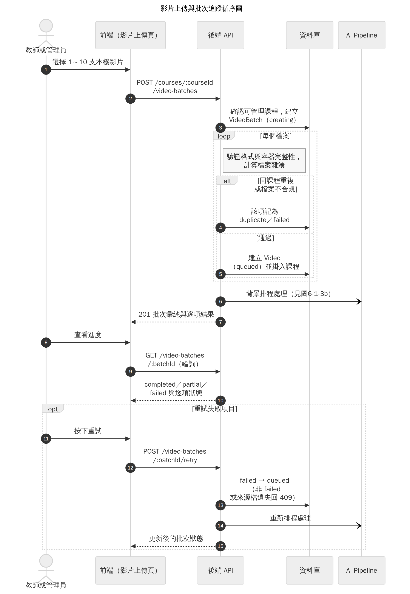

圖6-1-3a 影片上傳與批次追蹤循序圖

表6-1-7　圖6-1-3a 步驟對照

| 步驟 | 發生什麼 | 錯誤碼或結果 |
| --- | --- | --- |
| 1～3 | 教師一次選 1～10 支本機影片，以單一 multipart 請求上傳；後端確認可管理課程並建立 VideoBatch（creating） | 無管理權 → 403 `COURSE_MANAGE_DENIED`；超過 10 支 → 400 `VIDEO_BATCH_LIMIT_EXCEEDED` |
| 4 | （loop）同課程已有相同檔案或檔案不合規，該項標記後繼續下一檔 | duplicate／failed 與錯誤碼 |
| 5 | （loop）通過驗證者建立 Video 並掛入課程 | processing.status = queued |
| 6～7 | 背景排程處理（見圖6-1-3b），回傳批次彙總與逐項結果 | 201，部分失敗不回滾 |
| 8～10 | 教師以批次 API 輪詢進度 | completed／partial／failed 與逐項狀態 |
| 11～15 | 重試失敗項目：failed 改回 queued 並重新排程 | 非 failed 或來源檔遺失 → 409 |

設計理由：每處理完一個檔案就保存一次批次狀態，某一檔失敗不會回滾已成功的項目；批次狀態由各影片的處理狀態彙整而來，不另外維護一份可能互相矛盾的狀態。貼 YouTube 網址建立影片的 API 仍保留，但教師上傳頁不提供此入口，故未繪入。

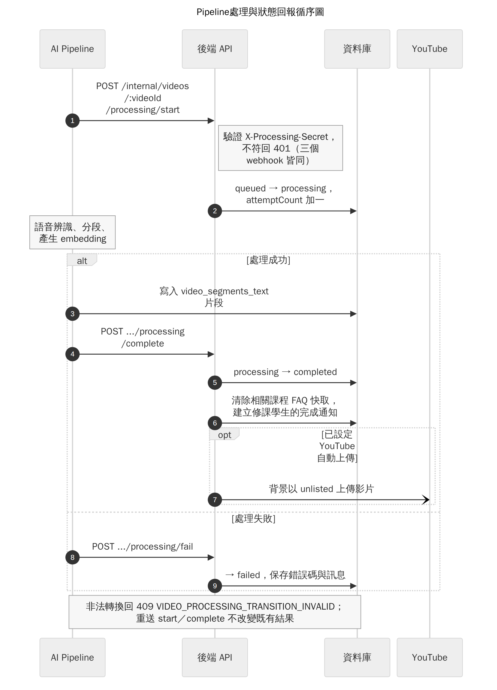

圖6-1-3b Pipeline 處理與狀態回報循序圖

表6-1-8　圖6-1-3b 步驟對照

| 步驟 | 發生什麼 | 錯誤碼或結果 |
| --- | --- | --- |
| 1～2 | Pipeline 開始運算前呼叫 start webhook；後端把 queued 轉為 processing 並累計嘗試次數 | 密鑰錯誤 → 401 |
| （灰框） | 語音辨識、分段、產生 embedding | — |
| 3～6 | 成功：Pipeline 寫入 `video_segments_text` 後呼叫 complete；後端轉為 completed，清除相關課程 FAQ 快取並通知修課學生 | — |
| 7 | （opt）已設定 YouTube 自動上傳時，背景以 unlisted 上傳 | 上傳結果不影響處理狀態 |
| 8～9 | 失敗：Pipeline 呼叫 fail，後端保存 failed 與錯誤訊息 | — |
| （底部灰框） | 狀態機只允許合法轉換；重送 start／complete 不重複計數 | 409 `VIDEO_PROCESSING_TRANSITION_INVALID` |

設計理由：processing 由 Pipeline 實際開始時回報，而不是在排程時設定，狀態反映的是真正在運算的影片；完成回報會清除 FAQ 快取，因為片段更新後舊答案可能過時。webhook 允許重送，Pipeline 在通知失敗時重試不會破壞既有結果。

### 6-1-4 學生網頁觀看與提問

對應 UC-04（表5-3-4）。開啟影片與送出提問是兩個獨立觸發，分成圖6-1-4a、圖6-1-4b；提問的 FAQ 快取、檢索與生成是網頁與 LINE 共用的段落，另畫成圖6-1-4c 供兩者引用。

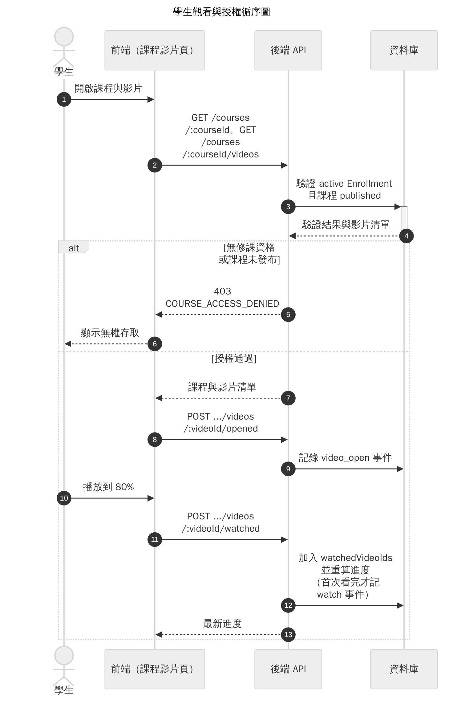

圖6-1-4a 學生觀看與授權循序圖

表6-1-9　圖6-1-4a 步驟對照

| 步驟 | 發生什麼 | 錯誤碼或結果 |
| --- | --- | --- |
| 1～4 | 學生開啟課程；後端驗證 active Enrollment 且課程 published | — |
| 5～6 | 無修課資格或課程未發布 | 403 `COURSE_ACCESS_DENIED` |
| 7～9 | 回傳課程與影片清單；前端記錄一次開啟事件 | video_open |
| 10～13 | 播放到 80% 時回報 watched；後端更新看過的影片並重算進度，首次看完才記 watch 事件 | 最新進度 |

設計理由：開啟次數與完成進度分開記錄，管理員統計看的是每次開啟，學生進度只在看到 80% 時才前進，重複觀看不會重複計入 watch 事件。

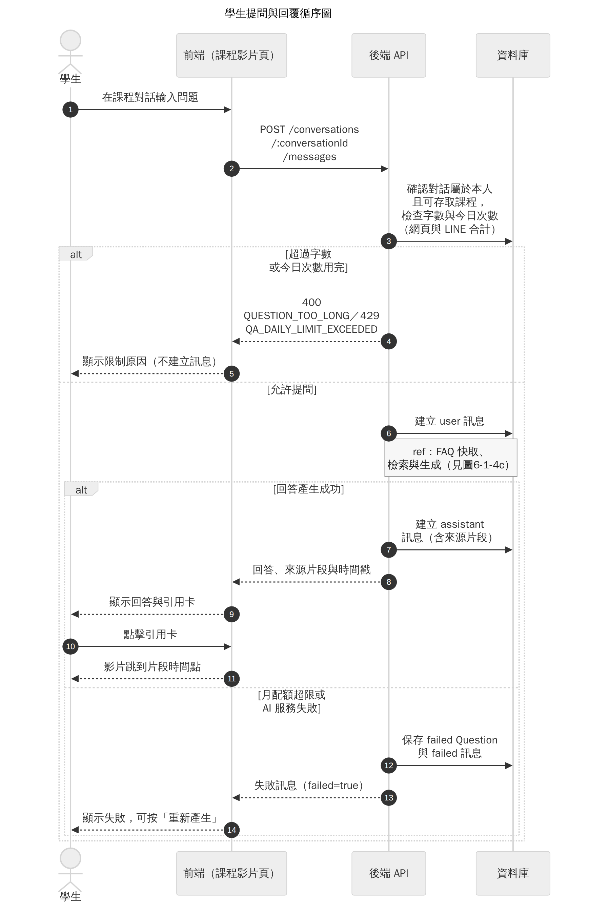

圖6-1-4b 學生提問與回覆循序圖

表6-1-10　圖6-1-4b 步驟對照

| 步驟 | 發生什麼 | 錯誤碼或結果 |
| --- | --- | --- |
| 1～3 | 學生在課程對話送出問題；後端確認對話屬於本人且仍可存取課程，檢查字數與今日次數（網頁與 LINE 合計） | 對話不屬於本人 → 403 `CONVERSATION_ACCESS_DENIED` |
| 4～5 | 超過字數或今日次數用完，不建立任何訊息 | 400 `QUESTION_TOO_LONG`／429 `QA_DAILY_LIMIT_EXCEEDED` |
| 6 | 建立 user 訊息，接著執行圖6-1-4c（灰框 ref） | — |
| 7～11 | 回答產生成功：建立含來源片段的 assistant 訊息；學生點擊引用卡，影片跳到片段時間點 | 回答、來源片段與時間戳 |
| 12～14 | 月配額超限或 AI 服務失敗：保存 failed 提問紀錄與訊息 | failed=true，可按「重新產生」 |

設計理由：每次提問都重新驗證課程存取權，撤銷修課或課程下架在下一次提問立即生效。每日次數在進入快取判斷之前檢查，快取命中的提問同樣計入；失敗的回答不扣次數，重新產生成功才計入。

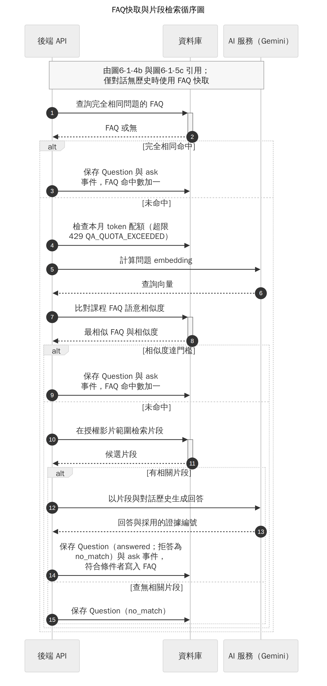

圖6-1-4c FAQ 快取與片段檢索循序圖

表6-1-11　圖6-1-4c 步驟對照

| 步驟 | 發生什麼 | 錯誤碼或結果 |
| --- | --- | --- |
| 1～3 | 第一層：以正規化後完全相同的文字查詢課程 FAQ，命中即保存提問紀錄並累加命中數 | 不呼叫 AI 服務 |
| 4 | 未命中才檢查本月 token 配額 | 429 `QA_QUOTA_EXCEEDED` |
| 5～9 | 第二層：請 AI 服務計算問題 embedding，比對課程 FAQ 語意相似度，達門檻即採用快取答案 | — |
| 10～11 | 兩層都未命中：只在該課程授權影片範圍內檢索片段 | — |
| 12～14 | 有相關片段：以片段與對話歷史生成回答，AI 服務一併回傳實際採用的證據編號；符合條件者寫入 FAQ | answered；罐頭拒答記為 no_match 且不寫 FAQ |
| 15 | 查無相關片段 | no_match，前端提示換個問法 |

設計理由：快取只用於對話中沒有歷史訊息的提問，追問一律重新檢索，避免把依賴上下文的答案給其他學生。月配額只保護真正會呼叫 AI 服務的路徑，所以排在第一層快取之後；引用只來自本次實際採用的片段，不會出現檢索範圍以外的內容。

### 6-1-5 LINE 綁定與課程問答

對應 UC-05（表5-3-5）。綁定、切換課程與提問是學生在 LINE 上的三種獨立操作，分成圖6-1-5a～6-1-5c。LINE 平台負責轉送學生訊息，並把後端的回覆送回學生。

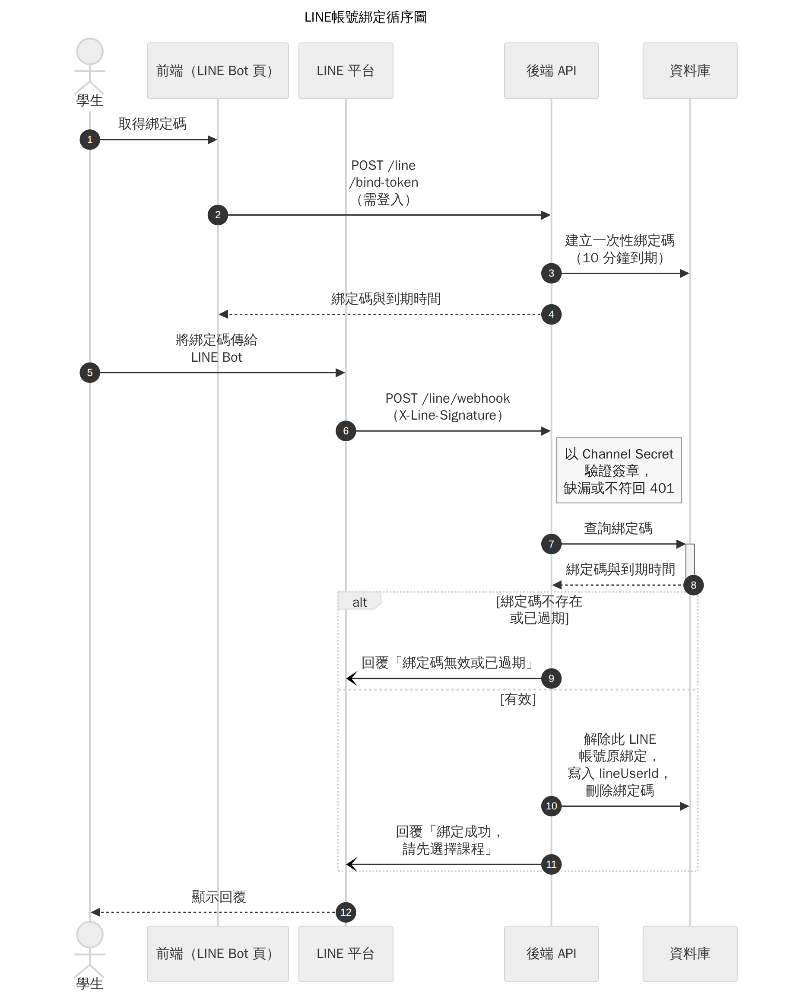

圖6-1-5a LINE 帳號綁定循序圖

表6-1-12　圖6-1-5a 步驟對照

| 步驟 | 發生什麼 | 錯誤碼或結果 |
| --- | --- | --- |
| 1～4 | 已登入的學生在網頁取得一次性綁定碼（10 分鐘到期） | — |
| 5～6 | 學生把綁定碼傳給 LINE Bot，LINE 平台以 webhook 送達後端 | — |
| （灰框） | 以 Channel Secret 驗證 HMAC 簽章（每次 webhook 皆同） | 401 `LINE_SIGNATURE_MISSING`／`LINE_SIGNATURE_INVALID` |
| 7～9 | 查詢綁定碼；不存在或已過期 | 回覆「綁定碼無效或已過期」 |
| 10～12 | 解除此 LINE 帳號原綁定、寫入 lineUserId、刪除已用綁定碼 | 回覆「綁定成功，請先選擇課程」 |

設計理由：簽章確保訊息確實來自 LINE 平台，一次性綁定碼確保是本人在網頁端主動發起；同一個 LINE 帳號改綁時以最新一次為準，先解除舊綁定再寫入，避免違反 lineUserId 的唯一限制。

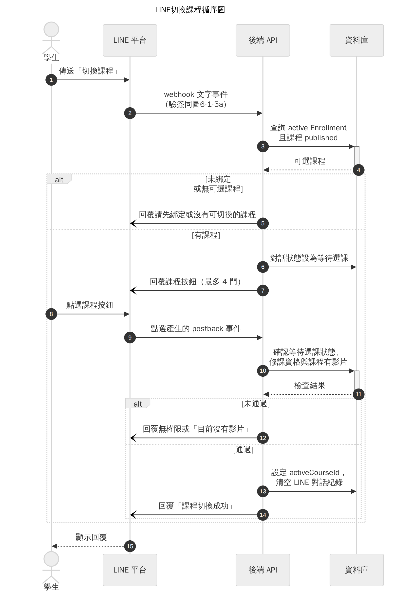

圖6-1-5b LINE 切換課程循序圖

表6-1-13　圖6-1-5b 步驟對照

| 步驟 | 發生什麼 | 錯誤碼或結果 |
| --- | --- | --- |
| 1～4 | 學生傳送「切換課程」；後端查詢 active Enrollment 且 published 的課程 | — |
| 5 | 未綁定或沒有可選課程 | 回覆操作提示 |
| 6～7 | 對話狀態設為等待選課，回覆課程按鈕 | 最多 4 門（LINE 按鈕範本上限） |
| 8～11 | 學生點選按鈕；後端確認處於等待選課狀態、修課資格有效且課程有影片 | — |
| 12 | 任一項未通過 | 回覆無權限或「目前沒有影片」 |
| 13～15 | 設定目前課程並清空 LINE 對話紀錄 | 回覆「課程切換成功」 |

設計理由：按鈕回傳的 postback 可被偽造，因此點選後再驗證一次狀態與修課資格；沒有影片的課程不設為目前課程，學生不會在空課程上得到無意義的回答。

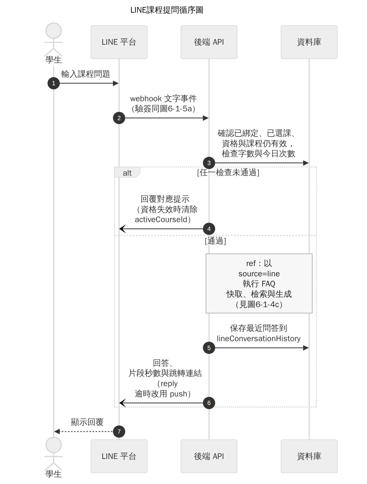

圖6-1-5c LINE 課程提問循序圖

表6-1-14　圖6-1-5c 步驟對照

| 步驟 | 發生什麼 | 錯誤碼或結果 |
| --- | --- | --- |
| 1～3 | 學生輸入問題；後端確認已綁定、已選課、資格與課程仍有效，並檢查字數與今日次數 | — |
| 4 | 任一檢查未通過 | 回覆對應提示；資格失效時清除目前課程 |
| （灰框 ref） | 以 `source=line` 執行圖6-1-4c 的 FAQ 快取、檢索與生成 | — |
| 5 | 保存最近問答，作為下一次追問的上下文 | — |
| 6～7 | 回覆答案、片段秒數與跳轉連結 | reply token 逾時改用 push |

設計理由：LINE 與網頁共用同一套課程授權、次數限制與問答流程，只有傳遞管道與對話紀錄存放位置不同，檢索與回答邏輯只維護一份。AI 回答可能需要十餘秒，LINE 的回覆憑證可能已逾時，因此改用主動推播送出同一則回答。

### 6-1-6 個人資料與通知

對應 UC-06（表5-3-6）。修改個人資料、忘記密碼與讀取通知是三個獨立入口，分成圖6-1-6a～6-1-6c，三種角色共用。

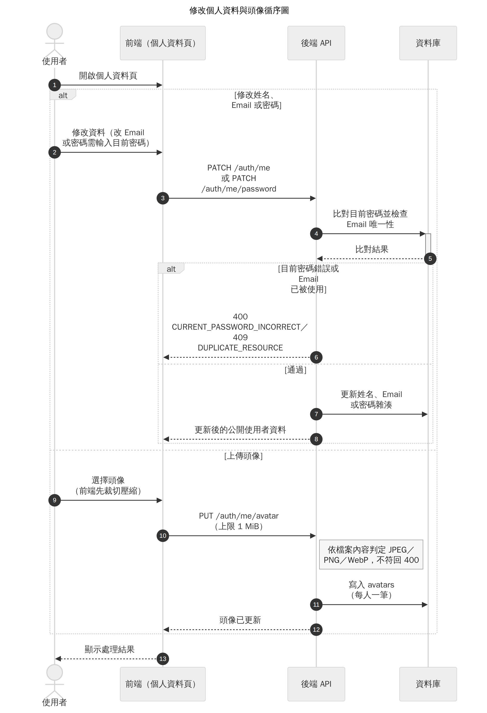

圖6-1-6a 修改個人資料與頭像循序圖

表6-1-15　圖6-1-6a 步驟對照

| 步驟 | 發生什麼 | 錯誤碼或結果 |
| --- | --- | --- |
| 1 | 開啟個人資料頁 | — |
| 2～5 | 修改姓名、Email 或密碼；改 Email 或密碼需輸入目前密碼，後端比對並檢查 Email 唯一性 | — |
| 6 | 目前密碼錯誤或 Email 已被使用 | 400 `CURRENT_PASSWORD_INCORRECT`／409 `DUPLICATE_RESOURCE` |
| 7～8 | 更新姓名、Email 或密碼雜湊 | 更新後的公開使用者資料 |
| 9～10 | 上傳頭像（前端先裁切壓縮，後端上限 1 MiB） | 超過大小 → 413 `AVATAR_TOO_LARGE`；宣告型別不允許 → 400 `INVALID_AVATAR_TYPE` |
| （灰框） | 依檔案內容判定 JPEG／PNG／WebP，與宣告型別不符即拒絕 | 400 `INVALID_AVATAR_FILE` |
| 11～13 | 頭像寫入 avatars（每人一筆） | 頭像已更新 |

設計理由：只改姓名不需要密碼，但改 Email 與密碼都涉及帳號控制權，必須先證明持有目前密碼。頭像依檔案內容而非副檔名判斷型別，讀取時需登入且只能讀自己的頭像。

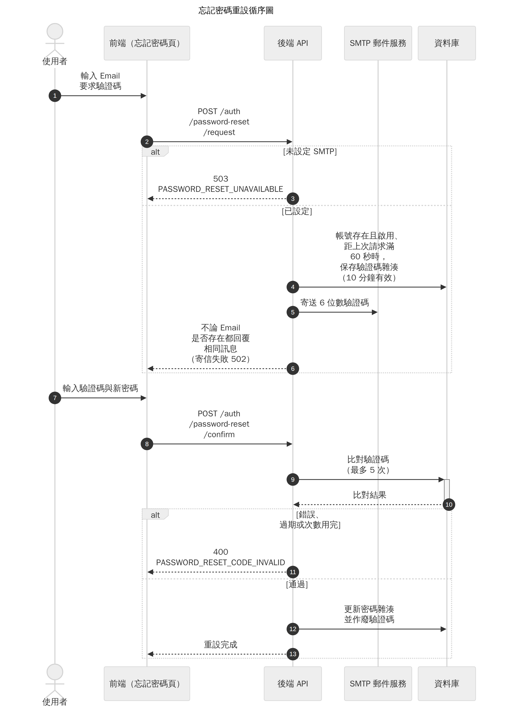

圖6-1-6b 忘記密碼重設循序圖

表6-1-16　圖6-1-6b 步驟對照

| 步驟 | 發生什麼 | 錯誤碼或結果 |
| --- | --- | --- |
| 1～2 | 使用者（未登入）輸入 Email 要求驗證碼 | — |
| 3 | 未設定 SMTP | 503 `PASSWORD_RESET_UNAVAILABLE` |
| 4～5 | 帳號存在且啟用、距上次請求滿 60 秒時，保存驗證碼雜湊（10 分鐘有效）並寄出 6 位數驗證碼 | — |
| 6 | 不論 Email 是否存在都回覆相同訊息 | 寄信失敗 → 502 `PASSWORD_RESET_EMAIL_FAILED` |
| 7～10 | 輸入驗證碼與新密碼，後端比對（最多 5 次） | — |
| 11 | 錯誤、過期或次數用完 | 400 `PASSWORD_RESET_CODE_INVALID` |
| 12～13 | 更新密碼雜湊並作廢驗證碼 | 重設完成 |

設計理由：回覆不區分 Email 是否存在，避免被用來探測帳號；60 秒的重送間隔與 5 次錯誤上限，分別防止信箱被灌爆與驗證碼被暴力猜測。

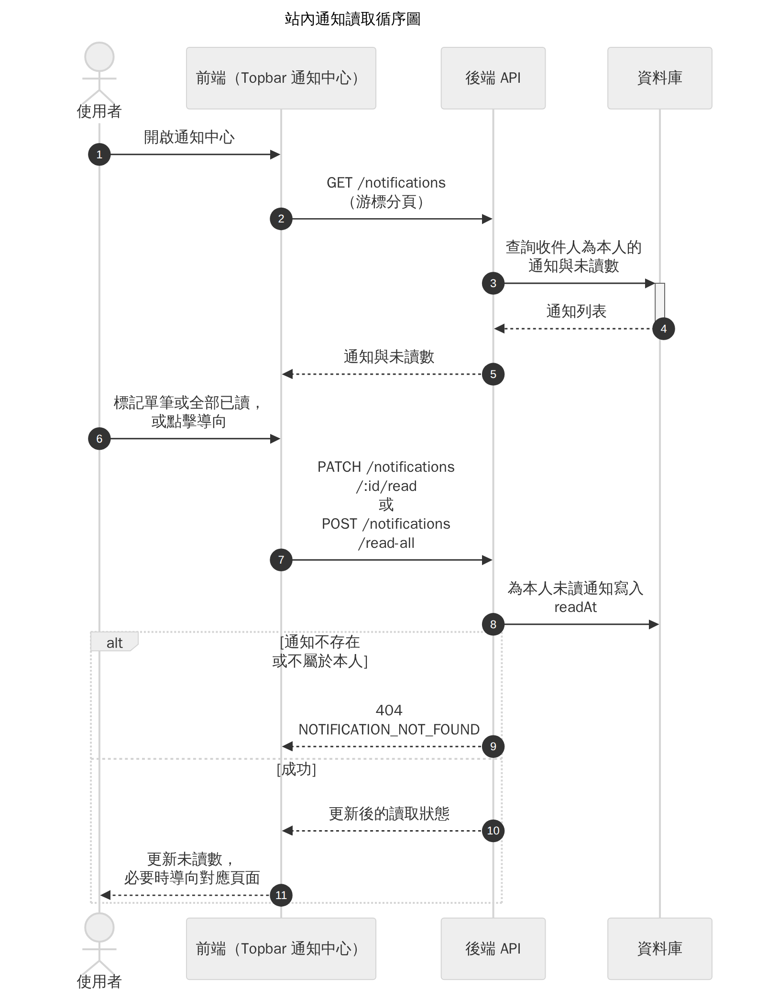

圖6-1-6c 站內通知讀取循序圖

表6-1-17　圖6-1-6c 步驟對照

| 步驟 | 發生什麼 | 錯誤碼或結果 |
| --- | --- | --- |
| 1～5 | 開啟通知中心；後端只查詢收件人為本人的通知，以游標分頁並附未讀數 | 游標格式錯誤 → 400 `VALIDATION_ERROR` |
| 6～8 | 標記單筆或全部已讀；後端只為本人未讀通知寫入 readAt | — |
| 9 | 通知不存在或不屬於本人 | 404 `NOTIFICATION_NOT_FOUND` |
| 10～11 | 回傳讀取狀態，前端更新未讀數並視需要導向對應頁面 | — |

設計理由：通知是依收件人各自建立的文件，一位使用者標記已讀不影響其他人；已讀以 readAt 時間記錄，而不是只在畫面上隱藏。

### 6-1-7 學生短影音瀏覽

對應 UC-07（表5-3-7）。只有一個觸發（開啟短影音牆），不拆圖。

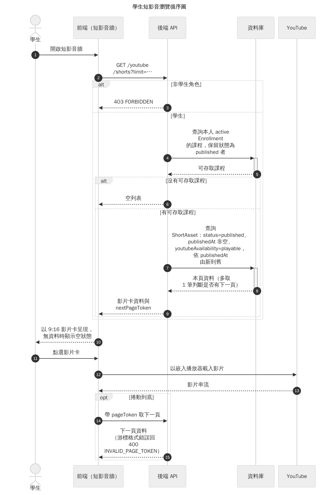

圖6-1-7 學生短影音瀏覽循序圖

表6-1-18　圖6-1-7 步驟對照

| 步驟 | 發生什麼 | 錯誤碼或結果 |
| --- | --- | --- |
| 1～2 | 學生開啟短影音牆 | — |
| 3 | 非學生角色 | 403 `FORBIDDEN` |
| 4～6 | 取本人 active Enrollment 且 published 的課程；沒有任何可存取課程 | 空列表 |
| 7～9 | 查詢 status 為 published、publishedAt 非空且 YouTube 可播放的 ShortAsset，依發布時間由新到舊，多取 1 筆判斷是否有下一頁 | 影片卡資料與 nextPageToken |
| 10～13 | 以 9:16 影片卡呈現，點選後由 YouTube 嵌入播放器載入 | 無資料時顯示空狀態 |
| 14～15 | 捲動到底時帶 pageToken 取下一頁 | 游標格式錯誤 → 400 `INVALID_PAGE_TOKEN` |

設計理由：篩選分兩段，修課授權與成品上架狀態各自獨立變化，任一條件不成立影片就從牆上消失。另有一個圖外的背景排程會定期向 YouTube 查詢影片狀態並寫回可播放狀態，被下架或設為私人的影片因此會自動從牆上移除。

### 6-1-8 短影音腳本與成品審核

對應 UC-08（表5-3-8）。腳本生成、成品上傳與成品審核是三個依序但獨立的操作，分成圖6-1-8a～6-1-8c。三張圖涉及的腳本相關 API 都受功能旗標控制，關閉時一律回 404。

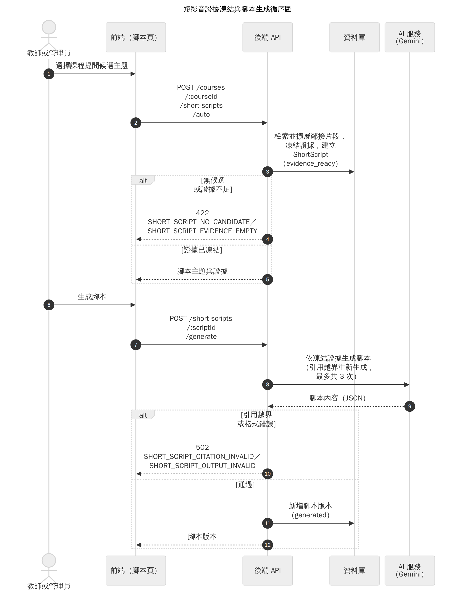

圖6-1-8a 短影音證據凍結與腳本生成循序圖

表6-1-19　圖6-1-8a 步驟對照

| 步驟 | 發生什麼 | 錯誤碼或結果 |
| --- | --- | --- |
| 1～3 | 教師選擇由課程提問彙整的候選主題；後端檢索並擴展鄰接片段，凍結證據，建立 ShortScript | evidence_ready |
| 4 | 沒有候選或證據不足 | 422 `SHORT_SCRIPT_NO_CANDIDATE`／`SHORT_SCRIPT_EVIDENCE_EMPTY` |
| 5 | 回傳腳本主題與凍結證據 | — |
| 6～9 | 生成腳本：後端把凍結證據交給 AI 服務；引用越界時重新生成，最多共 3 次 | — |
| 10 | 仍引用越界或格式錯誤 | 502 `SHORT_SCRIPT_CITATION_INVALID`／`SHORT_SCRIPT_OUTPUT_INVALID` |
| 11～12 | 新增腳本版本 | generated |

設計理由：腳本只能引用事先凍結的片段，內容可回溯到具體的課程逐字稿，而不是讓生成模型自由發揮；證據在生成前凍結，同一主題重新生成時使用的是同一批證據。

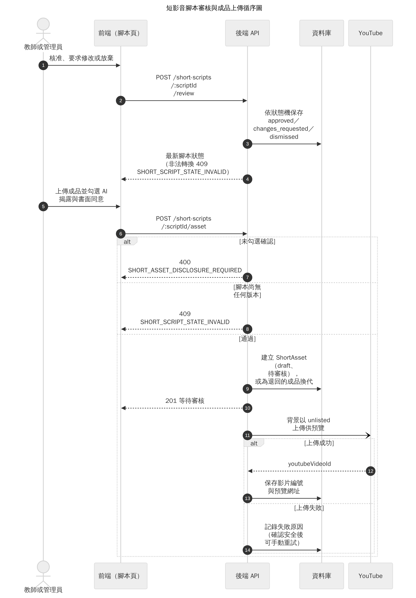

圖6-1-8b 短影音腳本審核與成品上傳循序圖

表6-1-20　圖6-1-8b 步驟對照

| 步驟 | 發生什麼 | 錯誤碼或結果 |
| --- | --- | --- |
| 1～4 | 教師核准、要求修改或放棄；後端依狀態機保存 | 非法轉換 → 409 `SHORT_SCRIPT_STATE_INVALID` |
| 5～6 | 教師上傳系統外製作的成品，並勾選 AI 揭露與書面同意 | — |
| 7 | 未勾選確認 | 400 `SHORT_ASSET_DISCLOSURE_REQUIRED` |
| 8 | 腳本尚無任何版本 | 409 `SHORT_SCRIPT_STATE_INVALID` |
| 9～10 | 建立 ShortAsset（draft、待審核），或為先前退回的成品換代 | 201 等待審核 |
| 11～13 | 背景以 unlisted 上傳 YouTube 供預覽，成功時保存影片編號 | — |
| 14 | 上傳失敗時記錄原因 | 確認可安全重試後才可手動重試 |

設計理由：系統不提供剪輯或渲染，成品由教師在系統外製作；上傳前必須確認 AI 揭露與同意，這兩項記錄在成品上供日後查核。可能已送出影片資料的失敗不自動重試，避免在 YouTube 上產生重複影片。

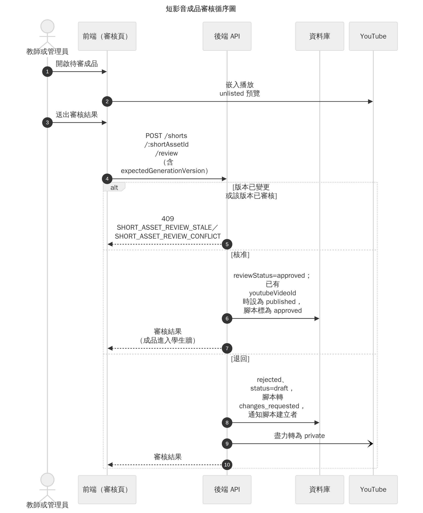

圖6-1-8c 短影音成品審核循序圖

表6-1-21　圖6-1-8c 步驟對照

| 步驟 | 發生什麼 | 錯誤碼或結果 |
| --- | --- | --- |
| 1～4 | 審核者嵌入播放 unlisted 預覽後送出審核結果，請求帶上看到的成品版本 | — |
| 5 | 版本已變更或該版本已審核 | 409 `SHORT_ASSET_REVIEW_STALE`／`SHORT_ASSET_REVIEW_CONFLICT` |
| 6～7 | 核准：已有 YouTube 影片時設為 published，腳本標為 approved | 成品進入學生牆（圖6-1-7） |
| 8～10 | 退回：成品回到 draft，腳本轉 changes_requested，通知腳本建立者，並盡力把 YouTube 影片轉為 private | — |

設計理由：審核請求帶版本號，避免審到已被換代的舊影片或重複審核；影片尚未上傳完成時核准只記錄結果，待上傳成功再自動上架。腳本核准與成品上架是兩道獨立關卡，成品是否上架只取決於當前版本的審核結果。

### 6-1-9 管理員維運

對應 UC-09（表5-3-9）。後台授權與使用者管理，以及其他三種資料維運，分成圖6-1-9a、圖6-1-9b。

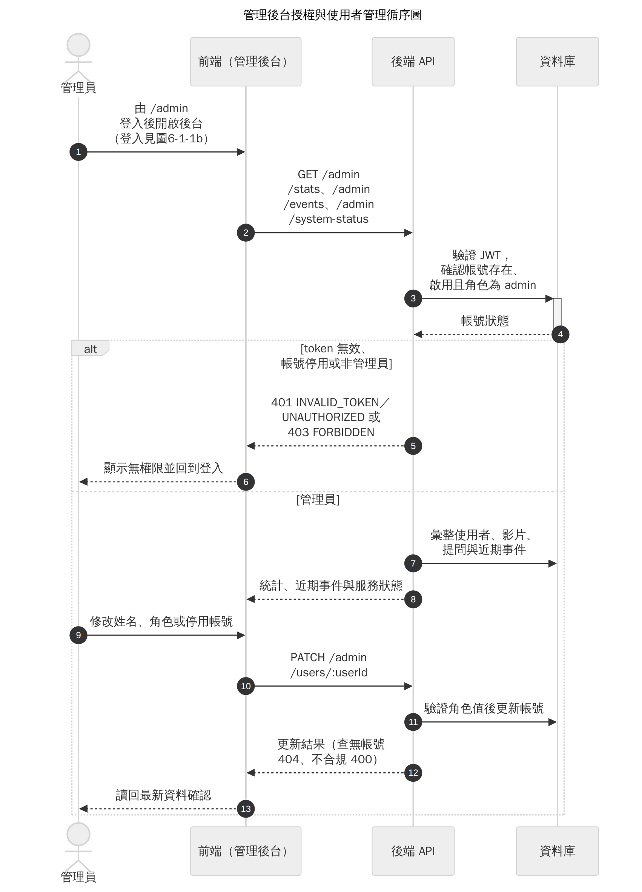

圖6-1-9a 管理後台授權與使用者管理循序圖

表6-1-22　圖6-1-9a 步驟對照

| 步驟 | 發生什麼 | 錯誤碼或結果 |
| --- | --- | --- |
| 1～4 | 管理員由 `/admin` 登入（見圖6-1-1b）後開啟後台；後端驗證 JWT，確認帳號存在、啟用且角色為 admin | — |
| 5～6 | token 無效、帳號停用或不存在、角色不是管理員 | 401 `INVALID_TOKEN`／`UNAUTHORIZED` 或 403 `FORBIDDEN` |
| 7～8 | 彙整使用者、影片、提問與近期事件 | 統計、近期事件與服務狀態 |
| 9～12 | 修改姓名、角色或停用帳號 | 查無帳號 → 404 `NOT_FOUND`；角色值不合規 → 400 `VALIDATION_ERROR` |
| 13 | 前端讀回最新資料確認 | — |

設計理由：授權不沿用登入當下的判斷，每一個後台請求都重新查詢帳號狀態，管理員被停用後下一個請求即失效。

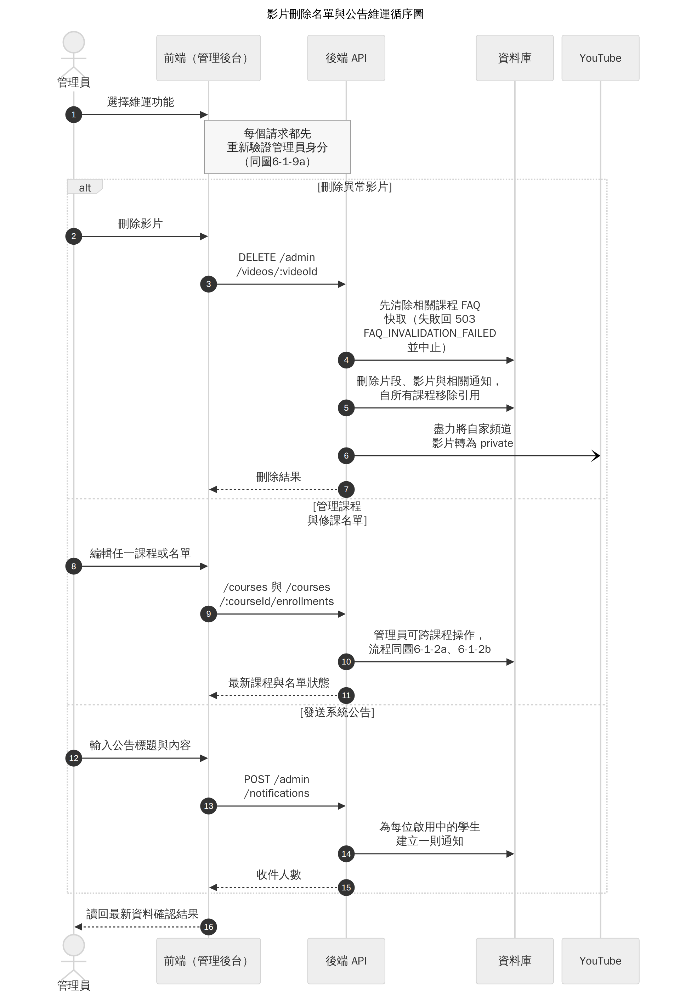

圖6-1-9b 影片刪除、名單與公告維運循序圖

表6-1-23　圖6-1-9b 步驟對照

| 步驟 | 發生什麼 | 錯誤碼或結果 |
| --- | --- | --- |
| 1 | 選擇維運功能（每個請求都先重新驗證管理員身分，同圖6-1-9a） | — |
| 2～4 | 刪除影片：先清除相關課程 FAQ 快取 | 失敗 → 503 `FAQ_INVALIDATION_FAILED` 並中止 |
| 5～7 | 刪除片段、影片與相關通知，自所有課程移除引用，盡力把自家頻道影片轉為 private | 刪除結果 |
| 8～11 | 管理課程與修課名單：沿用圖6-1-2a、6-1-2b 的 API，可跨課程操作 | 最新課程與名單狀態 |
| 12～15 | 發送系統公告：為每位啟用中的學生建立一則通知 | 收件人數 |
| 16 | 前端讀回最新資料確認結果 | — |

設計理由：刪除影片前必須先清除 FAQ 快取，確保不會留下引用已刪除影片的快取答案；提問紀錄與使用紀錄屬歷史資料，不隨影片刪除。所有操作完成後都讀回實際資料，不以前端的樂觀更新代替結果。

## 6-2 設計類別圖（Design class diagram）與設計物件圖（Design object diagram）

本節依第5章表5-4-1 的分析責任分成三組設計類別，每組各有兩張圖：a 圖為服務視圖，呈現後端服務、對外操作與服務之間的依賴；b 圖為資料視圖，呈現 Mongoose model 的屬性、參照關聯與多重性。另附一張設計物件圖。分析層的邊界與控制類別以責任命名（例如「課程授權」），在設計層落實為具體的後端服務；實體類別落實為 model，對應關係如表6-2-1。

表6-2-1　分析責任到設計類別的落實

| 分析類別（表5-4-1） | 設計類別 | 設計圖 |
| --- | --- | --- |
| 身分驗證 | AuthService、LoginThrottle | 圖6-2-1a |
| 課程授權 | CourseAccessService | 圖6-2-1a |
| 修課管理 | EnrollmentService | 圖6-2-1a |
| 影片管理、影片批次管理 | VideoBatchService、VideoProcessingService（影片掛載、解除掛載與刪除由 VideoService 負責，未繪入圖中，流程見圖6-1-3、圖6-1-9） | 圖6-2-1a |
| 提問處理 | QaService、AskLimitsService、FaqCacheService、CostControlService、AnswerGenerationService | 圖6-2-2a |
| 對話管理 | ConversationService | 圖6-2-2a |
| LINE 對話處理 | LineService | 圖6-2-2a |
| 通知發送 | NotificationService | 圖6-2-3a |
| 短影音腳本產生 | ShortScriptService | 圖6-2-3a |
| 短影音成品審核 | ShortAssetPublishService、ShortAssetService | 圖6-2-3a |
| 個人資料維護（UC-06） | AuthService（圖6-2-1a）、AvatarService、PasswordResetService | 圖6-2-1a、圖6-2-3a |
| 核心、問答、營運與短影音實體 | User、Course、Enrollment、Video、VideoBatch、Conversation、Message、Question、Faq、UsageLog、VideoSegment、Notification、ShortScript、ShortAsset 等 model | 圖6-2-1b、圖6-2-2b、圖6-2-3b |

記法說明：標示 «service» 的類別是後端服務，程式以 CommonJS 模組匯出函式，不是 JavaScript class，圖中以類別表示其對外操作；操作名稱即實際函式名稱，參數以物件傳入，圖中省略參數列、保留回傳型別。未標示 stereotype 的類別是 model，屬性以「欄位 : 型別」列出，列舉值以「｜」分隔，只列理解責任所需的欄位，不列 `_id` 與時間戳記。虛線箭頭表示使用關係（dependency），箭頭旁為用途；實線箭頭表示 model 之間以參照欄位建立的關聯，箭頭指向被參照的一方並標示多重性。MongoDB 不強制參照完整性，這些關聯由應用層維護，限制細節見第8章。服務對 model 的使用關係若全部畫在 a 圖會使圖面過寬，改列於各小節的表格。圖6-2-2a、圖6-2-3a 為橫向版面，排版時建議放在橫式頁面；其餘 b 圖與圖6-2-1a 可放直式頁面。

### 6-2-1 帳號、課程與影片設計類別圖

對應 UC-01～UC-03。

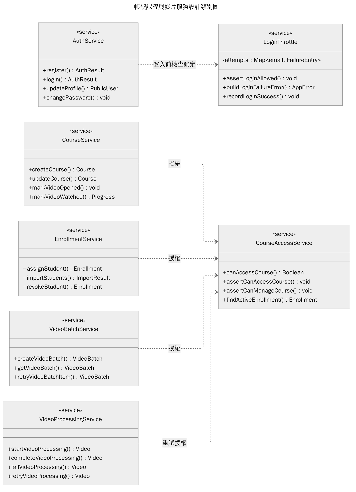

圖6-2-1a 帳號課程與影片服務設計類別圖

表6-2-2　圖6-2-1a 圖上位置對照

| 圖上位置 | 說明 |
| --- | --- |
| AuthService → LoginThrottle | 登入前先檢查鎖定；LoginThrottle 以記憶體中的 `attempts` 記錄各 Email 的失敗次數，不寫入資料庫，對應圖6-1-1b 的灰框 |
| 四個服務 → CourseAccessService | CourseService、EnrollmentService、VideoBatchService、VideoProcessingService 都依賴它判斷「可存取課程」與「可管理課程」 |
| CourseAccessService 的操作 | `findActiveEnrollment()` 與課程 status 共同決定學生的存取權，對應圖6-1-4a 步驟 3 |

表6-2-3　圖6-2-1a 服務與使用的資料類別

| 服務 | 使用的資料類別（見圖6-2-1b） |
| --- | --- |
| AuthService | User（建立與驗證） |
| CourseService | Course |
| EnrollmentService | Enrollment |
| VideoBatchService | VideoBatch、Video（逐檔建立） |
| VideoProcessingService | Video（處理狀態轉換） |

設計理由：授權規則集中在 CourseAccessService 一處，而不是散落在各服務中，任何新功能只要呼叫同一組判斷，就不會出現某條 API 漏掉修課或發布檢查的情況。

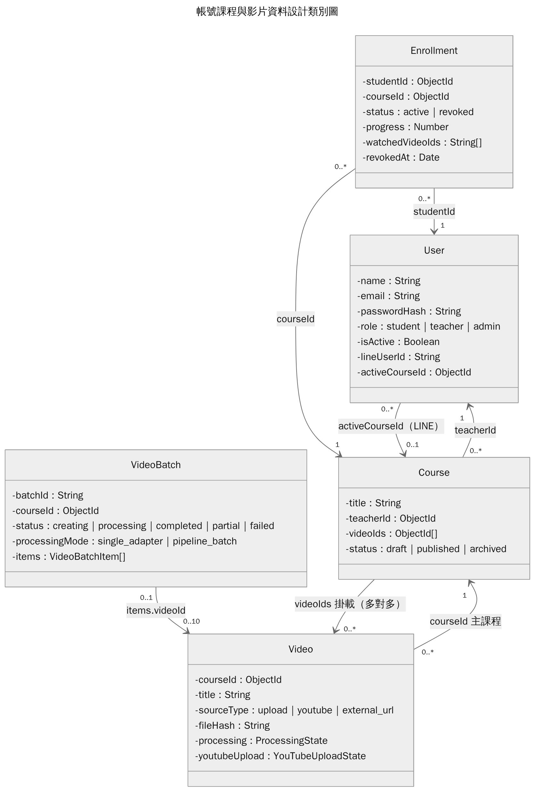

圖6-2-1b 帳號課程與影片資料設計類別圖

表6-2-4　圖6-2-1b 圖上關聯對照

| 圖上關聯 | 說明 |
| --- | --- |
| Course → User（teacherId，0..* 對 1） | 課程擁有者 |
| Enrollment → User、Course（studentId、courseId） | 同一學生與課程只有一筆（唯一索引），撤銷時改變 `status` 而不刪除 |
| Video → Course（courseId 主課程）與 Course → Video（videoIds 掛載，多對多） | 影片有一門主課程，另可掛載到多門課程 |
| VideoBatch → Video（items.videoId，0..1 對 0..10） | 一次上傳最多 10 支影片及其逐項結果 |
| User → Course（activeCourseId，0..1） | 只用於 LINE 的目前課程 |

設計理由：影片的處理狀態只寫在各 Video 的 `processing` 上，VideoBatch 的狀態由各影片彙整而來，兩者不會各自更新而互相矛盾。

### 6-2-2 問答與對話設計類別圖

對應 UC-04、UC-05。

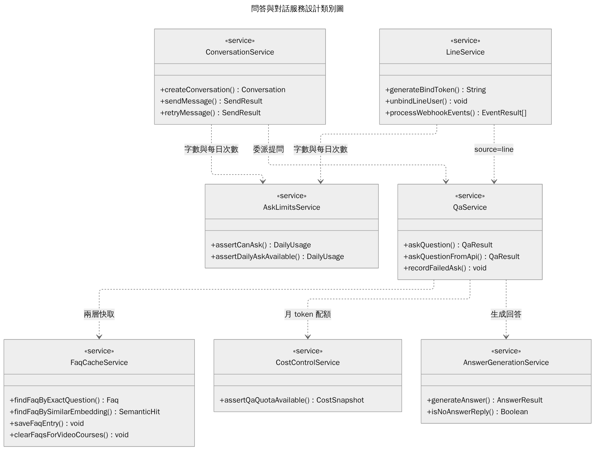

圖6-2-2a 問答與對話服務設計類別圖（建議橫式頁）

表6-2-5　圖6-2-2a 圖上位置對照

| 圖上位置 | 說明 |
| --- | --- |
| ConversationService、LineService → AskLimitsService | 兩個提問入口都先檢查字數與每日次數 |
| ConversationService、LineService → QaService | 兩個入口共用 `askQuestion()`，LINE 以 `source=line` 呼叫 |
| QaService → FaqCacheService | `findFaqByExactQuestion()` 與 `findFaqBySimilarEmbedding()` 對應圖6-1-4c 的兩層快取 |
| QaService → CostControlService | `assertQaQuotaAvailable()` 在兩層快取之間檢查月 token 配額 |
| QaService → AnswerGenerationService | `generateAnswer()` 生成回答；`isNoAnswerReply()` 辨識罐頭拒答，避免寫入 FAQ |

表6-2-6　圖6-2-2a 服務與使用的資料類別

| 服務 | 使用的資料類別（見圖6-2-2b） |
| --- | --- |
| ConversationService | Conversation（維護）、Message（建立） |
| LineService | LineBindToken（產生與核銷） |
| QaService | Question、UsageLog（記錄）；VideoSegment（授權範圍檢索） |
| FaqCacheService | Faq（查詢與保存） |

設計理由：網頁與 LINE 的差異只在對話紀錄存放位置（網頁存於 Conversation 與 Message，LINE 存於 User 的 LINE 對話欄位）與回覆方式，檢索與回答邏輯只有 QaService 一份。

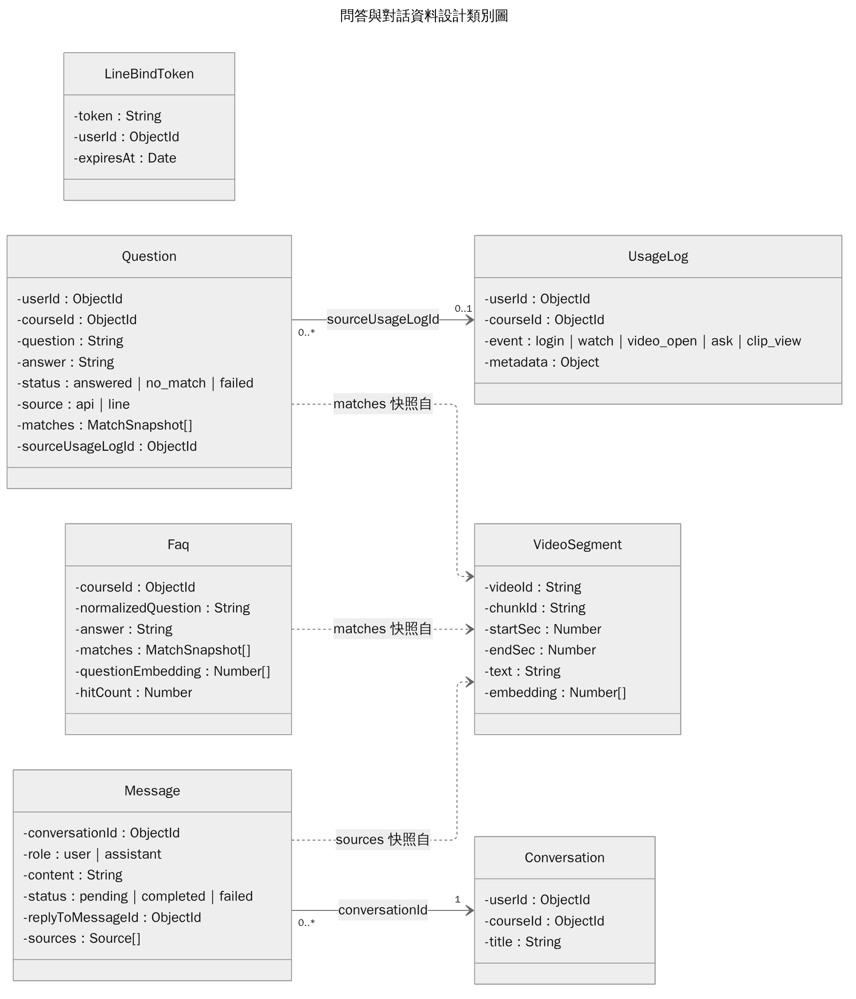

圖6-2-2b 問答與對話資料設計類別圖

表6-2-7　圖6-2-2b 圖上關聯對照

| 圖上關聯 | 說明 |
| --- | --- |
| Message → Conversation（conversationId，0..* 對 1） | assistant 訊息另以 `replyToMessageId` 指向所回答的 user 訊息，失敗重試時更新同一則 assistant 訊息 |
| Question → UsageLog（sourceUsageLogId） | 每次提問的稽核紀錄連到當次的 ask 事件 |
| Question、Faq、Message → VideoSegment（虛線「快照自」） | `matches`、`sources` 保存片段內容的快照而非參照 |
| LineBindToken（無連線） | 以 `userId` 指向 User（User 不在本圖），一次性使用、到期自動清除 |

設計理由：引用以快照保存，片段日後被重新處理，歷史回答仍保有當時引用的內容；Question 保存檢索到的全部候選供稽核，Message 的 `sources` 只保存回答實際採用的片段供學生核對。Question 與 Faq 之間沒有直接關聯，快取命中時同樣新增一筆 Question，快取答案與即時生成的答案走同一套紀錄。

### 6-2-3 個人資料、通知與短影音設計類別圖

對應 UC-06～UC-08。

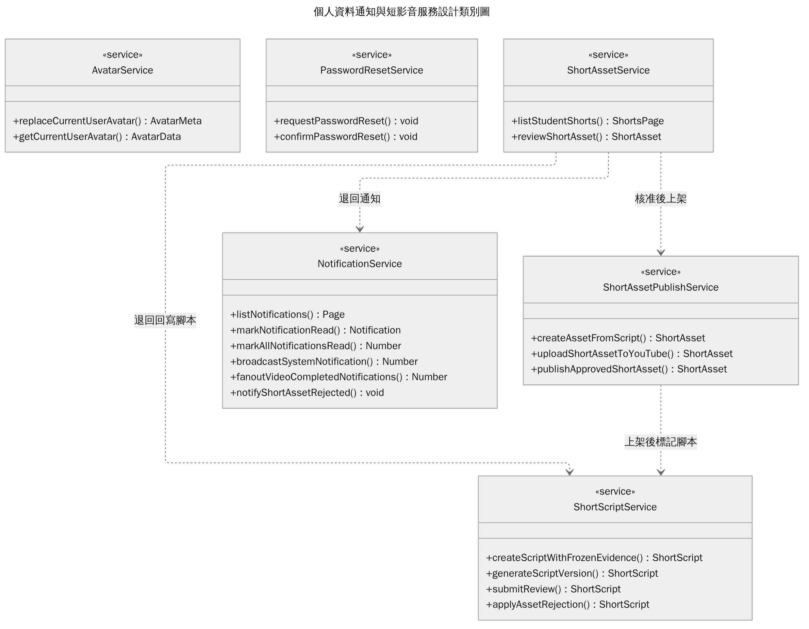

圖6-2-3a 個人資料通知與短影音服務設計類別圖（建議橫式頁）

表6-2-8　圖6-2-3a 圖上位置對照

| 圖上位置 | 說明 |
| --- | --- |
| AvatarService、PasswordResetService | 頭像保存與忘記密碼；姓名、Email 與密碼修改由圖6-2-1a 的 AuthService 負責 |
| ShortAssetService → NotificationService | 成品退回時通知腳本建立者 |
| ShortAssetService → ShortScriptService | 成品退回時把腳本轉為 changes_requested |
| ShortAssetService → ShortAssetPublishService | 成品核准後上架 |
| ShortAssetPublishService → ShortScriptService | 上架後把腳本標為 approved |

表6-2-9　圖6-2-3a 服務與使用的資料類別

| 服務 | 使用的資料類別（見圖6-2-3b） |
| --- | --- |
| AvatarService | Avatar（每位使用者一筆） |
| NotificationService | Notification（建立與已讀） |
| ShortScriptService | ShortScript（狀態機） |
| ShortAssetPublishService | ShortAsset（建立與上傳） |
| ShortAssetService | ShortAsset（查詢與審核） |

設計理由：短影音分為腳本、成品上傳與成品審核三個服務，對應圖6-1-8a～6-1-8c 三道操作；通知服務只在事件發生時被呼叫，不主動輪詢短影音狀態。

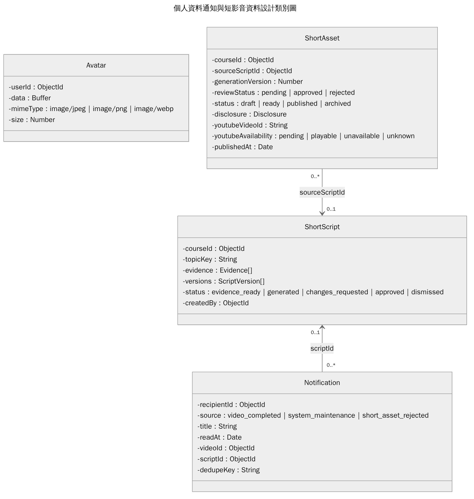

圖6-2-3b 個人資料通知與短影音資料設計類別圖

表6-2-10　圖6-2-3b 圖上關聯對照

| 圖上關聯 | 說明 |
| --- | --- |
| ShortAsset → ShortScript（sourceScriptId，0..* 對 0..1） | 一份腳本可對應多個成品；`generationVersion` 記錄同一成品的換代次數 |
| Notification → ShortScript（scriptId） | 退回通知可導回對應腳本；`dedupeKey` 防止同一事件重複通知 |
| Avatar（無連線） | 以 `userId` 指向 User（User 不在本圖） |

設計理由：成品的審核狀態（`reviewStatus`）與上架狀態（`status`）是兩個欄位，審核只對當前 `generationVersion` 有效；學生牆只顯示 `status` 為 published 且 YouTube 可播放者（圖6-1-7 步驟 7）。

### 6-2-4 學生網頁問答授權與引用設計物件圖

圖6-2-4 對應 UC-04，以一次網頁提問完成後的實例快照，說明圖6-2-1b 與圖6-2-2b 的設計類別在執行時如何連結。情境為：學生 student01 已被指派到已發布的 course01，在新建的對話中提出第一個問題，兩層 FAQ 快取都未命中，系統檢索到 segment07 並生成回答。

圖6-2-4 為橫向版面，建議放在橫式頁面。

圖6-2-4 Web問答授權與引用設計物件圖

圖中名稱與數值為示例，不是實際帳號或課程資料；物件以「物件名 : 類別名」標示（繪圖工具無法加上 UML 規定的底線）。授權來自 enrollment01 同時連到 student01 與 course01，且 course01 為 published，學生本身並不直接持有課程。conversation01 屬於 student01 與 course01，其中 message01 是學生的提問，message02 是回答，以 `replyToMessageId` 指回 message01，並在 `sources` 保存實際引用的 segment07；segment07 以 `videoId` 屬於 video01，而 video01 掛載在 course01，所以引用必然落在學生有權存取的課程範圍內。同一次提問另產生 question01（answered）與 usageLog01（ask），兩者以 `sourceUsageLogId` 連結，供統計與稽核使用。由於這是對話中的第一個問題且答案不是拒答，系統同時寫入 faq01，下一位學生問相同問題時即可由快取回答。
