# 第7章 實作模型

本章由四個視角說明 FocusFlow 如何落實為可執行的系統：7-1 說明程式在正式環境中跑在哪些節點、彼此以什麼協定溝通；7-2 說明前端、後端、AI Pipeline、資料儲存與問答通道的程式如何分群及相互依賴；7-3 說明可替換的元件透過哪些介面合作；7-4 說明登入、影片批次、影片處理、問答與 LINE 對話範圍五個物件在生命週期中的狀態與合法轉換。

圖表內容依目前程式碼、部署檔與設定檔整理。外部服務的憑證、Atlas 索引與正式主機上的實際連線狀態屬執行環境事實，本章以「待確認」標示，實際狀態以正式主機內的 `/health` 端點為準。

---

## 7-1 佈署圖（Deployment diagram）

FocusFlow 由四個可獨立啟動的部分構成：在瀏覽器中執行的 React SPA、以 PM2 常駐的 Node.js／Express API、由 API 以子程序啟動的 Python AI Pipeline，以及外部受管的 MongoDB Atlas。瀏覽器與 LINE 都不直接讀寫資料庫；課程權限、影片管理與問答請求一律先進入 API，由 API 驗證身分與授權後再存取資料或呼叫外部服務。

表7-1-1　部署層級、用途與驗收邊界

| 層級 | 節點與 artifact | 用途 | 執行環境狀態 |
| --- | --- | --- | --- |
| 使用者裝置 | 網頁瀏覽器（React SPA）、LINE App | 學生、教師與管理員操作介面；學生亦可由 LINE 提問 | — |
| 外部平台 | LINE Platform、YouTube、GitHub | LINE 訊息轉送與回覆、影片嵌入播放與自動上傳、原始碼與部署工作來源 | 憑證與 webhook 通道有效性：待確認 |
| 校內虛擬機 | Nginx（`dist` 靜態檔、443 TLS 與 `/api/` 反向代理）、PM2（`focusflow-backend`）、Python 虛擬環境（`main.py`／`batch_main.py`）、`backend/uploads`、`ngrok.service`、GitHub Actions self-hosted runner | 提供網站與 API、執行語音辨識與向量化、暫存上傳影片、轉送 LINE webhook、自動部署 | Python 虛擬環境與模型是否就緒：待確認 |
| 資料與 AI 服務 | MongoDB Atlas（含 Atlas Vector Search）、Gemini API、SMTP 郵件服務 | 儲存應用資料與影片片段、向量檢索、embedding 與回答生成、忘記密碼驗證信 | Atlas 索引、API 金鑰與寄信帳號：待確認 |

如圖7-1-1所示，佈署圖由上而下分為使用者裝置、外部平台、校內虛擬機、資料與 AI 服務四層。

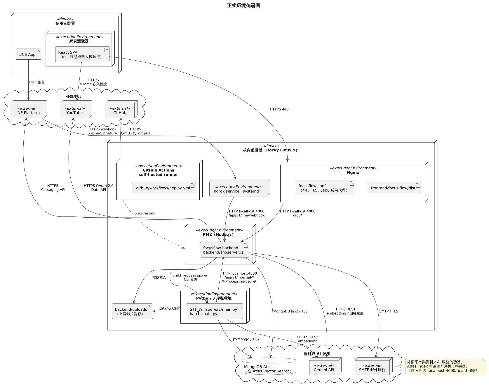

圖7-1-1 正式環境佈署圖

判讀重點如下：

- **網頁請求路徑**：瀏覽器以 HTTPS 443 連到 Nginx，Nginx 直接回應 `frontend/focus-flow/dist` 靜態檔，並把 `/api/` 開頭的請求轉給本機 `localhost:4000` 上的 `focusflow-backend`。學生觀看影片時，瀏覽器另以 YouTube IFrame 直接向 YouTube 取得串流，不經過 FocusFlow 主機。
- **LINE 路徑**：LINE Platform 把使用者訊息以 HTTPS webhook（附 `X-Line-Signature`）送到 `ngrok.service` 的公開通道，再轉到本機 4000 埠的 `/api/v1/line/webhook`，不經過 Nginx 的 443；後端回覆時再以 HTTPS 呼叫 LINE Messaging API。通道網址屬部署變動項，不列入圖中。
- **影片處理路徑**：API 收到上傳影片後寫入 `backend/uploads`，再以 `child_process.spawn` 啟動 `STT_Whisper/src/main.py`（多影片批次為 `batch_main.py`）。Pipeline 讀取來源影片、呼叫 Gemini 產生 embedding、以 pymongo 把片段寫入 Atlas，處理的開始、完成與失敗則以 HTTP 呼叫本機 `/api/v1/internal/*`，並以 `X-Processing-Secret` 驗證身分。
- **外部服務**：API 以 MongoDB 協定（TLS）存取 Atlas，以 HTTPS 呼叫 Gemini（回答生成可依設定切換為 OpenAI）、LINE 與 YouTube Data API（OAuth 2.0），以 SMTP 寄送驗證信。
- **自動部署**：`.github/workflows/deploy.yml` 定義 push 到 `main` 後，由虛擬機上的 self-hosted runner 取得工作，在 `/opt/focusflow` 執行 `git pull`、安裝後端相依套件、建置前端、以 `restorecon` 修正 SELinux context，接著 `pm2 restart focusflow-backend` 並 `systemctl reload nginx`；最後在主機內檢查 `/health` 的問答就緒狀態與 Nginx 的 API 代理。
- **對外連接埠**：依部署紀錄，對外僅 443 提供 HTTPS，80 埠由學校防火牆阻擋，Nginx 的 80 轉址只在主機內部生效；HTTPS 憑證由 acme.sh 以 TLS-ALPN-01 簽發並自動續約。上述狀態本章未重新實測，列為待確認。

文件不記錄 IP、token、連線字串或其他環境秘密。

## 7-2 套件圖（Package diagram）

套件圖回答「程式如何分群、誰依賴誰」。本節依責任把 FocusFlow 拆成五張圖：前端、後端、AI Pipeline、資料儲存，以及跨越 Web 與 LINE 兩個通道的問答程式。每張圖外框是實際目錄，內部套件以責任分群並列出代表檔案；虛線箭頭由依賴者指向被依賴者，箭頭文字說明依賴原因。第三方函式庫以 `«library»` 標示，版本取自 `package.json` 或 `requirements.txt` 宣告的可安裝範圍，實際安裝版本以各環境的 lockfile 為準。

表7-2-1　主要套件與其在 FocusFlow 中的用途

| 區域 | 主要套件（宣告版本） | 在 FocusFlow 中的用途 |
| --- | --- | --- |
| 前端 | React、React DOM ^19.2.4 | 三角色 SPA 的元件與狀態管理 |
| 前端 | Vite ^8.0.4（開發工具） | 開發伺服器與 production build，產出由 Nginx 提供的 `dist` |
| 前端 | three ^0.183.2、gsap ^3.14.2 | 登入與首頁的 3D 背景與動畫效果 |
| 前端 | qrcode.react ^4.2.0 | 產生 LINE 綁定 QR Code |
| 後端 | express ^4.19.2、cors ^2.8.5、morgan ^1.10.0 | REST 路由、跨來源白名單與請求紀錄 |
| 後端 | jsonwebtoken ^9.0.2、bcryptjs ^2.4.3 | JWT 簽發與驗證、密碼雜湊 |
| 後端 | multer ^2.0.0 | 影片、頭貼與問題回報截圖的 multipart 上傳 |
| 後端 | mongoose ^8.13.2、mongodb ^7.1.1 | Mongoose 管理 schema 與資料存取；原生 driver 用於同步、建立索引等維運腳本 |
| 後端 | nodemailer ^6.10.1 | 忘記密碼驗證信 |
| 後端 | swagger-ui-express ^5.0.1 | 於 `/docs` 呈現 OpenAPI 文件 |
| AI Pipeline | faster-whisper >=1.1.0、imageio-ffmpeg >=0.5.1、yt-dlp >=2026.3.17 | 語音辨識、音訊抽取、YouTube 音訊下載 |
| AI Pipeline | rapidfuzz >=3.13.0 | 逐字稿專有名詞正規化 |
| AI Pipeline | google-genai >=1.0.0 | 文字片段與視覺片段的 embedding |
| AI Pipeline | pymongo >=4.11.0 | 把片段與 embedding upsert 到 MongoDB |

圖7-2-1 說明前端如何由網址入口一路分派到頁面與 API 呼叫。分群依邏輯責任劃分；其中 `DashboardApp.jsx` 實體位於 `components/`，但負責依角色組合頁面，因此歸入應用殼層。

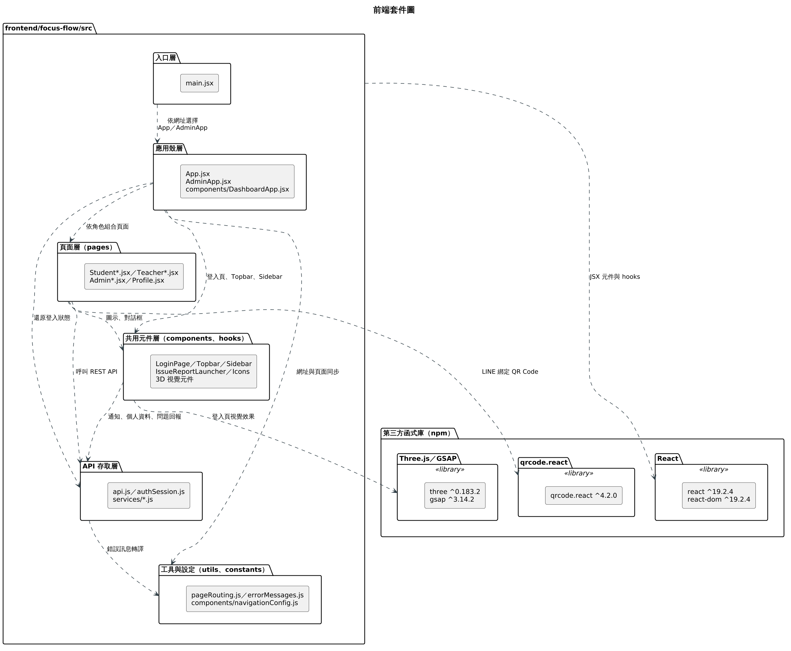

圖7-2-1 前端套件圖

`main.jsx` 依網址把 `/admin` 導向 `AdminApp.jsx`，其他路徑導向 `App.jsx`；應用殼層透過 `authSession.js` 還原登入狀態、以 `pageRouting.js` 同步網址，並由 `DashboardApp.jsx` 依角色組合學生、教師或管理員頁面。頁面與共用元件都只經由 API 存取層（`api.js`、`authSession.js` 與 `services/*.js`）呼叫後端，`api.js` 統一附加 JWT 並透過 `errorMessages.js` 把錯誤碼轉成中文訊息。前端只負責導覽與呈現，資料權限一律由後端重新驗證。

圖7-2-2 說明後端以 `backend/src` 的實體目錄分群，並標出分層規則的例外依賴。

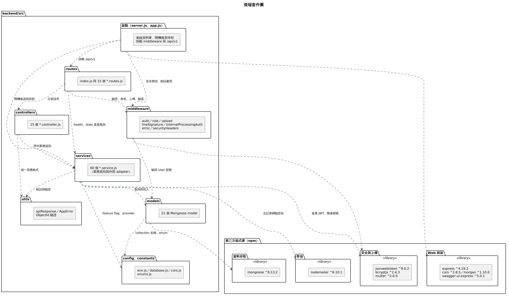

圖7-2-2 後端套件圖

主要依賴方向為 routes → controllers → services → models：routes 掛上 middleware 做身分驗證、角色授權、上傳限制與 webhook 驗簽，controllers 只負責解析請求與回應格式，業務規則與外部 API adapter 集中在 services，models 定義 Mongoose schema。圖中另標出三個例外：`health` 與 `stats` 兩個 route 直接呼叫 service、`authenticate` middleware 直接讀取 User model 確認帳號仍為啟用，以及啟動程式在開機時直接呼叫 service 復原排隊中的影片處理與啟動排程。

圖7-2-3 說明 AI Pipeline 依處理責任分成六群模組，由 CLI 入口串接各階段。

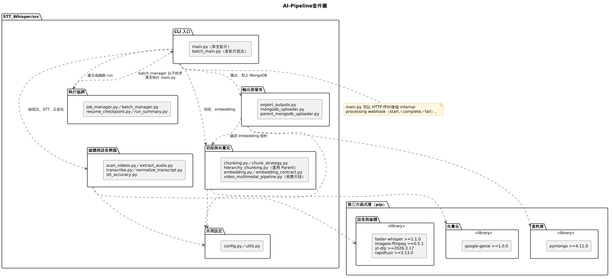

圖7-2-3 AI-Pipeline套件圖

`main.py` 處理單支影片：先由媒體與語音辨識模組抽取音訊、執行 Faster-Whisper 並正規化逐字稿，再交給切段與向量化模組產生 Leaf 片段、選用的 Parent 階層與 Gemini embedding，最後由輸出與發布模組匯出檔案並寫入 MongoDB；每個階段的進度由執行協調模組記錄 checkpoint，中斷後可續跑。`batch_main.py` 則由 `batch_manager.py` 以子程序逐支呼叫 `main.py`，因此執行協調與 CLI 入口之間存在雙向依賴。Parent 階層與其 embedding 是否產生由 `HIERARCHY_ENABLED` 控制，預設關閉。

圖7-2-4 說明哪些程式讀寫哪些資料集合，以及向量索引建立在哪裡。

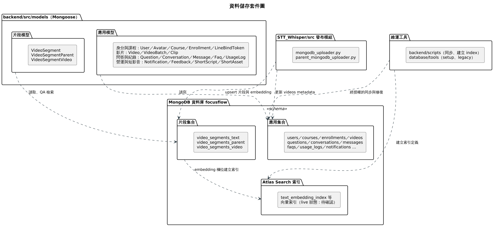

圖7-2-4 資料儲存套件圖

後端的應用模型讀寫使用者、課程、修課、影片、問答、通知與短影音等應用集合；片段模型則以讀取為主，供 QA 檢索使用。影片片段與 embedding 由 Pipeline 的發布模組 upsert 到 `video_segments_text` 等片段集合，並更新 `videos` 的處理 metadata。`backend/scripts` 與 `database/tools` 屬維運工具，用於同步資料、建立集合與索引；對共享 Atlas 執行前須先以唯讀查詢確認目標。向量索引（如 `text_embedding_index`）建立在片段集合的 embedding 欄位上，正式環境的索引狀態待確認。

圖7-2-5 說明網頁與 LINE 兩個提問通道如何共用同一套問答程式。

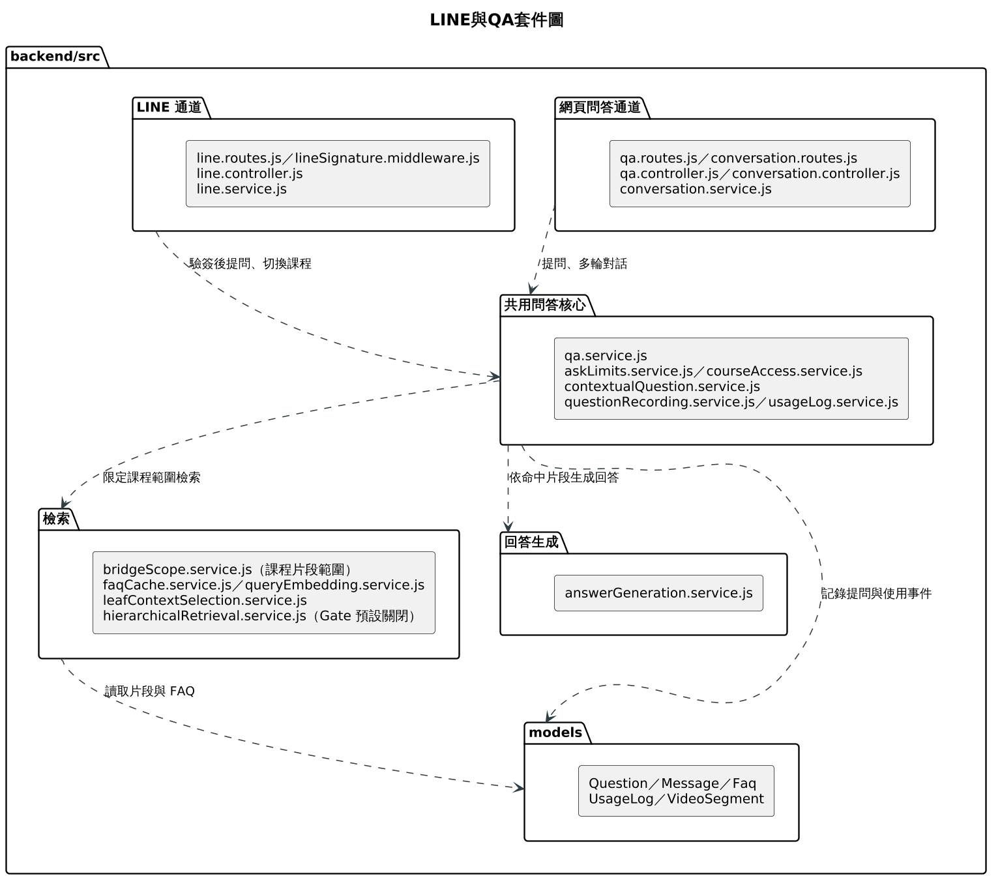

圖7-2-5 LINE與QA套件圖

網頁通道由 `qa.routes.js` 與 `conversation.routes.js` 進入，LINE 通道由 `line.routes.js` 進入並先經 `lineSignature.middleware.js` 驗簽；兩者都呼叫共用問答核心的 `qa.service.js`，並共用字數上限、每日提問次數與課程存取檢查。問答核心再依賴檢索套件取得課程範圍內的片段（含 FAQ 快取與 query embedding），交給回答生成套件產生答案，最後把提問與使用事件寫入 `questions` 與 `usage_logs`。FAQ 快取命中時仍會重新驗證引用片段是否仍在課程範圍內；課程範圍為空時不會退回搜尋全部資料。Parent 階層式檢索由 `HIERARCHICAL_RETRIEVAL_ENABLED` 控制，預設關閉，此時只使用 Leaf 片段。

## 7-3 元件圖（Component diagram）

元件圖回答「哪些可替換的單元透過什麼介面合作」。圖7-3-1 以圓形（lollipop）表示元件提供的介面，以半圓（socket）表示元件需要的介面；Express API 內部再拆成路由與授權、業務服務、外部整合 adapter 三個子元件，說明外部服務的呼叫集中在哪裡。

表7-3-1　主要元件責任與邊界

| 元件 | 提供的介面 | 需要的介面 | 責任與邊界 |
| --- | --- | --- | --- |
| React SPA | — | REST API、YouTube IFrame Player | 呈現三角色介面並呼叫 API；不直接存取資料庫，權限判斷以後端為準 |
| Express API（路由與授權） | REST API `/api/v1`、LINE Webhook、Processing Webhook | — | 驗證 JWT、角色、LINE 簽章與 Processing Secret；未通過者不進入業務服務 |
| Express API（業務服務） | — | Pipeline CLI、MongoDB 集合與 Vector Search | 課程、修課、影片狀態、問答與通知等業務規則 |
| Express API（外部整合 adapter） | — | Embedding／回答生成 API、Messaging API、YouTube Data API、SMTP | 封裝外部 API 呼叫；provider 可依環境變數切換（例如 embedding 可用 `mock`、回答可用 `template`），本機測試不需外部金鑰 |
| STT Pipeline CLI | Pipeline CLI（`main.py`／`batch_main.py` 參數） | Processing Webhook、MongoDB 集合、Embedding API | 語音辨識、切段、向量化與寫入片段；本機產物須經發布步驟寫入資料庫後才可供問答檢索 |
| MongoDB Atlas | MongoDB 集合與 Vector Search | — | 應用資料與片段資料的儲存與向量檢索 |
| 外部服務（Gemini、LINE Platform、YouTube、SMTP） | Embedding／回答生成、Messaging API、Data API／IFrame Player、SMTP | LINE Platform 需要 LINE Webhook | 由第三方營運，實際可用性與配額：待確認 |

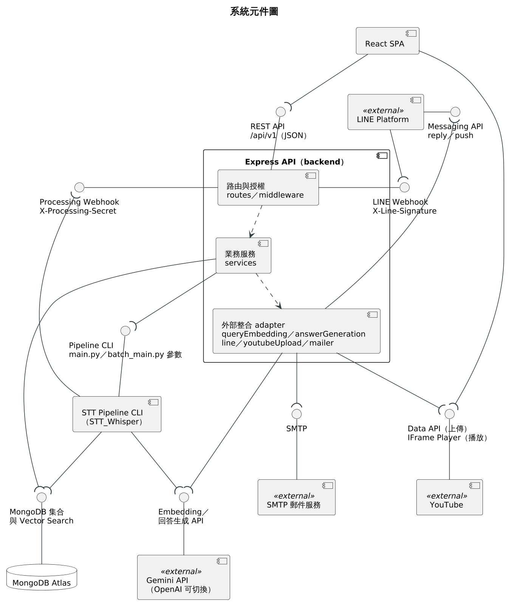

圖7-3-1 系統元件圖

如圖7-3-1所示，所有外部入口（網頁的 REST API、LINE Webhook、Pipeline 的 Processing Webhook）都先落在「路由與授權」子元件，而所有對外呼叫都集中在「外部整合 adapter」。因此更換 AI provider 或關閉某個外部服務時，只影響 adapter 與設定，不需要改動業務服務。Pipeline 與 API 之間是雙向合作：API 需要 Pipeline 的 CLI 介面啟動處理，Pipeline 需要 API 的 Processing Webhook 回報狀態；兩者都需要 MongoDB，但各自寫入不同集合。

## 7-4 狀態機（State machine），甚至時序圖（Timing diagram）

本節以五張狀態機圖描述五個物件的生命週期，每張只描述一個類別。轉換標籤採 `事件 [守衛條件] / 動作` 格式；狀態名稱沿用程式中的常數值，括號內附中文說明。

表7-4-1　主要狀態、事件與實作約束

| 對象 | 狀態 | 實作約束 | 圖 |
| --- | --- | --- | --- |
| 登入 Session（前端） | `anonymous`、`authenticated`、`invalid`、`unavailable`、`forbidden` | 只有 `/auth/me` 回 401／403 才清除 token；網路錯誤或 5xx 保留 token 供重試 | 圖7-4-1 |
| VideoBatch | `creating`、`processing`、`completed`、`partial`、`failed` | 狀態由各項目推導；單一批次 1～10 個檔案；已完成項目不回滾 | 圖7-4-2 |
| Video.processing | `queued`、`processing`、`completed`、`failed` | 每個 webhook 都檢查前置狀態，重送保持冪等；其他轉換回 409 `VIDEO_PROCESSING_TRANSITION_INVALID` | 圖7-4-3 |
| Question | `answered`、`no_match`、`failed` | 一次提問只寫入一筆最終結果；4xx 拒絕不寫入 `questions` | 圖7-4-4 |
| User 的 LINE 對話範圍 | `idle`、`awaiting_course_selection`，搭配 `lineUserId` 與 `activeCourseId` | webhook 先驗簽；選課須有效修課、課程已發布且有影片 | 圖7-4-5 |
| Course | `draft`、`published`、`archived` | 學生存取除課程已發布外，還需要有效的修課紀錄 | — |
| Enrollment | `active`、`revoked` | 同一 `(studentId, courseId)` 只有一筆紀錄，重新指派時由 `revoked` 回到 `active`；撤銷時同步清除該課程的 LINE 對話範圍 | — |
| ShortScript | `evidence_ready`、`generated`、`changes_requested`、`approved`、`dismissed` | `ALLOWED_TRANSITIONS` 未列出的轉換回 409 `SHORT_SCRIPT_STATE_INVALID`；`dismissed` 為終態 | — |
| ShortAsset | `status`：`draft`、`published`、`archived`；`reviewStatus`：`pending`、`approved`、`rejected` | 發布須審核通過且版本未變，否則回 409 `SHORT_ASSET_NOT_APPROVED`；同一版本只能審核一次 | — |
| Video.youtubeUpload | `uploading`、`uploaded`、`failed` | 重試須 `retrySafe` 為真且未達次數上限；逾時未完成的上傳標記為不可重試的 `failed` | — |

短影音腳本與成品相關功能由 `SHORT_SCRIPT_AUTOMATION_ENABLED` 控制，預設關閉；成品由教師在系統外產製後上傳，系統不提供自動剪輯或渲染。

### 登入 Session

圖7-4-1 描述前端 `AuthSession` 在頁面載入、登入、登出與管理員入口判斷時的狀態變化。

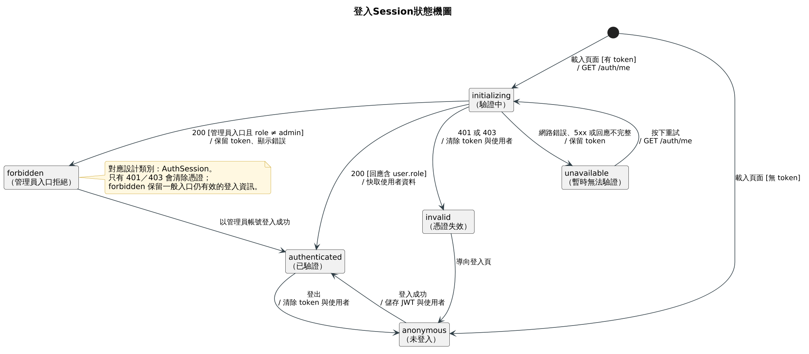

圖7-4-1 登入Session狀態機圖

頁面載入時若瀏覽器沒有 token，直接進入 `anonymous`；有 token 則進入驗證中（`initializing`，對應應用殼層的 `authInitializing` 旗標）並呼叫 `GET /auth/me`。後端回 200 且含角色時進入 `authenticated`；回 401 或 403 代表 token 已失效，前端清除 token 與使用者資料後經 `invalid` 回到登入頁；網路錯誤、5xx 或回應不完整時進入 `unavailable`，保留 token 讓使用者按重試再驗證一次，避免暫時性故障把仍有效的登入清掉。管理員入口另外檢查角色，非管理員帳號進入 `forbidden` 並顯示「此入口僅供管理員使用」，但不清除 token，使用者仍可由一般入口正常使用。

### 影片批次

圖7-4-2 描述教師一次上傳多支影片時，`VideoBatch` 的整體狀態如何由各項目的結果彙整而成。

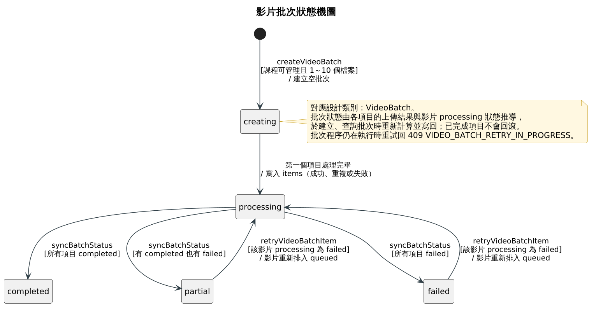

圖7-4-2 影片批次狀態機圖

教師上傳 1～10 個檔案時，系統先建立 `creating` 的空批次，每處理完一個檔案就把項目結果（成功、與課程既有影片重複、或失敗）寫入批次並進入 `processing`，因此部分檔案失敗時已成功的項目仍保留。之後每次建立或查詢批次，系統都依各項目的上傳結果與影片處理狀態重新推導批次狀態：仍有未結束項目時維持 `processing`，全部完成為 `completed`，全部失敗為 `failed`，兩者皆有為 `partial`。對 `partial` 或 `failed` 批次中處理失敗的影片按下重試，影片回到 `queued`，批次也隨之回到 `processing`；若批次程序仍在執行，重試回 409 `VIDEO_BATCH_RETRY_IN_PROGRESS`。

### 影片處理

圖7-4-3 描述單支影片 `processing` 子文件的狀態，與 `videoProcessing.service.js` 強制的轉換一一對應。

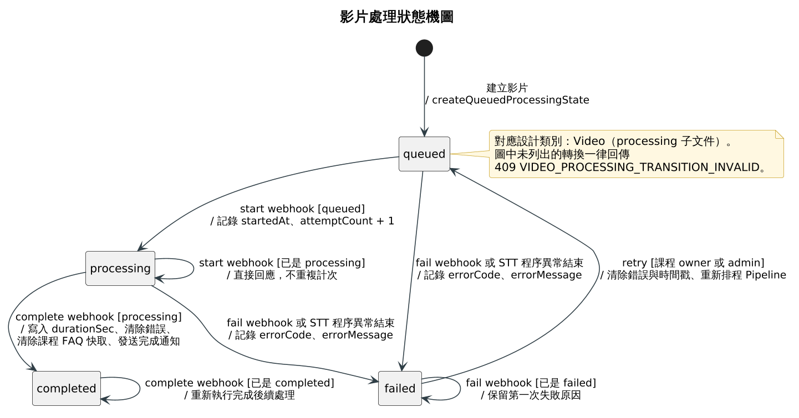

圖7-4-3 影片處理狀態機圖

影片建立時一律進入 `queued`。Pipeline 呼叫 start webhook 後由 `queued` 進入 `processing`，並記錄開始時間與嘗試次數；在 `processing` 狀態重送 start 只回應目前狀態，不重複計次。complete webhook 只接受 `processing`，完成時寫入影片長度、清除錯誤訊息、清除相關課程的 FAQ 快取、發送完成通知，並在 YouTube 自動上傳啟用時排程上傳；在 `completed` 狀態重送 complete 會重新執行這些後續處理，讓通知或快取清除失敗時可以安全重試。fail webhook 或 STT 程序異常結束可讓 `queued` 或 `processing` 進入 `failed`，重送 fail 保留第一次的失敗原因。只有課程教師或管理員可以對 `failed` 影片按重試，系統清除錯誤與時間戳記後回到 `queued` 並重新排程 Pipeline。圖中未列出的轉換（例如對 `completed` 影片重試）一律回 409 `VIDEO_PROCESSING_TRANSITION_INVALID`。

### QA 提問

圖7-4-4 描述一次提問從送出到產生最終結果的過程；最終結果即 `questions` 集合中 `status` 欄位的三個值。

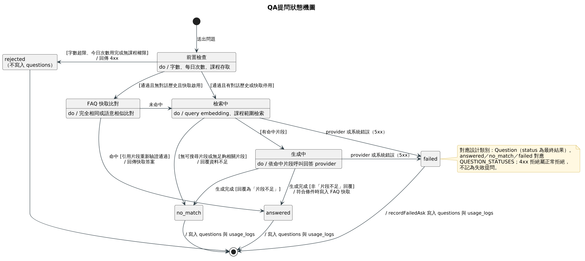

圖7-4-4 QA提問狀態機圖

提問先經前置檢查：問題超過字數上限、今日提問次數用完或沒有課程權限時直接回傳 4xx，這屬於正常拒絕，不寫入 `questions`。通過檢查後，沒有對話歷史且 FAQ 快取啟用時先比對快取，命中且引用片段重新驗證通過即回傳快取答案；未命中或有對話歷史時進入檢索，以 query embedding 在課程範圍內搜尋片段。課程沒有可搜尋片段或找不到足夠相關片段時結果為 `no_match`；有命中片段則交由回答 provider 生成答案，若回覆為「片段不足」的固定文字也記為 `no_match`，否則為 `answered`，並在符合條件時寫入 FAQ 快取。檢索或生成過程中發生 provider 或系統錯誤（5xx）時結果為 `failed`，由 `recordFailedAsk` 留下失敗紀錄。三種結果都會寫入 `questions` 與 `usage_logs`，供統計與後台查詢。

### LINE 對話範圍

圖7-4-5 描述 `User` 文件中 `lineUserId`、`lineConversationState` 與 `activeCourseId` 三個欄位共同形成的 LINE 對話範圍。

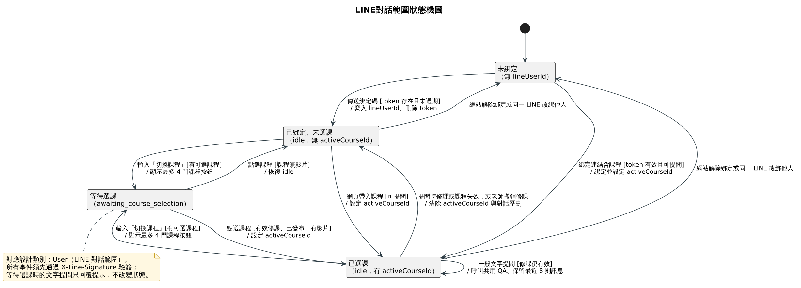

圖7-4-5 LINE對話範圍狀態機圖

所有 LINE 事件都須先通過 `X-Line-Signature` 驗簽。使用者在 LINE 傳送有效且未過期的一次性綁定碼後，系統寫入 `lineUserId` 並刪除綁定碼，進入「已綁定、未選課」；若綁定連結同時帶有課程且可提問，則直接進入「已選課」。輸入「切換課程」時，系統列出有效修課且已發布的課程（最多 4 門按鈕）並進入 `awaiting_course_selection`；此時一般文字提問只會收到提示。點選的課程若有效修課、已發布且有影片，就設定 `activeCourseId` 進入「已選課」；課程沒有影片則回到 `idle`。從網頁「詢問助教」帶入課程也可直接進入「已選課」。已選課時一般文字訊息會呼叫共用 QA 服務，並保留最近 8 則訊息作為多輪對話脈絡（`MAX_CONVERSATION_TURNS` 預設 4 輪）。老師撤銷修課，或提問時發現修課或課程已失效，系統清除 `activeCourseId` 與對話歷史並回到「已綁定、未選課」。使用者在網站解除綁定，或同一 LINE 帳號改綁其他系統帳號時，回到「未綁定」。
