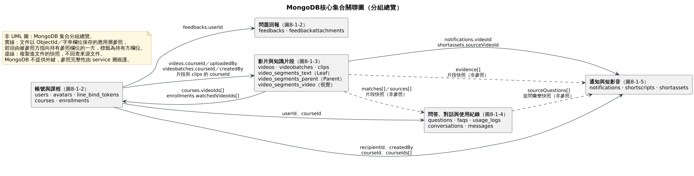
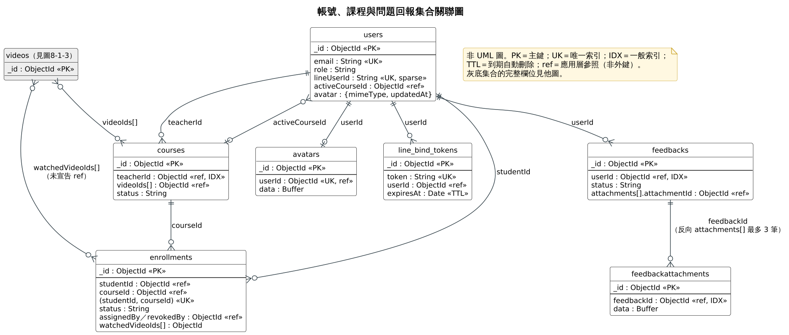
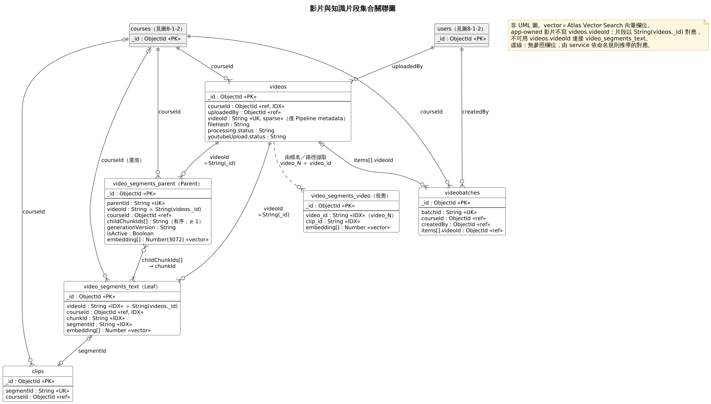
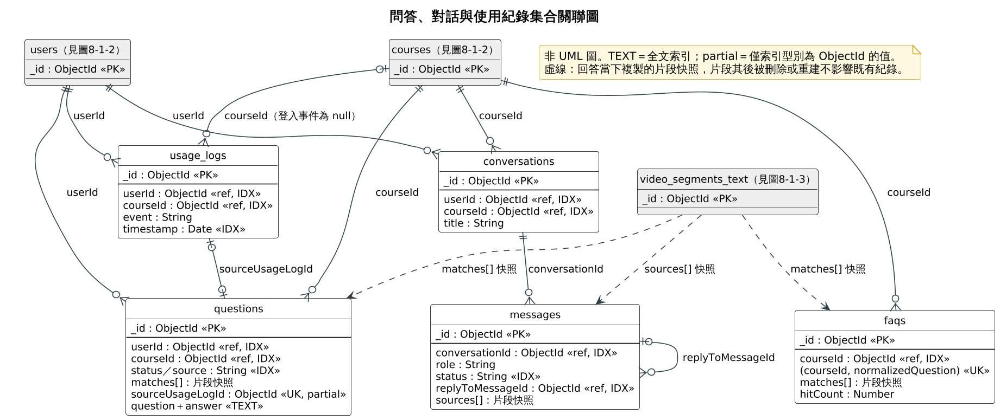
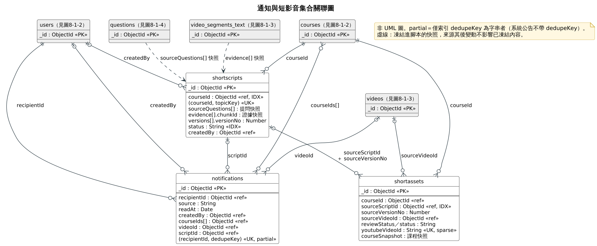
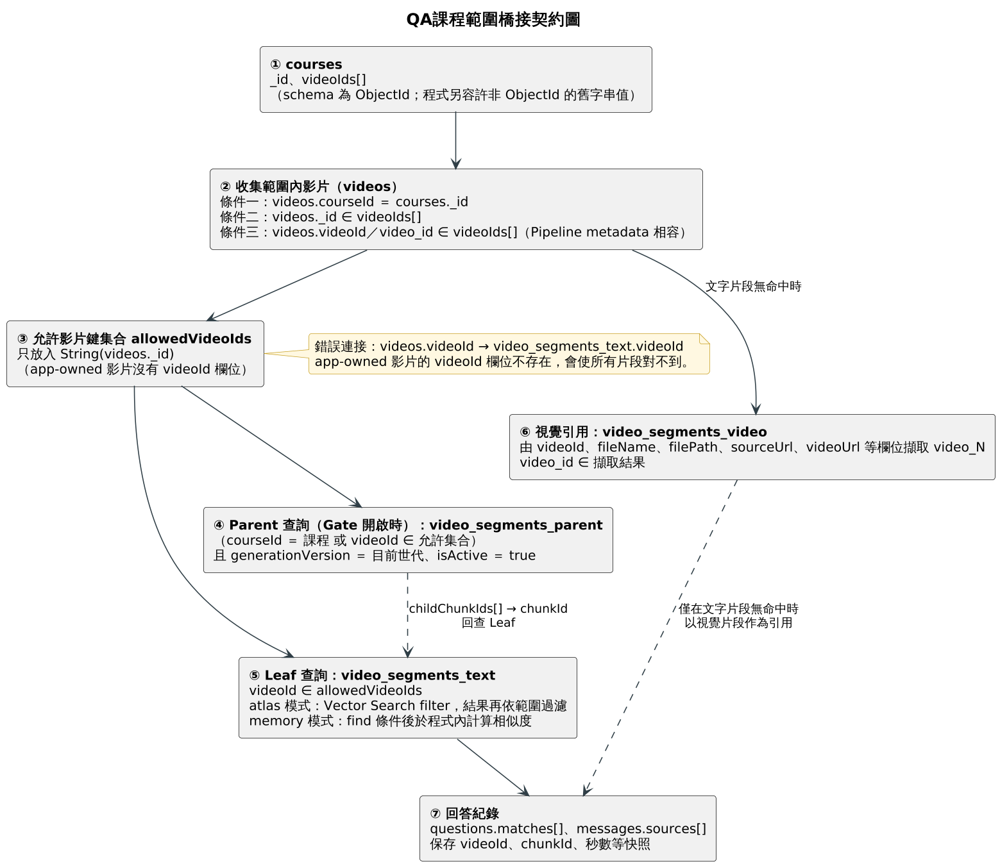

# 第8章 資料庫設計

FocusFlow 採用 MongoDB 文件型資料庫，並以 Node.js 端的 Mongoose ODM 定義綱要。選用文件型資料庫的理由有三：影片處理結果（逐字稿片段、向量、產生契約 metadata）的欄位會隨 AI Pipeline 版本演進，需要能在不停機的情況下增修欄位；問答的引用快照與 runtime 診斷資訊屬於巢狀且結構不固定的資料，以內嵌子文件保存比拆成多張關聯表更貼近使用方式；語意檢索所需的高維向量可直接以陣列欄位儲存，並由 MongoDB Atlas Vector Search 建立向量索引。

依系上規範，本章分兩節：8-1「資料庫關聯表」說明集合（collection）之間的參照關係與限制（Constraints），並以集合關聯圖呈現；8-2「表格及其 Meta data」逐一列出每個集合的欄位、索引與資料契約。

**資料來源與驗證邊界。** 本章內容以 2026-09-24 的 repository 為準，逐一核對 `backend/src/models/` 下 21 份 Mongoose schema、`backend/src/constants/enums.js`、`backend/src/scripts/` 與 `database/tools/setup/` 的索引／集合初始化腳本，以及 `backend/src/services/demoSeed.service.js`。本章屬於**程式碼層級的靜態說明**：撰寫時未連線共享 MongoDB Atlas，文中所有集合、索引與向量索引描述皆代表「程式宣告的目標契約」，不代表共享 Atlas 或正式環境的現況。引用的 Atlas 實查結果一律註明日期並標示為歷史快照；需重新以唯讀方式查證的項目彙整於表8-2-28。

---

## 8-1 資料庫關聯表

### 綱要與命名規則

表8-1-1　綱要與命名規則

| 項目 | 規則 |
| --- | --- |
| 集合命名 | Mongoose 預設將 Model 名稱轉為小寫複數（`User` → `users`、`VideoBatch` → `videobatches`）。需要對齊既有契約的集合在 schema 以 `collection` 選項或 `mongoose.model` 第三個參數明確指定，例如 `usage_logs`、`line_bind_tokens`。三類片段集合的名稱由環境變數決定（`VIDEO_SEGMENT_COLLECTION`、`VIDEO_SEGMENT_PARENT_COLLECTION`、`VIDEO_SEGMENT_VIDEO_COLLECTION`），預設分別為 `video_segments_text`、`video_segments_parent`、`video_segments_video`。 |
| 欄位命名 | JavaScript 與 JSON 一致採 camelCase；參照欄位命名為 `xxxId`。唯一例外是 `video_segments_video`，沿用 AI Pipeline 的 snake_case（見 DB-09）。 |
| 主鍵 | 一律使用 MongoDB 自動產生的 `_id`（ObjectId，12 bytes，字串形式 24 個十六進位字元），不另設代理鍵。 |
| 時間戳 | schema 啟用 `timestamps: true` 時自動維護 `createdAt` 與 `updatedAt`。21 個集合中僅 `line_bind_tokens`（自行宣告 `createdAt`）與 `video_segments_video`（`timestamps: false`）例外。 |
| 列舉值 | 集中定義於 `backend/src/constants/enums.js`，schema 以 `enum` 引用；少數只在單一 schema 使用的列舉（如 `messages.role`、`videobatches.processingMode`）直接寫在 schema 內。 |
| 選填且需唯一的欄位 | 以 `unique + sparse` 或 partial 索引宣告，並在寫入時**省略欄位而不寫入 `null`**，因為 sparse 索引仍會索引顯式的 `null` 值。 |

### 參照關係與限制（Constraints）

MongoDB **不提供外鍵與參照完整性檢查**。文件中的 `ObjectId` 欄位雖以 Mongoose 的 `ref` 宣告關聯對象，但該宣告只供 `populate()` 查詢時解析使用，資料庫本身不會阻止刪除被參照的文件，也不會自動連動刪除。因此本系統的跨集合參照都是**應用層維護的約定**：建立、解除與刪除連動由 service 層負責。例如刪除影片時，`video.service.js` 會先清除該課程的 FAQ 快取，再刪除片段、刪除影片文件、移除相關通知，並從所有課程的 `videoIds[]` 移除該影片；使用紀錄與提問紀錄則刻意保留。表8-1-2 的「維護層級」欄標示每一條參照由哪一層保證。

表8-1-2　集合參照關係、基數與限制

| 參照關係 | 參照欄位（持有方） | 基數（被參照方：持有方） | 限制（Constraints） | 維護層級 |
| --- | --- | --- | --- | --- |
| Avatar → User | `avatars.userId` | 1 : 0..1 | `userId` 必填且唯一，資料庫層保證一人至多一張頭貼 | 資料庫層（唯一索引）＋應用層 |
| LineBindToken → User | `line_bind_tokens.userId` | 1 : 0..* | `token` 唯一；`expiresAt` 設 TTL 索引，到期文件由資料庫自動刪除 | 資料庫層（唯一、TTL）＋應用層 |
| User → Course（LINE 作用課程） | `users.activeCourseId` | 1 : 0..* | 選填，預設 `null`；撤銷修課或切換課程時由 service 更新或清空 | 應用層 |
| Course → User（授課教師） | `courses.teacherId` | 1 : 0..* | 必填；建單欄索引供教師課程清單查詢 | 應用層 |
| Enrollment → User、Course | `enrollments.studentId`、`enrollments.courseId` | 學生與課程 N : M | `(studentId, courseId)` 複合唯一索引，一名學生對同一課程只保留一筆關係；撤銷以 `status = revoked` 表示而非刪除 | 資料庫層（複合唯一）＋應用層 |
| Enrollment → User（指派／撤銷者） | `enrollments.assignedBy`、`revokedBy` | 1 : 0..* | 選填，保留稽核資訊 | 應用層 |
| Enrollment → Video（已完成觀看） | `enrollments.watchedVideoIds[]` | N : M | 陣列元素為 ObjectId，但 schema **未宣告 `ref`**；用於計算觀看進度 | 應用層 |
| Video → Course | `videos.courseId`（主課程） | 1 : 0..* | 必填；單欄索引，另與 `fileHash` 組複合索引供同課程重複偵測 | 應用層 |
| Course → Video（掛載清單） | `courses.videoIds[]` | N : M | 有序陣列；一支影片可掛載到多門課程，`videos.courseId` 只記主課程。上傳時以 `$addToSet` 加入，刪除影片時自所有課程 `$pull` | 應用層 |
| Video → User（上傳者） | `videos.uploadedBy` | 1 : 0..* | 必填 | 應用層 |
| VideoBatch → Course、User、Video | `videobatches.courseId`、`createdBy`、`items[].videoId` | 1 : 0..* | `batchId` 唯一；單批影片數上限（10）由 API 層驗證，不在 schema 宣告 | 資料庫層（唯一）＋應用層 |
| VideoSegment（Leaf）→ Video | `video_segments_text.videoId`（**字串**） | 1 : 0..* | 值為 `String(videos._id)`，與 ObjectId 跨型別橋接（見「QA 課程範圍橋接契約」）；`videoId` 單欄索引與 `(courseId, videoId)` 複合索引 | 應用層（跨型別橋接） |
| VideoSegment（Leaf）→ Course | `video_segments_text.courseId` | 1 : 0..* | 選填，預設 `null`；QA 範圍過濾目前不依賴此欄位 | 應用層 |
| VideoSegmentParent → Video、Course | `video_segments_parent.videoId`（字串）、`courseId` | 1 : 0..* | 兩者皆必填；`videoId` 與 Leaf 同一命名空間 | 應用層 |
| VideoSegmentParent → VideoSegment（Leaf） | `video_segments_parent.childChunkIds[]` → `video_segments_text.chunkId` | Parent 1..* 個 Leaf | `childChunkIds` 必填且不得為空陣列，**順序是檢索契約的一部分**，不得排序或去重；`parentId` 唯一 | 應用層（含 schema validator） |
| VideoSegmentVideo（視覺）→ Video | `video_segments_video.video_id`（`video_N`） | 1 : 0..* | 無參照欄位；由 service 自影片的 `videoId`、`fileName`、`filePath`、`sourceUrl`、`videoUrl` 等欄位擷取 `video_N` 後比對 | 應用層（命名規則推導） |
| Clip → VideoSegment、Course | `clips.segmentId`（字串）、`clips.courseId` | 1 : 0..1 | `segmentId` 必填且唯一；`courseId` 選填 | 資料庫層（唯一）＋應用層 |
| Conversation → User、Course | `conversations.userId`、`courseId` | 1 : 0..* | 兩者皆必填並各自建索引，另有 `(userId, courseId, updatedAt)` 複合索引 | 應用層 |
| Message → Conversation、Message | `messages.conversationId`、`replyToMessageId` | 1 : 0..* | `conversationId` 必填；`replyToMessageId` 為同集合自參照，指向被回覆的提問訊息 | 應用層 |
| Question → User、Course | `questions.userId`、`courseId` | 1 : 0..* | 兩者皆必填並建索引 | 應用層 |
| Question → UsageLog | `questions.sourceUsageLogId` | 0..1 : 0..1 | unique＋sparse＋partial 索引（只索引型別為 ObjectId 的值），確保一筆使用紀錄至多對應一則提問 | 資料庫層（partial unique）＋應用層 |
| Faq → Course | `faqs.courseId` | 1 : 0..* | `(courseId, normalizedQuestion)` 複合唯一索引 | 資料庫層（複合唯一）＋應用層 |
| UsageLog → User、Course | `usage_logs.userId`、`courseId` | 1 : 0..* | `userId` 必填；`courseId` 可為空（登入事件不屬於任何課程）；**刻意不設 TTL** | 應用層 |
| Notification → User、Course、Video、ShortScript | `notifications.recipientId`、`createdBy`、`courseIds[]`、`videoId`、`scriptId` | 1 : 0..* | `(recipientId, dedupeKey)` partial unique 索引防止同一事件重複通知；系統公告不帶 `dedupeKey`，不參與該索引 | 資料庫層（partial unique）＋應用層 |
| ShortScript → Course、User | `shortscripts.courseId`、`createdBy` | 1 : 0..* | `(courseId, topicKey)` 複合唯一索引，同一課程不重複產生相同主題的腳本 | 資料庫層（複合唯一）＋應用層 |
| ShortAsset → Course、Video、ShortScript | `shortassets.courseId`、`sourceVideoId`、`sourceScriptId`＋`sourceVersionNo` | 1 : 0..* | `youtubeVideoId` 唯一＋sparse；`sourceScriptId` 須搭配 `sourceVersionNo` 才能定位到腳本的特定版本 | 資料庫層（唯一）＋應用層 |
| Feedback → User | `feedbacks.userId` | 1 : 0..* | 必填並建索引；`role` 另存提交當下的角色快照 | 應用層 |
| FeedbackAttachment ↔ Feedback | `feedbackattachments.feedbackId`；反向 `feedbacks.attachments[].attachmentId` | 1 : 0..3 | 雙向記錄；每筆回報最多 3 張附件、單張 10 MiB 由 API 層驗證。建立流程依序寫入回報、附件、再回填附件清單，未使用交易 | 應用層 |

除上述參照外，部分集合保存的是**快照而非參照**：`questions.matches[]`、`messages.sources[]`、`faqs.matches[]` 保存回答當下命中的片段資訊，`shortscripts.evidence[]` 保存凍結的證據片段，`shortscripts.sourceQuestions[]` 保存彙整後的原始提問文字，`shortassets.courseSnapshot` 保存上架當下的課程資訊。快照不回查來源文件，因此來源片段、影片或課程其後被重新處理、刪除或更名，都不會改變既有紀錄所呈現的內容。

表8-1-3 彙整本系統在 schema 層實際使用的限制種類。除此之外的規則（例如單批影片數、每日提問次數、附件數量與大小、角色權限）屬於 API 與 service 層的業務限制，不寫入資料庫綱要。

表8-1-3　schema 層宣告的限制種類與使用位置

| 限制種類 | Mongoose 宣告 | 使用位置舉例 |
| --- | --- | --- |
| 必填 | `required: true` | 各集合的識別與核心欄位 |
| 唯一 | `unique: true` | `users.email`、`avatars.userId`、`videobatches.batchId`、`clips.segmentId`、`line_bind_tokens.token` |
| 唯一（允許缺值） | `unique + sparse` | `users.lineUserId`、`videos.videoId`、`shortassets.youtubeVideoId` |
| 複合唯一 | `index({...}, { unique: true })` | `enrollments`、`faqs`、`shortscripts`、`video_segments_parent.parentId` |
| 條件式唯一 | `partialFilterExpression` | `questions.sourceUsageLogId`（`$type: objectId`）、`notifications.dedupeKey`（`$type: string`） |
| 列舉 | `enum` | 角色、課程狀態、處理狀態、審核狀態、回報分類等 |
| 預設值 | `default` | 狀態欄位、計數欄位、陣列與子文件 |
| 數值範圍 | `min` / `max` | `enrollments.progress`（0～100）、各計數與秒數欄位（`min: 0`）、版本號（`min: 1`） |
| 字串長度 | `maxlength` | `notifications.title`（120）、`notifications.content`（2000）、`conversations.title`（120）、`feedbacks.description`（2000）、`feedbacks.courseVideoName`（200）、`shortassets.reviewReasons[].note`（500） |
| 自訂驗證 | `validate` | `video_segments_parent.childChunkIds`（非空陣列）、`video_segments_parent.embedding`（恰為 3072 個有限數值） |
| 自動過期 | TTL 索引 `expireAfterSeconds: 0` | `line_bind_tokens.expiresAt` |
| 字串正規化 | `trim` / `lowercase` / `set` | 多數字串欄位 `trim`；`users.email` 另加 `lowercase`；`notifications.dedupeKey` 以 setter 將 `null` 轉為欄位不存在 |

### 集合關聯圖

集合關聯圖分成六張。圖8-1-1 為分組總覽，說明 21 個集合分成哪五組、組與組之間透過哪些欄位相連；圖8-1-2 至圖8-1-5 依組別畫出集合層級的關聯，每個方框列出主鍵、參照欄位、唯一與一般索引欄位，連線以鴉爪符號（crow's foot）表示基數；圖8-1-6 則單獨說明最容易誤解的 QA 課程範圍橋接契約。六張圖皆為文件型資料庫的集合關聯圖，**不是 UML 類別圖，也不是關聯式資料庫的外鍵 ERD**：圖中的 `ref` 僅表示應用層參照，資料庫不強制完整性。

圖例說明如下：實線代表文件以 ObjectId 或字串識別欄位保存的參照，連線旁的標籤為持有參照值的欄位；虛線代表快照（複製進文件、不回查來源）或由命名規則推導的對應；灰底方框為在其他圖中定義的集合，只列主鍵以示連接點。欄位標記 `PK` 為主鍵、`UK` 為唯一索引、`IDX` 為一般索引、`TTL` 為到期自動刪除、`vector` 為向量索引欄位、`TEXT` 為全文索引。



圖8-1-1 MongoDB核心集合關聯圖（分組總覽）

圖8-1-1 顯示「帳號與課程」是其他各組的共同上游：影片、問答、通知與問題回報都以 `userId`、`courseId` 類欄位指回使用者與課程。「影片與知識片段」與「問答」「短影音」之間只有快照關係，這是刻意的設計：回答紀錄與腳本證據不因影片重新處理而改變。



圖8-1-2 帳號、課程與問題回報集合關聯圖

圖8-1-2 中，`users` 與 `avatars` 為一對零或一（`avatars.userId` 唯一），頭貼影像本體另存一個集合，使每次身分驗證讀取使用者文件時不必載入影像。`enrollments` 以複合唯一索引實現學生與課程的多對多關係；`courses.videoIds[]` 與 `enrollments.watchedVideoIds[]` 則是課程與修課資料指向影片的陣列參照。`feedbacks` 與 `feedbackattachments` 互相保存對方的識別碼，附件影像同樣獨立存放，使回報列表查詢不必載入圖片。



圖8-1-3 影片與知識片段集合關聯圖

圖8-1-3 中，文字片段（Leaf）與上層片段（Parent）都以**字串** `videoId = String(videos._id)` 指回影片；Parent 以有序的 `childChunkIds[]` 對應 Leaf 的 `chunkId`。視覺片段 `video_segments_video` 與影片之間沒有參照欄位，以虛線表示由命名規則推導的對應。`videos.videoId` 只出現在 AI Pipeline 產生的 metadata 文件上，不可用來連接片段。



圖8-1-4 問答、對話與使用紀錄集合關聯圖

圖8-1-4 中，網頁多輪問答以 `conversations` → `messages` 保存，`messages.replyToMessageId` 讓助理回覆指回對應的提問訊息；每一次提問（網頁與 LINE）另寫入一筆 `questions`，並可透過 `sourceUsageLogId` 對應到 `usage_logs` 中的 `ask` 事件。三條虛線表示 `questions`、`messages`、`faqs` 保存的是片段快照。



圖8-1-5 通知與短影音集合關聯圖

圖8-1-5 中，`notifications` 可選擇性地指回觸發它的影片（影片處理完成通知）或腳本（成品退回通知），作為前端深層連結。`shortassets` 以 `sourceScriptId + sourceVersionNo` 定位成品依據的腳本版本；`shortscripts` 的主題來源與證據都是凍結快照。

### QA 課程範圍橋接契約

問答檢索必須限定在學生有權存取的課程影片內。這個範圍的解析路徑橫跨 `courses`、`videos` 與三類片段集合，而且需要在 ObjectId 與字串之間轉換，是本系統資料設計中最容易被誤解之處。圖8-1-6 依 `backend/src/services/bridgeScope.service.js` 的實作畫出解析順序。



圖8-1-6 QA課程範圍橋接契約圖

1. **收集範圍內影片**：`collectScopedVideos()` 取三種條件的聯集——`videos.courseId` 等於課程 `_id`；`videos._id` 在 `courses.videoIds[]` 內；或 `videos.videoId`／`video_id` 在 `courses.videoIds[]` 內（相容以字串記錄的 Pipeline metadata 影片）。
2. **建立允許影片鍵集合**：`buildCourseSegmentScope()` 只把每支影片的 `String(videos._id)` 放入 `allowedVideoIds`。
3. **查詢片段**：`buildSegmentLookupQuery()` 產生 `{ videoId: { $in: allowedVideoIds } }`。`atlas` 模式把它當作 Vector Search 的 filter，並在取回結果後再以範圍過濾一次；`memory` 模式以它作為 `find` 條件，在程式內計算相似度。
4. **Parent（Gate 開啟時）**：以（`courseId` 等於該課程 **或** `videoId` 在允許集合內）且 `generationVersion` 為目前世代、`isActive = true` 過濾，再依 `childChunkIds[]` 回查 Leaf。此路徑受 `HIERARCHICAL_RETRIEVAL_ENABLED` 控制，預設關閉。
5. **視覺引用**：只在文字片段完全沒有命中時執行，自影片欄位擷取 `video_N` 後比對 `video_segments_video.video_id`。

簡言之：

```text
courses._id ／ courses.videoIds[] → videos._id → String(videos._id) → video_segments_text.videoId
```

本系統以應用程式建立的影片（app-owned）**不寫入 `videos.videoId` 欄位**（`video.service.js` 的上傳與 YouTube 連結建立流程皆未設定），該欄位只出現在 Pipeline metadata 文件與示範資料上。因此若以 `videos.videoId` 去連接 `video_segments_text.videoId`，所有 app-owned 影片都會對不到任何片段。表8-1-4 整理各集合用來指向影片或片段的鍵，供跨集合查詢時對照。

表8-1-4　影片與片段識別鍵對照

| 集合與欄位 | 型別 | 值的來源 | 用途 |
| --- | --- | --- | --- |
| `videos._id` | ObjectId | MongoDB 產生 | 影片主鍵；`courses.videoIds[]`、`notifications.videoId`、`shortassets.sourceVideoId`、`videobatches.items[].videoId` 皆指向它 |
| `videos.videoId` | String | 僅 Pipeline metadata 或示範資料 | 相容舊資料的外部識別碼；**不用於連接片段** |
| `video_segments_text.videoId` | String | `String(videos._id)` | Leaf 片段所屬影片；QA 範圍過濾鍵 |
| `video_segments_parent.videoId` | String | `String(videos._id)` | Parent 所屬影片，與 Leaf 同一命名空間 |
| `video_segments_video.video_id` | String | Pipeline 的 `video_N` 命名 | 視覺片段所屬影片，靠命名規則比對 |
| `video_segments_text.chunkId` | String | Pipeline 產生 | Leaf 穩定識別碼；Parent `childChunkIds[]`、`messages.sources[].chunkId`、`shortscripts.evidence[].chunkId` 指向它 |
| `video_segments_text.segmentId` | String | 早期 Pipeline／示範資料 | 舊版片段識別碼；`clips.segmentId`、`questions.matches[].segmentId` 仍使用 |
| `questions.matches[].videoId`、`messages.sources[].videoId` | String | 回答當下的片段 `videoId` | 快照，不回查 |

---

## 8-2 表格及其 Meta data

本節逐一列出 21 個由 Mongoose schema 定義的集合，再說明索引、向量索引、集合與索引的建立途徑，以及資料契約的相容性邊界。每張欄位表的欄位意義如下：

- **欄位名稱**：文件中的欄位路徑。內嵌子文件以點號標示層級（例如 `processing.status`），陣列元素以 `[]` 標示（例如 `items[].itemId`）。
- **資料型態**：Mongoose 宣告的型別。文件型資料庫不宣告儲存長度，故不另列「長度」欄；ObjectId 固定為 12 bytes（24 個十六進位字元），有長度上限者（`maxlength`）列於「限制／索引」欄。
- **必填**：是否宣告 `required: true`。子文件內部的必填只在該子文件存在時生效。
- **預設值**：schema 宣告的 `default`；未宣告者以「—」表示。標示「欄位省略」者為刻意不寫入 `null`，以免 sparse 或 partial 索引把顯式 `null` 納入。
- **限制／索引**：`enum`、`unique`、`min`／`max`、`maxlength`、`trim`、`ref` 與索引宣告。凡標示 `ref` 者，均為應用層維護的參照，資料庫不強制參照完整性。

所有集合的 `_id` 皆為 MongoDB 自動產生的 ObjectId 主鍵；啟用 `timestamps` 的集合另自動維護 `createdAt` 與 `updatedAt`，各表合併為一列。

表8-2-1　集合總覽

| 編號 | Collection | Model（檔案） | 中文名稱 | 分組 | 用途 |
| --- | --- | --- | --- | --- | --- |
| DB-01 | `users` | User（`user.model.js`） | 使用者 | 帳號與課程 | 帳號、角色、LINE 綁定與對話狀態、忘記密碼驗證資料 |
| DB-02 | `avatars` | Avatar（`avatar.model.js`） | 頭貼 | 帳號與課程 | 頭貼影像本體，一人一筆 |
| DB-03 | `courses` | Course（`course.model.js`） | 課程 | 帳號與課程 | 課程基本資料、授課教師與掛載影片清單 |
| DB-04 | `enrollments` | Enrollment（`enrollment.model.js`） | 修課關係 | 帳號與課程 | 學生與課程的指派關係、觀看進度與撤銷稽核 |
| DB-05 | `videos` | Video（`video.model.js`） | 影片 | 影片與知識片段 | 影片來源、檔案資訊、處理狀態與 YouTube 上傳狀態 |
| DB-06 | `videobatches` | VideoBatch（`videoBatch.model.js`） | 影片批次 | 影片與知識片段 | 多檔上傳的批次彙總與逐檔結果 |
| DB-07 | `video_segments_text` | VideoSegment（`videoSegment.model.js`） | 文字片段（Leaf） | 影片與知識片段 | 逐字稿切片、時間區間與文字向量，問答檢索的權威來源 |
| DB-08 | `video_segments_parent` | VideoSegmentParent（`videoSegmentParent.model.js`） | 上層片段（Parent） | 影片與知識片段 | 由多個 Leaf 聚合的上層脈絡片段與其向量 |
| DB-09 | `video_segments_video` | VideoSegmentVideo（`videoSegmentVideo.model.js`） | 視覺片段 | 影片與知識片段 | 影像片段路徑、時間區間與視覺向量 |
| DB-10 | `questions` | Question（`question.model.js`） | 提問紀錄 | 問答、對話與使用紀錄 | 每次提問的問題、回答、命中片段快照與執行環境 |
| DB-11 | `usage_logs` | UsageLog（`usageLog.model.js`） | 使用紀錄 | 問答、對話與使用紀錄 | 登入、觀看、提問等事件的稽核歷史 |
| DB-12 | `faqs` | Faq（`faq.model.js`） | 問答快取 | 問答、對話與使用紀錄 | 課程層級常見問題快取與命中統計 |
| DB-13 | `line_bind_tokens` | LineBindToken（`lineBindToken.model.js`） | LINE 綁定權杖 | 帳號與課程 | 一次性綁定權杖，到期自動刪除 |
| DB-14 | `notifications` | Notification（`notification.model.js`） | 站內通知 | 通知與短影音 | 影片處理完成通知、系統公告與短影音退回通知 |
| DB-15 | `clips` | Clip（`clip.model.js`） | 精華片段 | 影片與知識片段 | 片段對應的播放連結、重點與跳轉網址（legacy 快取） |
| DB-16 | `conversations` | Conversation（`conversation.model.js`） | 對話 | 問答、對話與使用紀錄 | 網頁多輪問答的對話容器 |
| DB-17 | `messages` | Message（`message.model.js`） | 訊息 | 問答、對話與使用紀錄 | 對話中的單則訊息、引用來源與回覆關係 |
| DB-18 | `shortscripts` | ShortScript（`shortScript.model.js`） | 短影音腳本 | 通知與短影音 | 選題依據、凍結證據、多版腳本與審核狀態 |
| DB-19 | `shortassets` | ShortAsset（`shortAsset.model.js`） | 短影音成品 | 通知與短影音 | 成品審核、AI 揭露確認、YouTube 上架與封存資料 |
| DB-20 | `feedbacks` | Feedback（`feedback.model.js`） | 問題回報 | 問題回報 | 使用者回報的問題描述、分類、嚴重度與處理狀態 |
| DB-21 | `feedbackattachments` | FeedbackAttachment（`feedbackAttachment.model.js`） | 回報附件 | 問題回報 | 問題回報截圖的影像本體 |

### DB-01 users

**資料檔陳述**：記錄系統使用者帳號、角色、LINE 綁定與 LINE 對話狀態，以及進行中的忘記密碼驗證。集合名稱依預設命名；啟用 `timestamps`。

表8-2-2　`users` 欄位 Meta data

| 欄位名稱 | 資料型態 | 必填 | 預設值 | 中文說明 | 限制／索引 |
| --- | --- | --- | --- | --- | --- |
| `_id` | ObjectId | 是 | 系統產生 | 使用者主鍵 | 主鍵 |
| `name` | String | 是 | — | 姓名 | `trim` |
| `email` | String | 是 | — | 登入信箱 | `trim`、`lowercase`、唯一索引 |
| `passwordHash` | String | 是 | — | bcrypt 密碼雜湊 | 不得出現在任何 API 回應 |
| `role` | String | 否 | `student` | 角色 | `enum`：`admin`／`teacher`／`student` |
| `isActive` | Boolean | 否 | `true` | 帳號是否啟用 | 停用帳號無法通過驗證 |
| `avatar` | 子文件 | 否 | `null` | 頭貼存在性 metadata | 子文件不配置 `_id`；影像本體另存 `avatars` |
| `avatar.mimeType` | String | 是 | — | 頭貼影像格式 | `enum`：`image/jpeg`／`image/png`／`image/webp` |
| `avatar.updatedAt` | Date | 是 | — | 頭貼最後更新時間 | — |
| `lineUserId` | String | 否 | 欄位省略 | LINE 使用者識別碼 | `trim`、唯一＋sparse 索引；不得出現在 API 回應 |
| `lineBindAt` | Date | 否 | `null` | LINE 綁定完成時間 | — |
| `activeCourseId` | ObjectId | 否 | `null` | LINE 對話目前作用的課程 | `ref: Course` |
| `lineConversationState` | String | 否 | `idle` | LINE 對話狀態 | schema 未宣告 `enum`；service 使用 `idle`／`awaiting_course_selection` |
| `passwordReset` | 子文件 | 否 | `null` | 進行中的忘記密碼驗證 | 子文件不配置 `_id`；只保存雜湊 |
| `passwordReset.codeHash` | String | 是 | — | 驗證碼雜湊 | 不保存明碼 |
| `passwordReset.expiresAt` | Date | 是 | — | 驗證碼到期時間 | — |
| `passwordReset.attempts` | Number | 否 | `0` | 已嘗試次數 | 達上限後驗證碼作廢（service 判斷） |
| `passwordReset.requestedAt` | Date | 是 | — | 申請時間 | — |
| `lineConversationHistory[]` | 子文件陣列 | 否 | `[]` | LINE 多輪對話歷史 | 元素含 `role`（`enum`：`user`／`model`）與 `content`，不配置 `_id`；service 只保留最近 `MAX_CONVERSATION_TURNS × 2` 則（預設 4 輪、8 則），切換課程時清空 |
| `createdAt`、`updatedAt` | Date | 是 | 自動維護 | 建立與更新時間 | `timestamps: true` |

### DB-02 avatars

**資料檔陳述**：頭貼影像本體，一名使用者至多一筆（後寫入者覆蓋）。獨立成集合是為了讓每次身分驗證、聚合與 `$lookup` 讀取使用者文件時不帶影像。集合名稱明確指定為 `avatars`；啟用 `timestamps`。

表8-2-3　`avatars` 欄位 Meta data

| 欄位名稱 | 資料型態 | 必填 | 預設值 | 中文說明 | 限制／索引 |
| --- | --- | --- | --- | --- | --- |
| `_id` | ObjectId | 是 | 系統產生 | 頭貼主鍵 | 主鍵 |
| `userId` | ObjectId | 是 | — | 所屬使用者 | `ref: User`；唯一索引 |
| `data` | Buffer | 是 | — | 影像二進位內容 | 大小上限 1 MiB 由 API 層驗證 |
| `mimeType` | String | 是 | — | 影像格式 | `enum`：`image/jpeg`／`image/png`／`image/webp` |
| `size` | Number | 是 | — | 檔案大小（位元組） | `min: 1` |
| `createdAt`、`updatedAt` | Date | 是 | 自動維護 | 建立與更新時間 | `timestamps: true` |

### DB-03 courses

**資料檔陳述**：記錄教師建立的課程、課程狀態與掛載影片清單。集合名稱依預設命名；啟用 `timestamps`。

表8-2-4　`courses` 欄位 Meta data

| 欄位名稱 | 資料型態 | 必填 | 預設值 | 中文說明 | 限制／索引 |
| --- | --- | --- | --- | --- | --- |
| `_id` | ObjectId | 是 | 系統產生 | 課程主鍵 | 主鍵 |
| `title` | String | 是 | — | 課程名稱 | `trim` |
| `description` | String | 否 | `''` | 課程描述 | `trim` |
| `teacherId` | ObjectId | 是 | — | 授課教師 | `ref: User`；單欄索引 |
| `videoIds[]` | ObjectId 陣列 | 否 | `[]` | 掛載影片的有序清單 | 元素 `ref: Video`；一支影片可出現在多門課程 |
| `status` | String | 否 | `draft` | 課程狀態 | `enum`：`draft`／`published`／`archived` |
| `deletedAt` | Date | 否 | `null` | 保留的軟刪除欄位 | 目前刪除課程採實體刪除（`deleteOne`），service 不寫入此欄位 |
| `createdAt`、`updatedAt` | Date | 是 | 自動維護 | 建立與更新時間 | `timestamps: true` |

### DB-04 enrollments

**資料檔陳述**：學生與課程的修課關係、觀看進度與指派／撤銷稽核。撤銷時保留文件並改 `status`，重新指派可恢復原有進度。集合名稱依預設命名；啟用 `timestamps`。

表8-2-5　`enrollments` 欄位 Meta data

| 欄位名稱 | 資料型態 | 必填 | 預設值 | 中文說明 | 限制／索引 |
| --- | --- | --- | --- | --- | --- |
| `_id` | ObjectId | 是 | 系統產生 | 修課關係主鍵 | 主鍵 |
| `studentId` | ObjectId | 是 | — | 學生 | `ref: User`；與 `courseId` 組成複合唯一索引 |
| `courseId` | ObjectId | 是 | — | 課程 | `ref: Course`；與 `studentId` 組成複合唯一索引 |
| `enrolledAt` | Date | 否 | `Date.now` | 加入課程時間 | — |
| `status` | String | 否 | `active` | 修課狀態 | `enum`：`active`／`revoked`；撤銷不刪除文件 |
| `assignedBy` | ObjectId | 否 | `null` | 指派者 | `ref: User` |
| `revokedAt` | Date | 否 | `null` | 撤銷時間 | — |
| `revokedBy` | ObjectId | 否 | `null` | 撤銷者 | `ref: User` |
| `progress` | Number | 否 | `0` | 觀看進度百分比 | `min: 0`、`max: 100` |
| `watchedVideoIds[]` | ObjectId 陣列 | 否 | `[]` | 已完成觀看的影片 | 未宣告 `ref`；用於計算進度 |
| `lineNotify` | Boolean | 否 | `false` | 是否接收 LINE 通知 | — |
| `createdAt`、`updatedAt` | Date | 是 | 自動維護 | 建立與更新時間 | `timestamps: true` |

> 複合唯一索引 `(studentId, courseId)` 同時使「指派學生」的 upsert 在重試時具冪等性：重複指派會落在同一筆文件上，而不會產生重複關係。

### DB-05 videos

**資料檔陳述**：記錄 app-owned 課程影片的來源、檔案路徑、STT Pipeline 處理狀態與 YouTube 自動上傳狀態；同一集合也可能存在 Pipeline metadata 文件（見下方「混合集合邊界」）。集合名稱依預設命名；啟用 `timestamps`。

表8-2-6　`videos` 欄位 Meta data

| 欄位名稱 | 資料型態 | 必填 | 預設值 | 中文說明 | 限制／索引 |
| --- | --- | --- | --- | --- | --- |
| `_id` | ObjectId | 是 | 系統產生 | 影片主鍵 | 主鍵；其字串形式即片段的橋接鍵 |
| `courseId` | ObjectId | 是 | — | 主課程 | `ref: Course`；單欄索引，另與 `fileHash` 組複合索引 |
| `title` | String | 是 | — | 影片標題 | `trim` |
| `sourceType` | String | 否 | `upload` | 來源類型 | `enum`：`upload`／`external_url`／`youtube` |
| `sourceUrl` | String | 否 | `null` | 來源或播放路徑 | `trim` |
| `videoId` | String | 否 | 欄位省略 | Pipeline metadata 影片的外部識別碼 | `trim`、唯一＋sparse 索引；app-owned 影片不寫入 |
| `fileName` | String | 否 | `null` | 上傳原始檔名 | `trim` |
| `filePath` | String | 否 | `null` | 伺服器本機影片路徑 | `trim` |
| `audioPath` | String | 否 | `null` | 抽出的音訊路徑 | `trim` |
| `durationSec` | Number | 否 | `null` | 影片長度（秒） | `min: 0` |
| `week` | Number | 否 | `null` | 週次 | `min: 0` |
| `lesson` | Number | 否 | `null` | 課次 | `min: 0` |
| `videoSource` | String | 否 | `null` | 來源描述 | `trim` |
| `videoUrl` | String | 否 | `null` | 播放網址 | `trim` |
| `youtubeVideoId` | String | 否 | `null` | YouTube 影片識別碼 | `trim`；未建索引，同課程重複檢查由 service 查詢 |
| `fileHash` | String | 否 | `null` | 檔案雜湊 | `trim`；`(courseId, fileHash)` 複合索引供同課程重複偵測 |
| `uploadedBy` | ObjectId | 是 | — | 上傳者 | `ref: User` |
| `processing` | 子文件 | 是 | — | 處理狀態彙總 | 子文件不配置 `_id` |
| `processing.status` | String | 是 | — | 處理狀態 | `enum`：`queued`／`processing`／`completed`／`failed`；合法轉換由 `videoProcessing.service.js` 控制 |
| `processing.errorMessage` | String | 否 | `null` | 失敗訊息 | `trim` |
| `processing.errorCode` | String | 否 | `null` | 失敗代碼 | `trim` |
| `processing.queuedAt` | Date | 否 | `null` | 排入佇列時間 | — |
| `processing.startedAt` | Date | 否 | `null` | 開始處理時間 | — |
| `processing.completedAt` | Date | 否 | `null` | 完成時間 | — |
| `processing.failedAt` | Date | 否 | `null` | 失敗時間 | — |
| `processing.attemptCount` | Number | 否 | `0` | 處理嘗試次數 | `min: 0` |
| `youtubeUpload` | 子文件 | 否 | `null` | 自動上傳 YouTube 的狀態 | 子文件不配置 `_id`；未啟用自動上傳或 YouTube 連結影片為 `null` |
| `youtubeUpload.status` | String | 是 | — | 上傳狀態 | `enum`：`uploading`／`uploaded`／`failed` |
| `youtubeUpload.error` | String | 否 | `null` | 失敗訊息 | `trim` |
| `youtubeUpload.uploadedAt` | Date | 否 | `null` | 上傳成功時間 | — |
| `youtubeUpload.attemptCount` | Number | 否 | `0` | 嘗試次數 | `min: 0` |
| `youtubeUpload.lastAttemptAt` | Date | 否 | `null` | 最近嘗試時間 | — |
| `youtubeUpload.failedAt` | Date | 否 | `null` | 失敗時間 | — |
| `youtubeUpload.retrySafe` | Boolean | 否 | `false` | 是否確定未送出影片內容 | 為 `false` 時不得自動重試，以免產生重複影片 |
| `youtubeUpload.nextRetryAt` | Date | 否 | `null` | 下次可重試時間 | — |
| `youtubeUpload.localCleanupAt` | Date | 否 | `null` | 本機檔案清理時間 | — |
| `youtubeUpload.localCleanupError` | String | 否 | `null` | 本機檔案清理失敗訊息 | `trim` |
| `deletedAt` | Date | 否 | `null` | 保留的軟刪除欄位 | 目前刪除影片採實體刪除（`deleteOne`）；管理端查詢以 `deletedAt: null` 過濾 |
| `createdAt`、`updatedAt` | Date | 是 | 自動維護 | 建立與更新時間 | `timestamps: true` |

**混合集合邊界。** `videos` 是混合集合：除了本系統建立的影片文件（app-owned）之外，同一集合也可能存在 AI Pipeline 產生的 metadata 文件。schema 因此提供兩個判別用的靜態方法：同時具備 `courseId`、`uploadedBy`、`title` 與 `processing.status` 者為 app-owned（`isAppOwnedRecord`）；具備 `videoId`／`video_id` 但不符合前述條件者為 Pipeline metadata（`isPipelineMetadataRecord`）。Pipeline metadata 可能使用 snake_case 的 `video_id`，schema 並未宣告此欄位，只在 service 以相容方式讀取。

### DB-06 videobatches

**資料檔陳述**：教師一次上傳多支影片時的批次彙總與逐檔結果。集合名稱依預設命名；啟用 `timestamps`。

表8-2-7　`videobatches` 欄位 Meta data

| 欄位名稱 | 資料型態 | 必填 | 預設值 | 中文說明 | 限制／索引 |
| --- | --- | --- | --- | --- | --- |
| `_id` | ObjectId | 是 | 系統產生 | 批次主鍵 | 主鍵 |
| `batchId` | String | 是 | — | 批次識別碼 | `trim`、唯一索引；格式 `batch_YYYYMMDDhhmmss_xxxxxxxx` 由 API 層驗證 |
| `courseId` | ObjectId | 是 | — | 所屬課程 | `ref: Course`；`(courseId, createdAt)` 複合索引 |
| `createdBy` | ObjectId | 是 | — | 建立者 | `ref: User`；`(createdBy, createdAt)` 複合索引 |
| `status` | String | 否 | `creating` | 批次整體狀態 | `enum`：`creating`／`processing`／`completed`／`partial`／`failed` |
| `processingMode` | String | 否 | `single_adapter` | 執行方式 | `enum`：`single_adapter`／`pipeline_batch` |
| `items[]` | 子文件陣列 | 否 | `[]` | 逐檔結果 | 元素不配置 `_id` |
| `items[].itemId` | String | 是 | — | 項目識別碼 | `trim` |
| `items[].originalName` | String | 是 | — | 原始檔名 | `trim` |
| `items[].title` | String | 是 | — | 影片標題 | `trim` |
| `items[].videoId` | ObjectId | 否 | `null` | 建立成功後對應的影片 | `ref: Video` |
| `items[].uploadStatus` | String | 是 | — | 該檔上傳結果 | `enum`：`uploaded`／`duplicate`／`failed` |
| `items[].errorCode` | String | 否 | `null` | 失敗代碼 | `trim` |
| `items[].errorMessage` | String | 否 | `null` | 失敗訊息 | `trim` |
| `createdAt`、`updatedAt` | Date | 是 | 自動維護 | 建立與更新時間 | `timestamps: true` |

> 批次狀態描述整體結果，個別影片另保有自己的處理狀態（`videos.processing`），因此部分成功的批次仍可逐檔觀察與重試。

### DB-07 video_segments_text

**資料檔陳述**：逐字稿切片（Leaf）、時間區間、文字向量與向量產生契約，是問答檢索的權威來源。集合名稱由 `VIDEO_SEGMENT_COLLECTION` 決定，預設 `video_segments_text`，以對齊 AI Pipeline 寫入的集合；啟用 `timestamps`。文件由 Pipeline／匯入工具寫入，backend 主要讀取，並在刪除影片時依 `videoId` 刪除。

表8-2-8　`video_segments_text` 欄位 Meta data

| 欄位名稱 | 資料型態 | 必填 | 預設值 | 中文說明 | 限制／索引 |
| --- | --- | --- | --- | --- | --- |
| `_id` | ObjectId | 是 | 系統產生 | 片段主鍵 | 主鍵 |
| `courseId` | ObjectId | 否 | `null` | 所屬課程 | `ref: Course`；單欄索引，另與 `videoId` 組複合索引 |
| `segmentId` | String | 否 | `null` | 早期片段識別碼 | `trim`、單欄索引 |
| `chunkId` | String | 否 | `null` | Leaf 片段穩定識別碼 | `trim`、單欄索引；供 Parent 回查子片段 |
| `videoId` | String | 否 | `null` | 所屬影片（`String(videos._id)`） | `trim`、單欄索引；QA 範圍過濾鍵 |
| `startSec` | Number | 否 | `null` | 片段起始秒數 | `min: 0` |
| `endSec` | Number | 否 | `null` | 片段結束秒數 | `min: 0` |
| `text` | String | 否 | `null` | 片段逐字稿文字 | `trim` |
| `corrections[]` | Mixed 陣列 | 否 | `[]` | 名詞修正紀錄 | 結構隨 Pipeline 版本演進，不固定綱要 |
| `embedding[]` | Number 陣列 | 否 | `[]` | 文字向量 | Atlas Vector Search 的向量欄位；schema 未強制維度 |
| `embeddingProvider` | String | 否 | `null` | 向量供應商 | `trim` |
| `embeddingModel` | String | 否 | `null` | 向量模型名稱 | `trim` |
| `embeddingDimension` | Number | 否 | `null` | 向量維度 | — |
| `embeddingTaskType` | String | 否 | `null` | 向量任務類型 | `trim`；僅供稽核舊資料，新契約為 `null` |
| `embeddingInstructionVersion` | String | 否 | `null` | 指令版本 | `trim` |
| `generationVersion` | String | 否 | `null` | 產生世代 | `trim` |
| `normalizationVersion` | String | 否 | `null` | 文字正規化版本 | `trim` |
| `embeddingContractVersion` | String | 否 | `null` | 向量契約版本 | `trim` |
| `embeddingSchemaVersion` | String | 否 | `null` | 向量綱要版本 | `trim` |
| `createdAt`、`updatedAt` | Date | 是 | 自動維護 | 建立與更新時間 | `timestamps: true` |

> 片段保存完整的向量產生契約（供應商、模型、維度、正規化與契約版本），而不只保存向量本身。維度相同並不足以證明兩批向量可以互相比對，因此 `/health` 的 runtime 診斷會依這些欄位判斷目前的查詢向量能否安全查詢既有資料。

### DB-08 video_segments_parent

**資料檔陳述**：由多個 Leaf 依序聚合而成的上層片段（Parent）與其向量，供階層式檢索取得較大範圍的脈絡。集合名稱由 `VIDEO_SEGMENT_PARENT_COLLECTION` 決定，預設 `video_segments_parent`；Parent 與 Leaf 使用不同的識別碼命名空間，不共用集合；啟用 `timestamps`。階層式檢索由 `HIERARCHICAL_RETRIEVAL_ENABLED` 控制，預設關閉。

表8-2-9　`video_segments_parent` 欄位 Meta data

| 欄位名稱 | 資料型態 | 必填 | 預設值 | 中文說明 | 限制／索引 |
| --- | --- | --- | --- | --- | --- |
| `_id` | ObjectId | 是 | 系統產生 | 上層片段主鍵 | 主鍵 |
| `parentId` | String | 是 | — | 上層片段識別碼 | `trim`、唯一索引；重跑同影片以此冪等覆寫 |
| `videoId` | String | 是 | — | 所屬影片（`String(videos._id)`） | `trim`；與 Leaf 同一命名空間 |
| `courseId` | ObjectId | 是 | — | 所屬課程 | `ref: Course`；`(courseId, videoId)` 複合索引 |
| `hierarchyLevel` | Number | 是 | `1` | 階層層級 | — |
| `documentType` | String | 是 | `parent_chunk` | 文件類型標記 | `trim` |
| `startSec` | Number | 是 | — | 起始秒數 | `min: 0` |
| `endSec` | Number | 是 | — | 結束秒數 | `min: 0` |
| `text` | String | 是 | — | 聚合後的上層文字 | — |
| `childChunkIds[]` | String 陣列 | 是 | — | 有序的子片段 `chunkId` 清單 | 自訂驗證：不得為空陣列；順序不得排序或去重 |
| `childCount` | Number | 是 | — | 子片段數量 | `min: 1` |
| `order` | Number | 是 | — | 於影片內的排序 | `min: 0` |
| `embedding[]` | Number 陣列 | 是 | — | 上層文字向量 | 自訂驗證：恰為 3072 個有限數值 |
| `embeddingProvider` | String | 否 | `null` | 向量供應商 | `trim` |
| `embeddingModel` | String | 否 | `null` | 向量模型名稱 | `trim` |
| `embeddingDimension` | Number | 是 | — | 向量維度 | `enum`：`3072` |
| `embeddingTaskType` | String | 否 | `null` | 向量任務類型 | `trim`；僅供稽核舊資料 |
| `embeddingSchemaVersion` | String | 否 | `null` | 向量綱要版本 | `trim` |
| `embeddingInstructionVersion` | String | 否 | `null` | 指令版本 | `trim` |
| `embeddingContractVersion` | String | 否 | `null` | 向量契約版本 | `trim` |
| `preprocessingVersion` | String | 否 | `null` | 前處理版本 | `trim` |
| `normalizationVersion` | String | 否 | `null` | 文字正規化版本 | `trim` |
| `hierarchyFingerprint` | String | 否 | `null` | 階層設定指紋 | `trim`；`(videoId, hierarchyFingerprint)` 複合索引 |
| `sourceLeafFingerprint` | String | 否 | `null` | 來源 Leaf 指紋 | `trim` |
| `parentEmbeddingFingerprint` | String | 否 | `null` | 上層向量指紋 | `trim` |
| `documentSchemaVersion` | String | 否 | `parent_document_v1` | 文件綱要版本 | `trim` |
| `generationVersion` | String | 否 | `null` | 產生世代 | `trim`；`(videoId, generationVersion, isActive)` 複合索引 |
| `isActive` | Boolean | 否 | `true` | 是否為目前可服務的世代 | 舊世代以此標記排除，不需刪除即可停止被檢索 |
| `createdAt`、`updatedAt` | Date | 是 | 自動維護 | 建立與更新時間 | `timestamps: true` |

> 檢索以 Leaf 為權威來源，Parent 提供上層脈絡；`generationVersion` 與 `isActive` 共同構成檢索過濾條件，使同一支影片重新處理後，舊世代的上層片段不會與新世代混用。

### DB-09 video_segments_video

**資料檔陳述**：影像片段的檔案路徑、時間區間與視覺向量，目前只用於課程範圍內的視覺引用（文字片段無命中時的補充），**不是正式的多模態問答來源或精華片段發布來源**。集合名稱由 `VIDEO_SEGMENT_VIDEO_COLLECTION` 決定，預設 `video_segments_video`。此集合沿用 AI Pipeline 的 snake_case 欄位命名，是 21 個集合中唯一不採 camelCase 者，欄位不得與文字片段混用。

表8-2-10　`video_segments_video` 欄位 Meta data

| 欄位名稱 | 資料型態 | 必填 | 預設值 | 中文說明 | 限制／索引 |
| --- | --- | --- | --- | --- | --- |
| `_id` | ObjectId | 是 | 系統產生 | 視覺片段主鍵 | 主鍵 |
| `video_id` | String | 否 | `null` | Pipeline 影片識別碼（`video_N`） | `trim`、單欄索引；向量索引的 filter 欄位 |
| `clip_id` | String | 否 | `null` | 視覺片段識別碼 | `trim`、單欄索引 |
| `clip_path` | String | 否 | `null` | 片段檔案路徑 | `trim` |
| `start_sec` | Number | 否 | `null` | 起始秒數 | `min: 0` |
| `end_sec` | Number | 否 | `null` | 結束秒數 | `min: 0` |
| `embedding[]` | Number 陣列 | 否 | `[]` | 視覺向量 | 向量索引欄位 |

> 此集合 `timestamps: false`，不記錄 `createdAt` 與 `updatedAt`；文件由 Pipeline 整批寫入，時間資訊由執行產物側保存。

### DB-10 questions

**資料檔陳述**：每一次提問（網頁與 LINE）的問題、回答、命中片段快照與執行環境診斷。集合名稱明確指定為 `questions`；啟用 `timestamps`。刪除影片或課程時刻意保留。

表8-2-11　`questions` 欄位 Meta data

| 欄位名稱 | 資料型態 | 必填 | 預設值 | 中文說明 | 限制／索引 |
| --- | --- | --- | --- | --- | --- |
| `_id` | ObjectId | 是 | 系統產生 | 提問主鍵 | 主鍵 |
| `userId` | ObjectId | 是 | — | 提問者 | `ref: User`；單欄索引，另有 `(userId, askedAt)` 複合索引 |
| `courseId` | ObjectId | 是 | — | 所屬課程 | `ref: Course`；單欄索引，另有三組以課程為首的複合索引 |
| `question` | String | 是 | — | 問題內容 | `trim`；與 `answer` 共同建立全文索引 |
| `answer` | String | 否 | `''` | 回答內容 | `trim`；與 `question` 共同建立全文索引 |
| `status` | String | 否 | `answered` | 回答結果 | `enum`：`answered`／`no_match`／`failed`；單欄索引 |
| `source` | String | 否 | `api` | 提問來源 | `enum`：`api`／`line`／`debug`；單欄索引 |
| `matchCount` | Number | 否 | `0` | 命中片段數 | `min: 0` |
| `topSegmentId` | String | 否 | `null` | 最相關片段識別碼 | `trim`、單欄索引；`(courseId, topSegmentId)` 複合索引 |
| `matches[]` | 子文件陣列 | 否 | `[]` | 命中片段快照 | 元素不配置 `_id`；為快照而非參照 |
| `matches[].segmentId` | String | 否 | `null` | 片段識別碼 | `trim` |
| `matches[].videoId` | String | 否 | `null` | 影片識別碼 | `trim` |
| `matches[].videoTitle` | String | 否 | `null` | 影片標題 | `trim` |
| `matches[].startSec` | Number | 否 | `null` | 片段起始秒數 | `min: 0` |
| `matches[].endSec` | Number | 否 | `null` | 片段結束秒數 | `min: 0` |
| `matches[].score` | Number | 否 | `null` | 相似度分數 | — |
| `runtime` | Mixed | 否 | `{}` | 執行環境與供應商診斷資訊 | 結構隨供應商設定而異，不固定綱要 |
| `questionEmbedding[]` | Number 陣列 | 否 | `[]` | 問題向量 | 供短影音自動選題的同義題分群；舊資料需以 backfill 補齊 |
| `sourceUsageLogId` | ObjectId | 否 | 欄位省略 | 對應的使用事件 | `ref: UsageLog`；unique＋sparse＋partial 索引（僅索引 ObjectId 值） |
| `askedAt` | Date | 否 | `Date.now` | 提問時間 | 單欄索引；多組複合索引以此遞減排序 |
| `createdAt`、`updatedAt` | Date | 是 | 自動維護 | 建立與更新時間 | `timestamps: true` |

> `matches[]` 保存回答當下的片段快照，而非指向片段文件的參照。影片其後被重新處理或刪除時，既有提問紀錄仍可重現當時的回答依據。

### DB-11 usage_logs

**資料檔陳述**：登入、觀看、開啟影片、提問、點擊精華片段與短影音腳本生成等事件的稽核歷史。集合名稱明確指定為 `usage_logs`；啟用 `timestamps`。

表8-2-12　`usage_logs` 欄位 Meta data

| 欄位名稱 | 資料型態 | 必填 | 預設值 | 中文說明 | 限制／索引 |
| --- | --- | --- | --- | --- | --- |
| `_id` | ObjectId | 是 | 系統產生 | 使用紀錄主鍵 | 主鍵 |
| `userId` | ObjectId | 是 | — | 使用者 | `ref: User`；單欄索引 |
| `courseId` | ObjectId | 否 | `null` | 相關課程 | `ref: Course`；單欄索引；登入事件為 `null` |
| `event` | String | 是 | — | 事件類型 | `enum`：`login`／`watch`／`video_open`／`ask`／`clip_view`／`short_script_generate` |
| `durationSec` | Number | 否 | `null` | 事件持續秒數 | `min: 0` |
| `metadata` | Mixed | 否 | `{}` | 事件附帶資訊 | 依事件類型而異，不固定綱要 |
| `timestamp` | Date | 否 | `Date.now` | 事件發生時間 | 單欄索引 |
| `createdAt`、`updatedAt` | Date | 是 | 自動維護 | 建立與更新時間 | `timestamps: true` |

> 本集合**刻意不設 TTL 索引**。使用紀錄屬於稽核歷史，刪除影片或課程時一併保留，後台統計與 `backfillQuestionsFromUsageLogs.js` 皆依賴完整歷史。`watch` 與 `video_open` 分開記錄：前者代表首次達成觀看完成門檻（用於進度計算），後者代表每一次點開播放（用於管理端統計）；`short_script_generate` 與 `ask` 分開，避免教師儀表板的問答次數被腳本生成次數污染。

### DB-12 faqs

**資料檔陳述**：課程層級的常見問題快取與命中統計；網頁與 LINE 提問共用。集合名稱明確指定為 `faqs`；啟用 `timestamps`。

表8-2-13　`faqs` 欄位 Meta data

| 欄位名稱 | 資料型態 | 必填 | 預設值 | 中文說明 | 限制／索引 |
| --- | --- | --- | --- | --- | --- |
| `_id` | ObjectId | 是 | 系統產生 | 快取主鍵 | 主鍵 |
| `courseId` | ObjectId | 是 | — | 所屬課程 | `ref: Course`；單欄索引 |
| `question` | String | 是 | — | 原始問句 | `trim` |
| `normalizedQuestion` | String | 是 | — | 正規化後問句 | `trim`；`(courseId, normalizedQuestion)` 複合唯一索引 |
| `answer` | String | 是 | — | 快取的回答 | `trim` |
| `matches[]` | Mixed 陣列 | 否 | `[]` | 引用片段快照 | 保留問答回應的完整形狀，故以 Mixed 儲存 |
| `clip` | Mixed | 否 | `null` | 精華片段快照 | 同上 |
| `questionEmbedding[]` | Number 陣列 | 否 | `[]` | 問題向量 | 供相似問句比對 |
| `hitCount` | Number | 否 | `0` | 命中次數 | `min: 0`；`(courseId, hitCount 遞減)` 複合索引供容量淘汰 |
| `lastHitAt` | Date | 否 | `null` | 最近命中時間 | — |
| `lastAnsweredAt` | Date | 否 | `null` | 最近重新作答時間 | — |
| `createdAt`、`updatedAt` | Date | 是 | 自動維護 | 建立與更新時間 | `timestamps: true` |

> 快取的失效採事件驅動而非時間驅動：影片刪除、影片重新處理完成、課程刪除、影片掛載或自課程移除，都會清除該課程的快取；單一課程快取數超過上限時，淘汰命中次數最低者。變更答案模型、prompt 或檢索片段數等設定**不會**自動讓快取失效。

### DB-13 line_bind_tokens

**資料檔陳述**：LINE 帳號綁定用的一次性權杖。使用者在網頁取得權杖後貼到 LINE Bot 完成綁定。集合名稱以 `mongoose.model` 第三個參數指定為 `line_bind_tokens`；未啟用 `timestamps`，自行宣告 `createdAt`。

表8-2-14　`line_bind_tokens` 欄位 Meta data

| 欄位名稱 | 資料型態 | 必填 | 預設值 | 中文說明 | 限制／索引 |
| --- | --- | --- | --- | --- | --- |
| `_id` | ObjectId | 是 | 系統產生 | 權杖主鍵 | 主鍵 |
| `token` | String | 是 | — | 一次性綁定權杖 | 唯一索引；service 以 32 bytes 隨機值產生 64 個十六進位字元 |
| `userId` | ObjectId | 是 | — | 權杖所屬使用者 | `ref: User` |
| `createdAt` | Date | 否 | `Date.now` | 建立時間 | — |
| `expiresAt` | Date | 是 | — | 到期時間 | service 設為建立後 10 分鐘；TTL 索引 `expireAfterSeconds: 0` |

> TTL 索引使過期權杖不需應用層排程即自動清除（MongoDB 的 TTL 背景作業約每 60 秒執行一次，因此刪除會略晚於到期時間；service 驗證時另行比對 `expiresAt`）。這是本系統唯一由資料庫負責文件生命週期的集合。

### DB-14 notifications

**資料檔陳述**：站內通知，包含影片處理完成通知、管理員系統公告與短影音成品退回通知。集合名稱依預設命名；啟用 `timestamps`。

表8-2-15　`notifications` 欄位 Meta data

| 欄位名稱 | 資料型態 | 必填 | 預設值 | 中文說明 | 限制／索引 |
| --- | --- | --- | --- | --- | --- |
| `_id` | ObjectId | 是 | 系統產生 | 通知主鍵 | 主鍵 |
| `recipientId` | ObjectId | 是 | — | 收件者 | `ref: User`；三組複合索引的首欄 |
| `source` | String | 是 | — | 通知來源 | `enum`：`video_completed`／`system_maintenance`／`short_asset_rejected` |
| `title` | String | 是 | — | 通知標題 | `trim`、`maxlength: 120` |
| `content` | String | 是 | — | 通知內容 | `trim`、`maxlength: 2000` |
| `urgent` | Boolean | 是 | `false` | 是否為緊急通知 | — |
| `readAt` | Date | 否 | `null` | 已讀時間 | `(recipientId, readAt, createdAt, _id)` 複合索引支援未讀篩選與游標分頁 |
| `createdBy` | ObjectId | 否 | `null` | 發送者 | `ref: User`；系統自動通知為 `null` |
| `courseIds[]` | ObjectId 陣列 | 是 | `[]` | 相關課程 | 元素 `ref: Course` |
| `videoId` | ObjectId | 否 | `null` | 相關影片 | `ref: Video`；影片完成通知的深層連結 |
| `scriptId` | ObjectId | 否 | `null` | 相關短影音腳本 | `ref: ShortScript`；成品退回通知連回腳本 |
| `dedupeKey` | String | 否 | 欄位省略 | 去重鍵 | `trim`；setter 將 `null` 轉為欄位不存在；`(recipientId, dedupeKey)` partial unique 索引（僅索引字串值） |
| `createdAt`、`updatedAt` | Date | 是 | 自動維護 | 建立與更新時間 | `timestamps: true` |

> 系統公告刻意不帶去重鍵，不參與 partial unique 索引；同一事件對同一收件者的重複通知則由該索引在資料庫層擋下。刪除影片時，service 會一併移除該影片的通知。

### DB-15 clips

**資料檔陳述**：片段對應的播放連結、重點與跳轉網址。屬 legacy／選用的快取層，不是正式的權威資料來源，也不是精華片段發布來源。集合名稱明確指定為 `clips`；啟用 `timestamps`。

表8-2-16　`clips` 欄位 Meta data

| 欄位名稱 | 資料型態 | 必填 | 預設值 | 中文說明 | 限制／索引 |
| --- | --- | --- | --- | --- | --- |
| `_id` | ObjectId | 是 | 系統產生 | 精華片段主鍵 | 主鍵 |
| `segmentId` | String | 是 | — | 對應的片段識別碼 | `trim`、唯一索引 |
| `courseId` | ObjectId | 否 | `null` | 所屬課程 | `ref: Course` |
| `clipUrl` | String | 是 | — | 片段播放網址 | `trim` |
| `keyPoints[]` | String 陣列 | 否 | `[]` | 重點條列 | — |
| `jumpUrl` | String | 否 | `null` | 跳轉至原影片時間點的網址 | `trim` |
| `hitCount` | Number | 否 | `0` | 被引用次數 | `min: 0` |
| `createdAt`、`updatedAt` | Date | 是 | 自動維護 | 建立與更新時間 | `timestamps: true` |

### DB-16 conversations

**資料檔陳述**：網頁多輪問答的對話容器，一名學生在一門課程可有多個對話。集合名稱明確指定為 `conversations`；啟用 `timestamps`。

表8-2-17　`conversations` 欄位 Meta data

| 欄位名稱 | 資料型態 | 必填 | 預設值 | 中文說明 | 限制／索引 |
| --- | --- | --- | --- | --- | --- |
| `_id` | ObjectId | 是 | 系統產生 | 對話主鍵 | 主鍵 |
| `userId` | ObjectId | 是 | — | 對話擁有者 | `ref: User`；單欄索引 |
| `courseId` | ObjectId | 是 | — | 對話所屬課程 | `ref: Course`；單欄索引 |
| `title` | String | 否 | `新對話` | 對話標題 | `trim`、`maxlength: 120`；首次提問後由系統命名，2026-09-18 前建立的英文預設標題 `New conversation` 仍視為未命名 |
| `createdAt`、`updatedAt` | Date | 是 | 自動維護 | 建立與更新時間 | `timestamps: true`；`(userId, courseId, updatedAt 遞減)` 複合索引支援最近對話排序 |

### DB-17 messages

**資料檔陳述**：對話中的單則訊息（使用者提問或助理回覆）、引用來源快照與回覆關係。集合名稱明確指定為 `messages`；啟用 `timestamps`。

表8-2-18　`messages` 欄位 Meta data

| 欄位名稱 | 資料型態 | 必填 | 預設值 | 中文說明 | 限制／索引 |
| --- | --- | --- | --- | --- | --- |
| `_id` | ObjectId | 是 | 系統產生 | 訊息主鍵 | 主鍵 |
| `conversationId` | ObjectId | 是 | — | 所屬對話 | `ref: Conversation`；單欄索引，另有 `(conversationId, createdAt)` 複合索引 |
| `role` | String | 是 | — | 訊息角色 | `enum`：`user`／`assistant` |
| `content` | String | 是 | — | 訊息內容 | `trim` |
| `status` | String | 否 | `completed` | 訊息狀態 | `enum`：`pending`／`completed`／`failed`；單欄索引 |
| `replyToMessageId` | ObjectId | 否 | `null` | 所回覆的訊息 | `ref: Message`（同集合自參照）；單欄索引，另有 `(conversationId, replyToMessageId)` 複合索引 |
| `errorCode` | String | 否 | `null` | 失敗代碼 | `trim` |
| `sources[]` | 子文件陣列 | 否 | `[]` | 引用來源快照 | 元素不配置 `_id` |
| `sources[].videoId` | String | 否 | `null` | 影片識別碼 | `trim` |
| `sources[].chunkId` | String | 否 | `null` | Leaf 片段識別碼 | `trim` |
| `sources[].segmentId` | String | 否 | `null` | 早期片段識別碼 | `trim` |
| `sources[].parentIds[]` | String 陣列 | 否 | `[]` | 對應的上層片段 | — |
| `sources[].startSec` | Number | 否 | `null` | 起始秒數 | `min: 0` |
| `sources[].endSec` | Number | 否 | `null` | 結束秒數 | `min: 0` |
| `sources[].videoTitle` | String | 否 | `null` | 影片標題 | `trim` |
| `sources[].transcript` | String | 否 | `''` | 引用的逐字稿文字 | `trim` |
| `sources[].score` | Number | 否 | `null` | 相似度分數 | — |
| `standaloneQuestion` | String | 否 | `null` | 改寫為獨立語意後的問句 | `trim`；多輪對話中用於檢索 |
| `runtime` | Mixed | 否 | `{}` | 執行環境診斷資訊 | 不固定綱要 |
| `createdAt`、`updatedAt` | Date | 是 | 自動維護 | 建立與更新時間 | `timestamps: true` |

### DB-18 shortscripts

**資料檔陳述**：短影音腳本的選題依據、凍結證據、多版腳本與審核狀態。功能受 `SHORT_SCRIPT_AUTOMATION_ENABLED` 控制，預設關閉。集合名稱依預設命名；啟用 `timestamps`。

表8-2-19　`shortscripts` 欄位 Meta data

| 欄位名稱 | 資料型態 | 必填 | 預設值 | 中文說明 | 限制／索引 |
| --- | --- | --- | --- | --- | --- |
| `_id` | ObjectId | 是 | 系統產生 | 腳本主鍵 | 主鍵 |
| `courseId` | ObjectId | 是 | — | 所屬課程 | `ref: Course`；單欄索引 |
| `topic` | String | 是 | — | 主題名稱 | `trim` |
| `topicKey` | String | 是 | — | 主題正規化鍵 | `trim`；`(courseId, topicKey)` 複合唯一索引 |
| `sourceQuestions[]` | 子文件陣列 | 否 | `[]` | 合併前的原始提問 | 元素不配置 `_id`；由 `questions` 彙整的快照 |
| `sourceQuestions[].question` | String | 是 | — | 原始問句 | `trim` |
| `sourceQuestions[].askCount` | Number | 否 | `0` | 提問次數 | `min: 0` |
| `sourceQuestions[].uniqueAskerCount` | Number | 否 | `0` | 提問人數 | `min: 0`；比次數更能反映需求 |
| `selectionReason` | Mixed | 否 | `null` | 選題排名依據 | 供教師追溯為何選中此題 |
| `evidence[]` | 子文件陣列 | 否 | `[]` | 凍結的證據片段 | 元素不配置 `_id`；為快照而非參照 |
| `evidence[].code` | String | 是 | — | 證據編號 | `trim`；生成結果僅得引用此編號 |
| `evidence[].chunkId` | String | 是 | — | 來源 Leaf 片段識別碼 | `trim` |
| `evidence[].videoId` | String | 否 | `null` | 來源影片識別碼 | `trim` |
| `evidence[].videoTitle` | String | 否 | `null` | 來源影片標題 | `trim` |
| `evidence[].startSec` | Number | 否 | `null` | 起始秒數 | — |
| `evidence[].endSec` | Number | 否 | `null` | 結束秒數 | — |
| `evidence[].rawText` | String | 否 | `''` | 未修飾的逐字稿原文 | 不做自動糾錯，以保留比對回原片段的能力 |
| `evidence[].expandedFrom` | String | 否 | `null` | 由哪一筆鄰接擴展而來 | `trim`；區分直接命中與擴展補入 |
| `evidenceFrozenAt` | Date | 否 | `null` | 證據凍結時間 | — |
| `versions[]` | 子文件陣列 | 否 | `[]` | 歷次腳本版本 | 元素不配置 `_id` |
| `versions[].versionNo` | Number | 是 | — | 版本序號 | `min: 1` |
| `versions[].payload` | Mixed | 否 | `null` | 腳本內容 | 結構依敘事格式而定 |
| `versions[].generatedAt` | Date | 否 | `null` | 生成時間 | — |
| `versions[].feedback` | String | 否 | `null` | 審核回饋 | `trim` |
| `versions[].feedbackType` | String | 否 | `null` | 回饋類型 | `enum`：`retrieval`／`narrative`／`null` |
| `versions[].reviewedBy` | ObjectId | 否 | `null` | 審核者 | `ref: User` |
| `versions[].reviewedAt` | Date | 否 | `null` | 審核時間 | — |
| `versions[].evidenceFrozenAt` | Date | 否 | `null` | 此版所用證據的凍結時間 | 檢索類回饋會重新凍結證據 |
| `versions[].rejectedAsAsset` | Boolean | 否 | `false` | 回饋是否來自成品被退回 | 區分腳本階段與成品階段發現的問題 |
| `status` | String | 否 | `evidence_ready` | 腳本狀態 | `enum`：`evidence_ready`／`generated`／`changes_requested`／`approved`／`dismissed`；單欄索引，另有 `(courseId, status, createdAt 遞減)` 複合索引 |
| `dismissReason` | String | 否 | `null` | 否決原因 | `trim`；留痕以免同一主題重複被選中 |
| `createdBy` | ObjectId | 否 | `null` | 建立者 | `ref: User` |
| `createdAt`、`updatedAt` | Date | 是 | 自動維護 | 建立與更新時間 | `timestamps: true` |

> `evidence[]` 是快照而非參照：來源影片其後被刪除、重新處理或自課程移除，都不影響已凍結的證據內容，腳本引用因此始終可追溯。

### DB-19 shortassets

**資料檔陳述**：教師在系統外產製後上傳的短影音成品，記錄審核、AI 揭露與同意確認、YouTube 上架、可播放性同步與封存資料。集合名稱依預設命名；啟用 `timestamps`。YouTube 上架流程尚未 live 驗證。

表8-2-20　`shortassets` 欄位 Meta data

| 欄位名稱 | 資料型態 | 必填 | 預設值 | 中文說明 | 限制／索引 |
| --- | --- | --- | --- | --- | --- |
| `_id` | ObjectId | 是 | 系統產生 | 成品主鍵 | 主鍵 |
| `courseId` | ObjectId | 是 | — | 所屬課程 | `ref: Course`；學生瀏覽複合索引的首欄 |
| `sourceVideoId` | ObjectId | 否 | `null` | 素材影片 | `ref: Video` |
| `jobId` | String | 否 | `null` | 製作工作識別碼 | `trim` |
| `sourceScriptId` | ObjectId | 否 | `null` | 依據的腳本 | `ref: ShortScript`；單欄索引 |
| `sourceVersionNo` | Number | 否 | `null` | 依據的腳本版本 | `min: 1`；與 `sourceScriptId` 併用才能定位正確版本 |
| `filePath` | String | 否 | `null` | 教師上傳的本機成品路徑 | `trim`；審核通過後上架時使用 |
| `disclosure` | 子文件 | 否 | 各欄位預設值 | AI 揭露與同意確認 | 子文件不配置 `_id` |
| `disclosure.aiDisclosureConfirmed` | Boolean | 否 | `false` | 已確認標示 AI 生成 | — |
| `disclosure.consentConfirmed` | Boolean | 否 | `false` | 已確認取得教師數位分身書面同意 | 系統只記錄教師的確認，不代為取得同意 |
| `disclosure.confirmedBy` | ObjectId | 否 | `null` | 確認者 | `ref: User` |
| `disclosure.confirmedAt` | Date | 否 | `null` | 確認時間 | — |
| `youtubeUpload` | 子文件 | 否 | 各欄位預設值 | 上架稽核紀錄 | 子文件不配置 `_id` |
| `youtubeUpload.status` | String | 否 | `null` | 上傳狀態 | `enum`：`uploading`／`uploaded`／`failed`／`null` |
| `youtubeUpload.error` | String | 否 | `null` | 失敗訊息 | `trim` |
| `youtubeUpload.attemptCount` | Number | 否 | `0` | 嘗試次數 | `min: 0` |
| `youtubeUpload.lastAttemptAt` | Date | 否 | `null` | 最近嘗試時間 | — |
| `youtubeUpload.uploadedAt` | Date | 否 | `null` | 上傳成功時間 | — |
| `youtubeUpload.failedAt` | Date | 否 | `null` | 失敗時間 | — |
| `youtubeUpload.retrySafe` | Boolean | 否 | `false` | 是否確定未送出影片內容 | 為 `false` 時不自動重試 |
| `title` | String | 是 | — | 成品標題 | `trim` |
| `description` | String | 否 | `''` | 成品描述 | `trim` |
| `status` | String | 否 | `draft` | 上架狀態 | `enum`：`draft`／`ready`／`published`／`archived` |
| `reviewStatus` | String | 否 | `pending` | 審核狀態 | `enum`：`pending`／`approved`／`rejected` |
| `reviewedBy` | ObjectId | 否 | `null` | 審核者 | `ref: User` |
| `reviewedAt` | Date | 否 | `null` | 審核時間 | — |
| `reviewReasons[]` | 子文件陣列 | 否 | `[]` | 審核意見 | 元素含 `code`（必填，`enum`：`contentIncorrect`／`audioIssue`／`visualQuality`／`subtitleIssue`／`incomplete`／`other`）與 `note`（`trim`、`maxlength: 500`） |
| `generationVersion` | Number | 否 | `1` | 目前生成版本 | `min: 1` |
| `reviewedGenerationVersion` | Number | 否 | `null` | 已審核的生成版本 | `min: 1`；與 `generationVersion` 不一致代表尚未審核當前版本 |
| `reviewHistory[]` | 子文件陣列 | 否 | `[]` | 歷次審核決定 | 元素含 `generationVersion`、`status`（不含 `pending`）、`reviewedBy`、`reviewedAt`（皆必填）與 `reasons[]` |
| `youtubeVideoId` | String | 否 | 欄位省略 | YouTube 影片識別碼 | `trim`、唯一＋sparse 索引 |
| `youtubeUrl` | String | 否 | `null` | YouTube 觀看網址 | `trim` |
| `thumbnail` | String | 否 | `null` | 縮圖網址 | `trim` |
| `publishedAt` | Date | 否 | `null` | 上架時間 | 學生瀏覽複合索引的排序欄位 |
| `archivedAt` | Date | 否 | `null` | 封存時間 | — |
| `archivedBy` | ObjectId | 否 | `null` | 封存者 | `ref: User` |
| `archiveReason` | String | 否 | `null` | 封存原因 | `trim` |
| `statusBeforeArchive` | String | 否 | `null` | 封存前狀態 | `enum`：四種上架狀態或 `null`；供還原使用 |
| `courseSnapshot` | 子文件 | 否 | `null` | 課程快照 | 含 `courseId`、`title`、`teacherId`、`status`，皆必填；課程其後更名不影響已發布成品 |
| `youtubeAvailability` | String | 否 | `pending` | 影片可播放性 | `enum`：`pending`／`playable`／`unavailable`／`unknown`；學生瀏覽複合索引的一欄 |
| `youtubePrivacyStatus` | String | 否 | `unknown` | 影片隱私設定 | `enum`：`public`／`unlisted`／`private`／`unknown` |
| `lastCheckedAt` | Date | 否 | `null` | 最近同步 YouTube 狀態的時間 | — |
| `createdAt`、`updatedAt` | Date | 是 | 自動維護 | 建立與更新時間 | `timestamps: true` |

> 上架前必須通過審核，且審核對象必須是當前的 `generationVersion`；`disclosure` 的兩項確認也必須完成。上傳 YouTube 是不可逆的對外動作，因此前置條件與確認時間都寫入文件保留稽核軌跡。學生端瀏覽使用 `(courseId, status, youtubeAvailability, publishedAt 遞減, _id 遞減)` 複合索引，一次滿足課程範圍、上架狀態、可播放性過濾與游標分頁。

### DB-20 feedbacks

**資料檔陳述**：使用者在系統內提交的問題回報，以及管理員的處理狀態與備註。集合名稱明確指定為 `feedbacks`；啟用 `timestamps`。

表8-2-21　`feedbacks` 欄位 Meta data

| 欄位名稱 | 資料型態 | 必填 | 預設值 | 中文說明 | 限制／索引 |
| --- | --- | --- | --- | --- | --- |
| `_id` | ObjectId | 是 | 系統產生 | 回報主鍵 | 主鍵 |
| `userId` | ObjectId | 是 | — | 回報者 | `ref: User`；單欄索引 |
| `role` | String | 是 | — | 回報當下的角色 | `enum`：`admin`／`teacher`／`student`；角色快照 |
| `category` | String | 是 | — | 問題分類 | `enum`：`login_account`／`course_video`／`ai_qa`／`line_bot`／`shorts`／`ui_operation`／`other` |
| `severity` | String | 是 | — | 使用者自評影響程度 | `enum`：`blocking`（完全卡住）／`partial`（部分受影響）／`minor`（小問題或建議） |
| `description` | String | 是 | — | 問題描述 | `trim`、`maxlength: 2000` |
| `pageContext` | String | 否 | `null` | 發生問題的頁面 | `trim`；service 截斷為 200 字 |
| `courseVideoName` | String | 否 | `null` | 相關課程或影片名稱 | `trim`、`maxlength: 200` |
| `attachments[]` | 子文件陣列 | 否 | `[]` | 附件清單 | 元素不配置 `_id`；最多 3 筆由 API 層驗證 |
| `attachments[].attachmentId` | ObjectId | 是 | — | 附件文件 | `ref: FeedbackAttachment` |
| `attachments[].mimeType` | String | 是 | — | 附件格式 | — |
| `attachments[].size` | Number | 是 | — | 附件大小（位元組） | — |
| `attachments[].originalName` | String | 否 | `''` | 原始檔名 | `trim` |
| `status` | String | 否 | `open` | 處理狀態 | `enum`：`open`／`in_progress`／`resolved`／`closed`；`(status, createdAt 遞減)` 複合索引 |
| `adminNote` | String | 否 | `null` | 管理員備註 | `trim` |
| `createdAt`、`updatedAt` | Date | 是 | 自動維護 | 建立與更新時間 | `timestamps: true` |

### DB-21 feedbackattachments

**資料檔陳述**：問題回報截圖的影像本體，與回報文件分開存放，使回報列表查詢不必載入影像。集合名稱明確指定為 `feedbackattachments`；啟用 `timestamps`。

表8-2-22　`feedbackattachments` 欄位 Meta data

| 欄位名稱 | 資料型態 | 必填 | 預設值 | 中文說明 | 限制／索引 |
| --- | --- | --- | --- | --- | --- |
| `_id` | ObjectId | 是 | 系統產生 | 附件主鍵 | 主鍵 |
| `feedbackId` | ObjectId | 是 | — | 所屬回報 | `ref: Feedback`；單欄索引 |
| `data` | Buffer | 是 | — | 影像二進位內容 | 單張 10 MiB 上限與實際檔案內容檢查由 API 層執行 |
| `mimeType` | String | 是 | — | 影像格式 | `enum`：`image/jpeg`／`image/png`／`image/webp` |
| `size` | Number | 是 | — | 檔案大小（位元組） | `min: 1` |
| `originalName` | String | 否 | `''` | 原始檔名 | `trim` |
| `createdAt`、`updatedAt` | Date | 是 | 自動維護 | 建立與更新時間 | `timestamps: true` |

### 索引設計

本系統的一般索引依三類用途設計，皆宣告在 Mongoose schema 中：

1. **唯一性保證**：`users.email`、`avatars.userId`、`videobatches.batchId`、`clips.segmentId` 等單欄唯一索引，以及 `enrollments`、`faqs`、`shortscripts` 的複合唯一索引。唯一性交給資料庫保證，service 層不需自行查重，重試也具冪等性。可以沒有值的欄位（`users.lineUserId`、`videos.videoId`、`shortassets.youtubeVideoId`）採 sparse 索引並在寫入時省略欄位；`questions.sourceUsageLogId` 與 `notifications.dedupeKey` 則以 partial 索引只索引符合型別條件的文件。
2. **查詢與排序**：依實際查詢的過濾與排序組合建立複合索引，欄位順序與查詢一致。例如問答歷史以課程為範圍、時間遞減排序，故建 `(courseId, askedAt 遞減)`；通知列表同時過濾收件者與未讀狀態並以游標分頁，故建 `(recipientId, readAt, createdAt 遞減, _id 遞減)`；片段先限定課程再限定影片，故建 `(courseId, videoId)`。`questions` 另建 `question` 與 `answer` 的全文索引，供後台以關鍵字搜尋歷史問答。
3. **生命週期**：只有 `line_bind_tokens.expiresAt` 設 TTL 索引。其餘集合刻意不設 TTL，尤其 `usage_logs` 與 `questions` 屬稽核歷史，必須完整保留。

表8-2-23 列出 21 個 schema 宣告的所有一般索引（不含每個集合必有的 `_id` 索引）。欄位後的「-1」表示遞減排序。

表8-2-23　schema 宣告的一般索引總表

| 集合 | 索引鍵 | 選項 | 用途 |
| --- | --- | --- | --- |
| `users` | `email` | unique | 登入查詢、帳號唯一 |
| `users` | `lineUserId` | unique、sparse | LINE webhook 以 LINE 識別碼找使用者 |
| `avatars` | `userId` | unique | 一人一張頭貼 |
| `courses` | `teacherId` | — | 教師課程清單 |
| `enrollments` | `studentId, courseId` | unique | 修課關係唯一、指派冪等 |
| `videos` | `courseId` | — | 課程影片清單 |
| `videos` | `courseId, fileHash` | — | 同課程重複檔偵測 |
| `videos` | `videoId` | unique、sparse | Pipeline metadata 識別碼唯一 |
| `videobatches` | `batchId` | unique | 批次識別碼唯一 |
| `videobatches` | `courseId, createdAt -1` | — | 課程批次列表 |
| `videobatches` | `createdBy, createdAt -1` | — | 教師批次列表 |
| `video_segments_text` | `courseId`、`segmentId`、`chunkId`、`videoId`（各一） | — | 單欄查詢；`chunkId` 供 Parent 回查 Leaf |
| `video_segments_text` | `courseId, videoId` | — | 課程＋影片範圍查詢 |
| `video_segments_parent` | `parentId` | unique | 冪等覆寫 |
| `video_segments_parent` | `courseId, videoId` | — | 範圍檢索 |
| `video_segments_parent` | `videoId, hierarchyFingerprint` | — | 世代稽核與舊資料清理 |
| `video_segments_parent` | `videoId, generationVersion, isActive` | — | 目前世代過濾 |
| `video_segments_video` | `video_id`、`clip_id`（各一） | — | 視覺片段查詢 |
| `questions` | `userId`、`courseId`、`status`、`source`、`topSegmentId`、`askedAt`（各一） | — | 單欄篩選 |
| `questions` | `courseId, askedAt -1`；`userId, askedAt -1`；`courseId, status, askedAt -1`；`courseId, topSegmentId` | — | 課程／使用者問答歷史與統計 |
| `questions` | `question, answer`（text） | — | 全文搜尋 |
| `questions` | `sourceUsageLogId` | unique、sparse、partial（`$type: objectId`） | 使用紀錄至多回填一則提問 |
| `usage_logs` | `userId`、`courseId`、`timestamp`（各一） | — | 統計與回填 |
| `faqs` | `courseId` | — | 課程快取查詢 |
| `faqs` | `courseId, normalizedQuestion` | unique | 同課程同問句只留一筆 |
| `faqs` | `courseId, hitCount -1` | — | 容量淘汰 |
| `line_bind_tokens` | `token` | unique | 權杖唯一 |
| `line_bind_tokens` | `expiresAt` | TTL（`expireAfterSeconds: 0`） | 到期自動刪除 |
| `notifications` | `recipientId, createdAt -1, _id -1` | — | 通知列表游標分頁 |
| `notifications` | `recipientId, readAt, createdAt -1, _id -1` | — | 未讀篩選與分頁 |
| `notifications` | `recipientId, dedupeKey` | unique、partial（`$type: string`） | 事件通知去重 |
| `clips` | `segmentId` | unique | 一片段一筆 |
| `conversations` | `userId`、`courseId`（各一） | — | 對話查詢 |
| `conversations` | `userId, courseId, updatedAt -1` | — | 最近對話排序 |
| `messages` | `conversationId`、`status`、`replyToMessageId`（各一） | — | 訊息查詢 |
| `messages` | `conversationId, createdAt`；`conversationId, replyToMessageId` | — | 對話訊息排序、找回覆 |
| `shortscripts` | `courseId`、`status`（各一） | — | 腳本篩選 |
| `shortscripts` | `courseId, status, createdAt -1` | — | 課程腳本列表 |
| `shortscripts` | `courseId, topicKey` | unique | 同課程主題不重複 |
| `shortassets` | `sourceScriptId` | — | 由腳本找成品 |
| `shortassets` | `courseId, status, youtubeAvailability, publishedAt -1, _id -1` | — | 學生短影音牆與游標分頁 |
| `shortassets` | `youtubeVideoId` | unique、sparse | YouTube 影片唯一 |
| `feedbacks` | `status, createdAt -1` | — | 管理員依狀態瀏覽回報 |
| `feedbacks` | `userId` | — | 使用者回報查詢 |
| `feedbackattachments` | `feedbackId` | — | 由回報找附件 |

### 向量檢索索引（Atlas Vector Search）

語意檢索由 MongoDB Atlas Vector Search 負責，採分集合設計：文字、上層與視覺向量各自獨立，不共用集合也不共用索引。舊版單一集合 `video_segments.vector_index` 視為 legacy。表8-2-24 為程式碼與設定檔中可查到的目標契約。

表8-2-24　向量檢索索引契約

| 集合 | 索引名稱（設定來源） | 向量欄位與維度 | 相似度 | filter 欄位 | 定義與建立方式 |
| --- | --- | --- | --- | --- | --- |
| `video_segments_text` | `QA_ATLAS_VECTOR_INDEX_NAME`；程式預設為空字串，`backend/.env.example` 為 `text_embedding_index` | `embedding`，3072 | cosine | `courseId`（ObjectId）、`videoId`（String） | backend 程式**沒有**建立此索引的腳本；定義僅記載於 `database/tools/setup/init_indexes.js` 的註解（需在 Atlas 網頁手動建立）與 `backend/docs/current-state.md`。維度與 filter 欄位依文件記載，待確認 |
| `video_segments_parent` | `VIDEO_SEGMENTS_PARENT_VECTOR_INDEX_NAME`，預設 `parent_embedding_index` | `embedding`，3072（schema 亦強制） | cosine | `courseId`、`videoId`、`generationVersion`、`isActive` | `parentVectorIndex.service.js` 定義；`npm run db:ensure-parent-storage`（可加 `--dry-run`）建立一般索引與向量索引 |
| `video_segments_video` | `VIDEO_SEGMENTS_VIDEO_VECTOR_INDEX_NAME`，預設 `video_embedding_index` | `embedding`，3072 | cosine | `video_id` | `videoVectorIndex.service.js` 定義；`npm run db:ensure-video-vector-index`（可加 `--dry-run`）建立 |

向量檢索有兩種執行模式，由 `QA_VECTOR_SEARCH_MODE` 切換：`atlas` 模式把課程範圍過濾與相似度計算交給 Atlas Vector Search（取回結果後 service 再依範圍過濾一次）；`memory` 模式在應用程式內載入範圍內片段後計算相似度，供沒有 Atlas Vector Search 的本機開發環境使用。兩種模式共用同一組欄位契約，切換模式不需改變資料。`atlas` 模式搭配 `mock` 查詢向量是不合法設定，缺少向量索引時會直接回報設定錯誤，不會自動退回 `memory`。

### 集合與索引的建立途徑

集合與索引不是由單一 migration 建立，而是由下列途徑分別產生。這一點影響對「資料庫現況」的判斷：schema 宣告的索引不必然已存在於共享 Atlas。

表8-2-25　集合與索引的建立途徑

| 途徑 | 位置 | 作用範圍 | 注意事項 |
| --- | --- | --- | --- |
| Mongoose autoIndex | `backend/src/config/database.js` 以預設選項連線（Mongoose 8 預設 `autoIndex: true`） | backend 啟動並載入 model 時，對各 schema 宣告的索引執行 `createIndex`；第一次寫入時也會自動建立集合 | 只新增不刪除；若資料庫已有同名但選項不同的索引，建立會失敗並以 model 事件回報，不會中止服務。對共享 Atlas 啟動 backend 即可能觸發建索引，需事先核准 |
| `npm run db:ensure-questions` | `backend/src/scripts/ensureQuestionsCollection.js` | 建立 `questions` 集合並 `syncIndexes()` | `syncIndexes` 會刪除 schema 未宣告的索引；對共享 Atlas 執行前需確認目標 |
| `npm run db:ensure-parent-storage` | `backend/src/scripts/ensureParentStorage.js` | `video_segments_parent` 的 4 個一般索引與 Parent 向量索引 | 冪等；支援 `--dry-run` |
| `npm run db:ensure-video-vector-index` | `backend/src/scripts/ensureVideoVectorIndex.js` | `video_embedding_index` | 支援 `--dry-run` |
| mongosh 初始化腳本 | `database/tools/setup/init_collections.js`、`init_indexes.js` | 16 個集合（含 Pipeline 集合）與其索引 | 撰寫時間早於部分 model，與 schema 有差異（見表8-2-26）；對共享 Atlas 屬寫入操作，需核准 |
| 示範資料 | `backend/src/services/demoSeed.service.js`（`npm run seed`、`npm run seed:reset`；啟動時僅在 `DEMO_SEED_ENABLED=true` 執行，預設關閉） | 以 upsert 寫入示範使用者、課程、影片、片段、精華片段、修課、使用紀錄與通知 | 示範影片寫有 `videoId` 欄位（例如 `focusflow-demo-video-published`），與正式上傳流程不同；示範片段的 `videoId` 仍為 `String(videos._id)` |

表8-2-26　`database/tools/setup/init_indexes.js` 與 Mongoose schema 的索引差異

| 集合 | init 腳本 | Mongoose schema | 影響 |
| --- | --- | --- | --- |
| `videos` | `video_id` 唯一＋sparse | `videoId` 唯一＋sparse，另有 `(courseId, fileHash)` | 兩者可並存；以哪一個欄位保證 Pipeline metadata 唯一，需依實際資料確認 |
| `enrollments` | `studentId`、`courseId` 各自單欄索引 | `(studentId, courseId)` 複合唯一 | 只跑 init 腳本時不具唯一性保證 |
| `clips` | `segmentId` 一般索引、`courseId` 索引 | `segmentId` 唯一 | 同名索引選項不同，後建立者會衝突 |
| `video_segments_video` | `clip_id` 唯一 | `clip_id` 一般索引 | 同名索引選項不同，後建立者會衝突 |
| 未涵蓋的集合 | — | `avatars`、`videobatches`、`video_segments_parent`、`questions`、`faqs`、`conversations`、`messages`、`shortscripts`、`shortassets`、`feedbacks`、`feedbackattachments` | 這些集合的索引只來自 autoIndex 或專用腳本 |

### AI Pipeline 與資料匯入工具的集合邊界

除上述 21 個由 Mongoose 定義的集合外，AI Pipeline 與資料匯入工具另有自己的集合與檔案產物。backend runtime 除了刪除影片時會依 `video_id` 清除 `transcripts_normalized` 之外，不讀寫這些集合。

表8-2-27　AI Pipeline 與匯入工具的集合／產物邊界

| 集合或產物 | 用途與欄位邊界 |
| --- | --- |
| `transcripts_normalized` | Pipeline 正規化逐字稿，以 `video_id`（唯一）與內嵌 snake_case segments 為主；刪除影片時 backend 會依片段鍵刪除對應文件 |
| `term_dictionary` | 語音辨識的名詞修正字典，不屬於使用者主流程資料 |
| `video_segments_audio` | 音訊片段向量，Pipeline 預留，不參與文字問答 |
| `raw_transcripts`、`stt_cache`、`video_segments` | 初始化腳本列出的集合；`video_segments` 為 legacy 單一片段集合 |
| `runs/<runId>/manifest.json`、checkpoint、JSON／JSONL（含 `parent_chunks.jsonl`） | Pipeline 檔案系統產物，保存單次執行與續跑狀態，不是 MongoDB 集合 |

匯入工具的命名邊界如下：`database/tools/mongodb_uploader.py` 以 `chunkId` upsert 寫入符合 Leaf 契約的 camelCase 文件；`database/tools/legacy/` 下的舊版匯入程式寫入 snake_case 文字欄位，與目前 `video_segments_text` 契約不相容，僅作歷史保存，不得用來更新目前的集合。

### 資料契約與相容性說明

1. **混合集合**：`videos` 同時存放 app-owned 影片與 Pipeline metadata，以 `isAppOwnedRecord`／`isPipelineMetadataRecord` 判別；統計或清單查詢應只計入 app-owned 文件。
2. **跨型別橋接**：片段以字串 `String(videos._id)` 指向影片，課程範圍需經 `videos` 轉換（圖8-1-6）。`video_segments_text.courseId` 為選填欄位，QA 範圍過濾目前只依 `videoId` 條件，不依賴片段是否帶有 `courseId`。
3. **命名慣例邊界**：`video_segments_video` 維持 snake_case，並以 `video_N` 命名規則對應影片；此集合目前只作為文字無命中時的視覺引用，不是正式多模態問答或精華片段發布來源。
4. **Legacy 邊界**：`clips` 為選用快取；`video_segments` 單一集合與 `vector_index` 為 legacy；`database/tools/legacy/` 的 snake_case 匯入程式不得用於目前集合；`docs/20_Architecture/database/archive/` 的 v1 契約文件已過期，只供歷史參考。
5. **保留但未使用的欄位**：`courses.deletedAt` 與 `videos.deletedAt` 仍在 schema 中，管理端查詢以 `deletedAt: null` 過濾，但目前刪除課程與影片皆採實體刪除，service 不寫入這兩個欄位。
6. **Schema 演進方式**：MongoDB 沒有 SQL 式 migration。新增欄位時給預設值，舊文件讀取時自動套用；舊資料需要補值時以專用腳本處理，例如 `db:backfill-questions`（預設 dry-run）、`db:migrate-avatars`、`db:repair-legacy-enrollments`。
7. **交付形式**：系上規範列出 MDF／LDF 資料庫檔，但本專案使用 MongoDB，沒有對應的檔案格式；資料庫交付形式（例如 `mongodump` 匯出或僅交付 schema 與初始化腳本）待與指導老師確認，本章撰寫時未匯出資料庫。

### 待 live Atlas 唯讀查證項目

`backend/docs/current-state.md` 保留數次共享 Atlas 唯讀實查紀錄，例如 2026-08-02 查得 16 個集合、`videos` 31 筆中 app-owned 影片皆無 `videoId`／`video_id` 欄位、`video_segments_text` 1,651 筆的 `courseId` 皆不存在。這些都是歷史快照，本章撰寫時未重新查證。表8-2-28 列出需以唯讀方式重新確認的項目。

表8-2-28　待 live Atlas 唯讀查證項目

| 項目 | 需確認內容 | 建議查證方式 |
| --- | --- | --- |
| 集合清單 | 共享 Atlas 目前實際存在的集合，是否已包含 `notifications`、`conversations`、`messages`、`avatars`、`feedbacks`、`feedbackattachments`、`videobatches`、`shortscripts` | `listCollections` |
| 一般索引 | 各集合實際索引是否與表8-2-23 一致；`clips.segmentId`、`video_segments_video.clip_id`、`enrollments` 是否存在表8-2-26 的選項衝突 | `listIndexes`（逐集合） |
| `text_embedding_index` | 是否存在、`status` 是否為 READY、維度是否為 3072、filter 欄位是否為 `courseId`／`videoId` | `listSearchIndexes` |
| `parent_embedding_index` | 是否存在，filter 是否已含 `generationVersion` 與 `isActive` | `listSearchIndexes` |
| `video_embedding_index` | 是否存在與 READY | `listSearchIndexes` |
| 片段鍵分佈 | `video_segments_text.videoId` 是否皆為 `String(videos._id)`；`courseId` 是否仍缺值 | 唯讀 aggregate（`$type` 分佈） |
| 混合集合 | `videos` 中 Pipeline metadata 文件的數量與欄位（`videoId` 或 `video_id`） | 唯讀 aggregate |
| Leaf 向量契約 | 現有片段的 `embeddingProvider`／`embeddingModel`／`embeddingDimension`／`generationVersion` 是否與目前查詢設定一致 | 唯讀 aggregate；或看 VM 上 `/health` 的 runtime 診斷 |

上述查證只可使用唯讀帳號，不得在共享 Atlas 上執行初始化腳本、`syncIndexes` 或以寫入權限啟動 backend。
