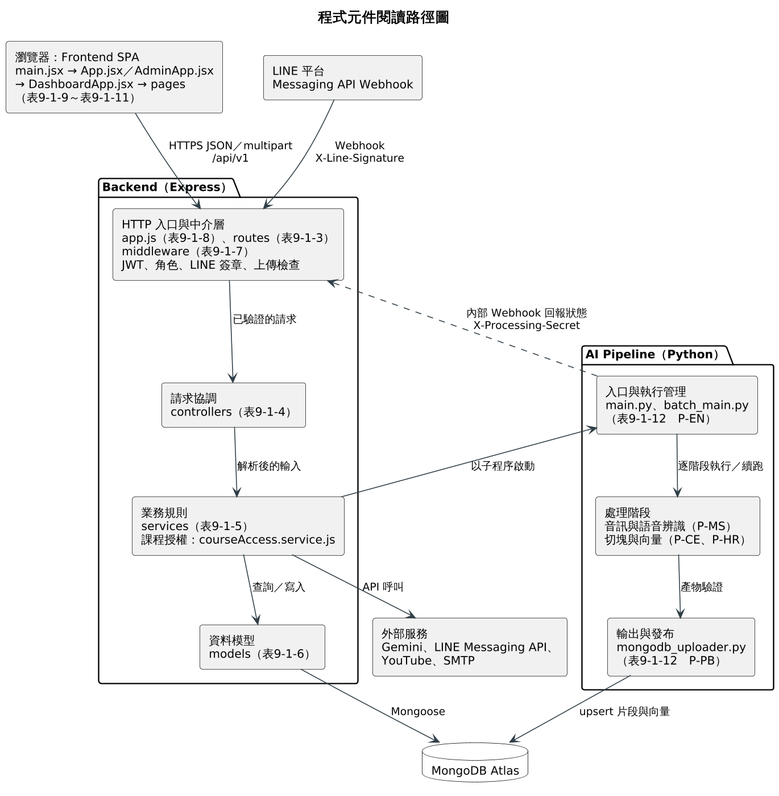

# 第9章 程式

本章說明 FocusFlow 三個服務的程式元件與規格。9-1 先說明程式架構、元件編號規則與閱讀路徑，再依 Backend、Frontend 與 AI Pipeline 列出元件清單，並挑選能代表第 5 章 9 個使用個案（UC-01～UC-09）的元件，逐一描述其位置、輸入、輸出、責任、錯誤處理與驗證方式；最後節錄少量短程式片段，說明授權、狀態轉換與來源式回答等關鍵規則。9-2 說明不直接對應單一使用個案、但支撐系統運作的附屬元件，包括技術性保護元件、維運與資料工具程式、相依套件版本，以及系統範圍界線。

本章的元件清單與規格以 2026-09-24 `dev` 分支（commit `5230d7a`）的程式碼、`package.json`、`requirements.txt` 與測試檔為依據，不貼上完整原始碼。本章與相鄰章節的分工如下：元件之間的依賴方向見第 7 章圖7-2-1～圖7-2-5 套件圖，元件之間的訊息順序見第 6 章圖6-1-1～圖6-1-9 循序圖，狀態欄位的合法轉換見圖7-4-1～圖7-4-9 狀態機圖，集合欄位的完整儲存契約見第 8 章 8-2。本章只描述「哪個檔案負責什麼」，需要時以圖號互指，不重述上述內容。

---

## 9-1 元件清單及其規格描述

### 9-1-1 程式架構與元件編號規則

本系統由三個服務組成。Frontend 為 React 19 與 Vite 建立的單頁式應用程式，負責角色畫面與呼叫 API；Backend 為 Node.js 與 Express 建立的 REST API，所有業務規則與資料權限都在此判斷；AI Pipeline 為 Python 命令列程式，由 Backend 以子程序啟動，負責語音辨識、切塊、向量化與寫入資料庫。Backend 固定採用 `routes → controllers → services → models` 分層：route 宣告路徑並掛載 middleware，controller 只做輸入解析與回應，主要規則放在 service，model 定義 MongoDB 集合的 schema。表9-1-1 彙整各服務的程式目錄、檔案數與對應清單。

表9-1-1　程式元件統計與清單索引

| 服務 | 分層（目錄） | 檔案數 | 清單 |
| --- | --- | --- | --- |
| Backend | 路由（`backend/src/routes/`） | 16 | 表9-1-3 |
| Backend | 控制器（`backend/src/controllers/`） | 15 | 表9-1-4 |
| Backend | 服務（`backend/src/services/`） | 60 | 表9-1-5 |
| Backend | 資料模型（`backend/src/models/`） | 21 | 表9-1-6 |
| Backend | 中介層（`backend/src/middleware/`） | 10 | 表9-1-7 |
| Backend | 入口、設定與共用工具（`server.js`、`app.js`、`config/`、`constants/`、`docs/`、`utils/`） | 17 | 表9-1-8 |
| Backend | 維運與資料工具程式（`backend/src/scripts/`） | 23 | 表9-2-2 |
| Frontend | 入口、共用元件（`src/`、`src/components/`） | 20 | 表9-1-9 |
| Frontend | 角色頁面（`src/pages/`） | 18 | 表9-1-10 |
| Frontend | 前端服務與工具（`services/`、`utils/`、`hooks/`、`constants/`） | 12 | 表9-1-11 |
| AI Pipeline | 處理程式（`STT_Whisper/src/`） | 31 | 表9-1-12 |
| 測試 | `backend/tests/`、`frontend/focus-flow/tests/`、`STT_Whisper/tests/` | 85／10／15 | 9-1-5 各元件「驗證方式」 |

樣式檔（`App.css`、`index.css`、`swagger-custom.css`）、圖片素材、Python 套件標記檔 `__init__.py`，以及 `backend/src/data/` 內兩份檢索評估資料集不屬於執行期程式元件，不列入清單。

元件編號採「服務－分層－流水號」三段式，第一段以英文字母代表服務，第二段以兩個英文字母代表分層，第三段為兩位數流水號，例如 `B-SV-33` 表示 Backend 服務層的第 33 個元件。以字母代替數字，是為了讓讀者在表格或測試紀錄中看到編號時，不需回查即可辨識所屬服務與分層。表9-1-2 為編號代碼一覽。

表9-1-2　元件編號代碼

| 服務代碼 | 分層代碼 | 範圍 |
| --- | --- | --- |
| B（Backend） | RT／CT／SV／MD／MW | 路由／控制器／服務／資料模型／中介層 |
| B（Backend） | IN／UT／TL | 應用程式入口與設定／共用工具／維運與資料工具程式 |
| F（Frontend） | EN／CP／PG | 入口與工作階段／共用元件／角色頁面與頁面工具 |
| F（Frontend） | SV／UT | 前端服務／工具、hooks 與常數 |
| P（AI Pipeline） | EN／MS／CE | 入口與執行管理／媒體與語音辨識／切塊與向量 |
| P（AI Pipeline） | HR／PB／TL | Parent 階層產物／輸出與發布／除錯與驗證工具 |

清單中的「使用個案」欄以第 5 章表5-2-2 使用個案清單的 UC-01～UC-09 為準：UC-01 註冊與登入、UC-02 教師管理課程與修課名單、UC-03 教師加入影片並追蹤處理、UC-04 學生在網頁觀看與提問、UC-05 學生綁定 LINE 並提問、UC-06 使用者維護個人資料與通知、UC-07 學生查看短影音、UC-08 教師產生腳本並提交短影音成品、UC-09 管理員維運系統。「共用」表示元件被多數使用個案共同依賴（例如認證與統一回應格式）；「—」表示元件屬於啟動、維運或評估用途，不直接對應使用個案。

如圖9-1-1所示，閱讀程式可依下列路徑進行。系統有兩個請求入口：瀏覽器中的 Frontend 以 HTTPS 呼叫 `/api/v1`，LINE 平台則以 Webhook 呼叫同一個 Backend；兩者都先經過 middleware 的驗證，再依 route、controller、service、model 的順序往下讀。service 視需要呼叫外部服務（Gemini、LINE Messaging API、YouTube、SMTP），或以子程序啟動 AI Pipeline；Pipeline 將產物寫入 MongoDB 後，再以內部 Webhook 回報處理狀態，而不是直接修改影片狀態。圖中每個方塊都標示對應的清單表號，讀者可由圖找到表格，再由表格找到檔案。



圖9-1-1 程式元件閱讀路徑圖

### 9-1-2 Backend 元件清單

路由層清單如表9-1-3。`index.js` 將各模組掛載於 `/api/v1`；`health.routes.js` 則由 `app.js` 另外掛載於 `/health`，不在 `/api/v1` 之下。

表9-1-3　Backend 路由（backend/src/routes/）

| 編號 | 檔案名稱 | 功能 | 使用個案 |
| --- | --- | --- | --- |
| B-RT-01 | `index.js` | 匯集各模組 router 並掛載於 `/api/v1`；短影片腳本 router 排在影片 router 之前，避免路徑被先行匹配。 | 共用 |
| B-RT-02 | `auth.routes.js` | 登入、學生自助註冊、忘記密碼（申請與確認）、`/auth/me` 讀取與修改、修改密碼、頭貼上傳與讀取。 | UC-01、UC-06 |
| B-RT-03 | `course.routes.js` | 課程 CRUD、修課名單列表／指派／撤銷／匯入、影片開啟與觀看完成回報、課程 FAQ 查詢與清除。 | UC-02、UC-04 |
| B-RT-04 | `video.routes.js` | 本機檔案或 YouTube 連結建立影片、多影片批次上傳與查詢、處理狀態查詢與重試、跨課程掛載與解除、刪除。 | UC-03 |
| B-RT-05 | `internal-video.routes.js` | Pipeline 回報處理開始、完成、失敗的內部 Webhook；以共享密鑰驗證，不使用 JWT。 | UC-03 |
| B-RT-06 | `conversation.routes.js` | 網頁多輪對話的建立、列表、訊息讀取與送出、失敗訊息重試；網頁問答畫面使用此組路由。 | UC-04 |
| B-RT-07 | `qa.routes.js` | 單輪提問端點 `POST /qa/ask`；目前網頁畫面改走對話路由，此端點保留為 API 介面。 | UC-04 |
| B-RT-08 | `line.routes.js` | LINE Webhook（驗證用 GET 與事件 POST）、綁定碼發放、解除綁定。 | UC-05 |
| B-RT-09 | `notification.routes.js` | 站內通知列表、單筆已讀、全部已讀。 | UC-06 |
| B-RT-10 | `youtube.routes.js` | 學生短影音牆清單 `GET /youtube/shorts`，僅限學生角色。 | UC-07 |
| B-RT-11 | `short-script.routes.js` | 短影音腳本候選、建立、版本生成、審核、成品上傳與上架重試；功能旗標關閉時整組路由回 404。 | UC-08 |
| B-RT-12 | `shorts.routes.js` | 教師與管理員的短影音成品審核列表、單筆讀取與審核送出。 | UC-08 |
| B-RT-13 | `stats.routes.js` | 學生與教師儀表板統計，依角色授權。 | UC-09 |
| B-RT-14 | `admin.routes.js` | 管理員統計、使用者、影片、事件、系統狀態、系統公告（發給所有啟用中的學生）與問題回報處理；整個 router 先驗管理員角色。 | UC-09 |
| B-RT-15 | `feedback.routes.js` | 已登入使用者送出問題回報（最多 3 張截圖）與讀取附件。 | UC-06、UC-09 |
| B-RT-16 | `health.routes.js` | `/health`：回報 QA、LINE、多模態、短影音同步與 YouTube 上傳的 runtime 設定快照；資料庫連線狀態改由管理員系統狀態（B-SV-48）提供。 | UC-09 |

表9-1-4　Backend 控制器（backend/src/controllers/）

| 編號 | 檔案名稱 | 功能 | 使用個案 |
| --- | --- | --- | --- |
| B-CT-01 | `auth.controller.js` | 解析登入、註冊、密碼重設、個人資料與頭貼請求，呼叫對應 service 後以統一格式回應。 | UC-01、UC-06 |
| B-CT-02 | `course.controller.js` | 課程 CRUD 與影片開啟／觀看完成回報的請求解析與回應。 | UC-02、UC-04 |
| B-CT-03 | `enrollment.controller.js` | 修課名單列表、指派、撤銷與名單匯入的 HTTP 邊界，授權規則留在 service。 | UC-02 |
| B-CT-04 | `video.controller.js` | 影片建立、查詢、處理狀態、重試、掛載與解除、刪除，以及三個內部 processing Webhook；上傳檔案先經容器檢查。 | UC-03 |
| B-CT-05 | `videoBatch.controller.js` | 多影片批次的建立、查詢與單項重試，只回傳批次彙整結果。 | UC-03 |
| B-CT-06 | `conversation.controller.js` | 解析對話與訊息參數，轉交對話 service。 | UC-04 |
| B-CT-07 | `qa.controller.js` | 檢查課程 ID 與問題非空、偵測疑似編碼損毀的輸入，再呼叫 QA service。 | UC-04 |
| B-CT-08 | `faq.controller.js` | 課程 FAQ 快取的列表與清除。 | UC-04 |
| B-CT-09 | `line.controller.js` | 將 LINE 事件陣列交給 service 處理，並處理綁定碼發放與解除綁定。 | UC-05 |
| B-CT-10 | `notification.controller.js` | 解析並限制通知查詢參數，處理單筆與全部已讀、系統公告。 | UC-06、UC-09 |
| B-CT-11 | `youtube.controller.js` | 學生短影音牆查詢；實際資料由 `shortAsset.service.js` 的 `listStudentShorts()` 提供。 | UC-07 |
| B-CT-12 | `shortScript.controller.js` | 腳本候選、建立、版本生成、審核、成品上傳與上架重試。 | UC-08 |
| B-CT-13 | `shorts.controller.js` | 短影音成品審核列表、單筆讀取與審核結果送出。 | UC-08 |
| B-CT-14 | `admin.controller.js` | 管理員統計、使用者、影片、事件、系統狀態與問題回報處理。 | UC-09 |
| B-CT-15 | `feedback.controller.js` | 問題回報的建立與附件讀取。 | UC-06、UC-09 |

服務層清單如表9-1-5，依檔名字母排序。其中 `childExpansion`、`hierarchical*`、`parent*` 等 7 個服務屬於 Parent 階層式檢索，受 `HIERARCHICAL_RETRIEVAL_ENABLED`（預設關閉）控制，關閉時問答只走 Leaf 片段檢索。

表9-1-5　Backend 服務（backend/src/services/）

| 編號 | 檔案名稱 | 功能 | 使用個案 |
| --- | --- | --- | --- |
| B-SV-01 | `admin.service.js` | 管理員總覽統計、使用者清單與姓名／角色／啟用狀態更新、影片清單與刪除、近期事件與事件統計。 | UC-09 |
| B-SV-02 | `answerGeneration.service.js` | 組裝回答 prompt 並呼叫回答 provider；集中定義「答不出來」罐頭字串與 `isNoAnswerReply()` 辨識規則。 | UC-04、UC-05 |
| B-SV-03 | `askLimits.service.js` | 問題字數上限與學生每日提問次數，以台北時間換日並合併網頁與 LINE。 | UC-04、UC-05 |
| B-SV-04 | `auth.service.js` | 登入驗證、學生自助註冊（教師與管理員不開放）、取得目前使用者、修改密碼與個人資料。 | UC-01、UC-06 |
| B-SV-05 | `avatar.service.js` | 以檔案簽章判斷頭貼實際格式，將影像寫入 `avatars` 集合並供本人讀取。 | UC-06 |
| B-SV-06 | `bridgeScope.service.js` | 建立課程的影片與片段查詢範圍，統一 `_id`、`videoId`、`video_id` 三種識別碼。 | UC-04、UC-05 |
| B-SV-07 | `childExpansion.service.js` | 由 Parent 命中結果回查對應 Leaf 片段，並再次做範圍過濾。 | UC-04、UC-05 |
| B-SV-08 | `contextualQuestion.service.js` | 判斷追問句並依對話歷史補回主題，使代名詞式提問仍可檢索。 | UC-04、UC-05 |
| B-SV-09 | `conversation.service.js` | 網頁多輪對話的建立、訊息讀寫、失敗重試，並將問答結果轉為訊息來源。 | UC-04 |
| B-SV-10 | `conversationTurnAnalytics.service.js` | 以唯讀連線彙總網頁與 LINE 的完整問答輪次，並攔截任何寫入指令。 | — |
| B-SV-11 | `costControl.service.js` | 以月為單位彙總 token 用量，超出全站或個人額度時拒絕提問。 | UC-04、UC-05 |
| B-SV-12 | `course.service.js` | 課程建立、查詢、更新、刪除與觀看進度記錄；刪除時一併刪除影片、片段、修課紀錄與 FAQ，將系統上傳的 YouTube 影片轉私人，並封存短影音成品。 | UC-02、UC-04 |
| B-SV-13 | `courseAccess.service.js` | 集中角色判斷、有效修課查詢，以及課程讀取權與管理權的斷言。 | 共用 |
| B-SV-14 | `demoSeed.service.js` | 以固定 ID 建立可重複執行的示範資料，並可保守回復示範基準。 | — |
| B-SV-15 | `embeddingContract.service.js` | 定義 Backend、Pipeline 與資料庫必須一致的向量契約欄位與比較規則。 | UC-03、UC-04 |
| B-SV-16 | `enrollment.service.js` | 修課名單列表、指派（可重複執行）、撤銷與名單匯入。 | UC-02 |
| B-SV-17 | `faqCache.service.js` | FAQ 兩層快取（正規化文字完全相同、向量相似度）、課程層失效與容量淘汰。 | UC-04、UC-05 |
| B-SV-18 | `feedback.service.js` | 問題回報建立、管理員列表與狀態更新、附件讀取權限檢查。 | UC-06、UC-09 |
| B-SV-19 | `hierarchicalDataReadiness.service.js` | 以唯讀查詢比對 Parent、Leaf 與索引的契約一致性，作為階層式檢索的啟用條件。 | UC-04、UC-05 |
| B-SV-20 | `hierarchicalRetrieval.service.js` | 串接 Parent 檢索與 Child 展開的檢索流程。 | UC-04、UC-05 |
| B-SV-21 | `hierarchicalRollout.service.js` | 解析階層式檢索的推行模式與影片允許清單，決定實際採用的檢索路徑。 | UC-04、UC-05 |
| B-SV-22 | `leafContextAssembly.service.js` | 將 Leaf 片段去重、依上限截斷後組成送入 prompt 的上下文。 | UC-04、UC-05 |
| B-SV-23 | `leafContextSelection.service.js` | 在檢索結果上補入同影片的鄰接片段，並輸出取捨診斷。 | UC-04、UC-05 |
| B-SV-24 | `line.service.js` | LINE 綁定碼產生與解除、Webhook 事件處理、對話狀態與課程切換選單、轉接共用問答。 | UC-05 |
| B-SV-25 | `loginThrottle.service.js` | 以 Email 累計登入失敗次數，達上限時暫時鎖定。 | UC-01 |
| B-SV-26 | `mailer.service.js` | SMTP 寄信封裝；未設定寄信帳號時由呼叫端回報功能未啟用。 | UC-06 |
| B-SV-27 | `mediaIntegrity.service.js` | 以容器結構檢查上傳影片是否為完整的 MP4、MOV 或 MKV。 | UC-03、UC-08 |
| B-SV-28 | `notification.service.js` | 站內通知列表、已讀、系統公告（發給所有啟用中的學生），以及影片處理完成與短影音退回通知。 | UC-06、UC-03、UC-09 |
| B-SV-29 | `parentSearch.service.js` | Parent 向量檢索與命中結果的契約驗證。 | UC-04、UC-05 |
| B-SV-30 | `parentSearchAdapter.service.js` | 組出 Parent 向量查詢管線並封裝資料庫錯誤，不外洩連線細節。 | UC-04、UC-05 |
| B-SV-31 | `parentVectorIndex.service.js` | Parent 集合的一般索引與向量索引定義及建立。 | — |
| B-SV-32 | `passwordReset.service.js` | 忘記密碼：寄出六位數驗證碼、只儲存雜湊、對未知 Email 回相同結果。 | UC-06 |
| B-SV-33 | `pilotUsageReport.service.js` | 產生只到次數層級的使用統計，不輸出姓名、Email 或提問內容。 | UC-09 |
| B-SV-34 | `qa.service.js` | 問答主流程：權限重驗、FAQ 快取、查詢向量、片段檢索、回答生成、引用組裝與紀錄寫入。 | UC-04、UC-05 |
| B-SV-35 | `qaScopeMonitoring.service.js` | 檢索候選的範圍過濾，並記錄範圍為空的事件。 | UC-04、UC-05 |
| B-SV-36 | `queryEmbedding.service.js` | 產生查詢向量並正規化為單位長度，與資料向量落在同一空間。 | UC-04、UC-05 |
| B-SV-37 | `questionRecording.service.js` | 將提問、回答、命中片段、runtime 快照與來源用量紀錄寫入 `questions`。 | UC-04、UC-05 |
| B-SV-38 | `retrievalEvaluation.service.js` | 以 Hit@K 與倒數排名評估檢索結果並彙總。 | — |
| B-SV-39 | `runtimeDiagnostics.service.js` | 組出 `/health` 的 QA、LINE 與多模態 runtime 快照，設定不合法時回設定錯誤。 | UC-09 |
| B-SV-40 | `shortAsset.service.js` | 短影音成品建立、審核、學生短影音牆清單，以及課程刪除時封存。 | UC-07、UC-08 |
| B-SV-41 | `shortAssetPublish.service.js` | 由腳本建立成品、上傳 YouTube、上架、重試，以及退回後轉為私人。 | UC-08 |
| B-SV-42 | `shortScript.service.js` | 腳本建立與證據凍結、版本生成、審核狀態轉換、成品退回時回寫。 | UC-08 |
| B-SV-43 | `shortScriptGeneration.service.js` | 八拍腳本生成與驗證：引用必須在凍結證據內，另檢查轉折、字幕長度與繁體字。 | UC-08 |
| B-SV-44 | `shortScriptTopic.service.js` | 由 `questions` 彙整候選主題並依熱度排序，排除已處理主題。 | UC-08 |
| B-SV-45 | `shortsSync.service.js` | 定期向 YouTube 同步短影音可播放狀態，含批次、重試與節流。 | UC-07 |
| B-SV-46 | `sttProcessLifecycle.service.js` | 組裝 Pipeline 子程序環境變數、記錄輸出、描述結束碼。 | UC-03 |
| B-SV-47 | `studentPilotRuntime.service.js` | 啟動時讀取並驗證試用情境所需的 runtime 旗標組合。 | — |
| B-SV-48 | `systemStatus.service.js` | 以本程序可觀察的事實（資料庫、QA、LINE、STT 環境與佇列、YouTube）組出系統服務狀態。 | UC-09 |
| B-SV-49 | `teacherStats.service.js` | 教師與學生儀表板統計；指向已刪除影片的紀錄合併為「內容已下架」。 | UC-09 |
| B-SV-50 | `usageLog.service.js` | 寫入登入、提問、觀看等使用事件。 | 共用 |
| B-SV-51 | `video.service.js` | 影片建立、查詢、刪除、跨課程掛載與解除、排程與重試單支 Pipeline。 | UC-03 |
| B-SV-52 | `videoBatch.service.js` | 多影片批次的持久化：逐項保存、部分失敗不回滾、狀態由逐項結果彙整。 | UC-03 |
| B-SV-53 | `videoBatchProcessing.service.js` | 寫出批次請求檔並啟動或續跑批次 Pipeline 子程序。 | UC-03 |
| B-SV-54 | `videoBatchReconciliation.service.js` | 定期讀取 Pipeline 批次 manifest，先驗證識別與筆數再套用狀態。 | UC-03 |
| B-SV-55 | `videoMigration.service.js` | 啟動時清理影片文件中明確為 null 的舊欄位。 | — |
| B-SV-56 | `videoProcessing.service.js` | 影片處理狀態機，以及完成後的 FAQ 清除、通知與 YouTube 上傳排程。 | UC-03 |
| B-SV-57 | `videoProcessingQueue.service.js` | 限制同時執行的影片處理數量並提供佇列快照。 | UC-03 |
| B-SV-58 | `videoVectorIndex.service.js` | 畫面片段集合的向量索引定義與建立。 | — |
| B-SV-59 | `youtube.service.js` | 讀取 YouTube 頻道上傳清單的舊版實作；目前沒有其他模組引用（見 9-2-4）。 | — |
| B-SV-60 | `youtubeUpload.service.js` | YouTube OAuth 取得存取權杖、上傳影片、刪除時轉私人、上傳狀態快照與中斷上傳的回收。 | UC-03、UC-08 |

資料模型層清單如表9-1-6。欄位、索引與限制的完整內容見第 8 章 8-2，此處只描述各 model 的職責。

表9-1-6　Backend 資料模型（backend/src/models/）

| 編號 | 檔案名稱 | 功能 | 使用個案 |
| --- | --- | --- | --- |
| B-MD-01 | `user.model.js` | 使用者帳號：姓名、Email、密碼雜湊、角色、啟用狀態、LINE 綁定與對話狀態、頭貼存在與否、密碼重設暫存欄位。 | UC-01、UC-05、UC-06 |
| B-MD-02 | `avatar.model.js` | 頭貼影像本體，每位使用者一份，與 `users` 分離以免查詢時攜帶影像位元組。 | UC-06 |
| B-MD-03 | `course.model.js` | 課程：標題、說明、授課教師、draft／published／archived 狀態與掛載影片清單。 | UC-02 |
| B-MD-04 | `enrollment.model.js` | 修課關係：學生與課程唯一，撤銷後可重新啟用而保留進度。 | UC-02、UC-04 |
| B-MD-05 | `video.model.js` | 影片：課程歸屬、上傳者、來源、時長、處理狀態子文件與 YouTube 上傳狀態子文件。 | UC-03 |
| B-MD-06 | `videoBatch.model.js` | 影片批次：批次識別碼、課程、建立者、執行模式與逐項狀態。 | UC-03 |
| B-MD-07 | `videoSegment.model.js` | Leaf 文字片段：逐字稿、起訖秒數、向量與向量契約欄位；集合名稱由環境變數決定。 | UC-03、UC-04 |
| B-MD-08 | `videoSegmentParent.model.js` | Parent 片段：涵蓋範圍、子片段識別碼清單與向量契約欄位。 | UC-04 |
| B-MD-09 | `videoSegmentVideo.model.js` | 畫面片段：課程範圍內的畫面引用資料；集合名稱由環境變數決定。 | UC-04 |
| B-MD-10 | `question.model.js` | 提問紀錄：問題、回答、狀態、來源管道、命中片段與 runtime 快照、提問向量。 | UC-04、UC-05、UC-08 |
| B-MD-11 | `conversation.model.js` | 網頁對話：所屬課程、擁有者與標題。 | UC-04 |
| B-MD-12 | `message.model.js` | 對話訊息：角色、內容、狀態與引用來源。 | UC-04 |
| B-MD-13 | `faq.model.js` | FAQ 快取：正規化問題、答案、命中次數、問題向量與引用快照。 | UC-04、UC-05 |
| B-MD-14 | `clip.model.js` | 片段引用快取，問答命中時用來組出跳轉資訊。 | UC-04 |
| B-MD-15 | `usageLog.model.js` | 使用事件：使用者、課程、事件種類與附加資訊。 | 共用 |
| B-MD-16 | `notification.model.js` | 站內通知：接收者、種類、內容、已讀狀態與去重用的部分唯一索引。 | UC-06 |
| B-MD-17 | `lineBindToken.model.js` | LINE 一次性綁定碼：隨機字串、使用者、到期時間（TTL 索引）。 | UC-05 |
| B-MD-18 | `shortScript.model.js` | 短影音腳本：凍結證據、候選主題來源、各版本內容與審核狀態。 | UC-08 |
| B-MD-19 | `shortAsset.model.js` | 短影音成品：課程快照、審核歷程、AI 揭露確認與上架紀錄。 | UC-07、UC-08 |
| B-MD-20 | `feedback.model.js` | 問題回報：回報者、角色、分類、嚴重程度、描述、附件摘要與處理狀態。 | UC-06、UC-09 |
| B-MD-21 | `feedbackAttachment.model.js` | 問題回報截圖本體，與回報主文件分離。 | UC-06、UC-09 |

表9-1-7　Backend 中介層（backend/src/middleware/）

| 編號 | 檔案名稱 | 功能 | 使用個案 |
| --- | --- | --- | --- |
| B-MW-01 | `auth.middleware.js` | `authenticate()`：驗證 Bearer JWT，重新查詢啟用中的使用者，將公開欄位掛到 `req.user`。 | 共用 |
| B-MW-02 | `role.middleware.js` | `authorizeRoles()`：依允許角色清單授權，須排在 `authenticate()` 之後。 | 共用 |
| B-MW-03 | `lineSignature.middleware.js` | 以原始 body 計算 HMAC-SHA256，比對 `X-Line-Signature`。 | UC-05 |
| B-MW-04 | `internalProcessingAuth.middleware.js` | 比對 `X-Processing-Secret` 共享密鑰，保護 Pipeline 回報 Webhook。 | UC-03 |
| B-MW-05 | `upload.middleware.js` | 影片上傳：MIME 須為 `video/*`、單檔上限 500 MB、批次最多 10 檔、中文檔名解碼、驗證失敗後清除暫存檔。 | UC-03、UC-08 |
| B-MW-06 | `avatarUpload.middleware.js` | 頭貼上傳：單一檔案、1 MiB、宣告 MIME 須為 JPEG／PNG／WebP。 | UC-06 |
| B-MW-07 | `feedbackUpload.middleware.js` | 問題回報附件：最多 3 張、每張 10 MiB。 | UC-06 |
| B-MW-08 | `securityHeaders.middleware.js` | 加上內容型別、框架嵌入、來源政策等安全標頭，`/api/` 另加 CSP。 | 共用 |
| B-MW-09 | `error.middleware.js` | 集中錯誤轉譯為統一格式，正式環境不回傳除錯細節。 | 共用 |
| B-MW-10 | `notFound.middleware.js` | 未匹配路徑回 404 `NOT_FOUND`。 | 共用 |

表9-1-8　Backend 入口、設定與共用工具

| 編號 | 檔案名稱 | 功能 | 使用個案 |
| --- | --- | --- | --- |
| B-IN-01 | `src/server.js` | 連線資料庫、欄位遷移、可選示範資料、啟動 YouTube 同步與批次對帳排程、回收中斷的處理，最後啟動 Express。 | 共用 |
| B-IN-02 | `src/app.js` | 建立 Express：安全標頭、CORS、請求日誌、body 解析（保留原始 body 供簽章驗證）、API 文件、`/health` 與 `/api/v1` 掛載。 | 共用 |
| B-IN-03 | `src/docs/openapi.js` | 讀取 OpenAPI 規格與 Swagger UI 樣式，提供 `/docs`。 | — |
| B-IN-04 | `config/env.js` | 集中讀取並檢核環境變數；正式環境未設定安全的 `JWT_SECRET` 時拒絕啟動。 | 共用 |
| B-IN-05 | `config/database.js` | 建立與關閉 MongoDB 連線。 | 共用 |
| B-IN-06 | `config/cors.js` | 依 `ALLOWED_ORIGINS` 白名單組出 CORS 選項。 | 共用 |
| B-IN-07 | `constants/enums.js` | 集中角色、課程狀態、影片處理與批次狀態、提問狀態、使用事件等列舉值。 | 共用 |
| B-UT-01 | `utils/apiResponse.js` | 組出統一的成功與錯誤回應結構。 | 共用 |
| B-UT-02 | `utils/appError.js` | 帶 HTTP 狀態碼與錯誤代碼的應用錯誤類別。 | 共用 |
| B-UT-03 | `utils/asyncHandler.js` | 包裝非同步 controller，使例外自動進入錯誤 middleware。 | 共用 |
| B-UT-04 | `utils/objectId.js` | `assertObjectId()`：驗證 MongoDB 識別碼格式。 | 共用 |
| B-UT-05 | `utils/publicUser.js` | `toPublicUser()`：以白名單輸出使用者欄位，排除密碼雜湊與 LINE 識別碼。 | 共用 |
| B-UT-06 | `utils/imageSignature.js` | 以檔案開頭位元組判斷 JPEG／PNG／WebP，不信任用戶端宣告的 MIME。 | UC-06 |
| B-UT-07 | `utils/textEncoding.js` | 偵測疑似編碼損毀的問題文字。 | UC-04 |
| B-UT-08 | `utils/vectorSimilarity.js` | 共用的餘弦相似度計算。 | UC-04、UC-05 |
| B-UT-09 | `utils/logPreview.js` | 截斷過長文字，避免日誌寫入完整內容。 | 共用 |
| B-UT-10 | `utils/logger.js` | 事件層級的警告記錄封裝。 | 共用 |

### 9-1-3 Frontend 元件清單

Frontend 位於 `frontend/focus-flow/src/`。`main.jsx` 依網址決定掛載一般入口或 `/admin` 管理員入口，登入後由 `DashboardApp.jsx` 依角色組合頁面；頁面狀態同步到網址，但資料權限一律由 Backend 重新判斷。

表9-1-9　Frontend 入口與共用元件

| 編號 | 檔案名稱 | 功能 | 使用個案 |
| --- | --- | --- | --- |
| F-EN-01 | `main.jsx` | 應用程式進入點，`/admin` 掛載管理員入口，其餘掛載一般入口。 | UC-01 |
| F-EN-02 | `App.jsx` | 一般入口：首頁、登入、學生註冊、登入後切換到儀表板。 | UC-01 |
| F-EN-03 | `AdminApp.jsx` | 管理員入口：獨立登入畫面與管理員儀表板；非管理員帳號顯示無權限而不強制登出。 | UC-01、UC-09 |
| F-EN-04 | `api.js` | `apiFetch()`：集中 API 位址、權杖存取、Bearer 標頭與錯誤解析。 | 共用 |
| F-EN-05 | `authSession.js` | `restoreAuthSession()`：以 `/auth/me` 還原登入狀態，區分匿名、已登入、憑證無效、服務暫時不可用、無權限五種結果。 | UC-01 |
| F-CP-01 | `components/DashboardApp.jsx` | 登入後的版面容器，組合側邊欄、頂欄與角色頁面。 | 共用 |
| F-CP-02 | `components/Sidebar.jsx` | 依角色顯示導覽項目與使用者資訊。 | 共用 |
| F-CP-03 | `components/Topbar.jsx` | 頁面標題、通知選單與已讀、管理員發送公告、頭貼顯示、腳本深層連結接收。 | UC-06、UC-09 |
| F-CP-04 | `components/navigationConfig.js` | 三種角色的導覽項目、角色標籤與頁面對應。 | 共用 |
| F-CP-05 | `components/LoginPage.jsx` | 一般登入表單，含角色選擇與忘記密碼入口。 | UC-01 |
| F-CP-06 | `components/AdminLoginPage.jsx` | 管理員專用登入表單。 | UC-01 |
| F-CP-07 | `components/RegisterPage.jsx` | 學生自助註冊表單與欄位檢查（固定送出 `role: 'student'`）。 | UC-01 |
| F-CP-08 | `components/ForgotPasswordModal.jsx` | 忘記密碼兩步驟：寄送驗證碼、以驗證碼設定新密碼。 | UC-06 |
| F-CP-09 | `components/EnrollmentManagerModal.jsx` | 修課名單查詢、指派、撤銷與名單匯入對話框，教師與管理員課程頁共用。 | UC-02 |
| F-CP-10 | `components/IssueReportLauncher.jsx` | 學生與教師的問題回報視窗：分類、嚴重程度、描述與最多 3 張截圖，送至 `/feedback`；另附外部意見表單連結。 | UC-06 |
| F-CP-11 | `components/StepIndicator.jsx` | 多步驟流程的進度指示。 | 共用 |
| F-CP-12 | `components/Icons.jsx` | 介面向量圖示集中管理。 | 共用 |
| F-CP-13 | `components/Button3D.jsx` | 首頁立體按鈕（three、gsap）。 | — |
| F-CP-14 | `components/LiquidGradientBg.jsx` | 首頁流動漸層背景（three）。 | — |
| F-CP-15 | `components/BubbleScene.jsx` | 3D 泡泡場景元件；目前沒有其他檔案引用（見 9-2-4）。 | — |

表9-1-10　Frontend 角色頁面與頁面工具（src/pages/）

| 編號 | 檔案名稱 | 功能 | 使用個案 |
| --- | --- | --- | --- |
| F-PG-01 | `StudentDashboard.jsx` | 學生總覽：課程進度、提問統計與近期活動。 | UC-09 |
| F-PG-02 | `StudentCourses.jsx` | 學生課程頁：影片播放與開啟／觀看回報、網頁多輪問答、引用片段展開與時間點跳轉、「詢問助教」LINE QR Code。 | UC-04、UC-05 |
| F-PG-03 | `StudentLineBot.jsx` | LINE 綁定頁：取得綁定碼、加入好友 QR Code、解除綁定。 | UC-05 |
| F-PG-04 | `StudentShortsWall.jsx` | 學生短影音牆：分頁載入已上架的短影音。 | UC-07 |
| F-PG-05 | `TeacherDashboard.jsx` | 教師總覽：課程、影片處理狀態與學生提問熱點。 | UC-09 |
| F-PG-06 | `TeacherCourses.jsx` | 教師課程管理：建立與編輯、發布狀態、修課名單、影片列表、跨課程掛載與解除、刪除影片。 | UC-02、UC-03 |
| F-PG-07 | `TeacherUpload.jsx` | 教師上傳：MP4／MOV／MKV 多檔選取、逐檔驗證、批次進度、失敗項目重試；以 localStorage 在重新整理後恢復追蹤。 | UC-03 |
| F-PG-08 | `TeacherShortScripts.jsx` | 教師短影音腳本：候選主題、腳本生成、版本檢視與成品上傳。 | UC-08 |
| F-PG-09 | `TeacherVideoReview.jsx` | 教師短影音成品審核：檢視、勾選退回原因、送出審核。 | UC-08 |
| F-PG-10 | `AdminOverview.jsx` | 管理員系統總覽：整體用量與系統服務狀態。 | UC-09 |
| F-PG-11 | `AdminUsers.jsx` | 管理員使用者管理：角色與啟用狀態調整。 | UC-09 |
| F-PG-12 | `AdminCourses.jsx` | 管理員課程管理：建立與編輯課程、指定授課教師、修課名單。 | UC-09、UC-02 |
| F-PG-13 | `AdminVideos.jsx` | 管理員影片管理：處理狀態檢視與刪除。 | UC-09 |
| F-PG-14 | `AdminFeedback.jsx` | 管理員問題回報：篩選、檢視截圖、更新處理狀態與備註。 | UC-09 |
| F-PG-15 | `AdminStats.jsx` | 管理員使用統計：事件分布與近期事件。 | UC-09 |
| F-PG-16 | `Profile.jsx` | 個人資料：姓名與 Email、修改密碼、更換頭貼。 | UC-06 |
| F-PG-17 | `qaConversationUtils.js` | 問答訊息與來源清單的顯示轉換與截斷規則。 | UC-04 |
| F-PG-18 | `teacherUploadUtils.js` | 上傳檔案的鍵值、大小格式、副檔名與容量檢查、清單合併。 | UC-03 |

表9-1-11　Frontend 服務、工具與共用 hooks

| 編號 | 檔案名稱 | 功能 | 使用個案 |
| --- | --- | --- | --- |
| F-SV-01 | `services/videoUpload.js` | `uploadCourseVideos()`：以單一 multipart 請求送出多支影片至 `/courses/:courseId/video-batches`，並檢查回傳批次格式。 | UC-03 |
| F-SV-02 | `services/videoReview.js` | 短影音審核的 API 呼叫與退回原因代碼。 | UC-08 |
| F-SV-03 | `services/shortScript.js` | 短影音腳本 API 呼叫，可分辨「功能未啟用」與「資源不存在」。 | UC-08 |
| F-SV-04 | `services/shortScriptTemplate.js` | 將腳本資料組成可複製的完整腳本文字。 | UC-08 |
| F-UT-01 | `utils/avatarImage.js` | 依伺服器端中繼資料決定頭貼版本並取得顯示位址。 | UC-06 |
| F-UT-02 | `utils/errorMessages.js` | 將後端錯誤代碼與狀態碼轉為中文提示。 | 共用 |
| F-UT-03 | `utils/pageRouting.js` | 頁面狀態與網址同步，重新整理停在原頁、上一頁可返回。 | 共用 |
| F-UT-04 | `utils/profileUser.js` | 個人資料表單與登入狀態的同步。 | UC-06 |
| F-UT-05 | `utils/scriptDeepLink.js` | 跨頁面開啟指定腳本，支援目標頁尚未掛載與已掛載兩種情況。 | UC-08 |
| F-UT-06 | `utils/userDisplay.js` | 顯示名稱與歡迎詞；資料不完整時不回退為固定示範身分。 | 共用 |
| F-UT-07 | `hooks/useModalDialog.js` | 對話框共用行為：焦點限制、Esc 關閉、背景捲動鎖定與焦點還原。 | 共用 |
| F-UT-08 | `constants/videoReviewReasons.js` | 短影音退回原因的代碼、標籤與填寫提示。 | UC-08 |

### 9-1-4 AI Pipeline 元件清單

AI Pipeline 位於 `STT_Whisper/src/`，對應 UC-03 中「系統處理影片」的部分。Backend 以子程序執行單支入口 `main.py` 或批次入口 `batch_main.py`，Pipeline 完成語音辨識、切塊與向量化後，把產物寫入 MongoDB，再以內部 Webhook 回報結果。Parent 階層產物（P-HR）是選用功能，預設不進入問答檢索路徑。

表9-1-12　AI Pipeline 元件（STT_Whisper/src/）

| 編號 | 檔案名稱 | 功能 | 使用個案 |
| --- | --- | --- | --- |
| P-EN-01 | `main.py` | 單支影片入口：音訊擷取、語音辨識、正規化、切塊、向量、產物驗證、寫入資料庫與處理狀態回報。 | UC-03 |
| P-EN-02 | `batch_main.py` | 批次入口：`--batch-input`、`--batch-request`、`--batch-resume` 三種模式，以單支流程為執行單位。 | UC-03 |
| P-EN-03 | `batch_manager.py` | 批次 manifest 與摘要、併發上限、單支失敗隔離、跨程序租約防止同批次重複執行。 | UC-03 |
| P-EN-04 | `job_manager.py` | 單次執行的 manifest，記錄每支影片與每個階段的狀態。 | UC-03 |
| P-EN-05 | `resume_checkpoint.py` | 續跑計畫與檢查點驗證，產物合法時才跳過已完成階段。 | UC-03 |
| P-EN-06 | `run_summary.py` | 執行摘要：階段結果統計與上傳結果紀錄。 | UC-03 |
| P-EN-07 | `config.py` | 由環境變數與命令列參數組成設定，並建立執行所需目錄。 | UC-03 |
| P-EN-08 | `utils.py` | 影片中繼資料與逐字稿片段的共用資料結構。 | UC-03 |
| P-MS-01 | `scan_videos.py` | 掃描來源影片，由目錄與檔名推斷課程欄位並讀取時長。 | UC-03 |
| P-MS-02 | `extract_audio.py` | 以 FFmpeg 產生 16 kHz 單聲道 WAV。 | UC-03 |
| P-MS-03 | `transcribe.py` | 以 faster-whisper 轉寫，並可重用逐字稿快取。 | UC-03 |
| P-MS-04 | `normalize_transcript.py` | 技術名詞正規化並保存修正歷程。 | UC-03 |
| P-MS-05 | `stt_accuracy.py` | 語音辨識設定指紋、診斷資訊與離線正確率指標。 | UC-03 |
| P-CE-01 | `chunking.py` | 將逐字稿片段合併為適合語意檢索的 Leaf chunk。 | UC-03 |
| P-CE-02 | `chunk_strategy.py` | 切塊設定快照與決定性指紋，供續跑時比對。 | UC-03 |
| P-CE-03 | `embedding.py` | 以 Gemini 產生文字 chunk 向量並記錄狀態。 | UC-03 |
| P-CE-04 | `embedding_contract.py` | Pipeline 端的向量契約與檢索用文件格式。 | UC-03 |
| P-HR-01 | `hierarchy_chunking.py` | 由 Leaf chunk 決定性推導 Parent chunk。 | UC-03 |
| P-HR-02 | `hierarchy_strategy.py` | 階層設定驗證與指紋。 | UC-03 |
| P-HR-03 | `build_parent_chunk_artifact.py` | 產生並驗證 Parent chunk 產物。 | UC-03 |
| P-HR-04 | `parent_embedding.py` | Parent 向量產生，保持決定性順序並可續用成功結果。 | UC-03 |
| P-HR-05 | `parent_embedding_strategy.py` | Parent 向量的設定與指紋契約。 | UC-03 |
| P-HR-06 | `embed_parent_chunk_artifact.py` | 指定範圍的 Parent 向量生成命令列工具。 | — |
| P-HR-07 | `parent_mongodb_uploader.py` | Parent 產物驗證與 upsert 規劃，錯誤紀錄不含原文與向量。 | UC-03 |
| P-HR-08 | `publish_parent_embeddings.py` | 驗證與發布兩階段分離的 Parent 發布命令列工具。 | — |
| P-PB-01 | `export_outputs.py` | 輸出影片中繼資料、逐字稿與正規化結果的 JSON／JSONL。 | UC-03 |
| P-PB-02 | `mongodb_uploader.py` | `upload_all()`：將執行產物 upsert 進各集合，並寫出逐集合上傳報告。 | UC-03 |
| P-PB-03 | `rebuild_student_pilot_leaf_embeddings.py` | 固定範圍的 Leaf 向量重建工具，前置條件不符時停止。 | — |
| P-PB-04 | `video_multimodal_pipeline.py` | 短片畫面向量的獨立側支流程。 | — |
| P-TL-01 | `debug_gemini_embedding.py` | 單筆向量請求的除錯工具。 | — |
| P-TL-02 | `validate_gemini_embedding.py` | 向量輸出的離線驗證工具。 | — |

### 9-1-5 代表性元件規格描述

前述清單只列出每個檔案的職責。本節依第 5 章的使用個案，挑選能說明各使用個案「在哪裡做出關鍵判斷」的元件，逐一描述位置、輸入、輸出、責任、錯誤處理與驗證方式。挑選原則有三：一、每個使用個案至少一個；二、優先選擇集中授權、狀態轉換或外部資料交接的元件；三、同一使用個案跨越多個服務時，各服務各選一個。表9-1-13 為代表性元件與使用個案的對照，表9-1-14 至表9-1-27 為各元件規格。

表9-1-13　代表性元件與使用個案對照

| 規格表 | 代表性元件 | 編號 | 使用個案 | 相關圖 |
| --- | --- | --- | --- | --- |
| 表9-1-14 | 認證與角色授權 middleware | B-MW-01、B-MW-02 | 共用（UC-01～UC-09） | 圖6-1-9（步驟 3～4）、圖7-2-2 |
| 表9-1-15 | 登入服務 `login()` | B-SV-04、B-SV-25 | UC-01 | 圖6-1-1 |
| 表9-1-16 | 前端工作階段還原 `restoreAuthSession()` | F-EN-05 | UC-01 | 圖7-4-1 |
| 表9-1-17 | 課程存取與修課名單服務 | B-SV-13、B-SV-16 | UC-02 | 圖6-1-2、圖7-4-6 |
| 表9-1-18 | 多影片批次服務 `createVideoBatch()` | B-SV-52、F-SV-01 | UC-03 | 圖6-1-3、圖7-4-2 |
| 表9-1-19 | 影片處理狀態機 | B-SV-56、B-MW-04 | UC-03 | 圖7-4-3 |
| 表9-1-20 | Pipeline 單支入口 `main.py` | P-EN-01、P-PB-02 | UC-03 | 圖6-1-3 |
| 表9-1-21 | 網頁對話服務 `sendMessage()` | B-SV-09、F-PG-02 | UC-04 | 圖6-1-4 |
| 表9-1-22 | 問答主流程 `askQuestion()` | B-SV-34 | UC-04、UC-05 | 圖6-1-4、圖7-4-4 |
| 表9-1-23 | LINE Webhook 與對話服務 | B-MW-03、B-SV-24 | UC-05 | 圖6-1-5、圖7-4-5 |
| 表9-1-24 | 通知服務 | B-SV-28、F-CP-03 | UC-06 | 圖6-1-6 |
| 表9-1-25 | 學生短影音牆 `listStudentShorts()` | B-SV-40 | UC-07 | 圖6-1-7、圖7-4-8 |
| 表9-1-26 | 短影音腳本服務 | B-SV-42、B-SV-43 | UC-08 | 圖6-1-8、圖7-4-7 |
| 表9-1-27 | 管理員維運與系統狀態 | B-SV-01、B-SV-48 | UC-09 | 圖6-1-9 |

各規格表的「驗證方式」列出對應的自動化測試檔。2026-09-24 以本機環境重新執行三個服務的測試，結果如下：Backend `npm test` 共 887 項，853 項通過、34 項失敗，失敗全部集中在短影音腳本的 3 個測試檔（`short-script.service.test.js`、`short-script-review.service.test.js`、`short-script.routes.test.js`），錯誤碼均為 `SHORT_SCRIPT_EVIDENCE_EMPTY`，單獨執行也可重現，原因待確認；Frontend `npm test` 共 68 項全數通過；AI Pipeline `python -m unittest` 共 189 項全數通過（本次環境未安裝 faster-whisper 與 sentence-transformers，實際語音辨識未執行）。上述結果只證明程式邏輯在本機測試替身（in-memory store、mock provider）下成立，不代表正式環境、共享 Atlas 或外部服務已完成驗收；正式驗收見第 10 章。

表9-1-14　元件規格－認證與角色授權 middleware

| 項目 | 說明 |
| --- | --- |
| 位置 | `backend/src/middleware/auth.middleware.js` 的 `authenticate()`、`role.middleware.js` 的 `authorizeRoles()` |
| 輸入 | HTTP 標頭 `Authorization: Bearer <token>`；route 宣告的允許角色清單 |
| 輸出 | 成功時 `req.user`（`id` 加上 `toPublicUser()` 白名單欄位）並交給下一層；失敗時交由錯誤 middleware 回應 |
| 責任 | 以 `JWT_SECRET` 驗證權杖後，每次都重新查詢使用者，確認帳號仍存在且啟用；角色授權一律在 route 層以 `authorizeRoles()` 宣告，controller 與 service 不自行比對角色字串。 |
| 錯誤處理 | 缺少權杖或帳號不存在／停用回 401 `UNAUTHORIZED`；權杖無效或過期回 401 `INVALID_TOKEN`；角色不符回 403 `FORBIDDEN`。 |
| 驗證方式 | `auth.routes.test.js`、`admin.routes.test.js`、`jwt-secret.config.test.js`，以及各 route 測試的未登入與無權限情境。 |

表9-1-15　元件規格－登入服務

| 項目 | 說明 |
| --- | --- |
| 位置 | `backend/src/services/auth.service.js` 的 `login()`；鎖定規則在 `loginThrottle.service.js` |
| 輸入 | Email、密碼、使用者在畫面上選擇的角色 |
| 輸出 | `{ token, user }`：JWT（payload 只含 `sub`）與公開使用者欄位；同時寫入一筆 `LOGIN` 使用事件 |
| 責任 | 依序執行角色格式檢查、鎖定檢查、帳號查詢、bcrypt 密碼比對、啟用狀態與角色比對。角色比對刻意放在密碼驗證之後，避免未通過驗證的人藉由錯誤訊息推測某 Email 屬於哪種角色。 |
| 錯誤處理 | 角色值不合法回 400 `VALIDATION_ERROR`；帳號不存在或密碼錯誤回 401 `INVALID_CREDENTIALS` 並附剩餘可嘗試次數；達上限（預設 15 分鐘內失敗 5 次，鎖定 15 分鐘）回 429 `TOO_MANY_LOGIN_ATTEMPTS`；帳號停用回 403 `USER_INACTIVE`；角色不符回 403 `ROLE_MISMATCH`，不發權杖。 |
| 驗證方式 | `auth.routes.test.js`（含鎖定與角色不符情境）、`user.model.test.js`。 |

表9-1-16　元件規格－前端工作階段還原

| 項目 | 說明 |
| --- | --- |
| 位置 | `frontend/focus-flow/src/authSession.js` 的 `restoreAuthSession()`、`requireAdminSession()`；由 `App.jsx` 與 `AdminApp.jsx` 在啟動時呼叫 |
| 輸入 | 瀏覽器保存的權杖；`GET /auth/me` 的回應 |
| 輸出 | `anonymous`、`authenticated`、`invalid`、`unavailable`、`forbidden` 五種狀態之一（狀態轉換見圖7-4-1） |
| 責任 | 重新整理頁面時以伺服器端使用者資料還原登入，而不是相信瀏覽器快取的角色。管理員入口再以 `requireAdminSession()` 判斷，非管理員帳號視為無權限，但保留其登入狀態供一般入口使用。 |
| 錯誤處理 | 只有 401／403 才清除權杖與使用者資料；網路中斷或 5xx 回 `unavailable` 並保留登入，避免暫時性錯誤把有效登入誤刪；成功回應但缺少使用者資料時也視為 `unavailable`。 |
| 驗證方式 | `frontend/focus-flow/tests/authSession.test.js`、`avatarSync.test.js`。 |

表9-1-17　元件規格－課程存取與修課名單服務

| 項目 | 說明 |
| --- | --- |
| 位置 | `backend/src/services/courseAccess.service.js`（`canAccessCourse()`、`assertCanAccessCourse()`、`assertCanManageCourse()`）、`enrollment.service.js`（`assignStudent()`、`revokeStudent()`、`importStudents()`） |
| 輸入 | 目前使用者、課程文件；指派時為學生 Email，匯入時為學生清單 |
| 輸出 | 授權通過或拋出錯誤；修課紀錄（`active`／`revoked`）與匯入結果摘要 |
| 責任 | 集中定義「誰可以讀、誰可以管」：管理員全部可讀可管；教師只能讀與管自己的課程；學生只有在課程為 `published` 且具有效修課時可讀（片段見表9-1-28）。修課指派可重複執行，重新指派會把同一筆紀錄由 `revoked` 轉回 `active` 並保留進度（見圖7-4-6）。問答、LINE 與短影音牆都重用同一組判斷。 |
| 錯誤處理 | 無讀取權回 403 `COURSE_ACCESS_DENIED`；無管理權回 403 `COURSE_MANAGE_DENIED`；找不到學生回 404 `STUDENT_NOT_FOUND`；撤銷時沒有有效修課回 404 `ENROLLMENT_NOT_FOUND`。 |
| 驗證方式 | `enrollment.routes.test.js`、`course-video.routes.test.js`、`import-students.test.js`、`repair-legacy-enrollments.test.js`。 |

表9-1-18　元件規格－多影片批次服務

| 項目 | 說明 |
| --- | --- |
| 位置 | `backend/src/services/videoBatch.service.js` 的 `createVideoBatch()`、`retryVideoBatchItem()`；前端 `services/videoUpload.js` 的 `uploadCourseVideos()` |
| 輸入 | 課程 ID、最多 10 個影片檔與對應標題（`titles` JSON 陣列）、目前使用者 |
| 輸出 | 批次紀錄（`batchId`、逐項 `itemId`、上傳狀態、處理狀態、錯誤碼） |
| 責任 | 先驗證課程管理權，再逐項建立影片並保存批次；依 `VIDEO_BATCH_PIPELINE_ENABLED` 選擇逐支排程或交給批次 Pipeline，兩種模式對外回傳相同格式。批次狀態由逐項結果彙整為 `processing`、`completed`、`partial` 或 `failed`（片段見表9-1-31，狀態轉換見圖7-4-2）。前端以單一 multipart 請求送出全部檔案，並檢查回傳筆數與 `itemId` 是否完整，格式不完整時不顯示假成功。 |
| 錯誤處理 | 未附檔回 400 `VIDEO_BATCH_FILES_REQUIRED`；超過 10 支時由 multer 先擋下回 400 `UPLOAD_ERROR`，service 另以 `VIDEO_BATCH_LIMIT_EXCEEDED` 作為第二道檢查；同課程重複來源在該項目標記 `DUPLICATE_VIDEO`，不影響其他項目；已成功的項目不因其他項目失敗而回滾，只有失敗項目可重試；有執行中的 worker 時重試回 409 `VIDEO_BATCH_RETRY_IN_PROGRESS`。 |
| 驗證方式 | `video-batch.routes.test.js`、`video-batch-processing.service.test.js`；前端 `videoUpload.test.js`、`teacherUploadUtils.test.js`。 |

表9-1-19　元件規格－影片處理狀態機

| 項目 | 說明 |
| --- | --- |
| 位置 | `backend/src/services/videoProcessing.service.js` 的 `startVideoProcessing()`、`completeVideoProcessing()`、`failVideoProcessing()`、`retryVideoProcessing()`；入口為 `internal-video.routes.js`，由 `internalProcessingAuth.middleware.js` 保護 |
| 輸入 | 影片 ID；完成時可附時長與 Pipeline 外部影片 ID，失敗時須附錯誤訊息 |
| 輸出 | 更新後的影片處理中繼資料（狀態、時間戳、嘗試次數、錯誤資訊） |
| 責任 | 實作 `queued → processing → completed／failed` 與 `failed → queued` 的轉換（圖7-4-3）。完成時觸發三件事：清除相關課程 FAQ 快取、通知課程成員、排程 YouTube 自動上傳（功能旗標開啟時）。 |
| 錯誤處理 | 非法轉換回 409 `VIDEO_PROCESSING_TRANSITION_INVALID`；Webhook 缺少或不符 `X-Processing-Secret` 回 401；重送的 start、fail 直接承認不重寫紀錄，重送的 complete 會重跑完成後的副作用，因此 Pipeline 可以安全重送（片段見表9-1-30）；YouTube 上傳失敗不影響處理狀態。 |
| 驗證方式 | `course-video.routes.test.js`、`stt-process-lifecycle.service.test.js`、`video-processing-queue.service.test.js`、`youtube-upload.service.test.js`。 |

表9-1-20　元件規格－Pipeline 單支入口

| 項目 | 說明 |
| --- | --- |
| 位置 | `STT_Whisper/src/main.py`；寫入資料庫由 `mongodb_uploader.py` 的 `upload_all()` 負責 |
| 輸入 | 命令列參數：`--video-path` 或 `--youtube-url`、`--video-id`（Backend 影片 ID）、`--resume-run-id` 等；環境變數中的 Backend 位址與 Webhook 密鑰 |
| 輸出 | 執行產物（逐字稿、chunk、向量 JSONL）、執行摘要與上傳報告、`video_segments_text` 等集合的 upsert 結果、對 Backend 的 start／complete／fail 回報、結束碼 |
| 責任 | 依序執行音訊擷取、語音辨識、正規化、切塊、向量、產物驗證與寫入資料庫；每個階段寫入 checkpoint，續跑時只重做指紋不符的階段。 |
| 錯誤處理 | 任一階段例外時標記執行失敗、保存摘要並回報 `fail`；Webhook 設定缺少或回報失敗只記錄警告、不中斷處理（片段見表9-1-33）；批次模式下 Backend 另會讀取 Pipeline 的批次 manifest 對帳補正狀態。 |
| 驗證方式 | `STT_Whisper/tests/` 的 `test_job_manager.py`、`test_resume_checkpoint.py`、`test_chunking.py`、`test_mongodb_uploader.py`、`test_batch_manager.py`。實際語音辨識與 Gemini 呼叫需外部模型與 API 金鑰，本次未執行。 |

表9-1-21　元件規格－網頁對話服務

| 項目 | 說明 |
| --- | --- |
| 位置 | `backend/src/services/conversation.service.js` 的 `sendMessage()`、`retryMessage()`；畫面為 `frontend/focus-flow/src/pages/StudentCourses.jsx` |
| 輸入 | 目前使用者、對話 ID、問題文字 |
| 輸出 | 使用者訊息與助理訊息、回答、來源片段（影片、文字、時間點）、補回主題後的獨立問題、runtime 資訊 |
| 責任 | 先檢查對話擁有者與提問限制，再取最近 `MAX_CONVERSATION_TURNS`（預設 4）輪歷史，交由 `contextualQuestion.service.js` 補回追問主題，最後呼叫 `askQuestion()`。學生可在畫面上展開引用片段，並點擊整張卡片跳到影片時間點。 |
| 錯誤處理 | 空白問題回 400 `VALIDATION_ERROR`；對話不存在回 404 `CONVERSATION_NOT_FOUND`，不屬於本人回 403 `CONVERSATION_ACCESS_DENIED`；超過字數上限回 400 `QUESTION_TOO_LONG`，超過每日次數回 429 `QA_DAILY_LIMIT_EXCEEDED`；問答失敗時助理訊息標記 `failed`，可由 `retryMessage()` 重試，非可重試狀態回 409 `MESSAGE_RETRY_NOT_ALLOWED`。 |
| 驗證方式 | `conversation.routes.test.js`、`contextualQuestion.service.test.js`、`ask-limits.routes.test.js`；前端 `qaConversationUtils.test.js`。 |

表9-1-22　元件規格－問答主流程

| 項目 | 說明 |
| --- | --- |
| 位置 | `backend/src/services/qa.service.js` 的 `askQuestion()`；網頁對話、`/qa/ask` 與 LINE 三個入口共用 |
| 輸入 | 目前使用者、課程 ID、問題、選用的檢索用問題、對話歷史與來源管道 |
| 輸出 | 回答文字、`answerStatus`、`citations`（影片、片段、時間點）、`runtime` 診斷；並寫入 `usage_logs`、`questions`，符合條件時寫入 `faqs` |
| 責任 | 依序執行 runtime 設定檢查、課程讀取權重驗、FAQ 第一層（文字完全相同）、月額度檢查、查詢向量、FAQ 第二層（相似度 ≥ 0.95）、Leaf 片段檢索（Atlas 或記憶體模式）、回答生成、引用組裝與紀錄寫入。FAQ 命中前會重新確認引用仍在課程範圍內，失效即改走正式檢索。 |
| 錯誤處理 | 無讀取權回 403 `COURSE_ACCESS_DENIED`；超出月額度回 429 `QA_QUOTA_EXCEEDED`；embedding 或回答 provider 失敗回 502 `EMBEDDING_PROVIDER_ERROR`／`ANSWER_PROVIDER_ERROR`，缺 API 金鑰回 500 `ANSWER_PROVIDER_NOT_CONFIGURED`；證據不足時回罐頭訊息並記為 `no_match`，不虛構內容，且不進 FAQ 快取（片段見表9-1-32，狀態見圖7-4-4）。 |
| 驗證方式 | `qa.routes.test.js`、`qa.service.test.js`、`citation-contract.test.js`、`faq-cache.service.test.js`、`answer-generation.service.test.js`、`bridge-scope.service.test.js`。 |

表9-1-23　元件規格－LINE Webhook 與對話服務

| 項目 | 說明 |
| --- | --- |
| 位置 | `backend/src/routes/line.routes.js`、`middleware/lineSignature.middleware.js`、`services/line.service.js` 的 `processWebhookEvents()`、`generateBindToken()` |
| 輸入 | LINE 平台送來的事件陣列與 `X-Line-Signature`；已登入使用者的綁定碼請求 |
| 輸出 | 各事件處理結果與 LINE 回覆訊息；10 分鐘有效的一次性綁定碼 |
| 責任 | 以原始 body 驗簽後逐一處理事件：綁定碼比對、課程切換選單（只列出學生具有效修課且已發布的課程，受 LINE 按鈕範本限制最多 4 筆）、在選定課程中提問並重用 `askQuestion()`。對話狀態、目前課程與歷史存於 `users` 文件，歷史保留最近 `MAX_CONVERSATION_TURNS × 2` 則訊息（預設 8 則），切換課程時清空（狀態見圖7-4-5）。 |
| 錯誤處理 | 缺簽章或簽章不符回 401 `LINE_SIGNATURE_MISSING`／`LINE_SIGNATURE_INVALID`；未設定 Channel Secret 回 500 `LINE_NOT_CONFIGURED`；單一事件失敗只記錄並繼續處理下一個事件，不讓整批 Webhook 失敗；綁定碼過期除依 TTL 索引清除外，使用時也會再判斷一次。 |
| 驗證方式 | `line.routes.test.js`。LINE 平台的實際連線屬外部服務，需另行 live 驗證。 |

表9-1-24　元件規格－通知服務

| 項目 | 說明 |
| --- | --- |
| 位置 | `backend/src/services/notification.service.js`；畫面為 `frontend/focus-flow/src/components/Topbar.jsx` |
| 輸入 | 使用者、分頁參數；管理員的系統公告內容；完成處理的影片 |
| 輸出 | 通知列表與未讀數、已讀結果；系統公告與影片完成通知 |
| 責任 | 提供通知列表（有上限的分頁）、單筆與全部已讀；影片處理完成時，通知掛載該影片之課程中具有效修課且帳號啟用的學生，同一學生只通知一次；管理員發送系統公告時，`broadcastSystemNotification()` 只發給所有啟用中的學生（教師與管理員不會收到）；短影音成品被退回時通知教師。 |
| 錯誤處理 | 通知不存在或不屬於本人回 404 `NOTIFICATION_NOT_FOUND`；查詢參數不合法回 400 `VALIDATION_ERROR`；影片完成通知以部分唯一索引去重，Webhook 重送不會產生重複通知。 |
| 驗證方式 | `notification.routes.test.js`。 |

表9-1-25　元件規格－學生短影音牆

| 項目 | 說明 |
| --- | --- |
| 位置 | `backend/src/services/shortAsset.service.js` 的 `listStudentShorts()`；入口為 `youtube.routes.js` → `youtube.controller.js`，畫面為 `StudentShortsWall.jsx` |
| 輸入 | 學生 ID、分頁 token、每頁筆數 |
| 輸出 | 短影音項目清單與下一頁 token |
| 責任 | 只回傳同時符合三個條件的成品：學生對該課程有有效修課、課程為 `published`、成品狀態為 `published` 且 YouTube 可播放。修課被撤銷後，下一次查詢立即不再顯示該課程的短影音。 |
| 錯誤處理 | 分頁 token 格式錯誤回 400 `INVALID_PAGE_TOKEN`；非學生角色由 route 層回 403 `FORBIDDEN`；沒有符合條件的課程時回空清單而非錯誤。 |
| 驗證方式 | `shorts.routes.test.js`、`short-asset.service.test.js`、`shorts-sync.service.test.js`。 |

表9-1-26　元件規格－短影音腳本服務

| 項目 | 說明 |
| --- | --- |
| 位置 | `backend/src/services/shortScript.service.js`（`createScriptWithFrozenEvidence()`、`generateScriptVersion()`、`submitReview()`）、`shortScriptGeneration.service.js`（`generateScript()`、`validateCitations()`） |
| 輸入 | 目前使用者、課程 ID、選用的主題 key；腳本 ID 與審核決定、回饋類型與內容 |
| 輸出 | 腳本文件（凍結證據、各版本內容、審核狀態） |
| 責任 | 由課程提問彙整候選主題，選定後凍結證據片段；生成時只允許引用凍結證據內的片段，並檢查轉折句、字幕長度與繁體字；審核依允許的狀態轉換表進行（圖7-4-7）。整組功能受 `SHORT_SCRIPT_AUTOMATION_ENABLED`（預設關閉）控制，關閉時路由回 404。 |
| 錯誤處理 | 沒有候選通過過濾回 422 `SHORT_SCRIPT_NO_CANDIDATE`；證據不足回 422 `SHORT_SCRIPT_EVIDENCE_EMPTY`；不適用八拍結構回 422 `SHORT_SCRIPT_ARC_NOT_APPLICABLE`；非法狀態轉換回 409 `SHORT_SCRIPT_STATE_INVALID`；引用超出證據且重試後仍不通過回 502 `SHORT_SCRIPT_CITATION_INVALID`。 |
| 驗證方式 | `short-script.service.test.js`、`short-script-review.service.test.js`、`short-script.routes.test.js`、`short-script-generation.service.test.js`、`short-script-topic.service.test.js`。2026-09-24 本機執行時，前三個測試檔共 34 項失敗（`SHORT_SCRIPT_EVIDENCE_EMPTY`），原因待確認，詳見本節開頭說明。 |

表9-1-27　元件規格－管理員維運與系統狀態

| 項目 | 說明 |
| --- | --- |
| 位置 | `backend/src/services/admin.service.js`（`getStats()`、`listUsers()`、`updateUser()`、`listVideos()`、`deleteVideo()`、`getRecentEvents()`）、`systemStatus.service.js` 的 `getSystemStatus()`；畫面為 `AdminOverview.jsx` 等管理員頁面 |
| 輸入 | 管理員身分；使用者或影片 ID 與更新欄位 |
| 輸出 | 總覽統計、使用者與影片清單、事件統計；資料庫、AI 問答、LINE Bot、語音轉文字 Pipeline、YouTube 自動上傳五項服務狀態 |
| 責任 | 所有端點由 `admin.routes.js` 統一要求管理員角色。系統狀態只回報本程序可直接觀察的事實（資料庫連線、runtime 設定、Python 虛擬環境是否存在、處理佇列），不主動呼叫外部服務，也不回傳金鑰或連線字串。 |
| 錯誤處理 | 非管理員回 403 `FORBIDDEN`；使用者不存在回 404 `NOT_FOUND`；更新欄位不合法回 400 `VALIDATION_ERROR`；刪除影片前 FAQ 清除失敗回 503 `FAQ_INVALIDATION_FAILED`，影片不會被刪除。 |
| 驗證方式 | `admin.routes.test.js`、`system-status-security.test.js`、`stats.routes.test.js`、`health.routes.test.js`。 |

### 9-1-6 代表性程式片段

本節節錄 6 段短程式，每段只保留說明設計決策的核心分支，省略處以註解標示。表頭說明功能與用途，完整程式、錯誤處理與測試以原始檔為準。

表9-1-28　部分程式碼－backend/src/services/courseAccess.service.js

| 功能 | 課程讀取授權判斷 `canAccessCourse()`（UC-02、UC-04、UC-05、UC-07） |
| --- | --- |
| 用途 | 集中定義誰能讀取課程；學生必須同時滿足「課程已發布」與「具有效修課」兩個條件。 |

```javascript
async function canAccessCourse(user, course) {
  if (isAdmin(user)) {
    return true;
  }
  if (isTeacher(user)) {
    return isCourseOwner(user, course);
  }
  if (!isStudent(user)) {
    return false;
  }
  if (course.status !== COURSE_STATUSES.PUBLISHED) {
    return false;
  }
  return Boolean(await findActiveEnrollment(user.id, course._id));
}
```

表9-1-29　部分程式碼－frontend/focus-flow/src/authSession.js

| 功能 | 登入狀態還原 `restoreAuthSession()`（UC-01） |
| --- | --- |
| 用途 | 只有伺服器明確回 401／403 才清除憑證；斷網或 5xx 時保留登入，讓使用者稍後重試。 |

```javascript
export function isInvalidSessionError(error) {
  return error?.status === 401 || error?.status === 403;
}

try {
  const response = await apiFetchImpl('/auth/me');
  const user = response?.data?.user;
  // 省略：成功但缺少 user 時視為服務暫時不可用
  setUserImpl(user);
  return { status: AUTH_SESSION_STATUS.AUTHENTICATED, user };
} catch (error) {
  if (isInvalidSessionError(error)) {
    clearTokenImpl();
    clearUserImpl();
    return { status: AUTH_SESSION_STATUS.INVALID, error };
  }
  return { status: AUTH_SESSION_STATUS.UNAVAILABLE, error };
}
```

表9-1-30　部分程式碼－backend/src/services/videoProcessing.service.js

| 功能 | 處理狀態轉換的前態檢查與重送承認（UC-03） |
| --- | --- |
| 用途 | 只允許 `queued` 進入 `processing`；重送的開始事件直接承認而不重複累計嘗試次數；重送的完成事件會重跑副作用，用於補救通知或快取清除的失敗。 |

```javascript
// startVideoProcessing()
if (currentStatus === VIDEO_PROCESSING_STATUSES.PROCESSING) {
  return video;
}
if (currentStatus !== VIDEO_PROCESSING_STATUSES.QUEUED) {
  throw createTransitionError(currentStatus, VIDEO_PROCESSING_STATUSES.PROCESSING);
}

// completeVideoProcessing()
if (currentStatus === VIDEO_PROCESSING_STATUSES.COMPLETED) {
  await runCompletionSideEffects(video);
  return video;
}
if (currentStatus !== VIDEO_PROCESSING_STATUSES.PROCESSING) {
  throw createTransitionError(currentStatus, VIDEO_PROCESSING_STATUSES.COMPLETED);
}
```

表9-1-31　部分程式碼－backend/src/services/videoBatch.service.js

| 功能 | 批次狀態彙整 `deriveBatchStatus()`（UC-03） |
| --- | --- |
| 用途 | 批次狀態由逐項結果推導，不另存可能不一致的總狀態；部分成功記為 `partial`，已成功項目不回滾。 |

```javascript
function deriveBatchStatus(items) {
  const completed = items.filter((item) => item.processingStatus === VIDEO_PROCESSING_STATUSES.COMPLETED).length;
  const failed = items.filter((item) => item.status === VIDEO_BATCH_STATUSES.FAILED).length;
  const terminal = completed + failed;
  if (terminal < items.length) return VIDEO_BATCH_STATUSES.PROCESSING;
  if (completed && failed) return VIDEO_BATCH_STATUSES.PARTIAL;
  if (completed) return VIDEO_BATCH_STATUSES.COMPLETED;
  return VIDEO_BATCH_STATUSES.FAILED;
}
```

表9-1-32　部分程式碼－backend/src/services/qa.service.js

| 功能 | 問答結果的紀錄與 FAQ 快取條件（UC-04、UC-05） |
| --- | --- |
| 用途 | 只快取 runtime 正常、不是「答不出來」、且沒有對話歷史的回答；答不出來的題目記為 `no_match` 且不保存提問向量，避免把拒答永久快取。 |

```javascript
const shouldSaveFaq = faqCacheEnabled
  && !runtime.degraded
  && !isNoAnswerReply(answerResult.text)
  && !(Array.isArray(conversationHistory) && conversationHistory.length);

await Promise.all([
  recordQuestion({
    // 省略：使用者、課程、問題、回答、來源管道、命中片段與 runtime
    status: noAnswerReply ? QUESTION_STATUSES.NO_MATCH : QUESTION_STATUSES.ANSWERED,
    sourceUsageLogId: usageLog?._id,
    questionEmbedding: noAnswerReply ? null : queryVector,
  }),
  clipLogPromise,
  shouldSaveFaq ? saveFaqEntry({ /* 省略：課程、問答、實際引用與向量 */ }) : Promise.resolve(),
]);
```

表9-1-33　部分程式碼－STT_Whisper/src/main.py

| 功能 | 處理狀態回報 `notify_backend()`（UC-03） |
| --- | --- |
| 用途 | Pipeline 以共享密鑰呼叫 Backend 內部 Webhook 回報 start／complete／fail；缺少設定或回報失敗只記錄警告，不中斷影片處理。 |

```python
def notify_backend(config, video_id: str, endpoint: str, body: dict | None = None) -> None:
    if not video_id or not config.backend_url or not config.processing_webhook_secret:
        return
    url = f"{config.backend_url}/api/v1/internal/videos/{video_id}/processing/{endpoint}"
    req = urllib.request.Request(url, method="POST", data=json.dumps(body or {}).encode())
    req.add_header("Content-Type", "application/json")
    req.add_header("X-Processing-Secret", config.processing_webhook_secret)
    try:
        urllib.request.urlopen(req, timeout=10)
        # 省略：成功時的記錄
    except Exception as exc:
        logger.warning("Failed to notify backend (%s): %s", endpoint, exc)
```

---

## 9-2 其他附屬之各種元件

### 9-2-1 技術性保護元件

下列元件不屬於特定使用個案，而是所有請求都會經過、用來保護帳號、資料與外部介面的共用機制。表9-2-1 彙整保護項目、實作位置與對應錯誤碼。

表9-2-1　技術性保護元件

| 保護項目 | 實作元件 | 機制 | 錯誤碼 |
| --- | --- | --- | --- |
| 身分驗證 | B-MW-01、B-IN-04 | JWT（payload 只含使用者 ID），每次請求重新查詢帳號是否存在且啟用；正式環境未設定安全的 `JWT_SECRET` 時拒絕啟動。 | `UNAUTHORIZED`、`INVALID_TOKEN` |
| 角色授權 | B-MW-02、B-SV-13 | route 層宣告允許角色；課程層級的讀取與管理權集中於 `courseAccess.service.js`。 | `FORBIDDEN`、`COURSE_ACCESS_DENIED`、`COURSE_MANAGE_DENIED` |
| 密碼與帳號 | B-SV-04、B-SV-25、B-SV-32、B-UT-05 | bcrypt 雜湊；登入失敗鎖定；重設驗證碼只存雜湊；公開欄位白名單不輸出密碼雜湊與 LINE 識別碼。 | `TOO_MANY_LOGIN_ATTEMPTS`、`PASSWORD_RESET_CODE_INVALID` |
| 外部 Webhook | B-MW-03、B-MW-04 | LINE 以 HMAC-SHA256 驗證原始 body；Pipeline 回報以共享密鑰驗證，不使用 JWT。 | `LINE_SIGNATURE_INVALID`、`UNAUTHORIZED` |
| 檔案上傳 | B-MW-05～B-MW-07、B-SV-27、B-UT-06 | multer 限制 MIME、大小與檔數；影片再以容器結構檢查，圖片以檔案簽章判斷實際格式。 | `INVALID_FILE_TYPE`、`INVALID_MEDIA_CONTAINER`、`UPLOAD_ERROR` |
| 輸入驗證 | 各 controller、B-UT-04、B-UT-07 | 字串去除空白並檢查必填；ObjectId 格式檢查；問題字數上限與編碼損毀偵測。 | `VALIDATION_ERROR`、`INVALID_ID`、`QUESTION_TOO_LONG`、`INVALID_ENCODING` |
| 用量與成本 | B-SV-03、B-SV-11 | 學生每日提問上限（預設 5 次，網頁與 LINE 合計）；全站與個人月 token 額度。 | `QA_DAILY_LIMIT_EXCEEDED`、`QA_QUOTA_EXCEEDED` |
| 回應與標頭 | B-MW-08、B-MW-09、B-IN-06 | 安全標頭與 `/api/` 的 CSP；統一錯誤格式，正式環境不回傳除錯細節；CORS 白名單。 | 依各錯誤 |

### 9-2-2 維運與資料工具程式

`backend/src/scripts/` 收納不參與請求處理的命令列工具。表9-2-2 列出已登錄於 `backend/package.json` 的指令；其中會寫入資料庫的工具，對共享 Atlas 執行前須先確認目標環境。

表9-2-2　Backend 維運與資料工具程式

| 編號 | 檔案名稱 | npm 指令 | 功能 |
| --- | --- | --- | --- |
| B-TL-01 | `seedDemoUsers.js` | `seed`、`seed:reset` | 建立示範帳號與課程資料；`seed:reset` 先保守清除示範資料再重建。 |
| B-TL-02 | `ensureQuestionsCollection.js` | `db:ensure-questions` | 建立 `questions` 集合並同步索引。 |
| B-TL-03 | `backfillQuestionsFromUsageLogs.js` | `db:backfill-questions` | 由既有使用紀錄回補提問紀錄，預設試算，加 `--write` 才寫入。 |
| B-TL-04 | `ensureVideoVectorIndex.js` | `db:ensure-video-vector-index` | 建立畫面片段集合的向量索引。 |
| B-TL-05 | `ensureParentStorage.js` | `db:ensure-parent-storage` | 建立 Parent 集合的一般索引與向量索引。 |
| B-TL-06 | `repairLegacyEnrollments.js` | `db:repair-legacy-enrollments` | 修補缺少狀態欄位的舊修課紀錄，預設試算。 |
| B-TL-07 | `importStudents.js` | `db:import-students` | 由 CSV 名單建立學生帳號，預設試算，既有 Email 不覆寫。 |
| B-TL-08 | `syncLocalMongoToAtlas.js` | `db:sync-atlas` | 將本機資料庫內容同步至 Atlas。 |
| B-TL-09 | `migrateAvatarsToMongo.js` | `db:migrate-avatars` | 將舊的檔案系統頭貼移入 `avatars` 集合。 |
| B-TL-10 | `verifyShortsDeployment.js` | `smoke:shorts:readonly` | 唯讀檢查健康端點、短影音清單格式與 YouTube 可達性。 |
| B-TL-11 | `phase2_2_hierarchical_e2e_runner.js` | `preflight:phase2-2:readonly`、`e2e:phase2-2:readonly`、`baseline:student-pilot:readonly`、`diagnose:phase3b:readonly` | 階層式檢索的唯讀前置檢查、端對端檢索比對與試用基準診斷。 |
| B-TL-12 | `phase3a_q04_diagnostic.js` | `diagnose:q04:readonly` | 針對單一問題重跑檢索與回答生成，輸出診斷資料。 |
| B-TL-13 | `printStudentPilotFlagSnapshot.js` | `snapshot:student-pilot` | 輸出試用情境所需的 runtime 旗標快照。 |
| B-TL-14 | `pilotUsageReport.js` | `report:pilot-usage` | 唯讀產生指定期間的使用統計，預設排除示範帳號。 |

同目錄另有 9 支未登錄於 `package.json`、以 `node src/scripts/<檔名>` 直接執行的工具：`backfillQuestionEmbeddings.js`、`conversationTurnAnalytics.js`、`syncQuestionsToAtlas.js`、`trialShortScriptGeneration.js`、`verifyShortScriptSelection.js`，以及 4 支 `phase3c_round*_diagnostic.js` 檢索診斷程式。它們屬於一次性回補、統計或研究診斷用途，不列入正式維運流程。

資料庫區域的工具位於 `database/tools/`，與 Backend 共用同一資料庫但由 Python 或 mongosh 執行，如表9-2-3。

表9-2-3　資料庫區域工具（database/tools/）

| 位置 | 功能 | 使用限制 |
| --- | --- | --- |
| `mongodb_uploader.py` | 日常匯入工具：讀取 Pipeline 輸出，將文字片段以 camelCase `chunkId` upsert 進 `video_segments_text`，並匯入影片、正規化逐字稿等集合。 | 執行前確認來源輸出與目標資料庫。 |
| `setup/init_collections.js`、`setup/init_indexes.js` | 建立集合與索引。 | 會寫入資料庫，對共享 Atlas 執行前須經資料庫負責人同意。 |
| `legacy/` | 舊版匯入工具，沿用 snake_case 欄位。 | 僅供歷史參考，不可用來更新目前 camelCase 的 `video_segments_text`。 |

### 9-2-3 相依套件版本

三個服務直接宣告的相依套件列於表9-2-4 至表9-2-7。版本取自 `backend/package.json`、`frontend/focus-flow/package.json` 與 `STT_Whisper/requirements.txt`：`^` 表示允許相容的次版本更新，`>=` 表示最低版本；實際安裝版本由 lockfile 或安裝當下決定。執行環境方面，本次本機驗證使用 Node.js 22.22.2 與 Python 3.11.15；正式主機的實際版本與第 3 章表3-2-3 一致，仍待填寫。

表9-2-4　Backend 相依套件（dependencies）

| 套件名稱 | 版本 | 用途 |
| --- | --- | --- |
| `express` | `^4.19.2` | HTTP 伺服器與路由。 |
| `mongoose` | `^8.13.2` | MongoDB schema、索引與查詢。 |
| `mongodb` | `^7.1.1` | 官方原生驅動，供索引建立、同步與匯入等維運工具使用。 |
| `jsonwebtoken` | `^9.0.2` | JWT 簽發與驗證。 |
| `bcryptjs` | `^2.4.3` | 密碼雜湊與比對。 |
| `multer` | `^2.0.0` | 影片、頭貼與問題回報附件的 multipart 上傳。 |
| `cors` | `^2.8.5` | 跨來源資源共用設定。 |
| `dotenv` | `^16.4.5` | 由 `.env` 載入環境變數。 |
| `morgan` | `^1.10.0` | HTTP 請求記錄。 |
| `nodemailer` | `^6.10.1` | 忘記密碼驗證信的 SMTP 寄送。 |
| `swagger-ui-express` | `^5.0.1` | `/docs` API 文件介面。 |
| `js-yaml` | `^4.1.1` | 讀取 OpenAPI YAML 規格。 |

表9-2-5　Frontend 相依套件（dependencies）

| 套件名稱 | 版本 | 用途 |
| --- | --- | --- |
| `react` | `^19.2.4` | 使用者介面函式庫。 |
| `react-dom` | `^19.2.4` | React 的瀏覽器渲染。 |
| `three` | `^0.183.2` | 首頁 3D 按鈕與漸層背景。 |
| `gsap` | `^3.14.2` | 首頁按鈕動畫。 |
| `qrcode.react` | `^4.2.0` | LINE 綁定頁與課程頁「詢問助教」的 QR Code。 |

表9-2-6　AI Pipeline 相依套件（requirements.txt）

| 套件名稱 | 版本 | 用途 |
| --- | --- | --- |
| `faster-whisper` | `>=1.1.0` | 語音辨識模型推論。 |
| `imageio-ffmpeg` | `>=0.5.1` | 提供 FFmpeg 執行檔以擷取音訊。 |
| `yt-dlp` | `>=2026.3.17` | 由 YouTube 連結取得影片來源。 |
| `google-genai` | `>=1.0.0` | 呼叫 Gemini 產生向量。 |
| `numpy` | `>=1.26.4` | 向量運算與正規化。 |
| `rapidfuzz` | `>=3.13.0` | 技術名詞正規化的模糊比對。 |
| `pymongo` | `>=4.11.0` | 將產物寫入 MongoDB。 |
| `python-dotenv` | `>=1.0.1` | 由 `.env` 載入設定。 |
| `tqdm` | `>=4.66.4` | 命令列進度顯示。 |
| `sentence-transformers` | `>=3.0.1` | 已宣告於 `requirements.txt`，但 `STT_Whisper/src/` 內未找到引用，實際用途待確認。 |

表9-2-7　開發與建置工具（devDependencies）

| 套件名稱 | 版本 | 用途 |
| --- | --- | --- |
| `vite` | `^8.0.4` | 前端開發伺服器與正式建置。 |
| `@vitejs/plugin-react` | `^6.0.1` | Vite 的 React 支援。 |
| `eslint`、`@eslint/js` | `^9.39.4` | 前端程式檢查。 |
| `eslint-plugin-react-hooks`、`eslint-plugin-react-refresh` | `^7.0.1`、`^0.5.2` | React hooks 與熱更新規則。 |
| `globals` | `^17.4.0` | ESLint 全域變數定義。 |
| `@types/react`、`@types/react-dom` | `^19.2.14`、`^19.2.3` | 編輯器型別提示。 |
| `nodemon` | `^3.1.0` | 後端開發時自動重啟。 |

測試框架方面，Backend 與 Frontend 都使用 Node.js 內建的 `node:test`，AI Pipeline 使用 Python 內建的 `unittest`，因此不另列測試套件。

### 9-2-4 系統範圍界線

以下說明系統在設計上**不提供**的能力，以及保留在程式庫中但未接入主流程的元件，用來界定本章所列元件的職責範圍。

- **檢索來源以 Leaf 文字片段為準。**Parent 階層的產物、儲存與檢索轉接層由 `HIERARCHICAL_RETRIEVAL_ENABLED`（預設關閉）與資料契約檢查共同控制，條件不成立時一律使用 Leaf 檢索。
- **畫面片段不產生回答。**`video_segments_video` 只提供課程範圍內的畫面引用，不含逐字稿，系統不由畫面內容生成回答，也不以其作為剪輯來源。
- **短影音不做自動剪輯與渲染。**系統負責由逐字稿證據生成腳本、審核與上架；成品影片由教師在系統外製作後上傳，系統不提供自動剪輯、9:16 渲染或字幕合成。短影音腳本功能受 `SHORT_SCRIPT_AUTOMATION_ENABLED`（預設關閉）控制。
- **上傳至 YouTube 的影片採「不公開」。**私人影片無法以內嵌播放器播放，因此採取得連結即可觀看的設定；刪除影片或課程時，系統只會把自家頻道上由系統上傳的影片轉為私人，轉換失敗只記錄、不中斷刪除。
- **問題回報屬於試用期的支援功能。**`feedback` 相關元件（B-RT-15、B-CT-15、B-SV-18、B-MD-20～21、B-MW-07、F-CP-10、F-PG-14）對應第 5 章 FR-23「問題回報與處理」：學生與教師送出回報屬 UC-06，管理員處理屬 UC-09；資料存於第 8 章 DB-20 `feedbacks` 與 DB-21 `feedbackattachments`。系統只保存與追蹤回報，不自動分派或回覆使用者。
- **保留但目前未被引用的元件。**`backend/src/services/youtube.service.js`（B-SV-59，直接讀取 YouTube 頻道上傳清單的舊版實作）與 `frontend/focus-flow/src/components/BubbleScene.jsx`（F-CP-15）目前沒有其他模組引用；學生短影音牆已改由 `shortAsset.service.js` 提供資料。是否移除待團隊確認。
